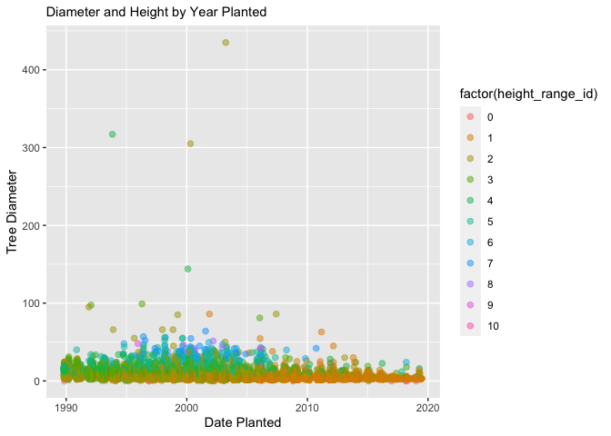
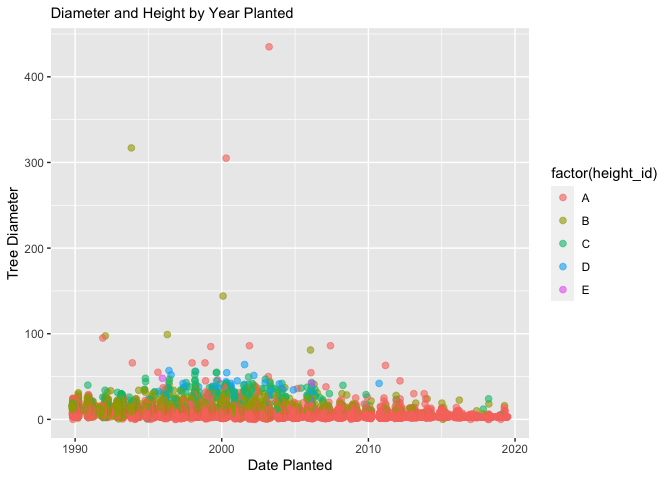

Mini Data Analysis Milestone 2
================

*To complete this milestone, you can edit [this `.rmd`
file](https://raw.githubusercontent.com/UBC-STAT/stat545.stat.ubc.ca/master/content/mini-project/mini-project-2.Rmd)
directly. Fill in the sections that are commented out with
`<!--- start your work here--->`. When you are done, make sure to knit
to an `.md` file by changing the output in the YAML header to
`github_document`, before submitting a tagged release on canvas.*

# Welcome to your second (and last) milestone in your mini data analysis project!

In Milestone 1, you explored your data, came up with research questions,
and obtained some results by making summary tables and graphs. This
time, we will first explore more in depth the concept of *tidy data.*
Then, you’ll be sharpening some of the results you obtained from your
previous milestone by:

- Manipulating special data types in R: factors and/or dates and times…
- Fitting a model object to your data, and extract a result.
- Reading and writing data as separate files.

**NOTE**: The main purpose of the mini data analysis is to integrate
what you learn in class in an analysis. Although each milestone provides
a framework for you to conduct your analysis, it’s possible that you
might find the instructions too rigid for your data set. If this is the
case, you may deviate from the instructions – just make sure you’re
demonstrating a wide range of tools and techniques taught in this class.

# Instructions

**To complete this milestone**, edit [this very `.Rmd`
file](https://raw.githubusercontent.com/UBC-STAT/stat545.stat.ubc.ca/master/content/mini-project/mini-project-2.Rmd)
directly. Fill in the sections that are tagged with
`<!--- start your work here--->`.

**To submit this milestone**, make sure to knit this `.Rmd` file to an
`.md` file by changing the YAML output settings from
`output: html_document` to `output: github_document`. Commit and push
all of your work to your mini-analysis GitHub repository, and tag a
release on GitHub. Then, submit a link to your tagged release on canvas.

**Points**: This milestone is worth 55 points (compared to the 45 points
of the Milestone 1): 45 for your analysis, and 10 for your entire
mini-analysis GitHub repository. Details follow.

**Research Questions**: In Milestone 1, you chose two research questions
to focus on. Wherever realistic, your work in this milestone should
relate to these research questions whenever we ask for justification
behind your work. In the case that some tasks in this milestone don’t
align well with one of your research questions, feel free to discuss
your results in the context of a different research question.

# Learning Objectives

By the end of this milestone, you should:

- Understand what *tidy* data is, and how to create it using `tidyr`.
- Generate a reproducible and clear report using R Markdown.
- Manipulating special data types in R: factors and/or dates and times.
- Fitting a model object to your data, and extract a result.
- Reading and writing data as separate files.

# Setup

Begin by loading your data and the tidyverse package below:

``` r
library(datateachr) # <- might contain the data you picked!
library(tidyverse)
library(broom)
library(lubridate)
```

# Task 1: Tidy your data (15 points) - COMPLETE

In this task, we will do several exercises to reshape our data. The goal
here is to understand how to do this reshaping with the `tidyr` package.

A reminder of the definition of *tidy* data:

- Each row is an **observation**
- Each column is a **variable**
- Each cell is a **value**

*Tidy’ing* data is sometimes necessary because it can simplify
computation. Other times it can be nice to organize data so that it can
be easier to understand when read manually.

### 2.1 (2.5 points)

Based on the definition above, can you identify if your data is tidy or
untidy? Go through all your columns, or if you have \>8 variables, just
pick 8, and explain whether the data is untidy or tidy.

<!--------------------------- Start your work below --------------------------->

According to the definition above, this data is tidy as each row is an
individual observation of a tree and each column is a variable. There
are a few NA values in the cultivar_name column (and a few other
columns), but I would still consider each cell to be a value.

``` r
#This will allow me to see the first 10 observation and all variables. 
head(vancouver_trees)
```

    ## # A tibble: 6 × 20
    ##   tree_id civic_number std_str…¹ genus…² speci…³ culti…⁴ commo…⁵ assig…⁶ root_…⁷
    ##     <dbl>        <dbl> <chr>     <chr>   <chr>   <chr>   <chr>   <chr>   <chr>  
    ## 1  149556          494 W 58TH AV ULMUS   AMERIC… BRANDON BRANDO… N       N      
    ## 2  149563          450 W 58TH AV ZELKOVA SERRATA <NA>    JAPANE… N       N      
    ## 3  149579         4994 WINDSOR … STYRAX  JAPONI… <NA>    JAPANE… N       N      
    ## 4  149590          858 E 39TH AV FRAXIN… AMERIC… AUTUMN… AUTUMN… Y       N      
    ## 5  149604         5032 WINDSOR … ACER    CAMPES… <NA>    HEDGE … N       N      
    ## 6  149616          585 W 61ST AV PYRUS   CALLER… CHANTI… CHANTI… N       N      
    ## # … with 11 more variables: plant_area <chr>, on_street_block <dbl>,
    ## #   on_street <chr>, neighbourhood_name <chr>, street_side_name <chr>,
    ## #   height_range_id <dbl>, diameter <dbl>, curb <chr>, date_planted <date>,
    ## #   longitude <dbl>, latitude <dbl>, and abbreviated variable names
    ## #   ¹​std_street, ²​genus_name, ³​species_name, ⁴​cultivar_name, ⁵​common_name,
    ## #   ⁶​assigned, ⁷​root_barrier

<!----------------------------------------------------------------------------->

### 2.2 (5 points)

Now, if your data is tidy, untidy it! Then, tidy it back to it’s
original state.

If your data is untidy, then tidy it! Then, untidy it back to it’s
original state.

Be sure to explain your reasoning for this task. Show us the “before”
and “after”.

<!--------------------------- Start your work below --------------------------->

Since my data began as tidy, I first made it untidy by using combining
some column values so that each column is not its own variable as well
as making it so that some cells have multiple values. After this, I used
the function separate to re-tidy the data back to its original state.
Now, the columns are once again each a variable and each cell is a
single value.

``` r
#To show the before, I use the function head to show the names of the variables as well as the fact that each row is an observation and each cell is a value
head(vancouver_trees)
```

    ## # A tibble: 6 × 20
    ##   tree_id civic_number std_str…¹ genus…² speci…³ culti…⁴ commo…⁵ assig…⁶ root_…⁷
    ##     <dbl>        <dbl> <chr>     <chr>   <chr>   <chr>   <chr>   <chr>   <chr>  
    ## 1  149556          494 W 58TH AV ULMUS   AMERIC… BRANDON BRANDO… N       N      
    ## 2  149563          450 W 58TH AV ZELKOVA SERRATA <NA>    JAPANE… N       N      
    ## 3  149579         4994 WINDSOR … STYRAX  JAPONI… <NA>    JAPANE… N       N      
    ## 4  149590          858 E 39TH AV FRAXIN… AMERIC… AUTUMN… AUTUMN… Y       N      
    ## 5  149604         5032 WINDSOR … ACER    CAMPES… <NA>    HEDGE … N       N      
    ## 6  149616          585 W 61ST AV PYRUS   CALLER… CHANTI… CHANTI… N       N      
    ## # … with 11 more variables: plant_area <chr>, on_street_block <dbl>,
    ## #   on_street <chr>, neighbourhood_name <chr>, street_side_name <chr>,
    ## #   height_range_id <dbl>, diameter <dbl>, curb <chr>, date_planted <date>,
    ## #   longitude <dbl>, latitude <dbl>, and abbreviated variable names
    ## #   ¹​std_street, ²​genus_name, ³​species_name, ⁴​cultivar_name, ⁵​common_name,
    ## #   ⁶​assigned, ⁷​root_barrier

``` r
#Untidy the data using unite to combine columns
van_tree=vancouver_trees %>% 
  unite(col = street, c(on_street, street_side_name), sep = ", ")%>% 
  unite(col = latlon, c(latitude, longitude), sep = ", ")

head(van_tree)
```

    ## # A tibble: 6 × 18
    ##   tree_id civic_number std_str…¹ genus…² speci…³ culti…⁴ commo…⁵ assig…⁶ root_…⁷
    ##     <dbl>        <dbl> <chr>     <chr>   <chr>   <chr>   <chr>   <chr>   <chr>  
    ## 1  149556          494 W 58TH AV ULMUS   AMERIC… BRANDON BRANDO… N       N      
    ## 2  149563          450 W 58TH AV ZELKOVA SERRATA <NA>    JAPANE… N       N      
    ## 3  149579         4994 WINDSOR … STYRAX  JAPONI… <NA>    JAPANE… N       N      
    ## 4  149590          858 E 39TH AV FRAXIN… AMERIC… AUTUMN… AUTUMN… Y       N      
    ## 5  149604         5032 WINDSOR … ACER    CAMPES… <NA>    HEDGE … N       N      
    ## 6  149616          585 W 61ST AV PYRUS   CALLER… CHANTI… CHANTI… N       N      
    ## # … with 9 more variables: plant_area <chr>, on_street_block <dbl>,
    ## #   street <chr>, neighbourhood_name <chr>, height_range_id <dbl>,
    ## #   diameter <dbl>, curb <chr>, date_planted <date>, latlon <chr>, and
    ## #   abbreviated variable names ¹​std_street, ²​genus_name, ³​species_name,
    ## #   ⁴​cultivar_name, ⁵​common_name, ⁶​assigned, ⁷​root_barrier

``` r
#Tidy the data using separate to undo the previous step
vancouver_trees=van_tree %>% 
  separate(col = street, into = c("on_street", "street_side_name"), sep=", ") %>% 
  separate(col = latlon, into = c("latitude", "longitude"), sep=", ")

head(vancouver_trees)
```

    ## # A tibble: 6 × 20
    ##   tree_id civic_number std_str…¹ genus…² speci…³ culti…⁴ commo…⁵ assig…⁶ root_…⁷
    ##     <dbl>        <dbl> <chr>     <chr>   <chr>   <chr>   <chr>   <chr>   <chr>  
    ## 1  149556          494 W 58TH AV ULMUS   AMERIC… BRANDON BRANDO… N       N      
    ## 2  149563          450 W 58TH AV ZELKOVA SERRATA <NA>    JAPANE… N       N      
    ## 3  149579         4994 WINDSOR … STYRAX  JAPONI… <NA>    JAPANE… N       N      
    ## 4  149590          858 E 39TH AV FRAXIN… AMERIC… AUTUMN… AUTUMN… Y       N      
    ## 5  149604         5032 WINDSOR … ACER    CAMPES… <NA>    HEDGE … N       N      
    ## 6  149616          585 W 61ST AV PYRUS   CALLER… CHANTI… CHANTI… N       N      
    ## # … with 11 more variables: plant_area <chr>, on_street_block <dbl>,
    ## #   on_street <chr>, street_side_name <chr>, neighbourhood_name <chr>,
    ## #   height_range_id <dbl>, diameter <dbl>, curb <chr>, date_planted <date>,
    ## #   latitude <chr>, longitude <chr>, and abbreviated variable names
    ## #   ¹​std_street, ²​genus_name, ³​species_name, ⁴​cultivar_name, ⁵​common_name,
    ## #   ⁶​assigned, ⁷​root_barrier

<!----------------------------------------------------------------------------->

### 2.3 (7.5 points)

Now, you should be more familiar with your data, and also have made
progress in answering your research questions. Based on your interest,
and your analyses, pick 2 of the 4 research questions to continue your
analysis in the next four tasks:

<!-------------------------- Start your work below ---------------------------->

1.  *Is height correlated to diameter? Are both diameter and height
    correlated to the date the tree was planted?*
2.  *Does having a curb present next to the tree significantly decrease
    the average height range of a tree?*

<!----------------------------------------------------------------------------->

Explain your decision for choosing the above two research questions.

<!--------------------------- Start your work below --------------------------->

I am most interested in these questions and think that they will have
the most impactful results. I added the second part of the first
question becuase I believe from my previous results, it will add an
interesting and more complex factor for analysis. From my previous
analysis, these two questions have the most room for exploration through
interesting figures and modeling. Furthermore, my other two questions
have data that is very unbalanced with only a few root barriers present
which makes the data lower impact and more difficult to make conclusions
for.
<!----------------------------------------------------------------------------->

Now, try to choose a version of your data that you think will be
appropriate to answer these 2 questions. Use between 4 and 8 functions
that we’ve covered so far (i.e. by filtering, cleaning, tidy’ing,
dropping irrelevant columns, etc.).

<!--------------------------- Start your work below --------------------------->

``` r
#Here is the before of the data:
head(vancouver_trees)
```

    ## # A tibble: 6 × 20
    ##   tree_id civic_number std_str…¹ genus…² speci…³ culti…⁴ commo…⁵ assig…⁶ root_…⁷
    ##     <dbl>        <dbl> <chr>     <chr>   <chr>   <chr>   <chr>   <chr>   <chr>  
    ## 1  149556          494 W 58TH AV ULMUS   AMERIC… BRANDON BRANDO… N       N      
    ## 2  149563          450 W 58TH AV ZELKOVA SERRATA <NA>    JAPANE… N       N      
    ## 3  149579         4994 WINDSOR … STYRAX  JAPONI… <NA>    JAPANE… N       N      
    ## 4  149590          858 E 39TH AV FRAXIN… AMERIC… AUTUMN… AUTUMN… Y       N      
    ## 5  149604         5032 WINDSOR … ACER    CAMPES… <NA>    HEDGE … N       N      
    ## 6  149616          585 W 61ST AV PYRUS   CALLER… CHANTI… CHANTI… N       N      
    ## # … with 11 more variables: plant_area <chr>, on_street_block <dbl>,
    ## #   on_street <chr>, street_side_name <chr>, neighbourhood_name <chr>,
    ## #   height_range_id <dbl>, diameter <dbl>, curb <chr>, date_planted <date>,
    ## #   latitude <chr>, longitude <chr>, and abbreviated variable names
    ## #   ¹​std_street, ²​genus_name, ³​species_name, ⁴​cultivar_name, ⁵​common_name,
    ## #   ⁶​assigned, ⁷​root_barrier

``` r
#First I will remove the NA values from the date planted column.  
van_tree_clean = vancouver_trees %>% 
  drop_na(date_planted) %>% 
#Next, I will demonstrate the unite function and combine latitude and longitude into the same column.
  unite(col = latlon, c(latitude, longitude), sep = ", ") %>% 
#Then, I will remove columns that are extraneous.
  subset(select = c("tree_id", "common_name", "height_range_id","diameter","curb","date_planted")) %>% 
#Now I will organize the data to list in descending order of date planted
  arrange(desc(date_planted))%>%
#This will change the values of curb to Yes and No rather than Y and N for better clarity of the data.
  mutate(curb = as.character(curb),
         curb = if_else(curb == 'Y', 'Yes', curb),
         curb = as.factor(curb)) %>%
  mutate(curb = as.character(curb),
         curb = if_else(curb == 'N', 'No', curb),
         curb = as.factor(curb))

head(van_tree_clean)
```

    ## # A tibble: 6 × 6
    ##   tree_id common_name              height_range_id diameter curb  date_planted
    ##     <dbl> <chr>                              <dbl>    <dbl> <fct> <date>      
    ## 1  258739 VANESSA PERSIAN IRONWOOD               1        3 Yes   2019-07-03  
    ## 2  262107 KWANZAN FLOWERING CHERRY               1        3 Yes   2019-06-16  
    ## 3  262108 KWANZAN FLOWERING CHERRY               1        3 Yes   2019-06-16  
    ## 4  262109 KWANZAN FLOWERING CHERRY               1        3 Yes   2019-06-16  
    ## 5  243526 JAPANESE STEWARTIA                     1        3 Yes   2019-06-13  
    ## 6  262320 FLOWERING ASH                          1        3 Yes   2019-06-03

``` r
#Now we can see the far more clear data set that is easy to read and very simple.
```

<!----------------------------------------------------------------------------->

# Task 2: Special Data Types (10) COMPLETE

For this exercise, you’ll be choosing two of the three tasks below –
both tasks that you choose are worth 5 points each.

But first, tasks 1 and 2 below ask you to modify a plot you made in a
previous milestone. The plot you choose should involve plotting across
at least three groups (whether by facetting, or using an aesthetic like
colour). Place this plot below (you’re allowed to modify the plot if
you’d like). If you don’t have such a plot, you’ll need to make one.
Place the code for your plot below.

<!-------------------------- Start your work below ---------------------------->

``` r
# I will make a new plot that shows the relationship between date planted and diameter with colors based on height class
van_tree_clean %>%
  ggplot(aes(date_planted,diameter, color=factor(height_range_id))) +
  geom_point(alpha=0.5, size=2) +
  labs(y="Tree Diameter", x="Date Planted", subtitle="Diameter and Height by Year Planted")
```

<!-- -->

<!----------------------------------------------------------------------------->

Now, choose two of the following tasks.

1.  Produce a new plot that reorders a factor in your original plot,
    using the `forcats` package (3 points). Then, in a sentence or two,
    briefly explain why you chose this ordering (1 point here for
    demonstrating understanding of the reordering, and 1 point for
    demonstrating some justification for the reordering, which could be
    subtle or speculative.)

2.  Produce a new plot that groups some factor levels together into an
    “other” category (or something similar), using the `forcats` package
    (3 points). Then, in a sentence or two, briefly explain why you
    chose this grouping (1 point here for demonstrating understanding of
    the grouping, and 1 point for demonstrating some justification for
    the grouping, which could be subtle or speculative.)

3.  If your data has some sort of time-based column like a date (but
    something more granular than just a year):

    1.  Make a new column that uses a function from the `lubridate` or
        `tsibble` package to modify your original time-based column. (3
        points)

        - Note that you might first have to *make* a time-based column
          using a function like `ymd()`, but this doesn’t count.
        - Examples of something you might do here: extract the day of
          the year from a date, or extract the weekday, or let 24 hours
          elapse on your dates.

    2.  Then, in a sentence or two, explain how your new column might be
        useful in exploring a research question. (1 point for
        demonstrating understanding of the function you used, and 1
        point for your justification, which could be subtle or
        speculative).

        - For example, you could say something like “Investigating the
          day of the week might be insightful because penguins don’t
          work on weekends, and so may respond differently”.

<!-------------------------- Start your work below ---------------------------->

**Task Number**: 2

This is a slight modification from the instructions. Instead of creating
an “other” category with the forcats package, I used the forcats package
to group the categorical height variable into smaller categories. I made
this change as it is more useful to my analysis. An other category would
not hold much meaning for this data as it is important to keep each
category tied to the corresponding height index. Thus, the grouping was
made to simplify the graphical output, though data analysis would still
be completed with all 10 categories. And finally, the justification is
for clarity of interpretation in the color index in the graphical
output.

``` r
#This function will make just 5 height categories instead of 10 so that the graph will be more clear with the color index. This makes the conclusion easier to interpret. First, I make a new column from height_range_id to modify. Then I mutate that column to recode the levels.
van_tree_clean$height_id=factor(van_tree_clean$height_range_id)
(van_tree_clean_1 = van_tree_clean %>% 
  mutate(height_id=fct_recode(height_id, "A"= "1","A"= "2","A"= "0",
             "B"= "3","B"= "4",
             "C"= "5","C"= "6",
             "D"= "7","D"= "8",
             "E"= "9","E"= "10")))
```

    ## # A tibble: 70,063 × 7
    ##    tree_id common_name              height_ra…¹ diame…² curb  date_pla…³ heigh…⁴
    ##      <dbl> <chr>                          <dbl>   <dbl> <fct> <date>     <fct>  
    ##  1  258739 VANESSA PERSIAN IRONWOOD           1       3 Yes   2019-07-03 A      
    ##  2  262107 KWANZAN FLOWERING CHERRY           1       3 Yes   2019-06-16 A      
    ##  3  262108 KWANZAN FLOWERING CHERRY           1       3 Yes   2019-06-16 A      
    ##  4  262109 KWANZAN FLOWERING CHERRY           1       3 Yes   2019-06-16 A      
    ##  5  243526 JAPANESE STEWARTIA                 1       3 Yes   2019-06-13 A      
    ##  6  262320 FLOWERING ASH                      1       3 Yes   2019-06-03 A      
    ##  7  262948 VANESSA PERSIAN IRONWOOD           1       3 Yes   2019-05-30 A      
    ##  8  262950 VANESSA PERSIAN IRONWOOD           1       3 Yes   2019-05-30 A      
    ##  9  262947 VANESSA PERSIAN IRONWOOD           1       3 Yes   2019-05-30 A      
    ## 10  262949 VANESSA PERSIAN IRONWOOD           1       3 Yes   2019-05-30 A      
    ## # … with 70,053 more rows, and abbreviated variable names ¹​height_range_id,
    ## #   ²​diameter, ³​date_planted, ⁴​height_id

``` r
#Here is the same graph as above, but with modified levels so that it is easier to view.
van_tree_clean_1 %>%
  ggplot(aes(date_planted,diameter, color=factor(height_id))) +
  geom_point(alpha=0.6, size=2) +
  labs(y="Tree Diameter", x="Date Planted", subtitle="Diameter and Height by Year Planted")
```

<!-- -->
<!----------------------------------------------------------------------------->

<!-------------------------- Start your work below ---------------------------->

**Task Number**: 3 Here I will make sure the date column is recognized
as a date in the form month, day, year and then I will create a new
column that extracts day of year from the date column.

This action is justified as having a plot with the day of the year
rather than a full date is useful when comparing year to year. Having
the month and day on the graph or in the output makes for a very
cluttered plot and the day of the year is a single number that shows
when in the year the tree was planted.

``` r
#First check if the date column is already recognized by R as a date.
class(van_tree_clean$date_planted)
```

    ## [1] "Date"

``` r
#Now I will make a new column called DOY_planted that extracts the day of the year from the date column.
van_tree_clean$DOY_planted=yday(as.POSIXct(van_tree_clean$date_planted))

head(van_tree_clean)
```

    ## # A tibble: 6 × 8
    ##   tree_id common_name           heigh…¹ diame…² curb  date_pla…³ heigh…⁴ DOY_p…⁵
    ##     <dbl> <chr>                   <dbl>   <dbl> <fct> <date>     <fct>     <dbl>
    ## 1  258739 VANESSA PERSIAN IRON…       1       3 Yes   2019-07-03 1           183
    ## 2  262107 KWANZAN FLOWERING CH…       1       3 Yes   2019-06-16 1           166
    ## 3  262108 KWANZAN FLOWERING CH…       1       3 Yes   2019-06-16 1           166
    ## 4  262109 KWANZAN FLOWERING CH…       1       3 Yes   2019-06-16 1           166
    ## 5  243526 JAPANESE STEWARTIA          1       3 Yes   2019-06-13 1           163
    ## 6  262320 FLOWERING ASH               1       3 Yes   2019-06-03 1           153
    ## # … with abbreviated variable names ¹​height_range_id, ²​diameter, ³​date_planted,
    ## #   ⁴​height_id, ⁵​DOY_planted

<!----------------------------------------------------------------------------->

# Task 3: Modelling - COMPLETE

## 2.0 (no points)

Pick a research question, and pick a variable of interest (we’ll call it
“Y”) that’s relevant to the research question. Indicate these.

<!-------------------------- Start your work below ---------------------------->

**Research Question**: Question 1: Is height correlated to diameter?

**Variable of interest**: diameter

<!----------------------------------------------------------------------------->

## 2.1 (5 points)

Fit a model or run a hypothesis test that provides insight on this
variable with respect to the research question. Store the model object
as a variable, and print its output to screen. We’ll omit having to
justify your choice, because we don’t expect you to know about model
specifics in STAT 545.

- **Note**: It’s OK if you don’t know how these models/tests work. Here
  are some examples of things you can do here, but the sky’s the limit.

  - You could fit a model that makes predictions on Y using another
    variable, by using the `lm()` function.
  - You could test whether the mean of Y equals 0 using `t.test()`, or
    maybe the mean across two groups are different using `t.test()`, or
    maybe the mean across multiple groups are different using `anova()`
    (you may have to pivot your data for the latter two).
  - You could use `lm()` to test for significance of regression.

<!-------------------------- Start your work below ---------------------------->

``` r
#Here I will run a linear model on the variables y=diameter and x=height class to understand if with an increase in x we also see an increase in y.
my.model.lm=lm(data=van_tree_clean, diameter~height_range_id)
summary(my.model.lm)
```

    ## 
    ## Call:
    ## lm(formula = diameter ~ height_range_id, data = van_tree_clean)
    ## 
    ## Residuals:
    ##    Min     1Q Median     3Q    Max 
    ## -26.91  -1.34  -0.56   0.69 428.51 
    ## 
    ## Coefficients:
    ##                 Estimate Std. Error t value Pr(>|t|)    
    ## (Intercept)      0.63189    0.03194   19.78   <2e-16 ***
    ## height_range_id  2.92811    0.01626  180.12   <2e-16 ***
    ## ---
    ## Signif. codes:  0 '***' 0.001 '**' 0.01 '*' 0.05 '.' 0.1 ' ' 1
    ## 
    ## Residual standard error: 3.982 on 70061 degrees of freedom
    ## Multiple R-squared:  0.3165, Adjusted R-squared:  0.3165 
    ## F-statistic: 3.244e+04 on 1 and 70061 DF,  p-value: < 2.2e-16

<!----------------------------------------------------------------------------->

## 2.2 (5 points)

Produce something relevant from your fitted model: either predictions on
Y, or a single value like a regression coefficient or a p-value.

- Be sure to indicate in writing what you chose to produce.
- Your code should either output a tibble (in which case you should
  indicate the column that contains the thing you’re looking for), or
  the thing you’re looking for itself.
- Obtain your results using the `broom` package if possible. If your
  model is not compatible with the broom function you’re needing, then
  you can obtain your results by some other means, but first indicate
  which broom function is not compatible.

<!-------------------------- Start your work below ---------------------------->

I chose to produce the p-value of the model which is shown in the
statistics table below in the p.value column. This table was created
with broom (tidy).

``` r
#Use the tidy function to produce a clean results table that shows the p.value and other helpful statistics. 
tidy(my.model.lm)
```

    ## # A tibble: 2 × 5
    ##   term            estimate std.error statistic  p.value
    ##   <chr>              <dbl>     <dbl>     <dbl>    <dbl>
    ## 1 (Intercept)        0.632    0.0319      19.8 7.51e-87
    ## 2 height_range_id    2.93     0.0163     180.  0

<!----------------------------------------------------------------------------->

# Task 4: Reading and writing data

Get set up for this exercise by making a folder called `output` in the
top level of your project folder / repository. You’ll be saving things
there.

## 3.1 (5 points)

Take a summary table that you made from Milestone 1 (Task 4.2), and
write it as a csv file in your `output` folder. Use the `here::here()`
function.

- **Robustness criteria**: You should be able to move your Mini Project
  repository / project folder to some other location on your computer,
  or move this very Rmd file to another location within your project
  repository / folder, and your code should still work.
- **Reproducibility criteria**: You should be able to delete the csv
  file, and remake it simply by knitting this Rmd file.

<!-------------------------- Start your work below ---------------------------->

``` r
#Here is the summary table for root barriers: I have renamed the columns for clarity.
mytable_forcsv=table(vancouver_trees$height_range_id, vancouver_trees$root_barrier) 
  colnames(mytable_forcsv)[1] <- "No Root Barrier"
  colnames(mytable_forcsv)[2] <- "Yes Root Barrier"
#Here I will convert the table to a data frame
table.for.csv=as_tibble(as.data.frame.matrix(mytable_forcsv))

class(table.for.csv)
```

    ## [1] "tbl_df"     "tbl"        "data.frame"

``` r
#This will make the output folder and write the csv file to the output folder.
dir.create(here::here("output"))
```

    ## Warning in dir.create(here::here("output")): '/Users/marcellacross/Desktop/
    ## Marcella-Cross-Stat-545-Repository/output' already exists

``` r
write_csv(table.for.csv, here::here("output", "practice_table_csv.csv"))
dir(here::here("output"))
```

    ## [1] "practice_table_csv.csv" "README.md"

<!----------------------------------------------------------------------------->

## 3.2 (5 points)

Write your model object from Task 3 to an R binary file (an RDS), and
load it again. Be sure to save the binary file in your `output` folder.
Use the functions `saveRDS()` and `readRDS()`.

- The same robustness and reproducibility criteria as in 3.1 apply here.

<!-------------------------- Start your work below ---------------------------->

``` r
#Here I create an rds file and then read its output to ensure that it is functional.
saveRDS(my.model.lm, here::here("output", "rds_model.rds"))
dir(here::here("output"))
```

    ## [1] "practice_table_csv.csv" "rds_model.rds"          "README.md"

``` r
readRDS(here::here("output", "rds_model.rds"))
```

    ## 
    ## Call:
    ## lm(formula = diameter ~ height_range_id, data = van_tree_clean)
    ## 
    ## Coefficients:
    ##     (Intercept)  height_range_id  
    ##          0.6319           2.9281

<!----------------------------------------------------------------------------->

# Tidy Repository

Now that this is your last milestone, your entire project repository
should be organized. Here are the criteria we’re looking for.

## Main README (3 points) - COMPLETE

There should be a file named `README.md` at the top level of your
repository. Its contents should automatically appear when you visit the
repository on GitHub.

Minimum contents of the README file:

- In a sentence or two, explains what this repository is, so that
  future-you or someone else stumbling on your repository can be
  oriented to the repository.
- In a sentence or two (or more??), briefly explains how to engage with
  the repository. You can assume the person reading knows the material
  from STAT 545A. Basically, if a visitor to your repository wants to
  explore your project, what should they know?

Once you get in the habit of making README files, and seeing more README
files in other projects, you’ll wonder how you ever got by without them!
They are tremendously helpful.

## File and Folder structure (3 points)

You should have at least four folders in the top level of your
repository: one for each milestone, and one output folder. If there are
any other folders, these are explained in the main README.

Each milestone document is contained in its respective folder, and
nowhere else.

Every level-1 folder (that is, the ones stored in the top level, like
“Milestone1” and “output”) has a `README` file, explaining in a sentence
or two what is in the folder, in plain language (it’s enough to say
something like “This folder contains the source for Milestone 1”).

## Output (2 points)

All output is recent and relevant:

- All Rmd files have been `knit`ted to their output, and all data files
  saved from Task 4 above appear in the `output` folder.
- All of these output files are up-to-date – that is, they haven’t
  fallen behind after the source (Rmd) files have been updated.
- There should be no relic output files. For example, if you were
  knitting an Rmd to html, but then changed the output to be only a
  markdown file, then the html file is a relic and should be deleted.

Our recommendation: delete all output files, and re-knit each
milestone’s Rmd file, so that everything is up to date and relevant.

PS: there’s a way where you can run all project code using a single
command, instead of clicking “knit” three times. More on this in STAT
545B!

## Error-free code (1 point)

This Milestone 1 document knits error-free, and the Milestone 2 document
knits error-free.

## Tagged release (1 point)

You’ve tagged a release for Milestone 1, and you’ve tagged a release for
Milestone 2.

### Attribution

Thanks to Victor Yuan for mostly putting this together.
