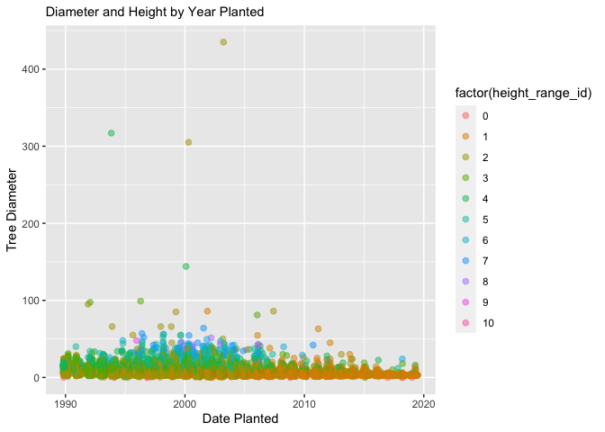
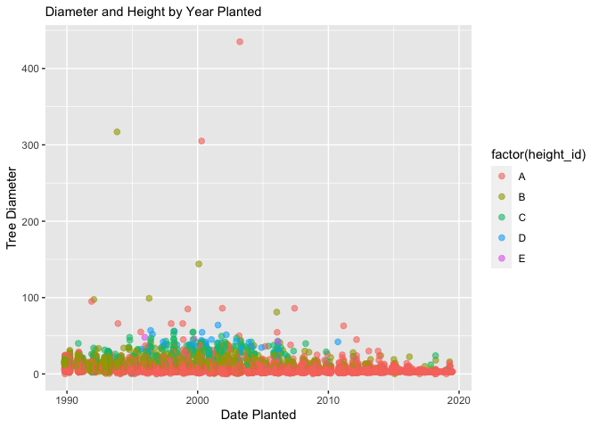

Mini Data Analysis Milestone 2
================

*To complete this milestone, you can edit [this `.rmd`
file](https://raw.githubusercontent.com/UBC-STAT/stat545.stat.ubc.ca/master/content/mini-project/mini-project-2.Rmd)
directly. Fill in the sections that are commented out with
`<!--- start your work here--->`. When you are done, make sure to knit
to an `.md` file by changing the output in the YAML header to
`github_document`, before submitting a tagged release on canvas.*

# Welcome to your second (and last) milestone in your mini data analysis project!

In Milestone 1, you explored your data, came up with research questions,
and obtained some results by making summary tables and graphs. This
time, we will first explore more in depth the concept of *tidy data.*
Then, you’ll be sharpening some of the results you obtained from your
previous milestone by:

- Manipulating special data types in R: factors and/or dates and times.
- Fitting a model object to your data, and extract a result.
- Reading and writing data as separate files.

**NOTE**: The main purpose of the mini data analysis is to integrate
what you learn in class in an analysis. Although each milestone provides
a framework for you to conduct your analysis, it’s possible that you
might find the instructions too rigid for your data set. If this is the
case, you may deviate from the instructions – just make sure you’re
demonstrating a wide range of tools and techniques taught in this class.

# Instructions

**To complete this milestone**, edit [this very `.Rmd`
file](https://raw.githubusercontent.com/UBC-STAT/stat545.stat.ubc.ca/master/content/mini-project/mini-project-2.Rmd)
directly. Fill in the sections that are tagged with
`<!--- start your work here--->`.

**To submit this milestone**, make sure to knit this `.Rmd` file to an
`.md` file by changing the YAML output settings from
`output: html_document` to `output: github_document`. Commit and push
all of your work to your mini-analysis GitHub repository, and tag a
release on GitHub. Then, submit a link to your tagged release on canvas.

**Points**: This milestone is worth 55 points (compared to the 45 points
of the Milestone 1): 45 for your analysis, and 10 for your entire
mini-analysis GitHub repository. Details follow.

**Research Questions**: In Milestone 1, you chose two research questions
to focus on. Wherever realistic, your work in this milestone should
relate to these research questions whenever we ask for justification
behind your work. In the case that some tasks in this milestone don’t
align well with one of your research questions, feel free to discuss
your results in the context of a different research question.

# Learning Objectives

By the end of this milestone, you should:

- Understand what *tidy* data is, and how to create it using `tidyr`.
- Generate a reproducible and clear report using R Markdown.
- Manipulating special data types in R: factors and/or dates and times.
- Fitting a model object to your data, and extract a result.
- Reading and writing data as separate files.

# Setup

Begin by loading your data and the tidyverse package below:

``` r
library(datateachr) # <- might contain the data you picked!
library(tidyverse)
library(broom)
library(lubridate)
```

# Task 1: Tidy your data (15 points) - COMPLETE

In this task, we will do several exercises to reshape our data. The goal
here is to understand how to do this reshaping with the `tidyr` package.

A reminder of the definition of *tidy* data:

- Each row is an **observation**
- Each column is a **variable**
- Each cell is a **value**

*Tidy’ing* data is sometimes necessary because it can simplify
computation. Other times it can be nice to organize data so that it can
be easier to understand when read manually.

### 2.1 (2.5 points)

Based on the definition above, can you identify if your data is tidy or
untidy? Go through all your columns, or if you have \>8 variables, just
pick 8, and explain whether the data is untidy or tidy.

<!--------------------------- Start your work below --------------------------->

According to the definition above, this data is tidy as each row is an
individual observation of a tree and each column is a variable. There
are a few NA values in the cultivar_name column (and a few other
columns), but I would still consider each cell to be a value.

``` r
#This will allow me to see the first 10 observation and all variables. 
head(vancouver_trees)
```

    ## # A tibble: 6 × 20
    ##   tree_id civic_number std_str…¹ genus…² speci…³ culti…⁴ commo…⁵ assig…⁶ root_…⁷
    ##     <dbl>        <dbl> <chr>     <chr>   <chr>   <chr>   <chr>   <chr>   <chr>  
    ## 1  149556          494 W 58TH AV ULMUS   AMERIC… BRANDON BRANDO… N       N      
    ## 2  149563          450 W 58TH AV ZELKOVA SERRATA <NA>    JAPANE… N       N      
    ## 3  149579         4994 WINDSOR … STYRAX  JAPONI… <NA>    JAPANE… N       N      
    ## 4  149590          858 E 39TH AV FRAXIN… AMERIC… AUTUMN… AUTUMN… Y       N      
    ## 5  149604         5032 WINDSOR … ACER    CAMPES… <NA>    HEDGE … N       N      
    ## 6  149616          585 W 61ST AV PYRUS   CALLER… CHANTI… CHANTI… N       N      
    ## # … with 11 more variables: plant_area <chr>, on_street_block <dbl>,
    ## #   on_street <chr>, neighbourhood_name <chr>, street_side_name <chr>,
    ## #   height_range_id <dbl>, diameter <dbl>, curb <chr>, date_planted <date>,
    ## #   longitude <dbl>, latitude <dbl>, and abbreviated variable names
    ## #   ¹​std_street, ²​genus_name, ³​species_name, ⁴​cultivar_name, ⁵​common_name,
    ## #   ⁶​assigned, ⁷​root_barrier

<!----------------------------------------------------------------------------->

### 2.2 (5 points)

Now, if your data is tidy, untidy it! Then, tidy it back to it’s
original state.

If your data is untidy, then tidy it! Then, untidy it back to it’s
original state.

Be sure to explain your reasoning for this task. Show us the “before”
and “after”.

<!--------------------------- Start your work below --------------------------->

Since my data began as tidy, I first made it untidy by using combining
some column values so that each column is not its own variable as well
as making it so that some cells have multiple values. After this, I used
the function separate to re-tidy the data back to its original state.
Now, the columns are once again each a variable and each cell is a
single value.

``` r
#To show the before, I use the function head to show the names of the variables as well as the fact that each row is an observation and each cell is a value
head(vancouver_trees)
```

    ## # A tibble: 6 × 20
    ##   tree_id civic_number std_str…¹ genus…² speci…³ culti…⁴ commo…⁵ assig…⁶ root_…⁷
    ##     <dbl>        <dbl> <chr>     <chr>   <chr>   <chr>   <chr>   <chr>   <chr>  
    ## 1  149556          494 W 58TH AV ULMUS   AMERIC… BRANDON BRANDO… N       N      
    ## 2  149563          450 W 58TH AV ZELKOVA SERRATA <NA>    JAPANE… N       N      
    ## 3  149579         4994 WINDSOR … STYRAX  JAPONI… <NA>    JAPANE… N       N      
    ## 4  149590          858 E 39TH AV FRAXIN… AMERIC… AUTUMN… AUTUMN… Y       N      
    ## 5  149604         5032 WINDSOR … ACER    CAMPES… <NA>    HEDGE … N       N      
    ## 6  149616          585 W 61ST AV PYRUS   CALLER… CHANTI… CHANTI… N       N      
    ## # … with 11 more variables: plant_area <chr>, on_street_block <dbl>,
    ## #   on_street <chr>, neighbourhood_name <chr>, street_side_name <chr>,
    ## #   height_range_id <dbl>, diameter <dbl>, curb <chr>, date_planted <date>,
    ## #   longitude <dbl>, latitude <dbl>, and abbreviated variable names
    ## #   ¹​std_street, ²​genus_name, ³​species_name, ⁴​cultivar_name, ⁵​common_name,
    ## #   ⁶​assigned, ⁷​root_barrier

``` r
#Untidy the data using unite to combine columns
van_tree=vancouver_trees %>% 
  unite(col = street, c(on_street, street_side_name), sep = ", ")%>% 
  unite(col = latlon, c(latitude, longitude), sep = ", ")

head(van_tree)
```

    ## # A tibble: 6 × 18
    ##   tree_id civic_number std_str…¹ genus…² speci…³ culti…⁴ commo…⁵ assig…⁶ root_…⁷
    ##     <dbl>        <dbl> <chr>     <chr>   <chr>   <chr>   <chr>   <chr>   <chr>  
    ## 1  149556          494 W 58TH AV ULMUS   AMERIC… BRANDON BRANDO… N       N      
    ## 2  149563          450 W 58TH AV ZELKOVA SERRATA <NA>    JAPANE… N       N      
    ## 3  149579         4994 WINDSOR … STYRAX  JAPONI… <NA>    JAPANE… N       N      
    ## 4  149590          858 E 39TH AV FRAXIN… AMERIC… AUTUMN… AUTUMN… Y       N      
    ## 5  149604         5032 WINDSOR … ACER    CAMPES… <NA>    HEDGE … N       N      
    ## 6  149616          585 W 61ST AV PYRUS   CALLER… CHANTI… CHANTI… N       N      
    ## # … with 9 more variables: plant_area <chr>, on_street_block <dbl>,
    ## #   street <chr>, neighbourhood_name <chr>, height_range_id <dbl>,
    ## #   diameter <dbl>, curb <chr>, date_planted <date>, latlon <chr>, and
    ## #   abbreviated variable names ¹​std_street, ²​genus_name, ³​species_name,
    ## #   ⁴​cultivar_name, ⁵​common_name, ⁶​assigned, ⁷​root_barrier

``` r
#Tidy the data using separate to undo the previous step
vancouver_trees=van_tree %>% 
  separate(col = street, into = c("on_street", "street_side_name"), sep=", ") %>% 
  separate(col = latlon, into = c("latitude", "longitude"), sep=", ")

head(vancouver_trees)
```

    ## # A tibble: 6 × 20
    ##   tree_id civic_number std_str…¹ genus…² speci…³ culti…⁴ commo…⁵ assig…⁶ root_…⁷
    ##     <dbl>        <dbl> <chr>     <chr>   <chr>   <chr>   <chr>   <chr>   <chr>  
    ## 1  149556          494 W 58TH AV ULMUS   AMERIC… BRANDON BRANDO… N       N      
    ## 2  149563          450 W 58TH AV ZELKOVA SERRATA <NA>    JAPANE… N       N      
    ## 3  149579         4994 WINDSOR … STYRAX  JAPONI… <NA>    JAPANE… N       N      
    ## 4  149590          858 E 39TH AV FRAXIN… AMERIC… AUTUMN… AUTUMN… Y       N      
    ## 5  149604         5032 WINDSOR … ACER    CAMPES… <NA>    HEDGE … N       N      
    ## 6  149616          585 W 61ST AV PYRUS   CALLER… CHANTI… CHANTI… N       N      
    ## # … with 11 more variables: plant_area <chr>, on_street_block <dbl>,
    ## #   on_street <chr>, street_side_name <chr>, neighbourhood_name <chr>,
    ## #   height_range_id <dbl>, diameter <dbl>, curb <chr>, date_planted <date>,
    ## #   latitude <chr>, longitude <chr>, and abbreviated variable names
    ## #   ¹​std_street, ²​genus_name, ³​species_name, ⁴​cultivar_name, ⁵​common_name,
    ## #   ⁶​assigned, ⁷​root_barrier

<!----------------------------------------------------------------------------->

### 2.3 (7.5 points)

Now, you should be more familiar with your data, and also have made
progress in answering your research questions. Based on your interest,
and your analyses, pick 2 of the 4 research questions to continue your
analysis in the next four tasks:

<!-------------------------- Start your work below ---------------------------->

1.  *Is height correlated to diameter? Are both diameter and height
    correlated to the date the tree was planted?*
2.  *Does having a curb present next to the tree significantly decrease
    the average height range of a tree?*

<!----------------------------------------------------------------------------->

Explain your decision for choosing the above two research questions.

<!--------------------------- Start your work below --------------------------->

I am most interested in these questions and think that they will have
the most impactful results. I added the second part of the first
question becuase I believe from my previous results, it will add an
interesting and more complex factor for analysis. From my previous
analysis, these two questions have the most room for exploration through
interesting figures and modeling. Furthermore, my other two questions
have data that is very unbalanced with only a few root barriers present
which makes the data lower impact and more difficult to make conclusions
for.
<!----------------------------------------------------------------------------->

Now, try to choose a version of your data that you think will be
appropriate to answer these 2 questions. Use between 4 and 8 functions
that we’ve covered so far (i.e. by filtering, cleaning, tidy’ing,
dropping irrelevant columns, etc.).

<!--------------------------- Start your work below --------------------------->

``` r
#Here is the before of the data:
vancouver_trees
```

    ## # A tibble: 146,611 × 20
    ##    tree_id civic_number std_st…¹ genus…² speci…³ culti…⁴ commo…⁵ assig…⁶ root_…⁷
    ##      <dbl>        <dbl> <chr>    <chr>   <chr>   <chr>   <chr>   <chr>   <chr>  
    ##  1  149556          494 W 58TH … ULMUS   AMERIC… BRANDON BRANDO… N       N      
    ##  2  149563          450 W 58TH … ZELKOVA SERRATA <NA>    JAPANE… N       N      
    ##  3  149579         4994 WINDSOR… STYRAX  JAPONI… <NA>    JAPANE… N       N      
    ##  4  149590          858 E 39TH … FRAXIN… AMERIC… AUTUMN… AUTUMN… Y       N      
    ##  5  149604         5032 WINDSOR… ACER    CAMPES… <NA>    HEDGE … N       N      
    ##  6  149616          585 W 61ST … PYRUS   CALLER… CHANTI… CHANTI… N       N      
    ##  7  149617         4909 SHERBRO… ACER    PLATAN… COLUMN… COLUMN… N       N      
    ##  8  149618         4925 SHERBRO… ACER    PLATAN… COLUMN… COLUMN… N       N      
    ##  9  149619         4969 SHERBRO… ACER    PLATAN… COLUMN… COLUMN… N       N      
    ## 10  149625          720 E 39TH … FRAXIN… AMERIC… AUTUMN… AUTUMN… N       N      
    ## # … with 146,601 more rows, 11 more variables: plant_area <chr>,
    ## #   on_street_block <dbl>, on_street <chr>, street_side_name <chr>,
    ## #   neighbourhood_name <chr>, height_range_id <dbl>, diameter <dbl>,
    ## #   curb <chr>, date_planted <date>, latitude <chr>, longitude <chr>, and
    ## #   abbreviated variable names ¹​std_street, ²​genus_name, ³​species_name,
    ## #   ⁴​cultivar_name, ⁵​common_name, ⁶​assigned, ⁷​root_barrier

``` r
#First I will remove the NA values from the date planted column.  
van_tree_clean = vancouver_trees %>% 
  drop_na(date_planted) %>% 
#Next, I will demonstrate the unite function and combine latitude and longitude into the same column.
  unite(col = latlon, c(latitude, longitude), sep = ", ") %>% 
#Then, I will remove columns that are extraneous.
  subset(select = c("tree_id", "common_name", "height_range_id","diameter","curb","date_planted")) %>% 
#Now I will organize the data to list in descending order of date planted
  arrange(desc(date_planted))%>%
#This will change the values of curb to Yes and No rather than Y and N for better clarity of the data.
  mutate(curb = as.character(curb),
         curb = if_else(curb == 'Y', 'Yes', curb),
         curb = as.factor(curb)) %>%
  mutate(curb = as.character(curb),
         curb = if_else(curb == 'N', 'No', curb),
         curb = as.factor(curb))

van_tree_clean
```

    ## # A tibble: 70,063 × 6
    ##    tree_id common_name              height_range_id diameter curb  date_planted
    ##      <dbl> <chr>                              <dbl>    <dbl> <fct> <date>      
    ##  1  258739 VANESSA PERSIAN IRONWOOD               1        3 Yes   2019-07-03  
    ##  2  262107 KWANZAN FLOWERING CHERRY               1        3 Yes   2019-06-16  
    ##  3  262108 KWANZAN FLOWERING CHERRY               1        3 Yes   2019-06-16  
    ##  4  262109 KWANZAN FLOWERING CHERRY               1        3 Yes   2019-06-16  
    ##  5  243526 JAPANESE STEWARTIA                     1        3 Yes   2019-06-13  
    ##  6  262320 FLOWERING ASH                          1        3 Yes   2019-06-03  
    ##  7  262948 VANESSA PERSIAN IRONWOOD               1        3 Yes   2019-05-30  
    ##  8  262950 VANESSA PERSIAN IRONWOOD               1        3 Yes   2019-05-30  
    ##  9  262947 VANESSA PERSIAN IRONWOOD               1        3 Yes   2019-05-30  
    ## 10  262949 VANESSA PERSIAN IRONWOOD               1        3 Yes   2019-05-30  
    ## # … with 70,053 more rows

``` r
#Now we can see the far more clear data set that is easy to read and very simple.
```

<!----------------------------------------------------------------------------->

# Task 2: Special Data Types (10) COMPLETE

For this exercise, you’ll be choosing two of the three tasks below –
both tasks that you choose are worth 5 points each.

But first, tasks 1 and 2 below ask you to modify a plot you made in a
previous milestone. The plot you choose should involve plotting across
at least three groups (whether by facetting, or using an aesthetic like
colour). Place this plot below (you’re allowed to modify the plot if
you’d like). If you don’t have such a plot, you’ll need to make one.
Place the code for your plot below.

<!-------------------------- Start your work below ---------------------------->

``` r
# I will make a new plot that shows the relationship between date planted and diameter with colors based on height class
van_tree_clean %>%
  ggplot(aes(date_planted,diameter, color=factor(height_range_id))) +
  geom_point(alpha=0.5, size=2) +
  labs(y="Tree Diameter", x="Date Planted", subtitle="Diameter and Height by Year Planted")
```

<!-- -->

<!----------------------------------------------------------------------------->

Now, choose two of the following tasks.

1.  Produce a new plot that reorders a factor in your original plot,
    using the `forcats` package (3 points). Then, in a sentence or two,
    briefly explain why you chose this ordering (1 point here for
    demonstrating understanding of the reordering, and 1 point for
    demonstrating some justification for the reordering, which could be
    subtle or speculative.)

2.  Produce a new plot that groups some factor levels together into an
    “other” category (or something similar), using the `forcats` package
    (3 points). Then, in a sentence or two, briefly explain why you
    chose this grouping (1 point here for demonstrating understanding of
    the grouping, and 1 point for demonstrating some justification for
    the grouping, which could be subtle or speculative.)

3.  If your data has some sort of time-based column like a date (but
    something more granular than just a year):

    1.  Make a new column that uses a function from the `lubridate` or
        `tsibble` package to modify your original time-based column. (3
        points)

        - Note that you might first have to *make* a time-based column
          using a function like `ymd()`, but this doesn’t count.
        - Examples of something you might do here: extract the day of
          the year from a date, or extract the weekday, or let 24 hours
          elapse on your dates.

    2.  Then, in a sentence or two, explain how your new column might be
        useful in exploring a research question. (1 point for
        demonstrating understanding of the function you used, and 1
        point for your justification, which could be subtle or
        speculative).

        - For example, you could say something like “Investigating the
          day of the week might be insightful because penguins don’t
          work on weekends, and so may respond differently”.

<!-------------------------- Start your work below ---------------------------->

**Task Number**: 2

This is a slight modification from the instructions. Instead of creating
an “other” category with the forcats package, I used the forcats package
to group the categorical height variable into smaller categories. I made
this change as it is more useful to my analysis. An other category would
not hold much meaning for this data as it is important to keep each
category tied to the corresponding height index. Thus, the grouping was
made to simplify the graphical output, though data analysis would still
be completed with all 10 categories. And finally, the justification is
for clarity of interpretation in the color index in the graphical
output.

``` r
#This function will make just 5 height categories instead of 10 so that the graph will be more clear with the color index. This makes the conclusion easier to interpret. First, I make a new column from height_range_id to modify. Then I mutate that column to recode the levels.
van_tree_clean$height_id=factor(van_tree_clean$height_range_id)
van_tree_clean$height_id
```

    ##     [1] 1  1  1  1  1  1  1  1  1  1  1  1  1  1  1  2  1  1  1  1  1  1  1  1 
    ##    [25] 1  1  1  1  1  1  1  1  1  1  1  1  1  2  1  1  1  1  1  1  1  1  1  1 
    ##    [49] 1  1  1  1  1  1  1  1  1  1  1  1  1  1  1  1  1  1  1  1  1  1  1  1 
    ##    [73] 2  1  1  1  1  1  1  1  1  1  1  1  1  1  1  1  1  1  1  1  1  1  1  1 
    ##    [97] 1  1  1  1  1  1  2  1  1  1  1  1  1  1  1  1  1  1  1  1  1  1  1  1 
    ##   [121] 1  1  1  1  1  1  1  1  1  1  1  1  1  1  1  1  1  1  1  1  1  1  1  1 
    ##   [145] 1  1  1  1  1  1  1  1  1  1  1  1  1  1  1  1  1  1  1  1  1  1  1  1 
    ##   [169] 1  1  1  1  1  1  1  1  1  1  1  1  1  1  1  1  1  1  1  1  1  1  1  1 
    ##   [193] 1  1  1  1  1  1  1  1  4  1  1  1  1  1  1  1  1  1  1  1  1  1  1  1 
    ##   [217] 1  1  1  1  1  1  1  1  1  1  1  1  1  1  1  1  1  1  1  1  1  1  1  1 
    ##   [241] 1  1  1  1  1  1  1  1  1  1  1  1  1  1  1  1  1  1  1  1  1  1  2  1 
    ##   [265] 1  1  1  1  1  1  1  1  1  1  1  1  1  1  1  1  1  1  1  1  1  1  1  1 
    ##   [289] 1  1  1  1  1  1  1  1  1  1  1  1  1  1  1  1  1  1  1  1  1  1  1  1 
    ##   [313] 1  1  1  1  1  1  1  1  1  1  1  1  1  1  1  1  1  1  1  1  1  1  1  1 
    ##   [337] 1  1  1  1  1  1  1  1  1  1  1  1  1  1  1  1  1  1  1  1  1  1  1  1 
    ##   [361] 1  1  1  1  1  1  1  1  1  1  1  1  1  1  1  1  1  1  1  1  1  1  1  1 
    ##   [385] 1  1  1  1  1  1  1  1  1  1  1  1  1  1  1  1  1  1  1  1  1  1  1  1 
    ##   [409] 1  1  1  1  1  1  1  1  1  1  1  1  1  1  2  1  2  1  1  1  1  1  1  1 
    ##   [433] 1  1  1  1  1  1  1  1  1  1  1  1  1  1  1  1  1  1  1  1  1  1  1  1 
    ##   [457] 1  1  1  1  1  1  1  1  1  1  1  1  1  1  1  1  1  1  1  1  1  1  1  1 
    ##   [481] 1  1  1  1  1  1  1  1  1  1  1  1  1  1  1  1  1  1  1  1  1  1  1  1 
    ##   [505] 1  1  1  1  1  1  1  1  1  1  1  1  1  1  1  1  1  1  1  1  1  1  1  1 
    ##   [529] 1  1  1  1  1  1  1  1  1  1  1  1  1  1  1  1  1  1  1  1  1  1  1  1 
    ##   [553] 1  1  1  1  1  1  1  1  1  1  1  1  1  1  1  1  1  1  1  1  1  1  1  1 
    ##   [577] 1  1  1  1  1  1  1  1  1  1  2  1  1  1  1  1  1  1  1  1  1  1  1  1 
    ##   [601] 1  1  1  1  1  1  1  1  1  1  1  1  1  1  1  1  1  1  1  1  1  1  1  1 
    ##   [625] 1  1  1  1  1  1  1  1  1  1  1  1  1  1  1  1  1  1  1  1  1  1  1  1 
    ##   [649] 1  1  1  1  1  1  1  1  1  1  1  1  1  1  1  1  1  1  1  1  1  1  1  1 
    ##   [673] 1  1  1  1  1  1  1  1  1  1  1  1  1  1  1  1  1  1  1  1  1  1  1  1 
    ##   [697] 1  1  1  1  1  1  1  1  1  1  1  1  1  1  1  1  1  1  1  1  1  1  1  1 
    ##   [721] 1  1  1  1  1  1  1  1  1  1  1  1  1  1  1  1  1  1  1  1  2  1  1  1 
    ##   [745] 1  1  1  1  1  1  1  1  1  1  1  1  1  1  1  1  1  1  1  1  1  1  1  1 
    ##   [769] 1  1  1  1  1  1  1  1  1  1  1  1  1  1  1  1  1  1  1  1  1  1  1  1 
    ##   [793] 1  1  1  1  1  1  1  1  1  1  1  1  1  1  1  1  1  1  1  1  1  1  1  1 
    ##   [817] 1  1  1  1  1  1  1  1  1  1  1  1  1  1  1  1  1  1  1  1  1  1  1  1 
    ##   [841] 1  1  1  1  1  1  1  1  1  1  1  1  1  1  1  1  3  2  1  1  1  2  2  1 
    ##   [865] 1  1  2  2  2  2  2  1  1  1  1  1  1  1  1  1  1  1  1  1  1  1  1  1 
    ##   [889] 1  1  1  1  1  1  1  1  1  1  1  1  1  1  1  1  1  1  1  1  1  1  1  1 
    ##   [913] 1  1  1  1  1  1  1  1  1  1  1  1  1  1  1  1  1  1  1  1  1  1  1  1 
    ##   [937] 1  1  1  1  1  1  1  1  1  1  1  1  1  1  1  1  1  1  1  1  1  1  1  1 
    ##   [961] 1  1  1  1  1  1  1  1  1  1  1  1  1  1  1  1  1  1  1  1  1  1  1  1 
    ##   [985] 1  1  1  1  1  1  1  1  1  1  1  1  1  1  1  1  1  1  1  1  1  1  1  1 
    ##  [1009] 1  1  1  1  0  1  1  1  1  1  1  1  1  1  1  1  1  1  1  1  1  1  1  1 
    ##  [1033] 1  1  1  1  1  1  1  1  1  1  1  1  1  1  1  1  1  1  1  1  1  1  1  1 
    ##  [1057] 1  1  1  1  1  1  1  1  1  2  1  1  1  1  1  1  1  1  1  1  1  1  1  1 
    ##  [1081] 1  1  1  5  1  1  1  1  1  1  1  1  1  1  1  1  1  1  1  1  1  1  1  1 
    ##  [1105] 1  1  1  1  1  1  1  1  1  1  1  1  1  1  1  1  1  1  1  1  1  1  1  1 
    ##  [1129] 1  1  1  1  1  1  1  1  1  1  1  1  1  1  1  1  1  1  1  1  1  1  1  1 
    ##  [1153] 1  1  1  1  1  1  1  1  1  1  1  1  1  1  1  1  1  1  1  1  1  1  1  1 
    ##  [1177] 1  1  1  1  1  1  1  1  1  1  1  1  1  1  1  1  1  1  1  1  1  1  1  1 
    ##  [1201] 1  1  1  1  1  1  1  1  1  1  1  1  1  1  1  1  1  1  1  1  1  1  1  1 
    ##  [1225] 1  1  1  1  1  1  1  1  1  1  1  1  1  1  1  1  1  1  1  1  1  1  1  1 
    ##  [1249] 1  1  1  1  1  1  2  2  2  2  2  2  1  1  1  1  1  1  1  1  1  1  1  1 
    ##  [1273] 1  1  1  1  1  1  1  1  1  1  1  1  1  1  1  1  1  1  1  1  1  1  1  1 
    ##  [1297] 1  1  1  1  1  1  1  1  1  1  1  1  1  1  1  1  1  1  1  1  1  1  1  1 
    ##  [1321] 1  1  1  1  1  1  1  1  1  1  1  1  1  1  1  1  1  1  1  1  1  1  1  0 
    ##  [1345] 1  1  1  1  1  1  1  1  1  1  1  1  1  1  1  1  1  1  1  1  1  1  1  1 
    ##  [1369] 1  1  1  1  1  1  1  1  1  1  1  1  1  1  1  1  1  1  2  1  1  1  1  1 
    ##  [1393] 1  1  1  1  1  1  1  1  1  1  1  1  1  3  1  1  1  1  1  1  1  1  1  1 
    ##  [1417] 1  1  1  1  1  1  1  1  1  1  1  1  1  1  1  1  1  1  1  1  1  1  1  1 
    ##  [1441] 1  1  1  1  1  1  1  1  1  1  1  1  1  1  1  1  6  1  1  1  1  1  1  1 
    ##  [1465] 1  1  1  1  1  1  1  1  1  1  1  1  1  1  1  1  1  1  1  1  1  1  1  1 
    ##  [1489] 1  1  1  1  1  1  1  1  1  1  1  1  1  1  1  1  1  1  1  1  1  1  1  1 
    ##  [1513] 1  1  1  1  1  1  1  1  1  1  1  1  1  1  1  1  1  1  1  1  1  1  1  1 
    ##  [1537] 1  1  1  1  1  1  1  1  1  1  1  1  1  1  1  1  1  1  1  1  1  1  1  1 
    ##  [1561] 1  1  1  1  1  1  1  1  1  1  1  1  1  1  1  1  1  1  1  1  1  1  0  1 
    ##  [1585] 1  1  1  1  1  1  1  1  1  1  1  1  1  1  1  1  1  1  1  1  1  1  1  1 
    ##  [1609] 1  1  1  1  1  1  1  1  1  1  1  1  1  1  1  1  1  1  1  1  1  1  1  1 
    ##  [1633] 1  1  1  1  1  1  1  1  1  1  1  1  1  1  1  1  1  1  1  1  1  1  1  1 
    ##  [1657] 1  1  1  1  1  2  1  1  1  1  1  1  1  1  1  1  1  1  1  1  1  1  1  1 
    ##  [1681] 1  1  1  1  1  1  1  1  1  1  1  1  1  1  1  1  1  1  1  1  1  1  1  1 
    ##  [1705] 1  1  1  1  1  1  1  1  1  1  1  1  1  1  1  1  1  1  1  1  1  1  1  1 
    ##  [1729] 1  1  1  1  1  1  1  1  1  1  1  1  1  1  1  1  1  1  1  1  1  1  1  1 
    ##  [1753] 1  1  1  1  1  1  1  1  1  1  1  1  1  1  1  1  1  1  1  1  1  1  1  1 
    ##  [1777] 1  1  1  1  1  1  1  1  1  1  1  1  1  1  1  1  1  1  1  1  1  1  1  1 
    ##  [1801] 1  1  1  1  1  1  1  1  1  1  1  1  1  1  1  1  1  1  1  1  1  1  1  1 
    ##  [1825] 1  1  1  1  1  1  1  1  1  1  1  1  1  1  1  1  1  1  1  1  1  1  1  1 
    ##  [1849] 1  1  1  1  1  1  1  1  1  1  1  1  1  1  1  1  1  1  1  1  1  1  1  1 
    ##  [1873] 1  1  1  1  1  1  1  1  1  1  2  1  1  1  1  1  1  1  1  1  1  1  1  1 
    ##  [1897] 1  1  1  1  1  1  1  1  1  1  1  1  1  1  1  1  1  1  1  1  1  1  1  1 
    ##  [1921] 1  1  1  1  1  1  1  1  1  1  1  1  1  1  1  1  1  1  1  1  1  1  1  1 
    ##  [1945] 2  1  1  1  1  1  1  1  1  1  1  1  1  1  1  1  1  1  1  1  1  1  1  1 
    ##  [1969] 1  1  1  1  1  1  1  1  1  1  1  1  1  1  1  1  1  1  1  1  1  1  2  2 
    ##  [1993] 5  2  2  3  2  2  2  2  2  2  2  2  1  1  2  1  1  1  1  1  1  1  1  1 
    ##  [2017] 1  1  1  1  1  1  2  2  2  2  1  1  1  1  1  1  1  1  1  1  1  1  1  1 
    ##  [2041] 1  1  1  1  1  1  1  1  1  1  1  1  1  4  1  1  1  1  1  1  1  1  1  1 
    ##  [2065] 1  1  1  1  1  1  1  1  1  1  1  1  1  1  1  1  1  1  1  1  1  1  1  1 
    ##  [2089] 1  1  1  1  1  1  1  1  1  1  1  1  1  1  1  1  1  1  1  1  1  1  1  1 
    ##  [2113] 1  1  1  1  1  1  1  1  1  1  1  2  2  1  1  1  1  1  1  1  1  1  1  1 
    ##  [2137] 1  1  1  3  1  1  1  1  1  1  1  1  1  1  1  1  1  1  1  1  1  1  1  1 
    ##  [2161] 1  1  1  1  1  1  1  1  1  1  1  1  1  1  1  1  5  1  1  1  1  1  1  1 
    ##  [2185] 1  1  1  1  1  1  1  1  1  1  1  1  1  1  1  1  1  1  1  1  1  1  1  1 
    ##  [2209] 1  1  1  1  1  1  1  2  1  1  1  1  1  1  1  1  1  1  1  1  1  1  1  1 
    ##  [2233] 1  1  1  1  1  1  1  1  1  1  2  1  1  1  1  1  1  1  1  1  1  1  1  1 
    ##  [2257] 1  1  1  1  1  1  1  1  1  1  1  1  1  1  1  1  1  1  1  1  1  1  1  1 
    ##  [2281] 1  1  1  1  1  1  1  1  1  2  2  1  1  1  1  1  1  1  2  1  1  1  1  1 
    ##  [2305] 1  1  1  1  1  1  1  1  1  1  2  1  1  1  1  1  1  1  1  1  1  1  1  1 
    ##  [2329] 1  1  1  1  1  1  1  1  1  1  1  1  1  1  1  1  1  1  1  1  1  1  1  1 
    ##  [2353] 1  1  1  1  1  1  1  1  1  1  1  1  1  1  1  1  1  1  1  1  1  1  1  1 
    ##  [2377] 1  1  1  1  1  1  1  1  1  1  1  1  1  2  1  1  1  1  1  1  1  1  1  1 
    ##  [2401] 1  1  1  1  1  1  1  1  1  1  1  1  1  1  1  1  1  1  1  1  1  1  1  1 
    ##  [2425] 1  1  1  1  1  1  1  1  1  1  1  1  1  1  1  1  1  1  1  1  1  1  1  1 
    ##  [2449] 1  1  1  1  1  1  1  1  1  1  1  1  1  1  1  1  1  1  1  1  1  1  1  1 
    ##  [2473] 1  1  1  1  1  1  1  1  1  1  1  1  1  1  1  1  1  1  1  1  1  1  1  1 
    ##  [2497] 1  1  1  1  1  1  2  1  1  1  1  1  2  1  1  1  1  1  1  1  1  1  1  1 
    ##  [2521] 1  1  1  1  1  1  1  1  1  1  1  1  1  1  1  1  1  1  1  1  1  1  1  1 
    ##  [2545] 1  1  1  1  1  1  1  1  2  1  2  2  1  1  1  1  1  1  1  1  1  1  1  1 
    ##  [2569] 1  1  1  1  1  1  1  1  1  1  1  1  1  1  1  1  1  1  1  1  1  1  1  1 
    ##  [2593] 1  1  1  1  1  1  1  1  1  1  1  1  1  1  1  1  1  1  1  1  1  1  1  1 
    ##  [2617] 1  1  1  1  1  1  1  1  1  1  1  1  1  1  1  1  1  1  1  1  1  1  1  1 
    ##  [2641] 1  1  1  1  1  1  1  1  1  1  1  1  1  1  1  1  1  1  1  1  1  1  1  1 
    ##  [2665] 1  1  1  1  1  1  1  1  1  1  1  1  1  1  1  1  1  1  1  1  1  1  1  1 
    ##  [2689] 1  1  1  1  1  1  1  1  1  1  1  1  1  1  1  1  1  1  1  1  1  1  1  1 
    ##  [2713] 1  1  1  1  1  1  1  1  1  1  1  1  1  1  1  1  1  1  1  1  1  1  1  1 
    ##  [2737] 1  1  1  1  1  1  1  1  1  1  1  1  1  1  1  1  1  1  1  1  1  1  1  1 
    ##  [2761] 1  1  1  1  1  1  1  1  1  1  1  1  1  1  1  1  1  1  1  1  1  1  1  1 
    ##  [2785] 1  1  1  1  1  1  1  1  1  1  1  1  1  1  1  1  1  1  1  1  1  1  1  1 
    ##  [2809] 1  1  1  1  1  1  1  1  1  1  1  1  1  1  1  1  1  1  1  1  1  1  1  1 
    ##  [2833] 1  1  1  1  1  1  1  1  1  1  1  1  1  1  1  1  1  1  1  1  1  1  1  1 
    ##  [2857] 1  1  1  1  1  1  1  1  1  1  1  1  1  1  1  1  1  1  1  1  1  1  1  1 
    ##  [2881] 1  1  1  1  1  1  1  1  1  1  1  1  1  1  1  1  1  1  1  1  1  1  1  1 
    ##  [2905] 1  1  1  1  1  1  1  1  1  1  1  1  1  1  1  1  1  1  1  1  1  1  0  1 
    ##  [2929] 1  1  1  1  1  1  1  1  1  1  1  1  1  1  1  1  1  1  1  1  1  1  2  1 
    ##  [2953] 1  2  1  1  1  1  1  1  1  1  2  1  1  1  1  1  1  1  1  1  4  1  1  1 
    ##  [2977] 1  1  1  1  1  1  1  1  1  1  1  1  1  1  1  1  1  1  1  1  1  1  1  1 
    ##  [3001] 1  1  1  1  1  1  1  1  1  1  1  1  2  1  1  2  2  1  1  1  1  1  1  1 
    ##  [3025] 1  1  1  1  1  1  1  2  1  1  1  1  1  1  1  1  1  1  1  1  1  1  1  1 
    ##  [3049] 1  1  1  1  1  1  1  1  1  1  1  1  1  1  1  1  1  1  1  1  1  1  1  1 
    ##  [3073] 1  1  1  1  1  1  1  1  1  1  1  1  1  1  1  1  2  1  1  1  1  1  1  1 
    ##  [3097] 1  1  1  2  1  1  1  1  1  1  1  1  1  1  1  1  2  1  1  1  1  1  1  1 
    ##  [3121] 1  1  1  1  1  1  1  3  1  1  1  1  2  1  1  1  1  1  1  1  1  1  2  1 
    ##  [3145] 1  1  1  1  1  1  1  2  1  1  1  1  1  1  1  1  1  1  1  1  1  1  1  1 
    ##  [3169] 1  1  1  1  1  1  1  3  1  1  1  1  1  1  1  1  1  1  1  1  1  1  1  1 
    ##  [3193] 1  1  1  1  1  1  1  1  1  1  1  1  1  1  1  1  1  1  1  1  1  1  1  1 
    ##  [3217] 1  1  1  1  1  1  1  1  1  1  1  1  1  1  1  1  1  1  1  1  1  1  1  1 
    ##  [3241] 1  1  1  1  1  1  1  1  1  1  1  1  1  1  1  1  1  1  1  1  1  1  1  1 
    ##  [3265] 1  1  1  1  1  1  1  1  1  1  1  1  1  1  1  1  1  1  1  1  1  1  1  1 
    ##  [3289] 1  1  1  1  1  1  1  1  1  1  1  1  1  1  1  1  1  1  1  1  1  1  1  1 
    ##  [3313] 1  1  1  1  1  1  1  1  1  1  1  1  1  1  1  1  1  1  1  1  1  1  1  1 
    ##  [3337] 1  1  1  1  1  1  1  1  1  1  1  1  1  1  1  1  1  1  1  1  1  1  1  1 
    ##  [3361] 1  1  1  1  1  1  1  1  1  1  1  1  1  1  1  1  1  1  1  1  1  1  1  1 
    ##  [3385] 1  1  2  2  2  1  1  1  1  1  1  1  1  1  1  1  1  1  1  1  1  1  1  1 
    ##  [3409] 1  1  1  1  1  1  1  1  1  1  1  1  1  1  1  1  1  1  1  1  1  1  1  1 
    ##  [3433] 1  1  1  1  1  1  1  1  1  1  1  1  1  1  1  1  1  1  1  1  1  1  1  1 
    ##  [3457] 1  2  2  1  1  1  1  1  1  1  1  1  1  1  1  1  1  1  1  1  1  1  1  1 
    ##  [3481] 1  1  1  1  1  1  1  1  1  1  1  1  1  1  1  1  1  1  1  1  1  1  1  1 
    ##  [3505] 1  1  1  1  1  1  1  1  1  1  1  1  1  1  1  1  1  1  1  1  1  1  1  1 
    ##  [3529] 1  1  1  1  1  1  1  1  1  1  1  1  1  1  1  1  1  1  1  1  1  1  1  1 
    ##  [3553] 1  1  1  1  1  1  1  1  1  1  1  1  1  1  1  1  1  1  1  1  1  1  1  1 
    ##  [3577] 1  1  1  1  1  1  1  1  1  1  1  1  1  1  1  1  1  1  1  1  1  1  1  1 
    ##  [3601] 1  1  1  1  1  1  1  1  1  1  1  1  1  1  1  1  1  1  1  1  2  2  2  1 
    ##  [3625] 1  1  1  1  1  1  1  1  1  2  1  1  1  1  1  1  1  1  1  1  2  2  1  1 
    ##  [3649] 1  1  1  1  1  1  1  1  1  1  1  1  1  1  1  1  1  1  2  1  1  1  1  1 
    ##  [3673] 1  1  1  1  1  1  1  1  1  1  1  1  1  1  1  1  1  1  1  1  1  1  1  1 
    ##  [3697] 1  1  1  1  1  1  1  1  1  1  1  1  1  1  4  1  1  1  1  1  1  1  1  1 
    ##  [3721] 1  1  1  1  1  1  1  1  1  1  1  1  1  1  1  1  1  1  1  1  1  1  1  1 
    ##  [3745] 1  1  1  1  1  1  1  1  1  1  1  1  1  1  1  1  1  1  1  1  1  1  1  1 
    ##  [3769] 1  1  1  2  1  1  1  1  1  1  1  1  1  1  1  1  1  1  1  1  1  1  1  1 
    ##  [3793] 1  1  1  1  1  1  1  1  1  1  1  1  1  1  1  1  1  1  1  1  1  1  1  1 
    ##  [3817] 1  1  1  1  1  1  1  1  1  1  1  1  1  1  1  1  1  1  1  1  1  1  1  1 
    ##  [3841] 1  1  1  1  1  1  1  1  1  1  1  1  1  1  1  1  1  1  1  1  1  1  1  1 
    ##  [3865] 1  1  1  1  1  1  1  1  1  1  1  1  1  3  1  1  1  1  1  1  1  1  1  1 
    ##  [3889] 1  1  1  1  1  1  1  1  1  1  2  1  1  1  1  1  1  1  1  1  1  1  1  1 
    ##  [3913] 1  1  1  1  1  1  1  1  1  1  1  1  1  1  1  1  1  1  1  1  1  1  1  1 
    ##  [3937] 1  1  1  1  1  1  1  1  1  1  1  1  1  1  1  1  1  1  1  1  1  1  1  1 
    ##  [3961] 1  1  1  1  1  1  1  1  1  1  1  1  1  1  1  1  1  1  1  1  1  1  1  1 
    ##  [3985] 1  1  1  1  1  1  1  1  1  1  1  1  1  1  1  1  1  1  1  1  1  1  1  1 
    ##  [4009] 1  1  1  1  1  1  1  1  1  1  1  1  1  1  1  1  1  1  1  1  1  1  1  1 
    ##  [4033] 1  1  1  1  1  1  1  1  1  1  1  1  1  1  1  1  1  1  1  1  1  1  1  1 
    ##  [4057] 1  1  1  1  1  1  1  1  1  1  1  1  1  1  1  1  1  1  1  1  1  1  1  1 
    ##  [4081] 1  1  1  1  1  1  1  2  1  1  1  1  1  1  1  1  1  1  1  1  1  1  1  1 
    ##  [4105] 1  1  1  1  1  1  1  1  1  1  1  1  1  1  1  1  1  1  1  1  1  1  1  1 
    ##  [4129] 1  1  1  1  1  1  1  1  1  1  1  1  1  1  1  1  1  1  1  1  1  1  1  1 
    ##  [4153] 1  1  1  1  1  1  1  1  1  1  1  1  1  1  1  1  1  1  1  1  1  1  1  1 
    ##  [4177] 1  1  1  1  1  1  1  1  1  1  1  1  1  1  2  1  1  1  1  1  1  1  1  1 
    ##  [4201] 1  1  1  1  1  1  1  1  1  1  1  1  1  1  1  1  1  1  1  1  1  1  2  1 
    ##  [4225] 1  1  1  1  1  1  1  1  1  1  1  1  1  1  1  1  1  1  1  1  1  1  1  1 
    ##  [4249] 1  1  1  1  1  1  1  1  1  1  1  1  1  1  1  1  1  1  1  1  1  1  1  1 
    ##  [4273] 1  1  1  1  1  1  1  1  1  1  1  1  1  1  1  1  1  1  1  1  1  1  1  1 
    ##  [4297] 1  1  1  1  1  1  1  1  1  1  1  1  1  1  1  1  1  1  1  1  1  1  1  1 
    ##  [4321] 1  1  1  1  1  1  1  1  1  1  1  1  1  1  1  1  1  1  1  1  1  1  1  1 
    ##  [4345] 1  1  1  1  1  1  1  1  1  1  1  1  1  1  1  1  1  1  1  1  1  1  2  1 
    ##  [4369] 1  1  1  1  1  1  1  1  1  1  1  1  1  1  1  1  1  1  1  1  1  1  1  1 
    ##  [4393] 1  1  1  1  1  1  1  1  1  1  1  1  1  1  1  1  1  1  1  1  1  1  1  1 
    ##  [4417] 1  1  1  1  1  1  1  1  1  1  1  1  1  1  1  1  1  1  1  1  1  1  1  1 
    ##  [4441] 1  1  1  1  1  1  1  1  1  1  1  1  1  1  1  1  1  1  1  1  1  1  1  1 
    ##  [4465] 1  1  1  1  1  1  1  1  1  1  1  1  1  1  1  1  1  1  2  1  1  1  1  1 
    ##  [4489] 1  1  1  1  1  1  1  1  1  1  1  1  1  1  1  1  1  1  1  1  1  1  1  1 
    ##  [4513] 1  1  1  1  1  1  1  1  1  1  1  1  1  1  1  1  1  1  1  1  1  1  1  1 
    ##  [4537] 1  1  1  1  1  1  1  1  1  1  1  1  1  1  1  1  1  1  1  1  1  1  1  1 
    ##  [4561] 1  1  1  1  1  1  1  1  1  1  1  1  1  1  1  1  1  1  1  1  1  1  1  1 
    ##  [4585] 1  1  1  1  1  1  1  1  1  1  1  1  1  1  1  2  3  1  1  1  1  2  1  2 
    ##  [4609] 2  2  2  2  2  2  1  1  2  1  1  1  1  1  1  1  1  2  2  2  1  1  1  1 
    ##  [4633] 1  1  1  1  1  2  2  1  1  1  1  1  2  2  2  1  3  1  1  2  1  1  1  1 
    ##  [4657] 1  1  1  1  1  1  1  1  1  1  1  1  1  1  1  1  1  1  1  1  1  1  1  1 
    ##  [4681] 1  1  1  1  1  1  1  1  1  1  1  1  1  1  1  1  2  3  1  2  1  1  1  1 
    ##  [4705] 1  1  1  1  2  1  1  1  1  1  1  1  3  1  2  1  1  1  1  1  1  1  1  1 
    ##  [4729] 1  1  1  1  1  1  1  1  1  1  1  1  1  1  1  1  1  1  1  1  1  1  1  1 
    ##  [4753] 1  1  1  1  1  1  1  1  1  1  1  1  1  1  1  1  1  1  1  1  2  1  1  1 
    ##  [4777] 1  1  1  1  1  1  1  1  1  1  1  1  1  1  1  1  1  1  1  1  1  1  1  1 
    ##  [4801] 1  1  1  1  1  1  1  1  1  1  1  1  1  1  1  1  1  1  2  2  2  2  2  2 
    ##  [4825] 2  2  1  1  1  1  1  1  1  1  1  1  1  1  1  1  1  1  1  1  1  1  1  1 
    ##  [4849] 1  1  1  1  1  1  1  1  1  1  1  1  1  1  1  1  1  1  1  1  1  1  1  1 
    ##  [4873] 1  1  1  1  1  1  1  1  1  1  1  1  1  1  1  1  1  1  1  1  1  1  1  1 
    ##  [4897] 1  1  1  1  1  1  1  1  1  1  1  1  1  1  1  1  1  1  1  1  1  1  1  1 
    ##  [4921] 1  1  1  1  1  1  1  1  1  1  1  1  1  1  1  1  1  1  1  1  1  1  1  1 
    ##  [4945] 1  1  1  1  1  1  1  1  1  1  1  1  1  1  1  1  1  1  1  1  1  1  1  2 
    ##  [4969] 1  1  1  1  1  1  1  1  1  1  1  1  1  1  1  1  1  1  1  1  1  1  1  1 
    ##  [4993] 1  1  1  1  1  1  1  1  1  1  1  1  1  1  4  1  1  1  1  1  1  3  1  1 
    ##  [5017] 1  1  1  1  1  1  1  1  1  1  1  1  1  1  1  1  1  1  1  1  1  1  1  1 
    ##  [5041] 1  1  1  1  1  1  1  1  1  1  1  1  1  1  1  1  1  1  1  1  1  1  1  1 
    ##  [5065] 1  1  1  1  1  1  1  1  1  1  1  1  1  1  1  1  1  1  1  1  1  1  1  1 
    ##  [5089] 1  1  1  1  1  1  1  1  1  1  1  1  1  1  1  1  1  1  1  1  1  1  1  1 
    ##  [5113] 1  1  1  1  1  1  1  1  1  1  1  1  1  1  1  1  1  1  1  1  1  2  1  1 
    ##  [5137] 1  1  1  1  1  1  1  1  1  1  1  1  1  1  1  1  1  1  1  1  1  1  1  1 
    ##  [5161] 1  1  1  1  1  1  1  1  1  1  1  1  1  1  1  1  1  1  1  1  1  1  1  1 
    ##  [5185] 1  1  1  1  1  1  1  1  1  1  2  2  2  0  1  1  1  1  1  2  1  1  1  1 
    ##  [5209] 3  1  1  1  1  1  3  1  1  1  1  1  1  1  1  1  1  1  1  1  1  1  1  1 
    ##  [5233] 1  1  1  1  1  1  1  1  1  1  1  1  1  1  1  1  1  1  1  1  1  1  1  1 
    ##  [5257] 1  1  1  1  1  1  1  1  1  1  1  1  1  1  1  1  1  1  1  1  1  1  1  1 
    ##  [5281] 1  1  1  1  2  1  1  1  1  1  1  1  1  1  1  1  1  1  1  1  1  1  1  1 
    ##  [5305] 1  1  1  1  1  1  1  1  1  1  1  1  1  1  1  1  1  1  1  1  1  1  1  1 
    ##  [5329] 1  1  1  1  1  1  1  1  1  1  1  1  1  1  1  1  1  1  1  1  1  1  1  1 
    ##  [5353] 1  1  1  1  1  1  1  1  1  1  1  1  1  1  1  1  1  1  1  1  1  1  1  1 
    ##  [5377] 1  1  1  1  1  1  1  1  1  1  1  1  1  1  1  1  1  1  1  2  1  1  1  1 
    ##  [5401] 1  1  1  1  1  1  1  1  1  1  1  1  1  1  1  1  1  1  1  1  1  1  1  1 
    ##  [5425] 1  1  1  1  1  1  1  1  1  1  1  1  1  1  1  1  1  1  1  1  1  1  1  1 
    ##  [5449] 1  1  1  1  1  1  1  1  1  1  1  1  1  1  1  1  1  1  1  1  1  1  1  1 
    ##  [5473] 1  1  1  1  1  1  1  1  1  1  1  1  1  1  1  1  1  1  1  1  1  1  1  1 
    ##  [5497] 1  1  1  1  1  1  1  1  1  1  1  1  1  1  1  1  1  1  1  1  1  1  1  1 
    ##  [5521] 1  2  1  1  1  1  1  2  1  1  1  1  1  1  1  1  1  1  1  1  1  1  1  1 
    ##  [5545] 1  1  1  1  1  1  1  1  1  1  1  1  1  1  1  1  1  1  1  1  1  1  1  1 
    ##  [5569] 1  1  1  1  1  1  1  1  1  1  1  1  1  1  3  1  1  1  1  1  1  1  1  1 
    ##  [5593] 1  1  1  1  1  1  1  1  1  1  1  3  1  1  1  1  1  1  1  1  2  1  2  2 
    ##  [5617] 1  1  1  1  1  1  1  1  1  1  1  1  1  1  1  1  1  1  1  3  3  1  1  1 
    ##  [5641] 1  1  1  1  1  1  1  1  1  1  1  1  1  1  1  1  1  1  1  1  1  1  1  1 
    ##  [5665] 1  1  1  1  1  1  1  1  1  1  1  1  1  2  2  2  1  1  1  1  1  1  1  1 
    ##  [5689] 1  1  1  1  1  1  1  1  1  1  1  1  1  1  1  1  1  1  1  1  1  1  1  1 
    ##  [5713] 1  1  1  1  1  1  1  1  1  1  1  1  1  1  1  1  1  1  1  1  1  1  1  1 
    ##  [5737] 1  1  1  1  1  1  1  1  1  1  1  1  1  1  1  1  1  1  1  1  1  1  1  1 
    ##  [5761] 1  1  1  1  1  1  1  1  1  1  1  1  1  1  1  1  1  1  1  1  1  1  1  1 
    ##  [5785] 1  1  1  1  1  2  2  2  1  1  1  1  1  1  1  1  1  1  1  1  1  1  1  1 
    ##  [5809] 1  1  1  1  1  1  1  1  1  1  1  1  1  1  1  1  1  1  1  1  1  0  0  1 
    ##  [5833] 1  1  0  1  1  1  1  1  0  1  1  0  1  0  0  0  1  1  1  1  1  1  1  0 
    ##  [5857] 1  0  1  1  1  1  1  1  1  1  1  1  1  1  1  1  1  1  1  1  1  1  1  1 
    ##  [5881] 1  1  1  1  1  1  1  1  1  1  1  1  1  1  1  1  1  2  2  1  1  1  1  1 
    ##  [5905] 2  1  1  1  1  1  1  1  1  1  1  1  1  1  1  1  1  1  1  1  1  1  1  1 
    ##  [5929] 1  1  1  1  1  1  1  1  1  1  1  1  1  1  1  1  1  1  1  1  1  1  2  2 
    ##  [5953] 1  1  1  1  1  1  1  1  1  1  1  1  1  1  1  1  1  1  1  1  1  1  1  1 
    ##  [5977] 1  1  1  1  1  1  1  1  1  1  2  1  1  1  2  1  1  1  1  1  1  1  2  1 
    ##  [6001] 1  1  1  1  1  1  1  1  1  1  1  1  1  1  1  1  1  1  1  1  1  1  1  1 
    ##  [6025] 1  1  1  1  1  1  1  1  1  1  1  1  1  1  1  1  1  1  1  1  1  1  4  1 
    ##  [6049] 1  1  1  1  1  1  1  1  1  1  1  1  1  1  1  1  1  1  1  1  1  1  1  1 
    ##  [6073] 1  4  1  1  1  1  1  1  1  1  1  1  1  1  1  1  1  1  1  1  1  1  1  1 
    ##  [6097] 1  1  1  1  1  1  1  1  1  1  1  1  1  1  1  1  1  1  1  1  1  1  1  2 
    ##  [6121] 1  2  1  1  1  1  1  1  1  1  1  1  1  1  1  1  1  1  1  1  1  1  1  1 
    ##  [6145] 1  1  1  1  1  1  2  1  1  1  1  1  1  1  1  1  1  1  1  1  1  1  1  1 
    ##  [6169] 1  1  1  1  1  1  1  1  1  1  1  1  1  1  1  1  1  1  1  1  3  1  2  3 
    ##  [6193] 1  1  1  1  1  1  1  1  1  1  1  1  1  1  1  1  1  1  1  1  1  1  1  1 
    ##  [6217] 1  1  1  1  1  1  1  1  1  1  1  1  1  1  1  1  1  1  2  1  1  1  1  1 
    ##  [6241] 1  1  1  1  1  1  1  1  1  1  1  1  1  1  1  1  1  1  1  1  1  1  1  1 
    ##  [6265] 1  1  1  1  2  1  1  1  1  1  1  1  1  1  1  1  1  1  1  1  1  1  1  1 
    ##  [6289] 1  1  1  1  1  1  1  1  1  1  1  1  1  1  1  1  1  1  1  1  1  1  1  1 
    ##  [6313] 1  1  1  1  2  1  1  1  1  1  1  1  1  1  1  1  1  1  1  2  1  1  2  1 
    ##  [6337] 1  1  1  1  1  2  2  1  1  1  1  2  1  1  1  1  1  1  1  1  1  1  1  1 
    ##  [6361] 1  2  1  1  1  1  1  1  1  1  1  1  1  1  1  1  1  1  1  1  1  1  1  1 
    ##  [6385] 1  1  1  1  1  1  1  1  1  1  1  1  1  1  1  1  1  1  1  1  1  1  1  1 
    ##  [6409] 1  1  2  2  1  1  1  1  1  1  1  1  1  2  1  1  1  1  1  1  1  1  1  1 
    ##  [6433] 1  1  1  1  1  1  1  1  1  1  1  1  1  1  1  1  1  1  1  1  1  1  1  1 
    ##  [6457] 1  1  1  1  1  1  1  1  1  1  1  1  1  1  1  1  1  1  1  1  1  1  1  1 
    ##  [6481] 1  1  1  1  1  1  0  0  1  1  1  1  1  1  1  1  1  1  1  1  1  1  1  1 
    ##  [6505] 1  1  1  1  1  1  1  1  1  1  1  1  1  1  1  1  1  1  1  1  1  1  1  1 
    ##  [6529] 1  1  1  1  1  1  1  1  1  1  1  1  1  1  1  1  1  1  1  1  1  1  1  1 
    ##  [6553] 1  1  1  1  1  1  1  1  2  1  1  1  1  1  1  1  1  1  1  1  1  1  1  1 
    ##  [6577] 1  1  1  1  1  1  1  1  1  1  1  1  1  1  1  1  1  1  1  1  1  1  1  1 
    ##  [6601] 1  1  1  1  1  1  1  1  1  1  1  1  1  1  1  1  1  2  1  1  1  1  1  1 
    ##  [6625] 1  1  2  1  1  1  1  2  1  1  1  1  1  1  2  1  1  1  1  1  1  1  1  1 
    ##  [6649] 1  1  1  1  2  1  1  3  1  1  1  1  1  1  2  1  1  1  1  1  1  1  1  1 
    ##  [6673] 1  1  1  1  1  1  1  1  1  1  2  1  1  1  1  1  1  1  1  1  1  1  1  1 
    ##  [6697] 1  1  1  1  1  1  1  1  1  1  1  1  1  1  1  1  1  1  1  1  1  1  1  1 
    ##  [6721] 1  1  1  1  1  1  1  1  1  1  1  1  1  1  1  1  2  1  1  1  1  1  1  1 
    ##  [6745] 1  1  1  1  1  1  1  1  1  1  1  1  1  1  1  1  1  1  1  1  1  1  1  1 
    ##  [6769] 1  1  1  1  1  1  1  1  1  1  1  1  1  1  1  1  1  1  1  1  1  1  1  1 
    ##  [6793] 1  1  1  1  1  1  1  1  1  1  1  1  1  1  1  1  1  1  1  1  1  1  1  1 
    ##  [6817] 1  1  1  1  1  1  1  1  1  1  6  1  1  1  1  1  1  1  1  2  1  1  1  1 
    ##  [6841] 1  1  2  1  1  1  1  1  1  1  1  1  1  1  1  1  2  1  1  1  1  1  2  1 
    ##  [6865] 1  1  1  1  2  1  1  1  1  1  1  1  1  1  1  1  1  1  1  1  1  1  1  1 
    ##  [6889] 1  1  1  1  1  1  1  1  1  1  1  1  1  1  1  1  1  1  2  1  1  1  1  1 
    ##  [6913] 1  1  1  1  1  1  1  1  1  1  1  1  1  1  1  1  1  2  1  1  1  1  1  1 
    ##  [6937] 1  1  1  1  1  1  1  1  1  1  1  1  1  1  1  1  1  1  1  1  1  1  1  1 
    ##  [6961] 1  1  1  1  1  1  1  1  1  1  1  1  1  1  1  2  1  1  1  1  1  4  3  1 
    ##  [6985] 1  1  1  1  1  1  1  1  1  1  1  1  1  1  1  1  1  1  1  1  1  1  1  1 
    ##  [7009] 1  1  1  1  1  1  1  1  1  1  1  1  1  1  1  1  1  1  1  1  1  1  1  1 
    ##  [7033] 1  1  1  1  1  1  1  1  1  1  1  1  1  1  1  1  1  1  1  1  1  1  1  1 
    ##  [7057] 1  1  1  1  1  1  1  1  1  1  1  1  1  1  1  1  2  1  1  1  1  1  1  1 
    ##  [7081] 1  1  1  1  1  1  1  1  1  1  1  1  1  1  1  1  1  1  1  1  1  1  2  1 
    ##  [7105] 1  1  1  1  1  1  1  1  1  1  1  1  1  1  1  1  1  1  1  1  1  1  1  1 
    ##  [7129] 1  1  1  1  2  1  1  1  1  1  1  1  1  1  1  1  1  1  1  1  1  1  1  1 
    ##  [7153] 1  1  1  1  1  1  1  1  1  1  1  1  1  1  1  1  1  1  1  1  1  1  1  1 
    ##  [7177] 1  1  1  1  1  1  1  1  1  1  1  1  1  1  1  1  1  1  1  1  1  1  1  1 
    ##  [7201] 1  1  1  1  1  1  1  1  1  1  1  1  1  1  1  1  1  1  1  1  1  1  1  1 
    ##  [7225] 1  1  1  1  1  1  1  1  1  1  1  1  1  2  1  1  1  1  1  1  1  1  1  1 
    ##  [7249] 1  1  1  1  1  1  1  1  1  1  1  1  1  1  1  1  1  2  1  1  1  1  1  1 
    ##  [7273] 1  2  1  1  1  1  1  1  1  1  1  1  1  1  1  1  1  1  1  1  1  1  1  1 
    ##  [7297] 1  1  1  1  1  1  1  1  1  1  1  1  1  1  1  1  1  1  1  1  1  1  1  1 
    ##  [7321] 1  1  1  1  1  1  1  1  1  1  1  1  1  1  1  1  1  1  1  1  1  1  1  1 
    ##  [7345] 1  1  1  1  1  1  1  1  1  1  1  1  1  1  2  2  2  2  2  1  1  1  1  1 
    ##  [7369] 1  1  1  1  1  1  1  1  2  2  2  2  2  2  1  1  2  2  2  2  2  1  2  1 
    ##  [7393] 1  1  1  1  1  1  1  1  1  1  1  1  1  1  1  1  1  1  1  1  1  1  1  1 
    ##  [7417] 1  1  1  1  1  1  1  1  1  1  1  1  1  1  1  1  1  1  1  1  1  1  1  1 
    ##  [7441] 1  1  1  1  1  1  1  1  1  1  1  1  1  1  1  1  1  1  1  1  1  1  1  1 
    ##  [7465] 1  1  1  1  1  1  1  1  1  1  1  1  1  1  1  1  1  1  2  1  1  1  2  1 
    ##  [7489] 1  1  1  1  1  2  1  1  1  1  1  1  1  1  1  1  1  1  1  1  1  1  1  1 
    ##  [7513] 1  1  1  1  1  2  1  1  1  1  1  1  1  3  1  1  1  1  1  1  1  1  1  2 
    ##  [7537] 1  1  1  1  1  1  1  1  2  1  1  1  1  1  1  1  1  1  1  1  1  1  1  1 
    ##  [7561] 1  1  1  1  1  1  1  1  1  1  1  1  1  1  1  1  1  1  1  1  1  1  1  1 
    ##  [7585] 1  1  1  1  1  1  1  1  1  1  1  1  1  1  1  1  1  1  1  1  1  1  1  1 
    ##  [7609] 1  1  1  1  1  1  1  1  1  1  1  1  1  1  1  1  1  1  1  1  1  1  1  1 
    ##  [7633] 1  1  1  1  1  1  1  1  1  1  1  1  1  1  1  1  1  1  1  1  1  1  1  1 
    ##  [7657] 1  1  1  1  1  1  1  1  1  1  1  1  1  1  1  1  1  1  1  1  1  1  1  1 
    ##  [7681] 1  1  1  1  1  1  1  1  2  1  2  1  1  1  1  1  1  1  1  1  1  3  1  1 
    ##  [7705] 1  1  1  1  1  1  1  1  1  1  1  1  1  1  1  1  1  2  1  1  1  1  1  1 
    ##  [7729] 1  1  1  1  1  1  1  1  1  2  1  1  1  0  1  0  0  1  1  1  1  1  0  0 
    ##  [7753] 0  1  1  1  1  0  0  1  1  1  1  1  4  1  1  1  2  2  1  1  1  1  2  1 
    ##  [7777] 1  2  1  1  1  1  1  2  2  1  1  1  1  1  1  1  1  1  1  1  1  1  1  1 
    ##  [7801] 1  1  1  1  1  1  1  1  1  1  1  1  1  1  1  1  1  1  1  1  1  1  1  1 
    ##  [7825] 1  1  1  1  1  1  1  1  1  1  1  1  1  1  1  1  2  2  1  1  1  1  1  1 
    ##  [7849] 1  1  1  1  1  1  1  1  1  1  1  1  1  1  1  1  1  1  1  1  1  1  1  1 
    ##  [7873] 1  1  1  1  1  1  1  1  1  1  1  1  1  1  1  1  1  1  2  1  1  1  1  1 
    ##  [7897] 1  1  1  1  1  1  1  1  1  1  1  1  1  1  1  2  1  1  1  1  1  1  1  1 
    ##  [7921] 1  1  1  1  1  1  1  1  1  1  1  1  1  1  1  1  1  1  1  1  1  1  1  1 
    ##  [7945] 1  1  1  1  1  1  1  1  1  1  1  1  1  1  1  1  1  1  1  1  1  1  1  1 
    ##  [7969] 1  1  1  1  1  1  1  1  1  1  1  1  1  2  1  1  1  1  1  1  1  1  1  1 
    ##  [7993] 1  1  1  1  1  1  1  1  1  1  1  1  1  1  1  1  1  1  1  1  1  1  1  1 
    ##  [8017] 1  1  1  1  1  1  1  1  1  1  1  1  1  1  1  1  1  1  1  1  1  1  1  1 
    ##  [8041] 2  1  1  1  1  1  1  1  1  1  1  1  1  1  1  1  2  2  2  1  1  1  1  1 
    ##  [8065] 1  1  1  1  1  1  1  2  2  1  1  1  1  1  1  1  1  1  1  1  1  1  1  2 
    ##  [8089] 1  1  1  1  1  1  1  1  1  1  1  1  1  1  1  1  1  1  1  1  1  1  1  1 
    ##  [8113] 1  1  1  2  1  1  1  1  1  1  1  1  1  1  1  1  1  1  1  1  1  1  1  1 
    ##  [8137] 2  1  1  1  1  1  1  2  2  1  1  1  1  1  1  1  1  1  2  2  1  2  1  1 
    ##  [8161] 1  1  1  1  1  1  1  1  1  1  1  1  1  1  1  1  1  1  1  1  1  1  1  1 
    ##  [8185] 1  1  1  1  1  1  1  1  1  1  1  1  1  1  1  1  1  2  1  1  1  1  1  1 
    ##  [8209] 1  1  1  1  1  1  1  1  1  1  1  1  1  1  1  1  1  2  1  1  2  2  1  1 
    ##  [8233] 1  1  1  1  1  1  1  1  1  1  1  1  1  2  1  1  1  1  1  1  1  1  1  1 
    ##  [8257] 1  1  1  1  1  1  1  1  1  1  1  1  1  1  1  1  1  1  1  2  1  1  1  1 
    ##  [8281] 1  1  1  1  1  1  1  1  1  1  1  1  1  1  1  1  1  1  1  2  1  1  1  1 
    ##  [8305] 1  1  1  1  1  1  1  1  1  1  1  1  1  1  1  1  1  1  1  1  1  1  1  1 
    ##  [8329] 1  1  1  1  1  3  1  1  1  1  1  1  1  1  1  1  1  1  1  1  1  1  1  1 
    ##  [8353] 1  1  1  1  1  1  1  1  1  1  1  1  1  1  1  1  1  1  1  1  1  1  1  1 
    ##  [8377] 1  1  1  1  1  1  1  1  1  1  1  1  1  1  1  1  1  1  1  1  1  1  1  1 
    ##  [8401] 1  1  1  1  1  1  1  1  1  1  1  1  1  1  1  1  1  1  1  1  1  1  1  1 
    ##  [8425] 1  1  1  1  1  1  1  1  1  1  1  1  1  1  1  1  1  1  1  1  1  1  1  1 
    ##  [8449] 1  1  1  1  1  1  1  1  1  1  1  1  1  1  1  1  1  1  1  1  1  1  1  1 
    ##  [8473] 1  1  1  1  1  1  1  1  1  1  1  1  1  1  1  1  1  1  1  2  1  1  1  1 
    ##  [8497] 1  2  1  1  1  1  1  1  1  1  1  1  1  1  1  1  1  1  1  1  1  1  1  1 
    ##  [8521] 1  1  1  1  1  1  1  1  1  1  1  1  1  1  1  1  1  1  1  1  1  1  1  1 
    ##  [8545] 1  1  1  1  1  1  1  1  1  1  1  1  1  1  1  1  1  1  1  1  1  2  2  1 
    ##  [8569] 1  1  1  1  2  1  1  1  1  1  1  1  1  1  2  1  1  1  1  1  1  1  1  1 
    ##  [8593] 1  1  1  1  1  1  1  1  1  1  1  1  1  1  1  1  1  1  1  1  1  1  1  1 
    ##  [8617] 1  1  1  1  1  1  1  1  1  1  1  1  1  1  1  1  1  1  1  1  1  1  1  1 
    ##  [8641] 1  1  1  1  1  1  1  1  1  1  1  1  1  1  1  1  1  1  1  1  1  1  1  1 
    ##  [8665] 1  1  1  1  1  1  1  1  1  1  1  1  1  1  1  1  1  1  1  1  1  1  1  1 
    ##  [8689] 1  1  1  1  1  1  1  1  1  1  1  1  1  1  1  1  1  1  1  1  1  1  2  1 
    ##  [8713] 1  1  2  1  1  1  1  1  1  1  1  1  1  1  1  1  1  1  1  1  1  1  1  1 
    ##  [8737] 1  1  1  1  1  1  1  1  1  1  1  1  1  1  1  1  1  1  1  1  1  1  1  1 
    ##  [8761] 1  1  2  1  1  1  1  1  1  1  1  1  1  1  1  1  1  1  1  1  1  1  1  1 
    ##  [8785] 1  1  1  1  1  1  1  1  1  1  1  1  1  1  1  1  1  1  1  1  1  1  1  3 
    ##  [8809] 6  3  1  3  1  3  1  1  1  1  2  1  1  2  1  1  1  1  1  1  2  1  1  1 
    ##  [8833] 1  1  1  1  1  1  1  1  1  1  1  1  1  2  1  1  1  1  1  1  1  1  1  1 
    ##  [8857] 1  1  1  1  1  1  1  1  1  1  1  1  1  1  2  1  1  1  1  1  1  1  1  1 
    ##  [8881] 1  1  1  1  1  1  1  1  1  1  1  1  1  1  1  1  1  1  1  1  1  1  1  1 
    ##  [8905] 1  1  1  1  1  1  1  1  1  1  1  1  1  1  1  1  1  1  1  1  1  1  1  1 
    ##  [8929] 1  1  1  1  1  2  1  1  1  1  1  1  2  1  1  1  1  1  1  1  1  1  1  1 
    ##  [8953] 1  1  1  1  1  1  1  1  1  1  1  1  1  1  1  1  1  1  1  1  1  1  1  1 
    ##  [8977] 2  1  1  1  1  1  1  1  1  1  1  1  1  1  1  1  1  1  1  1  1  1  1  1 
    ##  [9001] 1  1  1  1  1  1  1  1  1  1  1  1  1  1  1  1  1  1  1  1  1  1  1  1 
    ##  [9025] 1  1  1  1  1  1  1  1  1  1  1  1  1  1  1  1  1  1  1  1  1  1  1  1 
    ##  [9049] 1  1  1  1  1  1  1  1  1  1  1  1  1  1  1  1  1  1  1  1  1  1  1  1 
    ##  [9073] 1  1  1  2  1  1  1  1  1  1  1  1  1  1  1  1  1  1  1  1  1  1  1  1 
    ##  [9097] 1  2  4  1  1  1  1  2  1  1  1  1  1  2  1  1  1  1  1  1  1  1  1  1 
    ##  [9121] 1  1  1  1  1  1  1  1  1  1  1  1  1  1  1  1  1  1  1  1  1  1  1  1 
    ##  [9145] 1  1  1  1  1  1  1  1  1  1  1  1  1  1  1  1  1  1  1  1  1  1  1  1 
    ##  [9169] 1  1  1  1  1  1  1  1  1  1  1  1  1  1  1  1  1  1  2  1  1  1  1  1 
    ##  [9193] 1  1  1  1  1  1  1  1  1  1  1  1  1  1  1  1  1  1  1  1  1  1  1  1 
    ##  [9217] 1  1  1  1  1  1  1  1  1  1  1  1  1  1  1  1  1  1  1  1  1  1  1  1 
    ##  [9241] 1  1  1  1  1  1  2  1  1  1  1  1  1  1  1  1  2  1  1  1  1  1  1  1 
    ##  [9265] 1  1  1  1  1  1  1  1  1  1  1  1  1  1  1  1  1  1  1  1  1  1  1  1 
    ##  [9289] 1  1  1  1  2  1  1  1  1  1  1  1  1  1  1  1  1  1  1  1  1  1  1  1 
    ##  [9313] 1  1  1  1  1  1  1  1  1  1  1  1  1  1  2  1  1  1  1  1  1  3  1  1 
    ##  [9337] 1  2  1  1  1  1  1  1  1  1  1  1  1  1  1  1  1  1  1  1  1  1  1  1 
    ##  [9361] 1  1  1  1  1  1  1  1  1  1  1  1  1  1  1  1  1  2  1  1  1  1  1  1 
    ##  [9385] 1  1  1  1  1  1  1  1  1  1  1  1  1  1  1  1  1  1  1  1  1  1  1  1 
    ##  [9409] 1  1  1  1  1  1  1  1  2  1  1  1  1  1  1  1  1  1  1  1  1  1  1  1 
    ##  [9433] 1  1  1  1  1  1  1  1  1  1  1  1  1  1  1  1  1  1  1  1  1  1  1  1 
    ##  [9457] 1  1  1  1  1  1  1  1  1  1  1  1  1  1  1  1  1  1  2  1  1  1  1  1 
    ##  [9481] 2  1  1  1  1  1  1  1  1  1  1  1  1  1  1  1  1  1  1  1  1  1  1  1 
    ##  [9505] 1  1  1  1  1  1  1  1  1  1  1  1  1  1  1  1  1  1  1  1  1  1  1  1 
    ##  [9529] 1  1  1  1  1  1  1  1  1  1  1  1  1  1  1  1  1  1  1  1  1  1  1  1 
    ##  [9553] 1  1  1  1  1  1  1  1  1  1  1  1  1  1  1  1  1  1  1  1  1  1  1  1 
    ##  [9577] 1  1  1  1  1  1  1  1  1  1  1  1  1  1  1  1  1  1  1  1  1  1  1  1 
    ##  [9601] 1  1  1  1  1  1  1  1  1  1  1  1  1  1  1  1  1  1  1  1  1  1  1  1 
    ##  [9625] 1  3  2  1  1  1  2  1  1  1  1  1  1  1  1  1  1  1  1  1  1  1  1  1 
    ##  [9649] 1  1  1  1  1  1  1  1  1  1  1  1  1  1  1  1  1  1  1  1  1  1  1  1 
    ##  [9673] 1  1  1  1  1  1  1  1  1  1  1  1  1  1  1  1  1  1  2  1  1  1  1  1 
    ##  [9697] 1  1  1  1  1  1  1  1  1  1  1  1  1  1  1  1  1  1  1  1  1  1  1  1 
    ##  [9721] 1  1  1  1  1  1  1  1  1  1  1  1  1  1  1  1  1  1  1  1  1  2  2  1 
    ##  [9745] 1  1  1  1  1  1  1  1  1  1  1  1  1  1  1  1  1  1  1  1  1  1  1  1 
    ##  [9769] 1  1  1  1  1  1  1  1  1  1  1  1  1  2  1  1  1  1  1  1  1  1  1  1 
    ##  [9793] 1  1  2  1  1  1  1  1  1  1  1  1  1  1  1  1  1  1  1  1  1  1  1  1 
    ##  [9817] 1  1  2  1  1  1  1  1  1  1  1  1  1  1  1  1  1  1  1  1  1  1  1  1 
    ##  [9841] 1  1  1  1  1  1  1  1  1  1  1  1  1  1  1  1  1  1  1  1  1  1  1  1 
    ##  [9865] 1  1  1  1  1  1  1  1  1  1  1  1  1  1  1  1  1  1  1  1  1  1  1  1 
    ##  [9889] 1  1  1  1  1  1  1  1  3  1  1  1  1  1  1  1  1  1  1  1  1  1  1  1 
    ##  [9913] 1  1  1  1  1  1  1  1  1  2  1  1  1  1  1  1  1  1  1  1  1  1  1  1 
    ##  [9937] 1  1  1  1  2  2  2  1  1  1  1  1  1  1  1  1  1  1  1  1  1  1  1  1 
    ##  [9961] 1  1  1  1  1  1  1  1  1  1  1  1  1  1  1  1  1  1  1  1  1  1  1  1 
    ##  [9985] 1  1  1  1  1  1  1  1  1  1  1  1  1  1  1  2  1  1  1  1  1  1  1  1 
    ## [10009] 1  1  1  1  1  1  1  1  1  1  1  1  2  1  1  1  1  1  1  1  1  1  1  1 
    ## [10033] 1  1  1  1  1  1  1  1  1  1  1  1  1  1  1  1  1  1  3  1  1  1  1  1 
    ## [10057] 1  1  1  2  1  1  1  3  1  1  1  1  1  1  3  2  2  1  1  1  1  1  1  1 
    ## [10081] 1  2  1  1  1  1  1  1  3  1  1  1  1  1  1  1  1  1  1  1  1  1  1  1 
    ## [10105] 1  1  1  1  1  1  1  1  1  1  1  1  1  1  1  1  1  1  1  1  1  1  1  1 
    ## [10129] 1  1  1  1  2  1  1  1  1  4  1  1  1  1  1  1  1  1  1  1  1  1  1  1 
    ## [10153] 1  1  1  1  1  1  1  1  1  1  1  1  1  1  1  1  1  1  1  1  1  1  1  1 
    ## [10177] 1  1  1  1  1  1  1  1  1  1  1  1  1  1  1  1  1  1  1  1  1  1  1  1 
    ## [10201] 1  1  1  1  1  1  1  1  1  1  1  1  1  1  1  1  1  1  1  1  1  1  1  1 
    ## [10225] 1  1  1  1  1  1  1  1  1  1  1  1  1  1  1  1  1  1  1  1  1  1  1  2 
    ## [10249] 1  1  1  1  1  1  1  1  1  1  1  1  1  1  1  1  1  1  1  1  1  1  1  1 
    ## [10273] 1  1  1  1  1  1  1  1  1  1  1  1  1  1  1  1  1  1  1  1  1  1  1  1 
    ## [10297] 1  1  1  1  1  1  1  1  1  1  1  1  1  1  1  1  1  1  1  1  1  1  1  1 
    ## [10321] 1  1  1  1  1  1  1  1  1  1  1  1  1  1  1  1  1  1  1  1  1  1  1  1 
    ## [10345] 1  1  1  1  1  1  2  1  1  1  1  1  1  1  1  1  1  1  1  1  1  1  1  1 
    ## [10369] 1  1  1  1  1  1  1  1  1  1  1  1  1  1  1  1  1  1  1  1  1  2  1  1 
    ## [10393] 1  1  1  1  1  1  1  1  1  1  1  1  1  1  1  1  1  2  1  1  1  1  1  1 
    ## [10417] 1  1  1  1  1  1  1  1  1  1  1  1  1  1  1  1  1  1  1  1  1  1  1  1 
    ## [10441] 1  1  1  1  1  1  1  1  1  1  1  1  1  1  1  1  1  1  1  1  1  1  1  1 
    ## [10465] 1  1  1  1  1  1  1  1  1  1  1  1  1  1  1  1  1  1  1  1  1  1  1  1 
    ## [10489] 1  1  1  1  1  1  1  1  1  1  1  1  1  1  1  1  1  1  1  1  1  1  1  1 
    ## [10513] 1  1  1  1  4  1  1  1  1  1  1  1  1  1  1  1  1  1  1  1  1  1  1  1 
    ## [10537] 1  1  1  1  1  1  1  1  1  1  2  1  1  1  1  1  1  1  1  1  1  1  1  1 
    ## [10561] 1  1  1  1  1  1  1  1  1  1  1  1  1  1  1  1  1  1  1  1  1  1  1  1 
    ## [10585] 1  1  1  2  1  1  1  1  1  1  1  1  1  1  1  1  1  1  1  1  1  1  1  1 
    ## [10609] 1  1  1  1  1  1  1  1  1  1  1  1  1  1  1  1  1  1  1  1  1  1  1  1 
    ## [10633] 1  1  1  1  1  1  1  1  1  1  1  1  1  1  1  1  1  1  1  1  1  1  1  1 
    ## [10657] 1  1  1  1  1  1  1  1  1  1  1  1  1  1  1  1  1  1  1  1  1  1  1  1 
    ## [10681] 1  1  1  1  1  1  1  1  1  1  1  1  1  1  1  1  1  1  1  1  1  1  1  1 
    ## [10705] 1  1  1  1  1  1  1  1  3  2  1  1  1  1  2  2  2  1  1  1  1  2  1  1 
    ## [10729] 2  1  1  1  1  1  1  1  1  1  1  1  1  1  3  1  1  1  1  1  2  2  1  1 
    ## [10753] 2  2  2  2  1  1  1  1  1  1  2  1  1  2  2  2  2  2  2  1  1  1  1  1 
    ## [10777] 1  1  1  1  1  1  1  1  1  1  1  1  1  2  2  2  1  1  2  1  2  1  2  2 
    ## [10801] 1  1  1  1  3  1  1  1  1  1  1  1  1  1  1  1  1  1  1  1  1  1  1  1 
    ## [10825] 1  1  1  1  1  1  1  1  1  1  1  1  1  1  1  1  1  1  1  1  1  1  1  1 
    ## [10849] 1  1  1  1  1  1  1  1  1  1  1  1  1  1  1  1  1  1  1  1  1  1  1  1 
    ## [10873] 1  1  1  1  1  1  1  1  1  1  1  1  1  1  1  1  1  1  1  1  1  1  1  1 
    ## [10897] 1  1  1  1  1  1  1  1  1  1  1  1  1  1  1  1  1  1  1  1  1  1  1  1 
    ## [10921] 1  1  1  1  1  1  1  1  1  1  1  1  1  1  1  1  1  1  1  1  1  1  1  1 
    ## [10945] 1  1  1  1  1  1  1  1  1  1  1  1  1  1  1  1  1  1  1  2  1  1  1  1 
    ## [10969] 1  1  1  1  1  1  1  1  1  1  1  1  2  1  1  1  1  1  1  1  1  1  1  1 
    ## [10993] 1  1  1  1  1  1  1  1  1  1  1  1  1  1  1  1  1  1  1  1  1  1  1  1 
    ## [11017] 1  1  1  1  1  1  1  1  1  1  1  1  1  1  1  1  1  1  1  1  1  1  1  1 
    ## [11041] 1  1  1  1  1  1  1  1  1  1  1  1  1  1  1  1  1  1  1  1  1  1  1  1 
    ## [11065] 1  1  1  1  1  1  1  1  1  1  1  1  1  1  1  1  1  1  1  1  1  1  1  1 
    ## [11089] 1  1  1  1  1  1  1  1  1  1  1  1  1  1  1  1  1  1  1  1  1  1  1  1 
    ## [11113] 1  1  1  1  1  2  1  1  1  1  2  2  2  1  1  1  1  1  1  1  1  1  1  1 
    ## [11137] 1  1  1  1  1  1  1  1  1  1  1  1  1  1  1  1  1  1  1  1  1  1  1  1 
    ## [11161] 1  1  1  1  1  1  1  1  1  1  1  1  1  1  1  1  1  1  1  1  1  1  3  2 
    ## [11185] 1  1  1  1  1  1  1  1  1  1  1  1  1  1  1  1  1  1  1  1  1  1  1  1 
    ## [11209] 1  1  1  1  1  1  1  1  1  1  1  1  1  1  1  1  1  1  1  1  1  1  1  1 
    ## [11233] 1  1  1  1  1  1  1  1  1  1  1  1  1  1  1  1  1  1  1  1  1  1  1  1 
    ## [11257] 1  1  1  1  1  1  1  1  1  1  1  1  1  1  1  1  1  1  1  1  1  1  1  1 
    ## [11281] 1  1  1  1  1  1  1  1  1  1  1  1  1  1  1  1  1  1  1  1  1  1  1  1 
    ## [11305] 1  1  1  1  1  1  1  1  1  1  1  1  1  1  1  1  1  1  1  1  1  2  1  1 
    ## [11329] 1  1  1  1  2  2  1  1  1  1  1  1  1  1  1  1  1  1  1  1  1  1  1  1 
    ## [11353] 1  1  1  1  1  1  1  1  1  1  1  1  1  1  1  1  1  1  1  1  1  1  1  1 
    ## [11377] 1  1  1  1  1  1  1  1  1  1  1  1  1  1  1  1  1  1  1  1  1  1  1  1 
    ## [11401] 1  2  1  1  1  1  1  1  1  1  1  1  1  1  1  1  1  1  1  1  1  1  1  1 
    ## [11425] 1  1  1  1  1  1  1  1  1  1  1  1  1  1  1  1  1  1  1  1  1  1  1  1 
    ## [11449] 1  1  1  1  1  1  1  1  1  1  1  1  1  1  1  1  1  2  2  1  1  2  1  1 
    ## [11473] 1  1  1  1  1  1  1  1  1  1  1  1  1  1  1  1  1  1  1  1  1  3  1  1 
    ## [11497] 1  1  1  1  1  1  1  1  1  1  1  1  1  1  1  1  1  1  1  1  1  1  1  1 
    ## [11521] 1  1  1  1  1  1  1  1  1  1  1  1  1  1  1  1  1  1  1  1  1  1  1  1 
    ## [11545] 1  1  1  1  1  1  1  1  1  1  1  1  1  1  1  1  1  1  1  1  1  1  1  1 
    ## [11569] 1  1  1  1  1  1  1  1  1  1  1  1  1  1  1  1  2  1  1  1  1  1  1  1 
    ## [11593] 1  1  1  1  2  1  1  1  1  1  1  1  1  1  1  1  1  1  1  1  1  1  1  1 
    ## [11617] 1  1  1  1  1  1  1  1  1  1  1  1  1  1  1  1  1  1  1  1  1  1  1  1 
    ## [11641] 1  1  1  4  1  1  1  1  1  1  1  1  1  1  1  1  1  1  1  1  1  1  1  1 
    ## [11665] 2  1  2  2  2  1  2  1  1  1  1  1  1  1  1  1  1  1  1  1  2  1  1  2 
    ## [11689] 1  1  2  1  1  1  1  1  1  1  1  1  1  1  1  1  1  1  1  1  2  1  1  1 
    ## [11713] 1  1  1  1  1  1  1  1  1  1  1  1  1  1  1  1  2  1  2  2  1  1  1  1 
    ## [11737] 1  1  1  1  1  1  1  1  1  1  1  1  1  1  1  1  1  2  1  1  1  1  1  1 
    ## [11761] 1  1  1  1  1  1  1  1  1  1  1  1  1  2  1  1  1  1  1  1  1  1  1  1 
    ## [11785] 1  1  1  1  1  1  1  1  1  1  1  1  1  1  1  1  1  1  1  1  1  1  1  1 
    ## [11809] 1  1  1  1  1  1  1  1  1  1  1  1  1  1  1  1  1  1  1  1  1  1  1  1 
    ## [11833] 1  1  1  1  1  1  1  1  1  1  1  1  1  1  1  1  1  1  1  1  1  3  1  1 
    ## [11857] 1  1  1  1  1  1  1  1  1  1  1  1  1  1  1  1  1  1  1  2  1  1  2  1 
    ## [11881] 1  1  1  1  1  1  1  1  1  1  1  1  1  1  2  1  1  1  1  1  1  1  1  1 
    ## [11905] 1  1  2  1  1  1  1  1  1  1  1  1  1  1  1  1  1  1  1  1  1  1  1  1 
    ## [11929] 1  1  1  1  1  1  1  1  1  1  1  1  4  1  1  1  1  1  1  1  2  1  1  1 
    ## [11953] 1  1  1  1  3  2  2  1  2  2  2  1  1  1  2  1  1  1  1  1  1  1  1  1 
    ## [11977] 1  1  1  1  1  1  1  1  1  1  1  1  1  1  1  1  1  1  1  1  1  1  1  1 
    ## [12001] 1  1  1  1  1  1  1  1  1  1  1  1  1  1  1  1  1  1  1  1  1  1  1  1 
    ## [12025] 1  1  1  1  1  1  1  2  1  1  1  1  1  1  1  1  1  1  1  1  2  1  2  1 
    ## [12049] 1  1  1  1  1  2  1  1  1  1  1  1  1  1  1  1  1  1  1  1  2  1  1  1 
    ## [12073] 1  2  1  1  1  1  1  1  1  1  1  1  1  1  1  1  1  1  1  1  2  1  1  1 
    ## [12097] 1  1  1  1  1  1  1  1  1  1  1  1  2  1  1  1  2  2  2  2  1  1  1  1 
    ## [12121] 2  2  1  1  1  1  1  1  1  2  1  1  1  1  1  1  1  1  1  1  1  1  1  1 
    ## [12145] 1  1  1  1  1  1  1  1  2  1  1  1  3  1  1  1  1  1  1  1  1  1  1  1 
    ## [12169] 1  1  1  2  1  1  1  1  1  1  1  2  1  1  1  1  1  1  1  1  1  1  1  1 
    ## [12193] 1  1  1  1  1  1  1  1  1  1  1  1  1  1  1  1  1  1  1  1  1  1  1  1 
    ## [12217] 1  1  2  1  1  1  1  1  1  1  1  1  1  1  1  1  1  1  1  1  1  1  1  1 
    ## [12241] 1  1  1  1  1  1  1  1  1  1  1  1  2  1  1  1  1  1  1  1  1  1  1  1 
    ## [12265] 1  1  1  1  1  1  1  1  1  1  1  1  1  1  1  1  1  1  1  2  1  1  1  1 
    ## [12289] 1  1  1  1  1  1  1  1  1  1  1  2  1  1  1  1  1  1  1  1  1  1  1  1 
    ## [12313] 1  1  1  1  1  1  1  1  2  1  1  1  1  1  1  1  1  2  2  1  1  1  1  1 
    ## [12337] 1  1  1  2  1  1  1  1  1  1  1  2  1  1  1  1  1  1  1  1  1  2  1  1 
    ## [12361] 1  1  1  1  1  1  1  1  1  1  1  1  1  1  1  1  4  1  1  1  1  1  1  1 
    ## [12385] 1  1  1  1  1  1  1  1  1  1  1  1  1  1  1  1  1  1  1  1  1  1  1  1 
    ## [12409] 1  1  2  1  1  1  1  1  1  2  1  1  1  2  1  1  1  1  1  1  1  1  1  1 
    ## [12433] 1  1  1  1  1  1  1  1  1  1  1  1  1  1  1  1  1  1  1  1  1  1  1  1 
    ## [12457] 1  1  1  1  1  1  1  1  1  1  1  1  1  1  1  1  1  1  1  1  1  1  1  1 
    ## [12481] 1  1  1  1  1  1  1  1  1  1  1  1  1  1  1  1  1  1  1  1  1  1  1  2 
    ## [12505] 2  2  1  1  1  1  1  1  1  1  1  1  1  1  1  1  1  1  1  1  1  2  2  2 
    ## [12529] 1  1  1  1  1  1  1  1  1  1  1  1  1  1  1  1  1  1  1  1  1  1  1  1 
    ## [12553] 1  1  1  1  1  1  1  1  2  2  1  1  1  2  1  1  2  1  1  2  1  1  1  1 
    ## [12577] 1  1  1  1  2  2  1  1  1  1  1  1  1  2  1  2  1  1  2  1  1  2  1  2 
    ## [12601] 2  1  1  1  1  1  1  1  1  2  2  2  1  2  1  1  1  1  1  2  2  2  1  1 
    ## [12625] 2  1  2  2  2  2  2  2  1  1  1  1  1  1  1  1  1  1  1  1  1  1  1  1 
    ## [12649] 1  1  1  1  1  1  1  1  1  1  1  1  2  1  1  1  1  1  1  1  1  1  1  1 
    ## [12673] 1  1  2  1  1  1  1  1  1  1  1  1  2  1  1  1  1  1  1  1  3  2  1  1 
    ## [12697] 1  1  2  1  1  1  1  1  1  1  1  1  1  1  1  1  1  2  1  1  1  1  1  1 
    ## [12721] 1  1  1  1  1  1  1  1  1  1  1  1  1  1  1  1  1  1  1  2  1  1  2  1 
    ## [12745] 1  1  1  1  1  1  1  1  1  1  1  1  1  1  1  1  1  1  1  1  1  1  1  1 
    ## [12769] 1  1  1  1  1  1  1  1  1  1  1  1  2  1  3  1  1  1  1  1  1  1  1  1 
    ## [12793] 1  1  2  1  1  1  1  1  1  1  1  1  1  1  1  1  1  1  1  1  1  1  1  1 
    ## [12817] 1  1  1  1  1  1  1  1  1  1  1  1  1  1  1  1  1  1  1  1  1  1  1  1 
    ## [12841] 1  1  1  1  1  1  1  1  1  1  1  1  1  1  1  1  1  1  1  1  1  1  1  1 
    ## [12865] 1  1  1  1  1  1  1  1  1  1  1  1  1  1  1  1  1  1  1  1  1  2  1  1 
    ## [12889] 1  1  1  1  1  1  1  1  1  1  1  1  1  1  1  1  1  1  1  1  1  1  1  1 
    ## [12913] 1  1  1  1  1  1  1  1  1  1  1  1  1  1  1  2  1  1  1  1  1  1  1  1 
    ## [12937] 1  1  1  1  1  1  1  1  1  2  1  1  1  1  1  1  1  1  1  1  1  1  1  1 
    ## [12961] 1  1  1  1  1  1  1  1  1  1  1  1  1  1  1  1  1  1  1  1  1  1  1  1 
    ## [12985] 1  1  1  1  1  1  1  1  1  1  1  1  1  1  1  1  1  1  1  1  1  1  1  1 
    ## [13009] 1  1  1  1  1  1  1  1  1  1  1  1  1  1  1  1  1  1  1  1  1  1  1  1 
    ## [13033] 1  1  1  1  3  1  1  1  1  1  1  1  1  1  1  1  1  1  1  1  1  1  1  1 
    ## [13057] 1  1  1  1  1  1  1  1  1  1  1  1  1  1  1  1  1  1  1  1  1  1  1  1 
    ## [13081] 1  1  1  1  1  1  1  1  1  1  1  1  1  1  1  1  1  1  1  1  1  1  1  1 
    ## [13105] 1  1  1  1  1  1  2  1  1  1  1  1  1  1  3  1  1  1  1  1  1  1  1  1 
    ## [13129] 1  1  1  1  1  1  1  1  1  1  1  1  1  1  1  1  1  1  1  1  1  1  1  1 
    ## [13153] 1  1  1  1  1  1  1  1  1  1  1  1  1  1  1  1  1  1  1  1  1  1  1  1 
    ## [13177] 1  1  1  1  1  1  1  1  1  1  1  1  1  1  1  1  1  1  1  1  2  2  1  1 
    ## [13201] 1  1  1  1  1  1  1  1  1  1  1  1  1  1  1  1  1  1  1  1  1  1  1  1 
    ## [13225] 1  1  1  1  1  1  1  1  1  1  1  1  2  1  1  1  1  1  1  1  1  1  1  1 
    ## [13249] 1  1  1  1  1  1  1  1  1  2  1  2  1  2  1  1  1  1  1  1  1  1  1  1 
    ## [13273] 1  1  1  1  1  2  1  1  1  1  1  1  1  1  1  1  1  1  1  1  1  1  1  1 
    ## [13297] 1  1  1  1  1  1  1  1  1  1  1  1  1  1  1  1  2  1  3  2  1  1  1  1 
    ## [13321] 1  1  1  1  1  1  1  1  1  1  1  1  1  2  1  1  1  1  1  1  1  1  1  1 
    ## [13345] 1  1  1  1  1  1  1  1  1  3  1  1  1  2  1  2  1  1  1  1  1  1  1  1 
    ## [13369] 3  1  1  1  1  1  1  1  1  1  1  1  1  1  2  1  1  1  1  1  1  1  1  1 
    ## [13393] 1  1  1  1  1  1  1  1  1  1  1  1  1  1  1  1  1  1  1  1  1  1  1  1 
    ## [13417] 1  1  1  1  1  1  1  1  1  1  1  1  1  1  1  1  1  1  1  1  1  1  1  1 
    ## [13441] 1  1  1  1  1  1  2  1  1  1  1  1  1  1  1  1  1  1  1  1  1  1  1  1 
    ## [13465] 1  1  1  1  1  1  1  1  1  1  1  1  1  1  1  1  1  1  1  1  1  1  1  1 
    ## [13489] 1  1  1  1  1  1  1  1  1  1  1  1  1  1  1  1  1  1  1  1  1  1  1  1 
    ## [13513] 1  1  2  1  1  1  1  1  1  1  1  1  1  1  1  1  1  1  1  1  1  1  2  1 
    ## [13537] 2  1  1  1  1  1  1  1  2  1  1  1  1  1  1  1  1  1  1  1  1  1  1  1 
    ## [13561] 1  1  1  1  1  1  1  1  1  1  1  1  1  1  1  1  1  1  1  1  1  1  1  1 
    ## [13585] 1  1  1  1  1  1  1  1  1  1  1  1  1  1  1  1  1  1  1  1  1  1  1  1 
    ## [13609] 1  1  1  1  1  1  1  1  1  1  1  1  1  1  1  1  1  1  1  1  1  1  1  1 
    ## [13633] 1  1  1  1  1  1  1  1  0  1  1  1  1  1  1  1  1  1  1  1  1  1  1  1 
    ## [13657] 1  1  1  1  1  1  1  1  1  1  1  1  1  1  1  1  1  1  1  1  1  1  1  1 
    ## [13681] 1  1  1  2  1  1  1  2  1  1  1  1  1  1  1  1  1  1  1  1  1  1  1  1 
    ## [13705] 1  1  1  1  1  1  1  1  1  1  1  1  1  1  1  1  1  1  2  1  2  1  1  1 
    ## [13729] 2  1  1  2  1  1  1  1  1  1  1  1  2  1  1  1  1  1  1  1  2  3  1  1 
    ## [13753] 1  1  1  1  1  1  1  3  1  2  1  1  1  1  1  1  1  1  1  1  1  1  1  1 
    ## [13777] 1  1  6  1  1  1  1  1  1  1  1  1  1  1  2  2  1  1  1  2  1  2  1  1 
    ## [13801] 1  1  1  1  1  1  1  1  1  1  1  1  1  1  1  1  1  1  1  1  1  1  1  1 
    ## [13825] 1  1  1  1  1  1  1  1  1  1  1  2  1  1  1  1  1  1  1  1  1  1  1  1 
    ## [13849] 2  0  1  1  1  1  1  1  1  1  1  1  4  1  1  1  1  1  2  1  1  1  1  2 
    ## [13873] 2  1  1  1  1  2  1  1  1  2  1  1  1  1  2  2  1  1  1  1  1  2  1  1 
    ## [13897] 1  1  1  1  1  1  1  1  1  1  1  3  1  1  2  1  1  1  1  1  1  1  1  1 
    ## [13921] 1  1  1  1  1  1  4  1  1  1  1  1  1  1  1  1  1  1  1  1  1  2  1  1 
    ## [13945] 1  1  1  1  1  2  1  1  1  1  1  1  1  1  1  1  1  1  1  1  1  1  1  1 
    ## [13969] 1  1  1  1  1  1  1  1  1  1  1  1  1  1  1  1  1  1  1  1  1  1  1  1 
    ## [13993] 1  1  1  1  1  1  1  2  1  1  1  1  1  1  1  1  1  1  1  1  1  1  1  1 
    ## [14017] 1  1  1  1  1  1  1  1  1  1  1  1  1  1  2  1  1  1  2  2  1  1  1  1 
    ## [14041] 1  1  1  1  1  1  1  1  1  1  2  1  1  1  1  1  3  2  1  2  1  1  1  1 
    ## [14065] 1  1  2  1  1  1  1  1  1  1  1  1  1  1  1  1  1  1  1  1  1  1  1  1 
    ## [14089] 1  1  1  1  1  1  1  1  1  1  1  1  1  1  1  1  1  1  1  1  1  1  1  1 
    ## [14113] 1  2  1  1  1  1  1  1  1  1  1  1  1  1  1  1  1  1  1  1  1  1  2  1 
    ## [14137] 1  1  1  1  1  1  1  2  2  2  1  1  1  1  1  1  1  1  1  1  1  1  1  1 
    ## [14161] 1  1  1  2  1  1  1  1  2  1  1  1  1  1  2  2  1  1  1  1  1  1  2  1 
    ## [14185] 1  1  1  1  1  1  1  1  1  1  1  1  1  2  2  1  1  1  1  2  1  1  1  1 
    ## [14209] 1  1  1  1  1  1  1  1  1  1  1  1  1  1  2  1  1  1  1  1  1  1  2  1 
    ## [14233] 1  1  2  1  1  1  1  1  2  1  1  1  1  1  1  1  1  1  2  1  1  1  1  1 
    ## [14257] 1  1  1  1  1  1  1  1  1  1  2  1  1  1  1  1  1  2  1  1  1  2  1  1 
    ## [14281] 1  1  2  1  1  1  1  1  1  1  1  1  2  1  1  1  1  1  1  1  1  1  1  1 
    ## [14305] 1  1  1  1  1  1  1  1  1  1  1  1  1  1  1  1  1  1  1  1  1  1  1  1 
    ## [14329] 1  1  1  1  1  2  2  2  2  1  1  1  1  2  1  2  1  1  1  1  1  1  1  1 
    ## [14353] 1  1  1  1  1  1  1  1  1  1  1  1  1  1  1  1  1  1  3  1  1  1  1  1 
    ## [14377] 1  1  1  1  1  1  1  1  1  1  1  1  1  1  1  1  1  1  1  1  1  1  2  1 
    ## [14401] 1  1  1  1  1  1  1  1  1  1  1  1  1  1  1  1  1  1  1  1  1  1  1  1 
    ## [14425] 1  1  1  1  1  1  1  1  1  1  1  2  2  2  1  1  1  1  1  1  1  1  1  1 
    ## [14449] 1  1  1  1  2  2  2  1  1  1  1  2  1  3  1  1  2  1  1  1  1  1  1  2 
    ## [14473] 1  1  1  1  2  2  1  1  1  1  1  1  1  1  1  2  1  1  1  1  1  1  2  1 
    ## [14497] 1  1  1  1  1  1  1  1  1  1  1  1  1  1  1  2  2  1  2  1  1  1  1  1 
    ## [14521] 1  1  1  1  1  1  1  1  1  1  1  1  1  2  1  1  1  1  1  1  2  1  1  1 
    ## [14545] 1  1  1  1  1  1  1  1  1  1  1  1  1  1  1  1  1  1  1  1  1  0  1  1 
    ## [14569] 2  1  1  1  1  1  1  1  1  1  1  1  1  1  1  1  1  1  1  1  1  1  1  1 
    ## [14593] 1  1  1  1  2  1  1  1  1  1  1  2  1  1  2  1  1  1  1  1  1  1  3  1 
    ## [14617] 1  1  1  1  1  1  1  1  1  1  1  1  1  1  1  1  1  1  1  2  1  1  1  1 
    ## [14641] 1  1  1  1  1  1  1  1  1  1  1  1  1  1  1  1  1  1  1  1  1  1  1  1 
    ## [14665] 1  3  2  1  1  1  1  1  1  1  2  1  1  1  1  1  1  1  1  1  1  1  1  1 
    ## [14689] 1  1  1  1  1  1  1  1  1  1  1  1  1  1  1  1  1  1  1  1  2  1  1  1 
    ## [14713] 1  1  1  1  1  1  1  1  1  2  1  1  2  1  1  1  1  1  1  1  1  1  1  1 
    ## [14737] 1  1  1  1  1  1  1  1  1  1  2  1  1  1  1  1  1  1  1  1  1  1  1  1 
    ## [14761] 1  1  1  1  1  1  1  1  1  1  1  1  1  1  1  1  1  1  1  1  1  1  1  1 
    ## [14785] 1  1  1  1  1  1  1  1  2  1  1  1  1  2  1  1  1  1  1  1  2  2  2  1 
    ## [14809] 1  2  1  1  1  1  1  1  1  1  1  1  1  1  1  1  1  1  1  1  1  1  1  1 
    ## [14833] 1  1  1  1  1  1  1  1  1  1  1  1  1  1  1  1  1  1  1  1  1  1  1  1 
    ## [14857] 1  1  2  2  1  1  2  2  2  1  2  2  1  1  1  2  1  2  1  1  1  1  2  2 
    ## [14881] 1  1  1  1  1  1  1  1  1  1  3  1  2  2  1  1  2  2  1  2  2  1  1  1 
    ## [14905] 1  1  1  1  1  1  1  1  1  1  2  1  1  2  1  1  1  2  1  1  2  1  1  1 
    ## [14929] 1  2  1  1  1  1  1  1  1  1  1  1  1  1  1  1  1  1  1  1  1  1  1  1 
    ## [14953] 1  1  1  3  3  1  1  1  1  1  1  1  1  1  1  1  1  1  1  1  1  1  1  3 
    ## [14977] 1  1  1  1  1  1  1  1  1  1  1  1  1  1  1  1  1  1  1  1  1  1  1  1 
    ## [15001] 1  1  4  1  1  1  1  1  1  1  1  1  1  1  1  1  1  1  1  1  1  1  3  1 
    ## [15025] 1  2  1  1  1  1  1  3  2  1  2  2  2  1  1  1  1  1  1  1  1  1  1  1 
    ## [15049] 1  1  1  1  1  1  2  2  1  2  1  1  1  1  1  1  1  1  2  1  1  1  3  1 
    ## [15073] 1  1  1  1  1  1  1  1  1  1  1  4  1  1  1  1  1  1  1  1  1  1  1  1 
    ## [15097] 2  1  1  1  1  1  1  1  1  1  1  1  1  1  2  1  1  1  1  1  1  1  1  1 
    ## [15121] 1  1  1  1  1  1  1  1  1  1  1  1  1  1  1  1  1  2  1  1  1  1  1  2 
    ## [15145] 1  1  1  1  1  2  1  1  1  1  1  2  1  1  1  1  1  2  1  1  1  1  1  1 
    ## [15169] 1  1  1  1  1  1  1  2  2  1  1  1  3  1  1  1  1  1  1  1  1  1  1  3 
    ## [15193] 1  1  1  1  1  1  1  1  1  1  1  1  1  1  1  1  1  1  1  1  1  1  1  1 
    ## [15217] 1  1  1  1  1  1  1  1  1  1  1  1  1  1  1  1  1  1  1  1  1  1  1  1 
    ## [15241] 1  1  1  1  1  1  1  1  1  1  1  1  1  1  1  1  1  1  1  1  1  1  1  1 
    ## [15265] 1  1  1  1  1  1  1  1  2  1  3  1  1  1  1  1  1  1  1  2  2  1  1  1 
    ## [15289] 1  1  3  2  1  1  1  1  1  1  1  1  1  1  1  1  1  1  1  1  1  1  1  1 
    ## [15313] 1  1  1  1  1  1  1  1  2  1  2  2  2  2  2  2  1  2  1  1  1  1  1  1 
    ## [15337] 1  1  1  1  1  1  1  1  1  1  2  1  1  1  2  3  1  1  1  1  1  1  1  1 
    ## [15361] 1  2  1  2  2  1  1  1  1  1  1  1  1  1  1  1  2  1  1  1  1  1  1  1 
    ## [15385] 1  1  1  1  1  1  1  1  1  1  1  1  1  1  1  1  1  1  1  1  1  1  1  1 
    ## [15409] 2  1  1  1  1  1  1  1  1  1  1  1  1  1  1  1  1  1  1  1  1  1  1  1 
    ## [15433] 1  1  1  1  1  1  1  1  1  1  1  2  1  1  2  1  2  1  1  1  2  1  3  1 
    ## [15457] 1  1  1  1  1  1  1  1  1  1  1  1  1  1  1  1  1  1  1  1  1  1  1  1 
    ## [15481] 1  4  1  1  1  1  1  1  1  2  1  1  1  1  1  1  2  1  1  1  1  1  1  1 
    ## [15505] 1  1  1  1  1  1  1  1  1  1  1  2  1  2  1  1  1  1  1  1  2  1  2  2 
    ## [15529] 1  1  1  1  1  1  1  1  1  1  1  1  1  1  1  1  1  1  1  1  1  1  1  1 
    ## [15553] 1  2  1  1  1  1  1  1  1  1  1  1  2  2  1  2  2  1  1  1  1  1  1  1 
    ## [15577] 2  1  1  1  1  2  1  1  2  1  1  1  1  1  1  1  1  2  1  1  1  1  1  1 
    ## [15601] 1  1  1  1  1  1  5  2  1  1  1  1  1  1  1  1  1  1  1  1  1  1  1  1 
    ## [15625] 1  1  1  1  1  1  1  1  1  1  2  1  1  1  1  1  1  1  1  1  1  1  1  1 
    ## [15649] 1  1  1  1  1  1  1  1  1  1  1  1  1  1  1  1  1  1  1  1  1  1  1  1 
    ## [15673] 1  1  1  1  1  1  1  1  1  1  1  1  2  1  1  1  2  1  1  1  1  1  1  2 
    ## [15697] 1  1  1  1  1  1  1  1  1  1  1  1  1  1  1  1  1  1  1  1  1  1  1  1 
    ## [15721] 1  2  1  1  1  1  2  2  1  1  2  1  1  1  1  1  2  1  2  2  2  1  1  1 
    ## [15745] 1  2  2  1  1  1  1  4  1  1  2  1  2  1  1  1  1  1  1  1  2  1  1  2 
    ## [15769] 1  2  1  1  2  1  2  1  1  1  2  1  1  1  2  1  1  1  1  1  1  2  2  2 
    ## [15793] 1  1  1  1  1  2  1  1  1  1  1  1  1  2  1  1  2  2  2  1  1  1  1  1 
    ## [15817] 2  1  1  1  1  1  1  1  1  1  1  1  1  1  1  1  1  1  1  1  1  1  1  1 
    ## [15841] 1  1  2  1  1  1  2  1  1  1  1  1  2  2  1  1  2  1  1  1  1  1  2  1 
    ## [15865] 1  1  1  1  1  1  1  1  1  1  1  1  1  1  1  1  1  1  1  1  1  1  1  1 
    ## [15889] 1  1  1  1  1  1  2  1  1  1  1  1  1  1  1  1  1  1  1  1  1  1  1  1 
    ## [15913] 1  1  1  1  1  1  2  2  1  1  1  1  2  2  1  2  2  1  1  1  1  1  2  1 
    ## [15937] 1  1  1  1  1  1  2  1  1  1  1  1  1  1  1  1  2  2  4  1  2  1  1  2 
    ## [15961] 1  2  1  1  1  1  1  1  1  1  1  1  1  1  1  1  1  1  1  1  1  1  1  1 
    ## [15985] 1  2  1  1  1  1  1  1  2  2  2  1  1  1  1  1  1  2  1  1  1  2  1  1 
    ## [16009] 2  1  1  1  2  1  1  1  1  1  2  1  1  1  1  1  1  1  1  1  1  1  1  3 
    ## [16033] 1  1  1  1  1  1  1  1  1  2  1  1  1  1  1  1  1  1  1  1  1  1  1  1 
    ## [16057] 1  1  2  1  1  1  1  1  1  1  1  1  1  1  1  1  1  1  1  1  1  1  1  1 
    ## [16081] 1  1  1  1  1  1  1  1  1  1  1  1  1  1  1  1  1  1  1  1  1  1  1  1 
    ## [16105] 1  1  1  1  1  1  1  1  1  1  1  1  1  1  1  1  1  1  1  1  2  2  2  2 
    ## [16129] 2  1  2  2  2  2  2  2  1  1  2  2  2  2  2  2  1  2  2  2  1  1  1  1 
    ## [16153] 1  1  1  1  1  1  2  1  1  1  1  1  1  1  1  1  1  1  1  1  1  1  1  1 
    ## [16177] 1  1  1  1  1  1  1  1  1  1  1  1  1  1  2  1  1  1  1  1  1  1  1  1 
    ## [16201] 1  1  1  1  1  2  1  1  1  1  1  1  1  1  1  1  1  1  1  1  1  1  1  1 
    ## [16225] 1  1  1  1  1  1  1  1  1  1  1  1  1  1  1  1  1  1  1  1  1  1  1  1 
    ## [16249] 1  1  1  1  1  1  1  1  1  1  1  1  1  1  1  1  1  1  1  1  1  1  1  2 
    ## [16273] 1  1  1  1  1  2  2  1  1  1  1  1  1  1  1  1  1  1  1  1  1  1  1  2 
    ## [16297] 1  1  1  1  1  1  1  1  1  2  1  1  1  1  1  1  1  1  1  1  2  1  1  1 
    ## [16321] 1  1  1  1  1  1  1  1  1  1  1  1  1  2  1  2  1  1  1  1  1  2  2  1 
    ## [16345] 1  1  1  1  1  1  1  1  1  1  1  2  2  1  2  1  1  1  2  1  1  1  1  1 
    ## [16369] 1  1  1  1  1  1  2  1  1  1  1  1  1  1  2  2  2  1  1  1  1  1  1  2 
    ## [16393] 1  1  2  1  1  1  1  1  1  1  1  1  1  1  1  1  1  1  1  1  1  1  1  1 
    ## [16417] 1  1  1  1  1  1  1  1  1  1  1  2  1  1  1  1  1  1  1  1  1  1  1  1 
    ## [16441] 1  1  1  1  1  1  1  1  1  1  1  1  1  1  1  1  1  1  1  1  1  1  1  1 
    ## [16465] 1  1  1  1  1  1  1  1  1  1  1  1  1  1  1  1  1  1  1  1  1  1  1  1 
    ## [16489] 1  1  1  1  1  1  1  1  1  1  1  1  1  1  1  1  1  1  1  1  1  1  1  1 
    ## [16513] 1  1  1  1  1  1  1  1  1  1  1  1  1  1  1  1  1  1  1  1  1  1  1  1 
    ## [16537] 1  1  1  1  1  1  1  1  1  1  1  1  1  1  1  1  1  1  1  1  1  1  1  1 
    ## [16561] 1  1  1  1  1  1  1  1  1  1  1  1  1  1  1  1  1  1  1  1  1  1  1  1 
    ## [16585] 1  1  1  1  1  1  1  1  1  1  1  1  1  1  1  1  1  1  1  1  1  1  1  1 
    ## [16609] 1  1  1  1  1  1  1  1  1  1  2  2  1  1  1  1  1  1  1  1  1  1  1  1 
    ## [16633] 1  1  1  1  1  1  1  1  1  1  1  1  1  1  1  1  1  1  1  1  1  1  1  1 
    ## [16657] 1  1  1  1  1  1  1  1  1  1  1  1  1  1  1  1  1  1  1  1  1  1  1  1 
    ## [16681] 1  1  1  1  1  1  1  1  1  1  1  1  1  1  1  1  1  1  1  1  1  1  1  1 
    ## [16705] 1  1  1  1  1  1  1  1  1  1  1  1  1  1  1  1  1  1  1  1  1  1  1  2 
    ## [16729] 1  1  1  1  1  1  1  1  1  1  1  1  1  1  1  1  1  1  1  1  1  1  1  1 
    ## [16753] 1  1  1  1  1  1  1  1  1  1  2  1  1  1  1  1  1  1  1  2  1  1  1  1 
    ## [16777] 1  2  1  2  2  1  1  1  1  1  1  1  1  1  1  1  1  1  1  1  1  1  1  1 
    ## [16801] 2  2  1  1  2  2  1  2  1  1  1  1  1  1  2  2  1  1  1  1  1  1  1  1 
    ## [16825] 1  1  1  1  1  1  1  1  1  1  1  1  1  2  1  1  1  1  1  1  1  1  1  1 
    ## [16849] 1  1  2  1  1  1  1  1  1  1  1  2  1  1  1  1  1  1  1  1  1  1  1  1 
    ## [16873] 2  1  1  1  1  1  1  1  1  1  1  1  1  1  1  1  1  1  1  1  1  1  1  1 
    ## [16897] 1  1  1  1  1  1  1  1  1  1  1  1  1  1  1  1  1  1  1  1  1  1  1  1 
    ## [16921] 1  1  1  1  1  1  1  1  1  1  1  1  1  1  1  1  1  1  1  1  1  1  1  1 
    ## [16945] 1  1  1  1  1  1  1  3  1  1  3  1  1  1  1  1  1  2  1  1  2  1  2  2 
    ## [16969] 1  1  1  1  1  1  2  2  1  1  1  2  4  1  1  1  1  1  1  1  1  1  1  1 
    ## [16993] 1  1  1  1  1  1  1  1  1  1  1  1  1  1  1  1  1  1  1  1  1  1  1  1 
    ## [17017] 1  1  1  1  1  1  1  1  1  1  1  3  2  2  2  2  2  3  2  1  1  1  2  2 
    ## [17041] 2  2  1  1  3  3  3  3  2  2  2  2  2  2  3  3  2  2  2  1  1  1  2  2 
    ## [17065] 2  2  2  3  1  1  1  1  1  1  1  1  1  1  1  1  1  1  1  1  1  1  2  1 
    ## [17089] 1  1  1  1  1  1  1  1  1  1  1  1  1  1  1  1  1  1  1  1  1  1  1  1 
    ## [17113] 1  1  1  1  1  1  1  1  1  1  1  1  1  1  1  1  1  1  1  1  1  1  1  1 
    ## [17137] 1  1  1  1  3  1  1  3  1  1  1  1  1  1  1  1  1  1  1  1  1  1  1  1 
    ## [17161] 1  1  1  1  1  2  1  1  2  1  1  1  1  1  1  1  1  1  1  1  1  2  1  0 
    ## [17185] 0  1  1  1  1  1  1  1  1  1  1  1  1  1  1  1  1  1  1  1  1  1  1  1 
    ## [17209] 1  1  1  1  1  1  1  1  1  1  1  1  1  1  2  1  1  1  1  1  1  2  1  1 
    ## [17233] 1  1  1  1  1  1  1  1  1  1  1  1  1  1  1  1  1  1  1  1  1  1  1  1 
    ## [17257] 1  1  1  1  1  1  1  1  1  1  1  1  1  1  1  1  1  1  7  1  1  1  1  1 
    ## [17281] 1  1  1  1  2  1  1  1  1  4  1  1  2  1  1  1  1  1  1  2  1  1  1  1 
    ## [17305] 1  1  1  2  1  2  3  2  2  2  1  2  2  2  2  2  1  1  1  1  2  1  2  1 
    ## [17329] 1  1  1  0  0  0  1  1  0  0  1  1  1  1  1  0  1  1  1  1  1  1  1  1 
    ## [17353] 1  0  1  1  1  1  0  2  1  1  0  0  1  1  1  1  0  0  0  0  1  1  1  1 
    ## [17377] 1  1  1  2  1  1  1  1  1  1  1  1  1  1  3  1  1  1  1  1  1  1  1  1 
    ## [17401] 1  1  2  0  0  1  1  0  0  0  1  1  1  1  0  1  1  4  4  1  1  1  1  1 
    ## [17425] 1  1  1  1  1  1  1  1  1  1  1  2  1  2  1  1  1  1  1  1  2  2  1  1 
    ## [17449] 1  1  1  1  1  1  1  1  1  1  1  1  2  1  1  1  1  1  2  1  1  1  1  1 
    ## [17473] 1  1  2  1  1  1  1  1  1  1  1  1  1  1  1  1  1  1  1  1  1  1  1  1 
    ## [17497] 1  1  2  1  1  1  1  1  1  1  1  1  1  1  1  1  1  3  2  2  2  1  3  2 
    ## [17521] 1  1  1  1  1  1  1  1  1  1  1  2  2  1  1  1  1  1  1  1  1  1  1  1 
    ## [17545] 1  1  1  1  1  1  1  1  1  2  1  1  1  1  1  1  1  1  1  1  1  1  1  1 
    ## [17569] 1  1  1  1  1  1  1  1  1  2  1  1  2  1  1  1  1  1  1  1  1  1  1  1 
    ## [17593] 1  1  1  1  1  1  1  1  1  1  1  1  1  1  1  1  1  1  1  1  1  1  1  1 
    ## [17617] 1  1  1  1  1  1  1  1  1  1  1  1  1  1  1  1  1  1  1  1  1  1  1  1 
    ## [17641] 1  1  1  1  1  1  1  2  1  1  1  1  1  1  1  3  1  1  1  1  1  1  1  1 
    ## [17665] 2  2  2  1  1  1  1  1  1  1  1  1  1  1  1  1  1  1  1  1  1  1  3  1 
    ## [17689] 1  1  1  1  1  1  1  1  1  1  1  1  1  1  1  1  1  1  1  1  1  1  1  1 
    ## [17713] 1  1  2  1  1  1  1  1  2  1  1  1  1  1  2  1  1  2  1  1  1  1  1  1 
    ## [17737] 1  3  1  1  1  1  1  1  1  1  1  1  1  1  1  1  1  1  1  1  1  1  1  1 
    ## [17761] 1  1  1  1  1  1  1  1  1  1  1  1  1  1  1  1  1  1  1  1  1  1  1  1 
    ## [17785] 1  1  1  1  1  1  1  1  1  1  1  1  1  1  1  1  1  1  1  1  1  1  1  1 
    ## [17809] 1  1  1  1  1  1  1  5  1  1  1  2  1  1  1  1  1  1  1  1  1  1  1  1 
    ## [17833] 1  1  1  1  1  1  2  1  1  1  1  2  1  1  1  1  2  1  1  1  3  1  1  2 
    ## [17857] 1  1  1  1  1  2  1  1  1  1  1  1  2  1  1  1  2  1  1  1  1  1  1  1 
    ## [17881] 1  1  1  1  1  1  1  1  1  1  1  1  1  1  1  1  1  1  1  3  1  1  1  2 
    ## [17905] 1  1  1  1  1  1  1  1  1  1  1  1  1  2  2  2  1  1  1  1  1  1  1  1 
    ## [17929] 1  1  1  1  4  1  1  2  1  1  1  1  1  1  1  1  1  1  1  1  1  1  1  1 
    ## [17953] 1  1  1  1  1  1  1  2  1  1  1  1  1  1  1  1  1  1  1  1  4  2  2  2 
    ## [17977] 1  1  1  2  1  1  2  1  1  1  1  2  1  1  3  1  1  1  1  1  1  1  1  1 
    ## [18001] 1  1  1  1  1  1  1  1  1  1  1  1  1  1  1  1  2  1  1  1  1  1  1  1 
    ## [18025] 1  1  1  1  1  1  1  1  1  1  1  1  1  1  1  1  2  1  1  1  2  3  1  1 
    ## [18049] 2  2  1  1  1  2  2  2  1  1  1  1  1  1  1  1  1  1  1  1  1  1  1  1 
    ## [18073] 1  1  1  1  1  1  1  1  1  1  1  1  1  1  1  1  1  1  1  1  1  2  1  1 
    ## [18097] 1  1  1  1  1  1  1  1  1  1  1  1  1  1  3  1  1  1  1  1  1  1  1  1 
    ## [18121] 1  1  1  1  1  1  1  1  1  1  1  1  1  1  1  1  2  1  1  1  1  1  1  1 
    ## [18145] 3  1  1  1  1  1  1  1  1  1  1  1  1  1  1  1  1  1  1  2  1  1  1  1 
    ## [18169] 1  1  1  3  3  1  1  1  1  1  1  2  1  1  1  2  1  1  1  1  1  1  1  1 
    ## [18193] 2  1  1  2  1  1  1  1  1  1  1  1  1  2  1  1  1  1  1  1  1  1  1  1 
    ## [18217] 1  1  1  1  1  1  1  1  1  1  1  1  1  1  1  1  1  1  1  2  1  1  1  1 
    ## [18241] 3  1  1  1  1  1  1  1  1  1  1  1  1  1  1  1  1  1  1  1  1  1  1  1 
    ## [18265] 2  1  1  1  1  1  1  1  1  1  2  1  1  1  2  2  2  2  1  3  1  1  1  1 
    ## [18289] 1  1  1  1  1  1  1  1  1  1  1  1  1  1  1  1  1  1  1  1  1  1  1  1 
    ## [18313] 1  1  1  4  1  1  1  1  1  1  1  1  1  1  1  1  1  1  1  1  1  1  1  2 
    ## [18337] 1  1  3  1  1  1  1  1  1  2  2  1  1  1  1  1  1  2  1  1  1  1  1  1 
    ## [18361] 1  1  1  1  1  1  1  1  1  1  1  1  1  1  1  1  1  1  1  1  1  1  1  1 
    ## [18385] 1  1  1  1  1  1  1  1  1  1  1  1  1  1  1  1  1  1  1  1  1  1  1  1 
    ## [18409] 1  1  1  1  1  1  1  1  2  1  1  1  2  1  1  1  1  1  1  1  1  1  1  2 
    ## [18433] 1  1  1  1  1  1  1  1  1  1  1  1  1  1  1  1  1  1  1  1  1  1  1  1 
    ## [18457] 1  1  1  1  1  1  1  1  1  1  1  1  1  1  1  1  1  1  1  1  1  1  1  1 
    ## [18481] 1  1  1  1  1  1  2  1  1  1  1  1  1  1  1  1  1  1  1  1  1  1  1  1 
    ## [18505] 1  1  1  1  1  1  1  1  1  1  1  1  1  1  1  1  1  1  1  1  1  1  1  1 
    ## [18529] 2  1  1  1  1  1  1  1  1  1  1  1  1  1  1  1  1  1  1  1  1  1  1  2 
    ## [18553] 1  1  1  1  1  1  1  1  1  1  1  1  1  1  1  1  1  1  1  1  1  1  4  4 
    ## [18577] 4  3  4  1  2  2  1  1  4  4  2  2  4  4  4  2  4  4  4  4  4  2  2  2 
    ## [18601] 4  2  4  4  4  3  4  3  4  4  3  2  2  2  2  4  4  2  4  4  1  1  1  3 
    ## [18625] 3  3  2  4  4  4  2  4  4  4  4  3  4  4  4  4  3  4  4  2  2  2  2  1 
    ## [18649] 2  4  4  3  3  3  2  4  2  2  2  2  2  1  1  3  3  1  1  1  1  1  1  1 
    ## [18673] 1  1  1  1  4  4  3  4  4  4  4  3  4  4  4  2  2  4  4  4  4  4  4  3 
    ## [18697] 2  3  4  1  1  4  1  3  3  1  4  3  4  4  4  3  4  3  3  3  3  3  1  2 
    ## [18721] 2  1  1  3  1  1  1  4  4  4  4  4  4  4  3  3  3  1  1  1  4  4  3  3 
    ## [18745] 3  3  3  3  3  3  3  1  1  1  4  4  4  4  3  3  1  1  1  2  1  3  1  1 
    ## [18769] 1  1  1  1  1  1  1  1  1  1  1  4  3  3  3  5  4  4  2  4  5  5  1  1 
    ## [18793] 1  2  3  2  4  4  1  1  1  4  4  5  1  2  3  5  5  2  4  3  4  4  1  1 
    ## [18817] 1  4  4  4  4  3  1  1  2  2  4  4  2  3  1  1  4  1  1  1  2  1  1  1 
    ## [18841] 1  1  1  1  1  1  1  1  1  1  1  1  1  1  1  1  1  1  1  1  1  3  1  1 
    ## [18865] 1  1  1  1  1  2  2  1  1  1  2  2  1  1  1  1  1  1  1  1  2  4  3  2 
    ## [18889] 1  1  1  2  1  1  1  1  1  1  1  3  2  1  1  1  1  1  1  1  1  1  3  1 
    ## [18913] 2  1  1  1  1  1  1  1  1  1  1  1  1  1  1  1  1  1  1  1  1  1  1  1 
    ## [18937] 1  1  1  1  1  1  1  1  1  1  1  1  1  1  1  1  1  1  1  1  1  1  3  2 
    ## [18961] 2  2  1  1  1  1  1  3  1  1  1  1  1  1  1  1  2  1  1  2  1  1  1  1 
    ## [18985] 1  1  1  1  1  1  1  1  1  1  1  1  1  1  1  1  1  1  1  1  1  1  1  1 
    ## [19009] 1  1  1  2  1  2  1  1  1  1  1  1  1  1  1  1  1  1  1  1  1  1  1  1 
    ## [19033] 1  1  1  2  1  1  1  2  1  1  1  1  1  1  1  1  1  1  1  1  1  1  1  1 
    ## [19057] 1  1  1  1  1  1  1  2  1  1  1  1  1  1  1  1  1  1  1  1  1  1  1  1 
    ## [19081] 1  1  1  1  1  1  1  1  1  1  1  1  1  1  1  1  1  1  1  1  1  1  1  1 
    ## [19105] 1  1  1  1  1  1  1  1  1  1  1  1  1  1  1  1  1  1  1  1  1  1  1  1 
    ## [19129] 1  1  1  1  1  1  1  1  1  1  1  1  1  1  1  1  1  1  1  1  1  1  1  1 
    ## [19153] 1  1  1  1  1  1  1  1  1  1  1  1  1  1  1  1  1  1  1  1  1  1  1  1 
    ## [19177] 1  1  1  1  1  1  1  1  1  1  1  1  1  1  1  1  1  1  1  1  1  1  1  1 
    ## [19201] 1  1  1  2  1  1  1  1  1  1  1  1  1  1  1  1  1  2  2  2  1  1  1  1 
    ## [19225] 1  1  1  1  1  1  1  1  1  1  1  1  1  1  1  1  1  1  1  1  1  1  1  1 
    ## [19249] 1  1  1  1  1  1  1  1  1  1  1  1  1  1  1  1  1  1  1  1  1  1  1  1 
    ## [19273] 1  1  1  1  1  1  1  1  1  1  1  1  1  1  1  1  1  1  1  1  1  1  1  1 
    ## [19297] 1  1  1  1  1  1  1  1  1  1  1  1  1  1  1  1  1  1  1  1  1  1  1  1 
    ## [19321] 1  1  1  1  1  1  1  1  1  1  1  1  1  1  1  1  1  1  1  1  1  1  1  1 
    ## [19345] 1  1  1  1  1  1  1  1  1  1  1  1  1  1  1  1  1  1  1  1  1  1  1  1 
    ## [19369] 1  1  1  1  1  1  1  1  1  1  1  1  1  1  1  1  1  1  1  1  1  1  1  1 
    ## [19393] 1  1  1  2  2  1  1  1  1  1  1  2  1  1  1  1  1  1  1  1  2  2  1  1 
    ## [19417] 1  1  1  1  2  1  1  1  2  1  1  1  1  1  1  1  1  1  1  1  1  1  1  1 
    ## [19441] 1  1  1  1  2  2  2  1  2  2  1  1  1  1  1  1  2  2  1  1  1  2  1  1 
    ## [19465] 1  1  1  1  1  1  1  1  1  1  1  1  1  1  1  1  1  1  1  1  1  1  1  1 
    ## [19489] 1  1  1  1  1  1  1  1  1  1  1  1  1  1  1  1  1  1  1  1  1  1  1  1 
    ## [19513] 1  1  1  1  1  1  1  1  1  1  1  1  1  1  1  1  1  1  1  1  1  1  1  1 
    ## [19537] 1  1  1  1  1  1  1  1  1  1  1  1  1  1  1  1  1  1  1  1  1  1  1  1 
    ## [19561] 1  1  1  1  1  1  1  1  1  1  1  1  1  1  1  1  1  1  1  1  1  1  4  1 
    ## [19585] 1  1  1  1  1  1  1  1  1  1  2  1  4  2  1  2  1  1  1  1  1  1  1  1 
    ## [19609] 1  1  1  1  1  1  1  1  1  1  5  3  2  3  1  1  1  1  1  2  1  2  1  1 
    ## [19633] 5  3  3  1  2  1  3  1  2  2  3  2  2  2  2  2  2  2  2  3  2  6  2  2 
    ## [19657] 2  2  1  1  1  2  2  2  2  2  3  2  3  1  1  1  1  1  1  1  1  1  1  1 
    ## [19681] 1  1  1  1  1  1  1  1  1  1  1  1  1  2  2  2  2  2  2  1  1  1  1  1 
    ## [19705] 1  1  2  2  2  2  2  3  1  1  1  1  2  1  1  2  2  2  1  2  2  2  3  1 
    ## [19729] 1  1  2  1  1  1  1  2  1  1  2  1  1  1  2  2  2  2  2  2  1  1  1  1 
    ## [19753] 2  1  1  1  1  1  1  1  2  2  2  1  1  1  1  1  2  2  2  2  2  2  2  2 
    ## [19777] 2  2  2  2  2  2  2  2  2  2  2  2  2  2  2  2  2  2  2  2  2  2  1  1 
    ## [19801] 1  2  1  1  1  1  1  1  1  1  1  1  1  1  1  1  1  1  1  1  1  2  2  1 
    ## [19825] 1  1  1  1  1  1  1  1  1  1  1  1  1  1  1  1  1  1  1  1  1  1  1  1 
    ## [19849] 1  1  1  1  1  1  1  1  1  1  1  1  1  1  1  1  1  1  1  4  1  1  1  1 
    ## [19873] 1  1  1  1  1  1  1  1  1  1  1  1  1  1  1  1  1  1  1  1  1  1  1  1 
    ## [19897] 1  1  1  1  1  1  1  1  2  1  1  1  1  1  1  1  1  1  1  1  1  1  1  1 
    ## [19921] 1  1  1  1  1  1  1  1  1  1  1  1  1  1  1  1  1  1  1  1  1  1  1  1 
    ## [19945] 1  1  1  1  1  1  1  1  1  2  1  1  1  1  1  2  2  1  1  1  1  1  1  2 
    ## [19969] 1  1  2  1  1  1  1  1  1  1  1  1  1  1  2  1  1  2  1  1  1  1  1  1 
    ## [19993] 1  1  2  1  1  1  1  2  1  1  2  1  1  1  1  1  1  1  1  1  3  3  2  2 
    ## [20017] 2  1  1  1  1  1  1  1  1  1  1  1  1  1  1  1  1  3  3  2  2  3  2  1 
    ## [20041] 1  1  2  1  1  1  1  1  1  1  1  1  1  1  1  1  1  1  1  1  1  1  1  1 
    ## [20065] 1  2  2  1  1  1  1  1  1  1  1  1  1  1  1  1  1  1  1  1  1  1  2  2 
    ## [20089] 2  2  1  1  2  1  1  1  2  1  1  1  1  1  2  2  2  2  1  1  1  1  2  2 
    ## [20113] 2  2  2  2  2  1  1  1  2  1  1  1  1  1  2  1  2  1  1  1  1  1  1  1 
    ## [20137] 1  1  2  2  1  1  3  1  1  1  1  1  1  1  1  1  1  1  1  1  1  1  1  1 
    ## [20161] 1  1  1  1  1  1  1  1  1  1  1  1  1  1  1  1  1  1  1  1  1  1  1  1 
    ## [20185] 1  1  1  1  1  1  1  1  1  1  1  1  1  1  1  1  1  1  1  1  1  1  1  1 
    ## [20209] 1  1  1  1  1  4  1  1  1  1  1  1  1  2  1  2  1  1  1  1  1  1  1  1 
    ## [20233] 1  1  1  1  1  1  1  1  1  1  1  1  1  1  1  1  1  1  1  1  1  1  1  1 
    ## [20257] 1  1  1  1  1  1  1  1  1  1  1  1  1  1  1  1  1  1  1  1  1  1  2  1 
    ## [20281] 1  1  1  1  1  1  1  1  1  1  1  1  1  1  1  1  1  1  1  1  1  1  1  1 
    ## [20305] 1  1  1  1  1  1  1  1  1  1  1  1  1  1  1  1  1  1  1  2  2  1  4  2 
    ## [20329] 1  2  2  1  1  1  1  1  1  1  1  1  1  1  1  1  1  1  1  1  1  2  1  1 
    ## [20353] 1  1  1  1  1  1  1  1  1  1  1  4  1  1  4  1  1  1  1  1  1  1  1  4 
    ## [20377] 4  1  1  1  2  1  1  1  1  3  1  1  1  1  1  1  1  1  1  1  1  1  1  1 
    ## [20401] 1  1  1  1  1  1  1  1  1  1  1  1  1  1  2  1  1  1  1  1  1  1  1  1 
    ## [20425] 1  1  1  1  1  1  1  4  1  1  1  1  1  1  1  1  1  1  1  1  1  1  1  1 
    ## [20449] 1  1  1  1  3  1  2  1  1  1  2  2  1  1  1  1  1  1  1  1  1  1  1  1 
    ## [20473] 1  2  1  1  1  1  2  1  1  1  1  1  1  1  3  3  3  2  1  1  2  3  1  1 
    ## [20497] 1  1  1  1  1  1  2  1  1  1  1  3  1  1  1  1  1  1  1  1  1  1  1  1 
    ## [20521] 1  1  1  1  1  1  1  1  1  1  1  1  1  1  1  2  1  1  1  1  1  1  1  1 
    ## [20545] 1  1  1  1  1  1  1  1  2  1  2  1  1  1  1  1  1  1  1  1  1  1  1  2 
    ## [20569] 1  1  1  1  1  2  2  1  1  1  1  1  1  1  1  1  1  1  1  1  1  1  1  3 
    ## [20593] 1  1  1  1  1  1  1  1  1  1  1  2  1  1  1  1  2  1  1  1  1  1  1  1 
    ## [20617] 1  1  1  1  1  1  1  1  1  1  1  1  1  1  1  1  1  1  1  1  2  1  1  1 
    ## [20641] 1  1  1  1  1  1  1  1  1  1  2  2  2  1  1  1  1  1  1  1  2  1  1  1 
    ## [20665] 1  1  1  1  1  2  2  4  2  1  1  1  1  1  1  1  1  1  2  1  1  1  1  1 
    ## [20689] 1  1  1  1  1  1  1  1  1  1  1  1  1  1  1  3  1  1  1  1  1  1  1  1 
    ## [20713] 1  1  1  1  1  1  1  1  1  1  1  1  1  1  1  1  1  1  1  1  1  3  1  1 
    ## [20737] 1  1  1  1  1  2  1  1  1  1  1  1  1  1  1  2  1  1  1  2  1  1  1  1 
    ## [20761] 1  1  1  1  1  1  1  1  2  1  1  2  1  1  1  1  1  1  1  1  1  1  1  1 
    ## [20785] 1  1  1  1  1  1  1  1  1  1  1  1  1  1  1  1  1  1  1  1  1  1  1  1 
    ## [20809] 1  1  1  1  1  1  1  1  1  1  1  1  1  1  1  1  1  1  1  1  1  1  1  1 
    ## [20833] 1  1  1  1  1  1  1  1  1  1  1  1  1  1  1  1  1  1  1  1  1  1  1  1 
    ## [20857] 2  1  1  1  1  1  1  1  1  1  1  1  1  1  1  1  1  1  1  1  1  1  1  1 
    ## [20881] 1  1  1  1  1  1  1  1  1  1  2  1  1  1  1  1  1  1  1  1  1  1  1  1 
    ## [20905] 1  1  1  1  1  1  1  1  1  1  1  1  1  1  1  1  1  1  1  1  1  1  1  1 
    ## [20929] 1  1  1  1  1  1  1  1  1  1  1  1  1  1  1  1  1  1  1  1  1  1  1  1 
    ## [20953] 1  1  1  1  1  1  1  1  1  1  1  1  2  1  1  1  1  1  1  2  2  1  1  1 
    ## [20977] 1  1  1  1  1  1  1  1  1  1  3  1  1  1  1  1  1  1  2  4  1  3  1  1 
    ## [21001] 2  1  1  1  1  1  1  1  1  1  1  1  1  1  1  1  1  1  2  2  1  1  1  1 
    ## [21025] 1  1  1  1  1  1  1  1  1  1  1  1  1  1  1  1  1  1  1  1  1  1  1  1 
    ## [21049] 1  1  1  1  1  1  1  1  1  1  1  1  1  1  1  1  1  1  1  1  1  1  1  1 
    ## [21073] 1  1  1  1  1  1  1  1  1  1  1  1  1  1  1  1  1  1  1  1  2  1  2  1 
    ## [21097] 2  1  1  1  3  1  1  1  1  1  3  1  1  1  1  1  1  1  1  1  1  1  1  1 
    ## [21121] 1  1  1  3  1  1  1  1  1  1  1  1  2  1  1  1  1  1  2  1  1  1  1  1 
    ## [21145] 1  1  1  1  2  3  2  2  1  1  1  2  1  2  3  1  1  1  1  1  2  1  1  1 
    ## [21169] 1  1  1  1  1  1  1  1  1  1  1  1  1  1  1  1  2  1  1  1  1  1  1  1 
    ## [21193] 1  1  1  1  1  1  1  1  1  2  1  1  1  1  1  1  1  1  1  1  1  1  1  1 
    ## [21217] 1  1  1  1  1  3  1  1  2  3  1  1  3  1  1  2  2  2  2  1  1  1  1  1 
    ## [21241] 1  1  1  1  1  1  2  1  1  1  1  1  1  2  1  1  1  1  1  1  1  1  2  1 
    ## [21265] 1  1  1  1  1  1  1  1  1  1  1  1  1  1  1  1  1  1  1  1  1  1  1  1 
    ## [21289] 1  1  1  1  1  1  1  1  1  1  1  1  1  1  1  1  1  1  1  1  1  1  1  2 
    ## [21313] 1  1  1  1  1  1  1  5  1  1  1  1  1  1  1  1  1  1  1  1  1  1  1  1 
    ## [21337] 1  1  1  1  1  1  1  1  1  1  1  1  1  1  1  1  1  1  1  1  1  1  1  1 
    ## [21361] 1  1  1  1  1  1  1  1  1  1  1  1  1  1  1  1  1  1  1  1  1  1  1  1 
    ## [21385] 1  1  1  1  1  1  1  4  1  1  1  1  1  1  1  1  1  1  1  1  1  1  1  1 
    ## [21409] 1  1  1  1  1  1  1  1  1  1  1  2  1  2  1  1  3  2  1  1  1  1  1  1 
    ## [21433] 1  1  4  1  1  1  1  1  3  1  1  1  1  1  1  1  1  1  1  1  1  1  1  1 
    ## [21457] 3  1  1  1  1  1  1  1  1  2  1  1  1  1  1  1  1  1  1  1  1  1  3  1 
    ## [21481] 1  1  1  1  1  1  1  1  1  1  1  1  1  1  1  1  1  1  1  1  1  1  1  1 
    ## [21505] 2  2  1  1  4  1  1  1  1  1  1  1  1  1  1  1  1  2  1  1  1  2  2  1 
    ## [21529] 1  1  1  1  1  1  1  1  1  1  1  1  1  1  1  1  1  1  1  1  2  1  1  1 
    ## [21553] 1  1  1  1  1  1  1  1  1  1  1  1  1  1  1  1  1  1  1  2  1  1  1  1 
    ## [21577] 1  1  1  1  1  1  1  0  1  1  1  1  1  1  1  1  1  1  1  1  1  1  1  1 
    ## [21601] 1  1  1  1  1  1  1  1  1  1  1  1  1  1  1  1  1  1  1  1  1  1  1  4 
    ## [21625] 1  1  1  1  2  1  1  1  1  1  1  1  1  1  1  1  1  1  1  1  1  1  1  1 
    ## [21649] 1  1  1  1  1  1  1  1  1  1  1  1  1  1  1  1  1  2  1  1  1  1  1  1 
    ## [21673] 1  2  1  1  1  1  1  1  1  1  1  1  1  1  1  1  1  1  1  1  1  1  1  1 
    ## [21697] 1  1  1  1  1  1  1  1  1  1  1  1  1  1  1  1  1  1  1  1  2  1  1  1 
    ## [21721] 1  1  1  1  1  2  1  1  1  1  1  1  1  2  2  1  1  1  1  1  1  1  1  2 
    ## [21745] 1  1  1  1  1  1  1  1  2  2  1  2  2  2  1  1  3  3  1  1  1  1  1  1 
    ## [21769] 1  1  1  2  1  1  1  1  1  1  1  1  1  1  1  1  1  1  1  1  1  1  2  1 
    ## [21793] 1  1  1  1  1  1  1  2  1  1  1  1  1  1  1  3  1  3  1  1  1  2  1  3 
    ## [21817] 1  1  2  1  1  1  1  1  1  1  1  1  1  1  1  1  1  1  1  1  1  1  1  2 
    ## [21841] 1  1  1  1  1  3  7  1  1  1  1  1  2  7  1  1  1  1  1  1  1  1  3  1 
    ## [21865] 1  3  1  1  1  1  1  1  1  1  1  3  1  1  1  1  1  1  1  3  1  1  1  1 
    ## [21889] 1  2  1  1  1  1  3  2  1  1  1  1  1  1  2  1  1  1  1  1  1  1  1  1 
    ## [21913] 1  1  1  1  1  1  1  1  1  1  1  1  1  1  1  1  2  1  1  1  1  3  1  1 
    ## [21937] 2  3  1  1  1  1  2  1  1  1  2  1  1  1  1  1  1  1  1  1  1  2  2  2 
    ## [21961] 1  1  1  2  2  2  2  1  2  2  2  2  1  2  2  1  1  1  2  1  1  1  1  1 
    ## [21985] 1  1  1  1  1  1  1  1  1  1  1  1  1  1  1  1  1  1  1  1  1  1  1  1 
    ## [22009] 1  3  1  1  1  1  1  1  1  2  1  1  1  1  1  3  1  1  3  2  1  1  2  3 
    ## [22033] 1  1  1  2  1  1  3  1  1  1  1  1  1  1  1  1  3  1  1  1  1  1  1  1 
    ## [22057] 1  1  1  1  1  1  1  1  1  1  1  1  1  1  1  1  1  1  1  1  1  1  1  1 
    ## [22081] 1  1  1  1  1  1  1  1  1  1  1  1  1  1  1  1  1  1  1  1  1  1  1  1 
    ## [22105] 1  1  3  1  2  1  1  1  1  1  1  1  1  1  2  1  1  3  1  1  1  1  2  2 
    ## [22129] 1  1  2  1  1  1  1  1  1  1  1  1  2  2  2  2  1  1  1  1  1  1  2  1 
    ## [22153] 1  1  1  1  4  1  1  1  1  1  1  1  1  1  2  1  1  1  1  1  1  1  2  1 
    ## [22177] 1  3  1  3  1  1  2  1  2  1  1  1  1  3  3  1  1  1  2  2  1  2  3  3 
    ## [22201] 1  3  1  1  1  1  1  1  1  1  1  1  1  1  1  2  1  1  1  2  2  1  1  1 
    ## [22225] 1  3  1  1  1  3  1  1  1  3  1  1  1  3  3  1  1  1  1  1  1  1  1  3 
    ## [22249] 1  1  1  1  1  1  1  1  0  1  1  1  1  1  1  1  1  1  1  1  1  2  1  1 
    ## [22273] 1  1  1  1  1  1  2  1  2  1  1  1  1  1  1  1  1  1  1  1  1  1  1  1 
    ## [22297] 1  1  1  1  1  1  1  1  1  1  1  1  1  1  1  1  1  1  1  1  1  1  1  1 
    ## [22321] 1  1  1  1  1  1  1  2  1  1  1  1  3  3  4  2  2  1  2  2  2  2  2  1 
    ## [22345] 2  2  2  2  2  2  2  2  2  2  2  1  2  2  2  2  2  1  2  4  1  2  2  1 
    ## [22369] 1  2  1  1  1  1  2  1  1  1  1  1  1  1  1  1  2  1  1  2  1  2  1  1 
    ## [22393] 1  2  1  1  3  1  1  1  1  1  1  1  1  2  1  1  1  1  1  1  1  1  1  4 
    ## [22417] 1  2  1  3  1  1  1  1  1  1  1  1  4  1  1  1  1  1  1  1  2  1  1  1 
    ## [22441] 2  1  1  2  1  1  1  2  1  1  2  2  1  6  1  1  1  1  1  1  1  1  2  2 
    ## [22465] 2  2  1  1  1  1  1  2  2  2  1  1  1  1  1  1  2  1  2  1  1  1  1  1 
    ## [22489] 1  1  2  1  1  1  1  1  2  1  1  2  1  1  1  1  1  1  1  1  2  1  1  1 
    ## [22513] 1  2  1  1  3  2  2  1  1  1  1  1  1  2  1  1  1  1  2  1  1  1  1  1 
    ## [22537] 1  1  1  1  2  1  1  2  2  2  1  1  1  1  1  1  1  1  1  1  1  1  2  1 
    ## [22561] 1  1  1  1  1  1  1  1  1  1  1  1  1  1  1  1  1  1  1  1  1  1  1  1 
    ## [22585] 1  1  1  1  1  1  1  2  2  1  1  1  1  1  2  2  2  3  1  2  1  1  1  1 
    ## [22609] 2  3  1  2  1  1  1  2  2  1  1  1  1  1  1  1  1  1  1  1  2  1  2  1 
    ## [22633] 1  1  2  4  2  1  1  1  1  1  1  1  1  1  1  2  1  1  1  1  1  1  1  2 
    ## [22657] 2  1  1  1  1  1  1  1  1  1  1  1  1  1  1  1  1  1  1  4  2  1  1  1 
    ## [22681] 3  1  1  1  1  1  1  1  1  1  4  1  1  1  1  1  1  1  1  1  1  1  1  1 
    ## [22705] 1  1  1  1  1  3  1  1  1  1  1  1  1  1  1  1  1  1  1  1  2  1  1  1 
    ## [22729] 1  1  1  1  1  1  1  1  1  1  1  1  1  1  1  1  1  1  1  1  1  1  1  1 
    ## [22753] 1  1  2  1  1  1  1  1  1  1  1  1  1  1  1  1  1  1  1  1  1  1  1  1 
    ## [22777] 1  1  2  2  1  1  1  1  2  1  1  1  4  4  1  1  1  1  4  2  1  1  1  1 
    ## [22801] 3  1  1  1  1  1  1  1  1  2  1  2  2  3  2  1  1  3  2  1  1  1  2  3 
    ## [22825] 1  1  1  1  1  1  1  1  1  1  1  1  1  1  1  1  1  1  1  1  1  1  1  1 
    ## [22849] 1  1  1  3  1  1  2  1  1  1  1  1  1  1  1  1  1  1  1  1  1  1  1  1 
    ## [22873] 1  1  1  1  1  1  1  1  1  1  1  1  1  2  1  1  1  1  1  1  1  1  1  1 
    ## [22897] 1  1  1  1  1  1  1  2  1  1  1  1  1  1  1  1  1  1  1  1  1  1  1  1 
    ## [22921] 1  2  1  1  1  1  1  1  1  1  1  1  1  3  3  1  1  1  1  1  1  1  1  1 
    ## [22945] 1  1  1  1  1  1  1  1  1  1  1  1  1  1  1  1  1  1  1  1  1  1  1  1 
    ## [22969] 1  1  1  1  1  1  1  1  1  1  1  1  1  1  1  1  1  1  1  1  1  1  1  1 
    ## [22993] 1  1  1  1  1  1  1  1  1  1  1  1  1  1  1  1  1  1  1  1  4  1  1  1 
    ## [23017] 1  3  1  1  1  1  1  1  1  2  1  1  1  1  1  4  1  1  1  1  1  1  1  1 
    ## [23041] 1  1  1  1  1  1  1  1  1  1  1  1  1  1  1  1  1  1  1  1  1  1  1  1 
    ## [23065] 1  2  1  1  1  1  1  1  1  2  1  1  1  1  1  1  1  4  1  1  1  1  1  1 
    ## [23089] 1  2  1  1  1  1  1  1  1  1  1  1  1  3  1  1  1  1  1  1  1  1  1  1 
    ## [23113] 1  1  1  1  1  1  1  1  2  1  1  1  1  1  1  1  1  1  1  1  1  1  1  1 
    ## [23137] 1  2  1  2  1  1  3  1  1  1  1  1  1  2  2  2  1  2  2  1  4  1  1  1 
    ## [23161] 1  1  1  1  1  1  3  1  2  1  1  1  1  1  1  1  1  4  1  1  1  1  2  1 
    ## [23185] 1  1  1  3  2  1  1  1  3  1  1  1  1  2  1  1  1  1  1  1  1  1  1  2 
    ## [23209] 1  1  1  1  1  2  2  1  1  1  1  1  1  1  1  1  1  1  1  1  1  1  1  1 
    ## [23233] 1  1  1  1  1  1  1  1  1  1  1  1  1  1  1  1  1  1  1  1  1  1  1  1 
    ## [23257] 1  1  1  1  1  1  1  1  1  1  1  1  1  1  1  1  1  1  1  3  1  1  4  1 
    ## [23281] 1  1  1  1  1  1  1  1  1  1  1  2  1  3  1  1  3  1  1  3  2  1  2  2 
    ## [23305] 1  2  1  1  1  1  3  1  1  1  1  1  1  1  1  1  1  1  1  1  1  1  1  1 
    ## [23329] 1  1  1  1  1  1  1  1  1  1  1  1  1  1  1  2  2  1  1  1  1  1  1  1 
    ## [23353] 1  1  1  1  1  1  1  2  1  1  1  2  1  1  1  1  1  2  1  1  1  1  1  2 
    ## [23377] 1  2  2  1  1  1  1  1  2  1  1  1  4  1  2  1  1  2  2  1  1  1  1  1 
    ## [23401] 1  1  1  1  1  1  1  1  1  1  1  1  1  4  1  1  2  1  1  1  4  1  1  1 
    ## [23425] 1  1  1  1  1  1  1  1  1  1  1  3  1  1  1  1  1  1  1  1  1  4  1  1 
    ## [23449] 1  1  1  1  1  1  1  1  4  4  4  1  1  1  1  1  1  1  2  2  2  1  1  1 
    ## [23473] 1  1  1  1  1  1  1  1  1  1  1  4  1  1  1  1  2  5  3  3  1  1  1  3 
    ## [23497] 1  1  1  1  1  1  1  1  1  4  1  1  1  1  1  1  2  1  1  1  1  1  2  1 
    ## [23521] 1  1  1  1  1  2  1  1  3  1  1  1  1  1  1  1  1  1  1  1  1  1  1  1 
    ## [23545] 1  1  1  2  2  1  1  1  1  1  1  1  1  1  1  1  1  1  1  1  1  1  1  1 
    ## [23569] 1  1  1  1  1  1  1  1  1  1  1  1  1  1  1  2  1  1  1  1  1  1  1  1 
    ## [23593] 1  1  1  1  1  1  1  1  1  1  1  1  1  1  1  1  1  1  1  1  1  1  1  1 
    ## [23617] 1  1  1  1  3  2  1  1  1  1  1  1  1  1  1  1  1  1  1  1  1  1  1  1 
    ## [23641] 1  1  1  1  1  1  1  1  1  1  1  1  1  1  1  1  1  1  1  1  1  1  1  1 
    ## [23665] 1  1  1  1  1  1  1  1  1  1  1  1  1  1  1  1  1  1  1  1  1  1  1  1 
    ## [23689] 1  1  1  1  2  1  1  1  1  1  1  1  1  1  1  1  1  1  1  1  1  1  1  1 
    ## [23713] 1  1  2  1  1  1  1  1  2  1  1  1  1  1  1  1  1  1  1  1  1  1  1  1 
    ## [23737] 1  1  1  1  1  1  1  1  1  1  1  1  1  1  1  1  1  1  1  1  1  1  1  1 
    ## [23761] 1  1  2  1  1  1  1  1  3  1  1  1  1  1  1  2  1  2  1  1  1  1  1  1 
    ## [23785] 2  3  1  1  1  1  1  1  1  1  2  1  1  0  1  1  1  1  1  1  1  1  1  1 
    ## [23809] 1  1  1  1  1  1  1  1  1  1  1  1  1  1  1  1  1  1  1  1  1  1  1  1 
    ## [23833] 1  1  1  1  1  1  1  1  1  1  1  1  1  1  1  1  1  1  1  1  2  1  1  1 
    ## [23857] 1  1  1  1  1  1  1  1  2  1  3  1  1  1  1  1  1  2  2  3  3  2  3  2 
    ## [23881] 1  2  1  2  1  1  1  1  1  1  1  1  1  1  1  1  1  1  1  2  2  2  1  1 
    ## [23905] 1  2  1  1  2  2  1  1  1  1  2  1  1  1  1  1  1  1  2  2  1  1  1  1 
    ## [23929] 1  1  1  1  1  1  1  1  1  1  1  1  1  1  1  1  1  1  1  1  1  1  1  1 
    ## [23953] 1  1  1  1  1  1  1  1  1  1  1  1  1  1  1  1  1  1  1  1  1  1  1  1 
    ## [23977] 1  1  1  1  1  1  1  1  1  1  1  1  1  1  1  1  1  1  1  1  1  2  1  1 
    ## [24001] 1  1  1  1  1  1  2  1  1  1  1  1  1  1  1  1  1  1  1  1  1  1  1  1 
    ## [24025] 1  1  1  1  1  1  1  1  1  1  1  1  1  1  1  1  3  1  2  1  1  1  1  1 
    ## [24049] 1  1  1  1  1  1  1  1  1  1  1  1  1  1  1  1  1  1  2  1  1  1  2  1 
    ## [24073] 1  1  1  1  1  2  2  1  1  1  1  3  1  3  1  1  1  1  1  1  1  1  1  1 
    ## [24097] 1  1  1  1  1  1  1  1  1  1  1  1  1  1  1  1  1  1  1  1  1  1  1  1 
    ## [24121] 1  1  1  1  1  1  1  1  1  1  1  1  1  1  1  1  1  1  1  1  1  1  1  1 
    ## [24145] 1  1  1  1  1  1  1  1  1  1  1  1  1  1  4  1  1  1  1  1  1  1  1  1 
    ## [24169] 1  1  1  1  1  1  1  1  1  4  2  1  1  1  1  1  1  1  1  1  1  1  1  1 
    ## [24193] 1  1  1  1  1  1  1  2  1  1  1  1  1  1  1  1  1  1  1  1  1  1  1  1 
    ## [24217] 1  1  1  1  1  1  2  1  1  1  1  1  1  1  1  2  1  1  1  1  1  1  1  1 
    ## [24241] 1  1  1  1  1  1  1  1  1  1  1  1  1  1  1  1  1  2  1  1  1  1  1  1 
    ## [24265] 1  1  1  1  1  1  2  1  1  1  1  2  2  1  2  1  2  1  1  2  1  1  1  1 
    ## [24289] 2  3  2  2  1  1  1  2  1  1  3  1  1  1  1  1  1  1  1  1  2  3  2  1 
    ## [24313] 1  1  1  1  1  1  1  1  2  1  1  1  1  1  1  2  2  1  1  1  1  1  1  3 
    ## [24337] 1  2  3  1  1  1  1  1  1  2  1  1  1  1  1  3  1  1  1  1  1  1  1  1 
    ## [24361] 1  1  1  1  1  1  1  1  1  1  1  2  1  1  1  1  1  1  1  1  1  1  1  1 
    ## [24385] 1  1  1  1  1  1  1  1  1  1  1  1  1  1  1  2  1  1  1  1  1  1  1  1 
    ## [24409] 1  1  1  1  1  1  1  1  1  1  1  1  1  1  1  1  1  1  1  1  1  1  1  1 
    ## [24433] 1  1  1  1  1  1  1  1  1  2  1  1  1  1  1  1  1  1  1  1  1  1  1  1 
    ## [24457] 1  1  1  1  1  1  1  1  1  1  1  1  1  1  1  1  1  1  1  1  1  1  1  1 
    ## [24481] 1  1  1  1  1  1  2  2  2  3  3  2  1  1  1  2  3  3  1  1  2  1  2  2 
    ## [24505] 1  1  1  1  1  1  1  3  1  1  1  1  2  1  2  2  2  2  2  2  2  2  2  2 
    ## [24529] 2  1  2  2  2  2  2  2  2  2  2  2  2  2  2  2  2  1  2  2  2  2  2  2 
    ## [24553] 1  1  2  2  2  2  1  1  1  2  2  2  2  2  2  2  2  2  1  2  2  2  2  2 
    ## [24577] 2  2  2  2  2  2  2  2  2  2  2  2  1  1  1  1  1  1  2  2  2  1  1  1 
    ## [24601] 1  1  1  1  1  1  1  1  1  1  1  1  1  1  1  1  1  1  1  1  1  2  2  1 
    ## [24625] 1  1  1  1  1  1  1  1  2  1  1  1  1  1  1  1  1  1  1  1  1  1  1  1 
    ## [24649] 1  1  1  1  1  1  1  1  1  1  1  1  1  1  1  1  1  1  1  1  1  1  1  1 
    ## [24673] 1  1  1  1  1  1  1  1  1  1  1  1  5  1  1  1  1  2  2  1  1  1  1  1 
    ## [24697] 1  1  3  3  1  1  1  1  1  1  1  2  1  1  1  3  1  1  1  1  1  1  2  1 
    ## [24721] 3  1  2  3  1  1  1  1  1  1  1  1  1  1  1  1  1  1  1  1  2  1  1  1 
    ## [24745] 1  3  1  1  1  1  1  1  1  2  1  1  2  4  3  1  1  1  1  1  1  1  1  1 
    ## [24769] 1  1  1  1  1  1  2  1  1  1  1  1  1  2  2  1  1  1  1  1  1  1  1  1 
    ## [24793] 2  2  1  1  1  1  1  1  1  1  1  1  1  1  1  1  1  1  1  1  1  1  1  2 
    ## [24817] 1  1  1  1  1  1  1  1  1  1  1  1  1  1  1  2  1  1  1  1  1  2  2  1 
    ## [24841] 2  1  1  1  2  1  1  1  1  1  1  1  1  1  1  1  2  1  1  1  1  1  1  1 
    ## [24865] 1  2  1  1  1  1  1  1  1  1  1  1  1  1  1  2  1  1  1  1  1  1  2  1 
    ## [24889] 1  1  1  1  3  1  1  1  1  1  1  1  1  1  1  1  1  1  1  1  1  1  1  1 
    ## [24913] 1  1  1  1  1  1  1  1  1  1  1  1  1  1  1  1  1  1  1  3  1  1  1  1 
    ## [24937] 1  1  1  1  1  1  1  1  1  3  1  1  1  1  1  1  1  1  1  2  1  4  1  1 
    ## [24961] 1  1  1  1  1  3  1  1  1  1  1  1  1  1  1  1  3  1  1  1  1  2  1  1 
    ## [24985] 3  1  1  3  1  1  1  1  3  1  1  1  1  1  1  2  1  1  1  2  1  1  1  1 
    ## [25009] 1  1  1  1  1  1  1  1  1  1  1  2  1  1  1  1  1  1  1  2  1  1  1  2 
    ## [25033] 1  1  1  1  1  1  1  1  1  1  1  1  1  3  1  2  1  1  1  2  1  1  1  1 
    ## [25057] 1  1  1  1  1  1  1  1  1  1  1  1  1  2  1  3  1  1  1  1  3  1  1  1 
    ## [25081] 1  1  1  2  2  1  1  1  1  1  1  1  2  1  1  1  1  1  1  1  1  1  1  2 
    ## [25105] 1  1  1  1  1  1  1  1  1  1  1  1  1  1  1  1  1  1  1  1  1  1  1  1 
    ## [25129] 1  1  1  1  3  1  1  2  1  1  1  1  1  1  1  1  1  1  3  1  1  1  1  1 
    ## [25153] 1  1  1  1  1  3  1  1  1  1  1  2  1  2  1  1  1  1  1  1  1  2  1  1 
    ## [25177] 1  1  1  2  2  1  1  1  1  1  1  1  1  1  1  1  1  1  1  2  1  1  1  1 
    ## [25201] 1  1  1  1  1  1  1  1  1  1  1  1  1  1  2  2  1  1  1  1  1  4  1  1 
    ## [25225] 1  4  1  1  1  1  1  1  3  3  3  1  1  1  1  1  1  1  1  1  1  2  2  1 
    ## [25249] 2  2  2  2  1  2  1  1  1  1  1  3  2  1  1  1  1  1  1  1  1  1  1  1 
    ## [25273] 1  2  1  1  1  1  1  1  1  1  1  1  1  1  1  1  1  1  1  1  1  1  1  1 
    ## [25297] 1  1  2  2  1  1  1  1  2  1  1  1  1  1  1  1  1  1  1  3  1  1  1  1 
    ## [25321] 1  1  1  1  1  1  1  1  1  1  1  1  3  1  1  1  1  1  1  1  1  2  1  1 
    ## [25345] 1  1  1  1  1  2  1  1  1  1  1  1  1  1  1  1  1  1  1  1  1  2  1  1 
    ## [25369] 1  1  1  1  3  1  1  1  1  1  1  1  1  1  1  1  4  1  3  3  3  1  1  1 
    ## [25393] 1  1  1  1  1  1  1  1  1  1  1  1  1  1  1  3  1  1  1  1  1  1  1  1 
    ## [25417] 1  1  2  1  2  1  1  1  1  1  1  2  1  2  2  4  1  1  2  2  1  1  1  1 
    ## [25441] 2  1  4  1  1  1  1  1  1  2  1  1  1  2  1  1  1  2  1  1  1  2  1  1 
    ## [25465] 1  1  1  1  1  1  1  1  1  3  2  1  1  2  1  2  1  1  3  1  1  1  1  2 
    ## [25489] 2  1  1  1  1  1  3  3  1  1  1  1  1  1  1  1  1  3  1  1  1  1  1  3 
    ## [25513] 3  1  1  1  1  1  1  1  1  1  2  1  1  2  1  1  1  1  2  1  1  1  1  1 
    ## [25537] 1  1  1  1  1  1  1  1  1  1  1  1  1  1  1  1  1  1  1  1  1  2  2  1 
    ## [25561] 1  1  1  1  1  1  1  1  1  1  1  1  1  1  1  1  3  2  1  3  2  3  1  2 
    ## [25585] 1  1  1  1  1  1  2  2  1  1  1  2  1  1  1  1  0  1  1  1  1  1  1  2 
    ## [25609] 1  1  1  2  1  1  1  1  1  1  1  1  1  1  1  1  1  1  1  1  1  1  1  1 
    ## [25633] 1  1  1  1  1  1  3  1  1  1  1  1  1  1  2  1  1  1  1  2  1  1  2  1 
    ## [25657] 1  1  1  1  1  1  2  1  1  1  1  1  2  2  1  1  1  1  1  1  2  2  1  2 
    ## [25681] 1  1  1  1  1  1  1  1  1  1  2  1  1  1  1  1  1  1  1  1  2  1  1  1 
    ## [25705] 1  2  2  1  1  1  1  1  1  1  1  1  1  1  1  1  1  1  1  1  3  1  1  1 
    ## [25729] 1  1  3  1  1  1  1  1  1  1  1  1  1  1  1  1  1  2  2  1  1  1  1  1 
    ## [25753] 1  1  1  2  1  1  1  1  1  1  1  1  1  1  1  1  1  1  1  1  1  1  1  1 
    ## [25777] 3  1  1  1  1  1  1  1  1  1  1  1  1  1  1  1  1  1  1  1  1  1  4  2 
    ## [25801] 2  1  1  1  1  1  1  1  1  1  1  1  1  1  1  1  1  1  4  1  1  2  2  1 
    ## [25825] 1  1  1  1  1  1  3  1  1  1  1  1  1  1  2  1  1  1  1  1  1  1  1  1 
    ## [25849] 1  2  1  1  1  1  1  1  1  1  1  1  1  1  2  1  1  1  1  1  1  2  1  1 
    ## [25873] 1  1  1  2  2  2  1  1  1  1  2  1  1  1  1  1  3  2  2  1  1  1  2  1 
    ## [25897] 1  1  1  1  1  1  2  1  1  1  1  1  1  1  4  1  1  1  1  1  1  1  1  1 
    ## [25921] 1  1  1  1  3  3  1  1  1  1  2  1  1  1  2  1  1  1  3  1  1  1  1  1 
    ## [25945] 1  1  1  2  1  2  2  1  1  1  1  1  1  2  1  1  1  1  1  1  1  1  1  1 
    ## [25969] 1  1  1  1  1  1  1  1  1  1  1  1  1  1  1  1  1  1  1  1  1  1  1  3 
    ## [25993] 1  1  1  1  1  1  2  2  3  1  3  3  1  3  2  3  2  1  1  1  1  1  2  1 
    ## [26017] 2  1  1  1  1  1  3  3  1  1  1  3  1  1  1  1  2  1  2  2  3  1  1  1 
    ## [26041] 1  1  1  1  2  1  1  1  1  3  1  3  1  1  1  1  1  1  1  1  1  1  1  1 
    ## [26065] 1  1  1  4  1  1  1  1  1  1  1  1  1  1  1  1  2  1  1  1  1  1  1  2 
    ## [26089] 1  1  1  1  4  1  1  1  3  1  1  2  1  1  1  1  4  2  1  3  1  1  1  1 
    ## [26113] 1  1  2  1  1  1  1  1  1  1  1  1  1  2  1  1  2  1  1  1  1  2  1  1 
    ## [26137] 1  1  1  1  1  1  1  2  1  1  1  1  1  1  2  2  1  1  1  1  1  1  1  1 
    ## [26161] 1  1  1  1  1  1  1  1  1  1  1  1  1  1  1  1  1  1  1  3  1  1  1  2 
    ## [26185] 1  1  1  1  1  1  2  2  3  1  1  2  2  1  1  1  1  2  1  1  1  2  1  1 
    ## [26209] 2  1  1  1  1  1  2  1  4  1  1  1  1  1  1  1  1  2  1  1  2  1  1  1 
    ## [26233] 1  1  1  1  1  1  1  1  1  1  1  1  1  3  1  1  3  1  1  1  2  1  1  1 
    ## [26257] 2  1  1  2  1  1  1  1  1  2  1  1  1  1  1  1  1  2  1  1  1  1  1  1 
    ## [26281] 1  1  2  1  1  1  1  1  1  1  1  1  1  1  1  1  1  1  1  2  1  1  1  1 
    ## [26305] 1  1  1  2  1  1  1  1  2  1  1  2  1  2  1  1  1  1  1  1  1  1  1  1 
    ## [26329] 1  1  1  1  1  1  1  3  2  2  1  2  1  2  1  1  1  1  1  1  2  1  1  1 
    ## [26353] 1  1  1  1  1  1  1  1  1  1  1  1  1  1  2  2  2  2  2  2  2  2  2  2 
    ## [26377] 2  2  1  2  2  1  2  1  3  2  2  2  1  2  1  1  2  1  1  2  2  2  1  4 
    ## [26401] 1  1  1  1  2  2  2  2  2  2  2  1  1  2  2  2  2  2  2  2  2  1  1  1 
    ## [26425] 1  1  3  1  1  1  1  1  1  1  2  1  1  1  1  1  1  1  1  1  1  1  1  1 
    ## [26449] 1  1  1  1  1  1  1  1  1  1  1  1  1  1  2  1  1  2  2  1  2  1  1  1 
    ## [26473] 1  1  1  1  1  1  1  2  1  1  1  1  1  1  2  1  1  2  1  2  1  1  3  1 
    ## [26497] 1  1  1  1  1  1  1  1  1  1  1  1  1  1  1  1  1  1  1  1  1  1  1  1 
    ## [26521] 1  1  1  1  3  1  1  1  2  1  1  1  1  1  3  1  1  1  1  1  1  1  1  1 
    ## [26545] 1  1  1  2  1  1  1  1  1  1  1  1  1  1  1  1  1  1  1  1  3  1  1  1 
    ## [26569] 1  1  1  1  1  1  1  1  2  2  1  1  1  1  1  1  1  1  1  2  1  1  1  1 
    ## [26593] 1  2  1  1  1  1  1  1  1  1  3  2  1  3  3  1  1  1  1  1  1  1  1  1 
    ## [26617] 1  1  1  1  1  2  1  1  1  1  1  1  1  1  1  1  1  1  1  1  1  1  1  1 
    ## [26641] 3  3  3  3  3  1  1  1  1  2  2  1  3  1  1  3  1  1  1  2  1  1  1  1 
    ## [26665] 1  1  3  3  1  1  5  1  1  1  1  2  2  2  2  3  3  2  1  2  1  3  1  1 
    ## [26689] 2  3  2  2  2  3  1  2  1  1  1  4  1  1  1  1  2  2  1  1  1  1  1  1 
    ## [26713] 1  1  1  2  2  1  1  1  1  1  1  1  1  1  1  3  1  1  1  1  1  1  2  1 
    ## [26737] 1  2  2  2  1  1  2  1  1  1  1  7  1  1  1  1  1  1  1  1  1  1  1  1 
    ## [26761] 1  1  1  3  3  4  4  1  2  1  1  1  1  1  1  1  1  1  1  4  1  4  1  3 
    ## [26785] 2  2  2  2  2  2  2  2  2  2  2  2  1  2  1  2  2  2  2  2  2  2  1  1 
    ## [26809] 1  1  1  1  2  2  2  2  1  1  1  2  2  1  2  2  2  2  2  2  2  2  2  1 
    ## [26833] 2  1  1  2  2  2  1  2  1  2  2  2  2  2  2  1  2  1  1  2  2  2  1  1 
    ## [26857] 2  1  2  1  2  2  2  1  2  1  1  1  1  2  2  2  1  1  1  1  1  2  1  1 
    ## [26881] 3  3  2  2  1  2  1  1  2  2  1  1  1  1  1  1  3  3  1  1  1  1  1  1 
    ## [26905] 2  2  3  1  1  1  1  1  1  1  1  2  3  3  2  3  3  2  2  2  2  2  2  3 
    ## [26929] 3  2  3  3  3  2  2  3  1  1  1  1  1  1  1  1  1  1  1  1  1  1  1  1 
    ## [26953] 2  1  1  2  2  2  2  4  4  8  2  1  2  2  2  2  1  1  2  1  2  2  2  2 
    ## [26977] 2  2  2  2  1  2  2  2  2  2  4  4  4  2  1  2  2  1  4  3  3  2  2  2 
    ## [27001] 2  2  2  2  2  2  2  2  2  2  1  5  1  3  2  3  2  2  1  1  3  1  1  1 
    ## [27025] 2  1  1  1  1  1  1  1  1  2  1  1  2  5  3  4  3  3  4  2  1  1  1  1 
    ## [27049] 2  1  2  2  1  1  1  1  1  1  3  4  2  2  2  2  2  2  2  1  1  1  1  1 
    ## [27073] 1  1  3  2  2  2  2  2  1  3  1  1  1  1  2  2  2  4  4  1  2  2  2  1 
    ## [27097] 1  1  3  3  1  1  2  2  3  2  2  2  2  4  2  2  2  2  2  2  2  2  2  2 
    ## [27121] 2  2  2  2  1  1  1  2  1  1  1  1  1  2  2  1  1  1  1  1  1  2  1  1 
    ## [27145] 1  1  1  1  2  2  2  2  2  2  1  2  1  1  1  1  2  2  2  2  2  1  1  2 
    ## [27169] 2  2  2  1  2  2  2  2  2  1  1  1  1  1  2  2  1  2  2  2  2  2  2  2 
    ## [27193] 2  2  2  1  1  1  1  1  1  2  2  2  1  2  2  2  2  2  2  2  2  2  1  1 
    ## [27217] 1  1  1  1  1  1  1  1  1  1  1  1  2  1  1  1  3  4  4  4  1  1  1  1 
    ## [27241] 3  4  4  4  1  1  1  1  3  1  2  2  2  1  1  1  1  1  2  1  1  1  1  1 
    ## [27265] 1  1  1  1  1  1  1  1  1  1  1  1  1  1  1  1  1  1  1  1  1  1  1  1 
    ## [27289] 1  1  1  2  2  2  1  1  1  1  1  1  1  1  1  1  1  1  1  1  1  1  1  1 
    ## [27313] 2  1  1  1  1  1  1  1  1  1  1  1  1  1  1  1  1  1  1  1  5  4  4  2 
    ## [27337] 1  1  2  2  2  2  2  2  2  2  2  2  2  2  2  6  2  2  2  1  1  3  2  2 
    ## [27361] 3  3  3  1  3  3  3  1  1  1  1  2  1  1  2  2  1  2  1  5  2  1  4  1 
    ## [27385] 5  1  1  1  1  1  2  2  3  1  1  3  2  1  1  2  1  2  1  1  1  1  1  1 
    ## [27409] 1  1  1  1  1  1  1  1  1  2  1  1  1  1  1  2  1  2  1  1  1  1  1  1 
    ## [27433] 1  1  1  1  1  1  1  1  1  1  1  2  1  1  1  1  2  1  1  1  1  1  1  1 
    ## [27457] 1  1  1  1  1  1  1  1  1  1  1  1  1  1  1  1  1  1  1  1  1  1  2  1 
    ## [27481] 1  1  1  1  1  1  1  1  1  1  1  1  1  1  1  1  1  1  1  1  1  1  1  1 
    ## [27505] 4  1  1  1  1  1  1  1  1  1  1  1  1  1  1  1  1  1  1  1  1  1  1  1 
    ## [27529] 1  1  1  1  1  1  1  1  1  1  1  1  1  1  1  1  1  1  1  1  1  1  1  1 
    ## [27553] 1  1  1  1  1  1  1  1  1  1  1  1  1  1  1  1  1  1  1  1  1  1  1  1 
    ## [27577] 4  1  1  1  1  1  1  1  1  1  1  1  1  1  1  1  3  2  1  1  1  1  1  1 
    ## [27601] 4  1  1  1  1  2  1  1  1  1  2  1  1  1  1  1  1  1  1  1  1  1  1  1 
    ## [27625] 1  3  1  1  1  1  4  1  1  1  1  1  1  1  1  1  1  1  1  1  2  3  1  1 
    ## [27649] 1  1  1  1  1  1  1  1  1  1  1  1  1  2  1  1  1  2  1  2  1  1  1  1 
    ## [27673] 1  1  1  1  1  1  1  1  1  1  1  1  2  2  1  1  1  1  2  1  2  2  2  3 
    ## [27697] 1  1  1  1  1  1  1  2  1  1  1  1  3  1  1  1  1  1  1  4  3  1  1  1 
    ## [27721] 1  1  1  1  1  2  1  3  1  1  1  1  1  3  1  1  1  1  3  1  1  2  1  3 
    ## [27745] 2  1  1  1  1  1  1  1  1  1  1  1  1  1  1  1  1  1  1  1  1  2  2  1 
    ## [27769] 2  1  1  1  1  1  1  1  1  1  1  1  1  1  1  2  1  1  1  1  1  1  1  2 
    ## [27793] 2  1  1  1  1  1  3  1  1  1  1  1  1  1  1  1  1  1  1  1  2  2  2  2 
    ## [27817] 2  2  1  1  2  1  1  1  1  1  1  1  1  1  1  1  1  2  1  2  1  1  1  1 
    ## [27841] 1  1  1  1  1  3  2  1  1  1  2  1  1  1  1  1  1  2  1  1  1  1  1  2 
    ## [27865] 1  1  1  1  1  1  1  1  1  2  2  1  2  2  1  1  1  1  2  1  2  1  2  1 
    ## [27889] 1  4  1  1  1  1  3  2  1  2  2  2  1  1  1  1  2  2  1  1  2  2  2  2 
    ## [27913] 1  1  1  1  1  2  2  2  3  1  1  1  2  1  1  1  1  2  2  2  1  1  2  1 
    ## [27937] 1  1  1  1  1  2  1  1  1  1  1  2  1  2  2  1  1  1  1  1  1  1  1  1 
    ## [27961] 1  1  1  1  1  1  1  1  1  1  1  1  1  1  1  1  1  1  1  1  1  1  1  1 
    ## [27985] 4  4  1  1  1  1  1  1  1  1  1  1  1  1  1  1  1  1  1  1  1  1  1  1 
    ## [28009] 1  1  1  4  1  1  1  1  1  1  1  1  1  1  1  2  1  1  1  1  1  1  1  1 
    ## [28033] 1  1  1  2  5  1  2  1  1  1  1  1  2  1  1  1  2  1  1  1  1  1  1  1 
    ## [28057] 1  1  1  1  1  1  1  1  1  1  1  1  1  1  1  3  1  1  1  1  1  1  1  1 
    ## [28081] 1  1  1  1  1  1  1  2  1  1  1  1  1  1  1  1  1  1  1  1  1  1  1  1 
    ## [28105] 1  1  1  1  1  2  1  1  1  1  1  1  1  1  1  1  1  1  1  1  1  1  1  1 
    ## [28129] 1  1  1  1  1  1  1  1  1  1  1  1  4  1  1  1  1  1  1  1  1  1  1  1 
    ## [28153] 1  4  1  1  1  1  1  1  1  1  1  1  1  1  2  1  1  1  1  1  1  2  1  3 
    ## [28177] 2  1  1  1  1  1  1  1  2  2  2  1  1  1  1  1  1  2  1  1  1  2  1  1 
    ## [28201] 1  1  1  2  1  1  1  1  1  1  1  1  1  1  1  1  1  1  1  1  1  1  1  1 
    ## [28225] 1  1  1  1  1  1  1  2  1  2  1  1  1  1  1  1  1  1  1  1  1  1  1  1 
    ## [28249] 1  1  1  1  1  1  1  1  1  1  1  1  1  1  1  1  1  1  1  1  4  1  1  1 
    ## [28273] 1  1  3  1  1  1  1  1  1  1  1  1  1  3  1  1  1  1  1  1  1  1  1  1 
    ## [28297] 1  1  1  1  1  4  1  2  1  1  1  2  1  1  2  1  1  1  1  3  2  2  3  3 
    ## [28321] 1  1  1  1  1  1  1  1  2  2  1  2  2  3  1  1  1  1  1  1  1  1  1  1 
    ## [28345] 1  1  1  1  1  2  2  2  3  3  3  8  1  1  1  1  1  1  1  1  1  1  1  1 
    ## [28369] 1  1  1  1  2  1  1  1  1  1  1  1  1  1  1  1  1  1  1  1  2  2  1  1 
    ## [28393] 1  2  1  2  1  1  2  2  1  1  1  1  1  1  1  1  1  1  1  1  1  1  1  1 
    ## [28417] 1  1  4  2  2  2  2  1  1  1  1  1  1  2  1  1  1  1  2  2  1  2  1  1 
    ## [28441] 1  1  2  4  1  1  1  1  2  1  1  1  1  1  1  1  1  1  2  5  1  1  1  1 
    ## [28465] 1  1  1  1  1  1  1  1  1  4  1  1  1  1  1  1  1  1  1  1  1  1  1  1 
    ## [28489] 1  1  1  1  1  1  1  3  1  1  1  1  1  1  2  2  1  1  1  1  1  1  1  2 
    ## [28513] 2  1  2  1  1  1  1  2  1  1  1  1  2  1  1  1  1  2  2  1  2  2  1  1 
    ## [28537] 1  1  1  1  1  2  1  2  4  1  1  1  1  1  1  1  1  1  1  2  2  3  1  1 
    ## [28561] 1  1  1  1  1  1  1  1  1  1  3  1  1  1  1  4  4  1  1  1  1  1  1  1 
    ## [28585] 3  1  1  2  1  1  3  1  1  2  4  1  1  1  2  1  1  1  1  1  1  1  1  1 
    ## [28609] 4  2  2  1  1  1  1  1  1  3  3  1  1  1  2  1  3  3  3  1  1  1  1  7 
    ## [28633] 1  1  1  1  1  1  2  1  1  6  1  1  1  1  1  1  1  1  6  1  1  1  2  1 
    ## [28657] 1  1  1  1  1  1  1  2  2  1  1  1  1  1  1  1  1  1  1  2  7  2  2  1 
    ## [28681] 1  1  1  1  1  2  2  1  1  2  1  1  1  1  2  2  1  1  1  1  2  2  1  1 
    ## [28705] 4  1  1  1  1  1  1  1  1  1  1  1  1  1  1  1  1  1  1  2  1  1  1  1 
    ## [28729] 1  1  1  2  2  1  1  1  1  1  1  1  1  1  1  1  1  1  1  1  1  1  1  3 
    ## [28753] 2  1  1  1  1  1  9  1  4  2  1  2  1  1  1  1  1  1  1  1  2  2  2  1 
    ## [28777] 1  1  1  1  1  1  1  1  1  1  1  1  1  1  1  1  1  1  1  1  1  1  1  1 
    ## [28801] 2  1  1  1  9  1  4  1  1  1  1  1  1  1  1  1  1  1  1  1  1  1  1  1 
    ## [28825] 1  1  1  1  1  1  1  1  1  1  1  3  1  1  1  1  1  1  1  1  1  2  1  1 
    ## [28849] 1  1  1  1  1  1  1  1  1  1  1  1  1  1  1  1  1  1  1  1  1  1  1  1 
    ## [28873] 1  1  1  1  1  1  1  2  2  1  1  1  2  1  2  1  1  1  1  2  1  1  1  1 
    ## [28897] 1  1  1  2  2  1  1  1  1  1  1  1  1  1  1  1  1  1  1  1  1  2  1  1 
    ## [28921] 1  1  1  1  1  1  1  1  1  1  2  1  1  1  3  1  1  2  1  1  2  1  1  2 
    ## [28945] 1  1  2  1  2  1  1  2  1  1  2  1  1  1  4  1  1  1  1  1  1  1  1  2 
    ## [28969] 1  1  1  1  2  1  1  1  1  1  1  1  4  2  1  1  1  1  1  1  4  3  1  1 
    ## [28993] 1  1  1  1  1  1  1  1  1  1  1  1  1  1  1  1  1  1  4  1  4  1  1  8 
    ## [29017] 1  1  1  1  1  1  1  1  1  1  1  1  1  1  4  1  1  4  2  1  1  1  1  1 
    ## [29041] 1  2  1  1  1  1  1  1  1  1  1  1  1  1  1  4  1  1  1  1  1  1  1  1 
    ## [29065] 3  3  1  2  1  5  1  1  1  1  1  1  1  1  1  2  3  2  1  1  1  1  1  2 
    ## [29089] 1  1  3  1  1  1  1  1  1  1  1  1  1  1  1  2  1  3  1  1  1  2  1  1 
    ## [29113] 1  1  1  1  1  1  1  1  1  1  1  1  1  1  1  1  1  1  1  1  1  1  1  1 
    ## [29137] 1  1  1  1  1  1  1  1  1  2  1  1  1  1  1  1  1  1  1  1  1  1  1  1 
    ## [29161] 1  1  2  1  1  1  1  1  1  1  1  1  1  1  1  1  1  1  1  1  1  1  1  1 
    ## [29185] 1  1  1  1  1  1  1  1  1  1  2  1  1  1  5  1  1  1  1  1  1  1  1  3 
    ## [29209] 1  1  1  1  1  1  1  1  1  1  2  2  1  1  1  1  1  1  2  1  1  1  1  1 
    ## [29233] 1  1  1  2  2  2  1  1  1  1  1  1  1  1  2  1  1  1  2  1  2  5  1  4 
    ## [29257] 2  2  2  1  1  5  2  1  1  1  2  2  2  2  1  1  1  1  1  1  1  1  1  1 
    ## [29281] 1  1  1  1  1  1  1  1  1  1  1  1  1  2  1  1  1  1  1  1  2  2  1  1 
    ## [29305] 1  1  1  3  2  1  1  2  1  2  1  3  1  1  2  3  3  1  1  1  1  1  1  2 
    ## [29329] 1  1  3  2  1  1  1  1  1  1  1  2  2  1  1  1  1  1  3  1  1  1  1  2 
    ## [29353] 1  1  1  1  1  1  1  2  1  1  1  2  1  1  1  1  1  1  1  2  1  1  1  2 
    ## [29377] 1  1  1  2  1  2  1  2  1  1  1  2  2  1  1  1  1  1  1  1  4  1  1  2 
    ## [29401] 1  2  1  1  1  1  1  1  1  1  1  1  4  2  1  1  1  1  1  1  1  2  1  1 
    ## [29425] 3  1  1  1  1  1  2  2  1  1  3  1  1  1  1  2  1  2  1  1  1  1  2  3 
    ## [29449] 1  1  1  2  2  2  2  2  1  1  2  1  1  1  2  2  1  1  1  1  1  1  1  1 
    ## [29473] 1  2  1  1  1  1  1  1  1  1  2  1  1  2  1  1  1  1  3  3  1  1  1  1 
    ## [29497] 1  1  1  1  1  1  4  1  2  1  1  1  1  1  2  2  2  1  2  3  4  1  2  2 
    ## [29521] 1  1  1  1  1  1  1  1  1  1  1  1  1  1  2  1  1  1  1  1  1  1  1  1 
    ## [29545] 1  2  1  1  2  1  1  3  1  1  1  1  1  2  3  1  1  1  1  1  1  1  8  1 
    ## [29569] 1  1  2  1  1  1  1  2  1  2  2  1  1  1  1  1  1  1  1  1  1  1  1  1 
    ## [29593] 2  1  1  1  1  1  2  1  1  1  1  1  1  1  1  1  2  1  1  1  1  3  1  1 
    ## [29617] 1  1  2  1  1  1  1  1  1  1  2  3  2  1  1  3  1  1  1  2  1  3  2  1 
    ## [29641] 1  2  1  3  1  1  1  1  1  1  1  1  1  1  1  1  3  1  1  1  1  1  1  1 
    ## [29665] 1  4  2  1  1  1  1  1  1  1  1  1  1  3  1  1  1  1  1  4  2  1  1  1 
    ## [29689] 1  1  4  3  1  1  1  4  2  2  1  4  1  1  1  3  1  1  1  1  3  3  3  3 
    ## [29713] 1  1  1  3  3  3  1  1  1  2  1  2  1  2  2  2  1  1  1  1  2  1  1  1 
    ## [29737] 1  2  1  1  1  2  1  1  1  1  1  1  2  2  2  2  1  1  2  3  2  2  2  1 
    ## [29761] 1  1  1  1  1  1  1  2  1  1  1  1  1  1  1  1  1  1  1  1  1  1  1  2 
    ## [29785] 2  3  1  1  1  1  1  4  1  1  1  3  4  1  1  1  4  1  1  1  3  1  1  1 
    ## [29809] 1  3  1  1  1  1  1  1  2  1  1  1  1  4  1  1  1  1  1  1  2  1  1  1 
    ## [29833] 1  1  1  1  1  1  1  1  1  1  1  1  1  1  1  1  1  2  1  2  1  1  1  1 
    ## [29857] 1  1  1  1  1  1  1  1  1  1  1  1  1  1  1  1  1  1  1  1  1  1  1  1 
    ## [29881] 1  1  1  1  1  1  1  1  1  1  1  1  1  1  1  1  1  1  1  1  1  1  2  1 
    ## [29905] 1  3  1  1  1  2  1  1  1  1  2  1  2  1  7  1  3  1  1  1  2  1  1  1 
    ## [29929] 1  1  1  1  1  1  1  1  1  1  1  1  1  1  1  1  1  2  2  1  1  1  1  1 
    ## [29953] 1  1  2  1  1  1  2  1  1  1  2  1  1  2  1  1  1  1  4  1  1  4  1  1 
    ## [29977] 1  1  1  1  1  1  1  2  4  1  1  1  1  1  1  1  1  1  1  3  1  1  1  1 
    ## [30001] 1  3  1  1  1  1  1  1  1  2  4  4  1  2  1  2  1  1  1  1  1  1  1  3 
    ## [30025] 2  1  2  1  1  3  1  1  1  1  1  1  1  1  1  1  1  1  1  1  1  1  1  1 
    ## [30049] 1  1  1  1  1  2  1  1  1  1  1  1  1  1  1  1  3  1  1  1  1  2  1  1 
    ## [30073] 1  1  1  2  2  1  4  1  1  1  2  2  1  1  2  2  1  1  1  1  1  1  1  1 
    ## [30097] 1  1  1  1  1  1  1  1  1  1  1  1  1  2  1  1  1  2  2  1  1  1  1  2 
    ## [30121] 1  1  1  1  2  1  1  1  2  1  1  1  1  1  1  2  1  1  1  1  1  2  1  1 
    ## [30145] 1  1  3  1  1  1  2  1  1  1  1  1  1  1  1  1  1  1  1  1  1  1  1  1 
    ## [30169] 1  3  1  1  4  1  1  1  2  1  1  2  1  1  1  1  1  1  1  1  1  1  1  1 
    ## [30193] 1  1  1  1  1  1  1  1  1  2  1  3  1  1  1  1  1  1  1  1  3  1  1  1 
    ## [30217] 3  1  1  1  1  1  1  1  4  1  2  1  1  1  1  1  1  1  1  1  1  1  3  1 
    ## [30241] 1  1  1  1  2  2  2  2  1  1  3  1  1  1  1  1  2  2  2  1  1  1  1  1 
    ## [30265] 1  2  1  1  1  1  1  1  1  1  1  1  3  1  1  1  1  1  1  1  4  1  1  1 
    ## [30289] 2  1  1  2  3  2  1  1  1  1  4  2  1  1  1  1  1  1  1  1  2  1  1  1 
    ## [30313] 1  1  1  1  1  1  1  1  1  1  4  1  1  1  1  1  1  1  1  1  1  1  1  1 
    ## [30337] 1  1  1  1  1  1  1  1  1  1  1  1  1  1  1  1  1  1  1  3  1  1  1  1 
    ## [30361] 1  1  1  1  1  1  2  3  3  1  1  1  1  1  1  1  1  1  1  1  1  1  1  1 
    ## [30385] 1  1  1  1  1  1  1  1  1  1  1  1  1  1  1  2  1  1  1  1  1  1  1  1 
    ## [30409] 1  1  1  1  1  1  1  1  1  1  2  1  1  1  1  1  1  1  1  2  2  2  2  1 
    ## [30433] 1  2  1  1  1  2  2  1  1  1  1  1  1  2  3  1  1  1  1  1  1  1  1  1 
    ## [30457] 1  6  1  1  1  1  1  1  1  1  2  2  1  1  1  2  1  2  1  1  3  2  1  1 
    ## [30481] 1  1  3  1  1  1  1  1  2  1  1  1  1  1  1  1  1  1  3  1  1  2  1  2 
    ## [30505] 1  1  1  1  1  3  1  1  2  2  1  3  1  1  1  1  3  3  1  1  1  3  3  1 
    ## [30529] 2  1  1  1  1  1  1  1  1  1  1  4  1  1  1  1  1  1  1  1  1  1  1  1 
    ## [30553] 1  1  1  3  1  1  1  1  1  1  3  1  1  1  1  1  2  5  5  4  5  3  3  1 
    ## [30577] 3  1  1  1  1  1  1  1  1  1  1  1  1  2  1  1  1  1  1  2  2  1  2  3 
    ## [30601] 2  2  2  2  2  2  2  2  5  3  2  2  3  2  1  2  1  2  2  2  1  3  3  3 
    ## [30625] 1  1  4  1  4  1  4  2  2  2  2  2  2  2  2  2  2  2  2  1  2  2  2  2 
    ## [30649] 2  2  2  2  2  2  2  2  2  1  1  1  2  2  2  2  2  3  1  1  1  1  1  1 
    ## [30673] 1  1  1  1  1  1  1  3  2  1  2  1  1  1  1  1  1  1  1  2  1  1  2  1 
    ## [30697] 2  1  1  1  1  2  1  1  1  1  1  2  1  1  1  1  3  1  1  3  2  2  3  1 
    ## [30721] 3  2  1  1  2  2  2  1  1  2  2  1  2  1  1  1  1  2  1  1  1  1  1  1 
    ## [30745] 1  1  1  1  1  1  1  1  1  1  1  1  1  1  1  1  2  1  1  2  2  1  1  1 
    ## [30769] 1  1  1  1  1  1  1  1  1  1  1  1  1  1  1  1  1  1  1  2  1  1  1  1 
    ## [30793] 1  2  1  2  1  1  1  1  1  1  1  1  1  1  1  1  1  2  1  1  1  1  1  1 
    ## [30817] 1  1  1  1  2  1  1  1  1  4  1  1  1  1  1  1  1  1  2  2  1  1  1  1 
    ## [30841] 1  1  1  2  2  1  1  1  1  1  1  1  1  1  2  1  1  2  1  1  1  1  1  2 
    ## [30865] 2  2  4  1  1  1  2  2  1  1  1  2  1  4  1  1  1  2  1  1  5  1  1  1 
    ## [30889] 3  1  1  1  1  4  1  3  4  1  1  1  2  1  5  2  2  1  1  1  2  1  2  1 
    ## [30913] 1  2  1  1  5  1  2  3  3  3  2  1  1  3  1  1  1  1  1  2  1  1  1  1 
    ## [30937] 1  1  2  1  1  1  1  1  1  1  2  2  1  1  1  1  1  1  1  2  1  1  1  1 
    ## [30961] 1  1  1  1  1  1  1  2  1  1  1  1  1  1  1  1  1  1  1  1  2  2  2  1 
    ## [30985] 2  3  1  2  2  1  1  1  1  2  1  3  1  1  2  1  1  1  1  1  1  2  1  1 
    ## [31009] 1  1  1  1  1  2  1  1  1  2  3  1  2  1  1  1  1  2  1  1  1  1  3  1 
    ## [31033] 1  1  1  1  1  1  1  1  1  2  1  1  1  1  1  1  1  1  1  1  1  3  1  1 
    ## [31057] 1  1  1  1  1  1  1  1  1  2  2  1  1  1  1  1  2  1  1  1  1  1  1  2 
    ## [31081] 3  1  1  1  1  1  1  1  1  1  1  2  3  1  2  2  1  1  2  1  2  2  1  2 
    ## [31105] 1  1  2  1  1  1  1  1  1  1  1  2  1  1  1  1  1  1  1  1  1  1  1  1 
    ## [31129] 2  1  1  1  1  1  1  1  1  1  1  1  1  1  2  2  1  1  2  1  2  1  1  1 
    ## [31153] 1  2  2  2  2  1  1  1  1  1  1  1  1  1  2  2  1  1  2  1  1  4  1  3 
    ## [31177] 2  2  1  1  1  1  1  1  1  2  2  2  1  1  1  1  2  1  1  1  1  1  2  2 
    ## [31201] 2  2  1  1  1  1  2  1  1  1  1  1  1  1  1  1  1  1  1  2  1  1  1  1 
    ## [31225] 1  1  1  3  1  2  1  2  1  2  4  2  2  2  2  2  1  1  1  1  3  3  2  2 
    ## [31249] 1  1  1  2  1  2  2  2  2  2  1  1  2  1  1  1  1  2  2  2  1  1  2  2 
    ## [31273] 2  1  1  3  2  2  2  2  2  1  2  1  2  2  1  1  2  1  1  1  1  1  1  1 
    ## [31297] 1  1  1  1  1  2  2  2  1  2  1  1  1  1  1  1  1  1  1  1  1  1  1  1 
    ## [31321] 1  1  1  1  2  1  1  2  1  1  1  1  1  1  1  1  1  1  2  2  1  1  1  1 
    ## [31345] 1  1  1  1  1  1  1  1  1  1  1  1  1  1  1  1  1  1  1  1  1  1  1  1 
    ## [31369] 5  1  1  1  1  1  1  1  1  1  1  1  1  1  1  1  1  2  2  1  2  1  1  1 
    ## [31393] 1  1  2  1  1  1  1  1  2  2  1  1  1  1  2  1  1  1  1  1  1  1  1  1 
    ## [31417] 2  2  2  1  3  1  1  1  1  3  1  2  2  1  1  2  2  1  1  1  1  1  2  3 
    ## [31441] 2  2  2  1  1  1  1  1  1  1  1  1  4  1  1  2  1  2  1  2  1  2  2  2 
    ## [31465] 2  2  1  1  1  2  1  1  1  1  1  1  1  1  1  1  1  1  1  1  1  1  1  1 
    ## [31489] 1  1  1  1  1  1  1  1  1  1  1  3  1  1  1  1  1  1  1  3  1  1  1  1 
    ## [31513] 2  2  2  2  1  1  2  1  2  1  2  1  1  1  1  1  1  2  2  2  3  1  2  1 
    ## [31537] 1  1  2  1  1  1  3  3  2  1  1  1  1  1  2  2  3  1  1  1  1  2  1  1 
    ## [31561] 1  1  1  1  2  1  1  4  1  1  1  1  1  1  1  2  1  1  1  1  1  1  1  1 
    ## [31585] 1  1  1  1  1  1  1  1  1  1  1  1  1  1  1  2  1  1  2  2  2  1  1  1 
    ## [31609] 1  2  1  1  1  1  2  2  2  2  2  1  1  1  2  2  2  1  2  1  1  1  1  1 
    ## [31633] 1  1  1  1  1  1  2  1  1  1  1  1  1  1  1  1  1  1  1  1  1  1  2  2 
    ## [31657] 1  1  1  1  2  1  2  1  1  1  2  1  1  1  2  2  1  1  1  1  1  1  1  1 
    ## [31681] 1  1  2  1  4  1  1  1  1  1  1  2  5  1  1  1  1  1  1  2  1  1  1  1 
    ## [31705] 3  1  4  1  2  1  1  1  1  1  1  1  1  1  3  3  2  1  1  1  1  1  1  1 
    ## [31729] 3  1  1  1  1  1  1  1  3  3  3  2  1  3  3  1  1  1  1  2  2  2  2  3 
    ## [31753] 1  4  2  2  2  1  1  1  1  3  1  1  1  3  1  2  2  1  2  2  1  1  1  3 
    ## [31777] 2  2  2  2  2  1  1  2  2  3  1  2  1  3  2  1  1  1  2  1  1  1  1  2 
    ## [31801] 1  1  1  1  1  1  1  1  1  1  1  2  2  1  1  2  1  3  1  2  2  2  2  2 
    ## [31825] 2  2  2  1  1  1  1  1  1  1  1  1  1  1  1  1  1  1  1  1  1  1  1  1 
    ## [31849] 1  1  1  1  1  1  1  1  1  1  1  1  1  1  1  1  1  1  1  1  1  1  1  1 
    ## [31873] 1  1  1  1  1  1  2  1  1  1  1  1  2  1  1  1  2  1  2  1  1  1  1  1 
    ## [31897] 1  1  1  1  1  2  1  1  1  1  1  3  3  1  1  1  1  1  1  1  1  1  1  2 
    ## [31921] 2  1  1  1  1  1  2  1  1  1  1  1  1  1  1  1  1  1  3  1  1  2  1  1 
    ## [31945] 1  3  1  4  1  1  1  1  1  1  1  1  1  1  1  1  1  2  1  1  1  1  1  1 
    ## [31969] 1  1  1  1  1  3  1  1  1  1  2  2  1  1  1  2  1  1  2  1  1  1  1  1 
    ## [31993] 1  2  2  1  1  1  1  1  1  1  1  1  1  1  1  1  1  1  1  1  1  1  1  1 
    ## [32017] 1  2  3  2  1  4  1  1  2  2  1  2  2  1  1  2  1  1  1  2  1  1  1  1 
    ## [32041] 1  1  1  1  2  2  2  1  2  1  1  2  1  1  1  1  1  1  1  1  1  1  4  1 
    ## [32065] 1  1  1  1  1  1  1  1  1  1  1  1  1  1  1  1  1  2  1  1  1  1  1  1 
    ## [32089] 1  1  1  1  1  1  1  1  1  1  1  1  1  1  2  2  1  1  1  1  1  1  1  1 
    ## [32113] 1  1  1  1  1  1  1  1  1  1  1  1  1  1  1  1  1  1  1  1  1  1  1  1 
    ## [32137] 1  1  1  1  1  1  1  1  1  1  1  1  1  2  1  1  1  1  1  1  1  1  1  1 
    ## [32161] 1  1  1  1  1  1  4  2  1  1  1  1  1  1  1  1  2  2  1  4  4  1  1  2 
    ## [32185] 1  1  4  4  1  1  1  1  1  1  1  1  3  4  3  1  1  1  1  1  1  1  1  1 
    ## [32209] 3  3  2  1  1  1  2  2  3  1  1  1  1  1  1  1  1  1  1  1  1  1  1  1 
    ## [32233] 1  1  1  2  1  1  1  1  1  1  1  1  2  1  1  1  1  1  1  1  1  1  1  1 
    ## [32257] 1  1  1  1  3  1  1  1  1  1  1  1  1  1  1  1  1  1  1  1  1  1  1  1 
    ## [32281] 1  2  2  2  2  2  2  2  2  2  2  1  1  2  2  1  1  1  1  1  2  2  2  1 
    ## [32305] 2  2  1  1  1  1  2  2  2  2  1  1  2  1  1  2  2  2  2  2  2  2  2  2 
    ## [32329] 2  2  2  2  2  2  2  1  1  2  2  1  1  1  2  1  1  1  1  2  2  2  2  2 
    ## [32353] 1  2  2  2  2  2  2  2  2  4  1  2  2  1  1  2  2  2  1  1  2  4  2  2 
    ## [32377] 1  2  2  1  2  2  2  2  1  2  2  2  2  1  2  2  2  2  2  2  2  2  2  2 
    ## [32401] 4  1  2  2  2  2  1  1  2  2  2  2  1  2  2  1  2  2  2  2  2  2  2  2 
    ## [32425] 2  2  2  2  2  2  2  2  2  2  1  1  1  1  1  1  1  1  1  2  2  2  2  1 
    ## [32449] 1  2  1  2  1  1  1  1  2  1  1  4  2  3  2  2  2  1  1  1  1  1  1  2 
    ## [32473] 2  2  1  1  1  2  2  1  1  1  1  1  1  2  2  1  1  1  1  1  2  2  2  1 
    ## [32497] 1  1  1  1  2  2  1  2  2  1  2  1  1  1  1  1  1  2  2  2  1  1  3  2 
    ## [32521] 2  3  4  1  2  1  3  1  3  2  1  1  1  2  1  2  1  1  1  2  1  1  1  1 
    ## [32545] 2  3  1  2  1  1  2  1  2  1  3  1  1  1  2  1  1  1  2  1  1  2  2  2 
    ## [32569] 1  1  1  1  2  2  2  2  1  1  1  1  1  2  2  1  1  1  1  2  2  2  1  1 
    ## [32593] 1  3  2  2  2  1  2  1  1  1  2  1  2  1  1  1  2  1  1  1  2  2  3  1 
    ## [32617] 1  1  2  1  1  2  1  1  2  2  2  1  1  2  3  2  2  2  2  2  1  1  2  3 
    ## [32641] 2  2  2  2  2  2  1  1  2  1  1  2  1  1  2  1  1  1  1  1  2  2  3  3 
    ## [32665] 2  1  2  1  2  1  1  3  1  2  1  1  2  1  2  2  1  2  1  2  3  1  1  2 
    ## [32689] 2  2  2  1  1  1  1  1  2  1  1  2  1  1  1  1  1  2  2  2  2  2  1  1 
    ## [32713] 1  1  2  2  2  2  2  1  1  1  2  2  2  1  1  1  1  1  1  1  2  1  1  1 
    ## [32737] 2  1  1  1  1  2  1  1  2  2  1  2  1  1  2  2  2  2  2  2  2  2  2  2 
    ## [32761] 2  2  1  1  1  1  3  2  3  1  1  1  1  2  2  2  2  2  1  2  2  4  2  2 
    ## [32785] 2  2  2  2  2  2  2  2  2  2  2  2  2  3  2  2  1  2  1  1  1  2  2  2 
    ## [32809] 1  1  1  1  2  1  2  2  2  2  1  1  1  2  2  2  1  1  2  1  1  1  2  2 
    ## [32833] 2  1  1  1  1  2  2  2  2  2  2  2  3  2  1  1  2  1  1  1  2  1  2  2 
    ## [32857] 2  1  1  1  1  1  1  1  2  2  1  1  1  2  1  2  1  1  1  2  2  2  2  1 
    ## [32881] 2  1  1  1  2  1  2  2  2  2  1  1  1  2  2  2  2  2  2  2  1  1  4  2 
    ## [32905] 2  2  2  2  2  1  2  2  1  2  2  2  2  2  2  1  1  2  2  2  2  2  2  2 
    ## [32929] 2  2  1  2  2  2  2  1  1  2  2  2  7  2  2  2  2  2  2  1  1  1  1  1 
    ## [32953] 2  2  2  2  2  1  2  1  2  2  2  1  2  1  1  2  2  2  2  2  2  1  2  2 
    ## [32977] 2  1  1  1  2  2  2  1  1  1  1  1  1  1  2  1  1  2  2  1  1  1  1  2 
    ## [33001] 1  2  2  1  2  2  1  2  2  2  2  2  2  2  2  1  2  2  1  1  1  2  2  2 
    ## [33025] 2  2  2  2  2  1  2  2  2  2  2  2  2  2  2  2  2  2  1  2  2  2  2  2 
    ## [33049] 1  2  2  1  1  2  1  1  1  1  2  1  1  1  2  2  2  1  2  2  2  2  1  1 
    ## [33073] 1  2  2  2  1  1  2  2  2  1  1  4  4  3  2  2  2  2  2  2  1  1  2  2 
    ## [33097] 2  2  2  2  2  2  2  2  2  2  2  1  1  3  2  4  4  4  4  4  3  2  2  2 
    ## [33121] 2  2  1  1  1  1  1  2  2  2  2  2  3  1  1  1  2  2  2  2  2  3  2  2 
    ## [33145] 1  2  2  2  2  2  2  2  2  2  2  2  2  2  2  2  1  4  1  2  1  2  2  2 
    ## [33169] 2  2  2  2  4  3  1  1  2  2  2  2  2  4  2  2  1  2  1  2  2  2  2  2 
    ## [33193] 2  2  1  1  2  2  2  2  2  2  3  1  1  2  2  2  2  2  2  2  2  2  3  2 
    ## [33217] 2  2  2  2  2  2  2  2  2  2  2  2  3  3  1  1  1  1  2  2  1  1  1  2 
    ## [33241] 1  1  2  1  1  1  2  2  2  2  1  1  2  2  1  1  1  1  1  2  2  2  2  1 
    ## [33265] 2  1  1  2  2  2  1  1  1  1  2  2  2  2  2  2  1  1  2  1  1  2  2  2 
    ## [33289] 2  1  1  2  2  2  2  1  1  1  4  2  2  2  2  2  2  1  2  2  2  2  2  2 
    ## [33313] 2  1  2  4  2  3  2  2  2  2  1  1  1  1  1  2  2  1  1  2  2  2  2  1 
    ## [33337] 2  4  2  2  1  1  1  1  1  1  1  4  4  2  2  2  2  2  2  2  2  2  2  2 
    ## [33361] 2  2  2  2  2  2  2  3  1  1  1  1  1  1  1  3  1  1  1  4  6  6  1  1 
    ## [33385] 1  3  1  6  1  1  2  1  2  2  2  2  2  2  2  2  1  2  2  2  1  1  1  1 
    ## [33409] 1  3  1  1  1  1  1  1  1  1  1  1  1  1  1  1  1  1  1  1  1  2  2  1 
    ## [33433] 4  1  2  2  2  1  2  2  1  1  1  1  1  1  1  1  3  3  3  1  2  2  1  1 
    ## [33457] 1  2  1  2  2  2  1  1  2  2  1  2  1  1  2  2  1  1  1  1  1  1  2  2 
    ## [33481] 2  1  1  1  2  2  1  1  2  1  1  2  2  2  1  1  2  1  1  2  1  2  2  2 
    ## [33505] 2  2  2  2  2  1  1  3  2  2  2  1  2  2  2  2  1  2  2  2  1  1  1  2 
    ## [33529] 2  2  1  2  1  1  1  2  1  1  1  2  1  1  2  2  1  2  2  2  1  2  2  2 
    ## [33553] 2  2  1  2  2  2  1  2  2  2  2  2  2  3  2  2  2  2  2  2  2  2  2  2 
    ## [33577] 1  2  2  2  1  1  2  2  3  2  3  2  2  2  2  2  2  2  2  2  2  2  2  2 
    ## [33601] 2  2  1  1  1  1  1  1  2  2  2  2  2  2  2  2  2  2  2  2  2  2  2  1 
    ## [33625] 1  1  2  2  3  2  2  2  2  2  2  2  2  2  2  2  2  2  2  2  2  2  2  2 
    ## [33649] 2  2  2  2  2  2  2  1  1  1  1  1  1  2  3  1  2  2  2  2  3  2  2  2 
    ## [33673] 2  2  2  2  2  2  2  2  2  1  1  1  2  3  2  2  2  2  2  2  2  2  1  1 
    ## [33697] 1  1  2  2  2  2  2  2  2  2  2  1  1  2  2  2  2  2  2  2  2  2  2  2 
    ## [33721] 2  2  4  2  2  2  2  2  2  2  2  2  2  2  2  2  1  1  2  2  2  2  2  2 
    ## [33745] 2  2  2  2  2  2  1  1  2  2  2  2  2  2  2  2  2  2  2  2  2  2  2  1 
    ## [33769] 3  2  2  2  2  2  2  2  2  2  2  1  1  2  2  2  2  2  1  1  2  2  2  2 
    ## [33793] 1  2  2  2  2  2  2  2  2  2  2  2  2  2  2  1  2  2  2  2  2  1  2  1 
    ## [33817] 2  1  1  3  1  3  2  2  2  3  2  1  2  2  2  2  2  2  2  1  2  2  1  2 
    ## [33841] 1  1  1  1  3  1  2  4  1  2  2  2  2  2  1  2  1  1  2  1  2  2  2  1 
    ## [33865] 1  2  2  2  2  2  2  5  2  4  2  1  2  2  2  2  2  3  2  2  2  3  3  2 
    ## [33889] 2  2  2  3  3  2  2  2  2  2  2  2  2  2  2  2  2  2  2  2  2  2  2  3 
    ## [33913] 2  3  2  1  2  2  2  2  2  2  2  2  1  1  2  2  2  2  2  1  1  2  1  2 
    ## [33937] 2  2  2  2  2  2  2  2  2  1  1  2  2  2  1  2  1  1  1  2  2  2  1  1 
    ## [33961] 2  1  2  2  2  1  2  2  2  1  2  1  2  3  2  2  2  2  1  1  1  1  2  2 
    ## [33985] 1  1  2  2  2  2  3  2  3  3  1  2  1  3  2  1  1  2  2  1  3  2  1  3 
    ## [34009] 2  3  1  1  2  2  8  3  2  2  3  2  1  2  2  3  3  2  1  2  1  2  2  1 
    ## [34033] 2  1  2  1  2  2  1  2  2  2  2  2  4  2  2  2  2  1  2  2  1  2  3  2 
    ## [34057] 3  1  1  1  2  1  1  2  2  2  2  2  2  2  2  1  1  2  2  2  3  2  2  1 
    ## [34081] 2  2  2  2  2  2  2  3  2  2  2  2  2  1  2  2  2  2  2  2  1  1  1  2 
    ## [34105] 1  2  2  2  3  2  1  2  2  2  1  1  2  3  1  2  1  1  2  2  1  1  2  2 
    ## [34129] 2  2  1  1  2  2  1  1  2  2  1  3  2  2  2  2  2  2  2  1  2  2  2  1 
    ## [34153] 3  1  2  2  2  2  1  2  2  2  2  2  2  1  2  3  3  1  2  2  2  2  2  2 
    ## [34177] 2  1  2  2  3  2  2  1  2  2  2  2  2  3  2  2  2  1  2  2  2  1  1  1 
    ## [34201] 2  2  2  2  2  2  2  2  2  2  1  2  2  1  2  2  2  1  1  2  2  2  2  1 
    ## [34225] 2  2  1  1  2  2  2  2  2  1  2  1  1  1  2  2  2  2  2  2  1  0  2  1 
    ## [34249] 1  2  1  2  3  2  1  2  1  1  1  1  1  1  2  2  2  3  3  1  1  2  2  4 
    ## [34273] 1  2  2  2  2  1  1  2  2  2  2  1  2  2  2  2  1  4  1  3  4  2  2  2 
    ## [34297] 2  2  1  2  2  1  5  2  2  2  1  2  1  2  2  2  2  2  2  1  1  1  1  1 
    ## [34321] 1  2  1  2  1  1  2  2  2  1  1  2  2  2  3  1  1  2  1  3  2  2  1  2 
    ## [34345] 1  2  2  3  3  2  1  1  2  2  2  2  2  2  2  2  2  2  2  2  1  1  1  2 
    ## [34369] 4  1  1  2  2  1  1  1  2  2  1  2  2  2  2  2  3  4  1  2  2  1  1  2 
    ## [34393] 1  2  2  3  1  1  2  2  2  2  3  2  2  2  4  2  2  2  1  3  2  2  1  2 
    ## [34417] 2  1  2  1  2  1  1  2  1  1  1  1  1  2  1  3  2  2  1  1  1  1  1  3 
    ## [34441] 3  2  1  2  2  2  2  1  2  2  1  2  2  2  2  3  3  2  1  4  2  1  1  2 
    ## [34465] 2  2  2  2  1  1  1  2  2  1  1  1  2  2  1  1  2  2  1  1  2  2  2  1 
    ## [34489] 1  1  1  1  2  2  3  2  2  2  2  2  1  2  1  2  2  2  2  2  2  2  2  2 
    ## [34513] 1  2  2  2  2  1  2  2  1  2  2  2  2  3  2  1  1  2  2  2  1  2  1  1 
    ## [34537] 1  2  2  2  2  1  1  1  1  1  1  1  1  1  1  2  1  1  2  1  2  2  2  2 
    ## [34561] 2  2  2  2  2  1  4  1  3  1  2  2  1  2  2  1  1  2  2  2  1  2  1  1 
    ## [34585] 2  1  1  2  1  1  2  2  1  2  2  2  2  2  2  2  1  1  2  2  5  2  1  3 
    ## [34609] 2  2  2  2  2  2  2  2  2  2  2  2  2  1  2  1  2  1  2  1  2  1  1  2 
    ## [34633] 2  2  2  2  2  1  1  1  1  1  2  1  2  2  2  2  2  2  2  2  2  2  2  2 
    ## [34657] 2  1  2  1  2  2  2  2  2  3  2  2  2  2  3  2  2  2  1  1  2  2  1  2 
    ## [34681] 2  2  2  3  2  2  1  1  2  2  2  1  1  2  2  2  2  2  1  1  1  1  2  2 
    ## [34705] 2  2  2  1  1  1  1  1  2  4  2  2  2  2  2  3  2  2  4  2  3  1  1  1 
    ## [34729] 2  3  1  2  2  1  3  2  2  2  1  2  1  3  2  2  3  2  1  1  4  2  2  2 
    ## [34753] 2  2  1  2  2  4  2  2  1  1  1  2  2  1  2  2  2  2  2  2  2  1  1  2 
    ## [34777] 2  2  2  1  2  2  2  2  2  2  2  2  2  2  1  1  2  1  4  5  3  2  2  1 
    ## [34801] 3  2  2  2  1  2  6  2  3  2  2  2  1  2  1  1  1  1  1  1  2  2  5  2 
    ## [34825] 2  2  1  2  2  1  1  1  1  1  1  4  1  1  1  2  1  1  2  1  1  2  2  2 
    ## [34849] 2  2  1  2  2  1  1  1  2  5  3  2  2  1  1  2  2  2  1  2  1  1  1  2 
    ## [34873] 2  1  1  2  2  2  2  2  2  2  2  2  1  1  2  3  2  2  1  1  2  2  1  1 
    ## [34897] 3  2  2  2  2  2  1  1  2  2  3  1  1  1  2  3  2  2  2  1  1  2  1  2 
    ## [34921] 4  4  1  3  1  1  2  3  2  1  2  1  3  3  3  2  3  1  1  1  2  2  2  2 
    ## [34945] 2  2  2  2  2  2  2  2  1  2  2  2  3  2  3  2  2  2  2  2  1  3  1  2 
    ## [34969] 2  2  1  2  2  4  1  2  1  2  2  1  3  2  1  1  1  1  2  2  1  2  1  2 
    ## [34993] 2  2  1  1  1  2  1  1  2  1  2  2  2  1  1  2  4  2  2  2  2  3  3  1 
    ## [35017] 1  1  2  2  2  2  2  2  1  2  1  2  2  2  4  1  1  1  1  2  2  3  2  2 
    ## [35041] 2  2  2  2  2  2  2  2  2  2  2  1  2  2  1  2  2  2  1  2  2  2  2  2 
    ## [35065] 1  1  1  2  2  2  2  2  1  2  1  2  2  2  2  2  2  2  2  2  2  2  2  2 
    ## [35089] 4  1  1  2  2  2  1  2  1  2  2  2  1  1  1  2  2  2  2  1  1  1  2  1 
    ## [35113] 2  2  1  1  3  2  1  1  2  2  2  1  1  1  1  1  1  1  2  2  3  1  2  1 
    ## [35137] 2  2  2  1  2  1  1  2  2  2  4  2  1  2  1  1  1  1  1  1  2  2  2  2 
    ## [35161] 2  1  4  4  1  2  2  2  2  2  1  1  2  1  2  1  2  2  1  1  1  2  2  1 
    ## [35185] 1  1  1  3  3  3  3  2  2  7  1  1  2  2  3  1  2  2  1  2  2  2  2  2 
    ## [35209] 1  1  1  2  2  1  2  2  2  2  1  1  1  1  1  1  1  1  1  2  2  2  1  2 
    ## [35233] 1  1  1  2  1  1  1  1  1  1  1  1  1  1  1  1  1  1  2  2  1  1  2  1 
    ## [35257] 3  3  3  1  2  2  2  1  3  3  3  1  1  3  1  1  1  1  1  2  2  2  2  2 
    ## [35281] 2  1  1  1  2  2  2  4  2  1  1  3  3  3  2  2  2  1  2  1  3  3  2  2 
    ## [35305] 2  2  1  2  2  1  1  2  1  2  2  1  1  2  2  1  1  1  2  1  1  2  1  1 
    ## [35329] 2  1  1  1  1  2  2  2  2  2  2  1  2  1  2  2  1  2  2  2  2  2  1  1 
    ## [35353] 2  2  1  2  2  2  2  2  2  2  1  2  2  2  2  2  2  2  2  1  2  1  1  2 
    ## [35377] 1  1  1  1  1  1  2  1  1  2  2  2  3  2  1  1  2  2  2  2  2  1  1  1 
    ## [35401] 1  2  2  2  2  1  2  2  2  2  1  4  2  2  2  2  2  2  2  1  2  1  1  2 
    ## [35425] 2  2  1  1  2  1  1  2  3  2  1  1  2  2  2  2  2  2  1  1  2  3  2  2 
    ## [35449] 2  2  1  1  2  2  2  2  2  1  1  2  2  1  1  2  1  1  1  1  2  2  2  2 
    ## [35473] 2  2  2  1  1  1  2  2  1  3  2  2  1  1  1  1  3  3  1  2  2  1  2  1 
    ## [35497] 2  2  2  2  2  2  2  3  2  2  2  1  1  2  3  2  1  1  2  2  2  2  2  2 
    ## [35521] 4  1  2  2  1  1  2  2  1  3  2  1  1  1  1  2  1  3  4  2  1  1  3  2 
    ## [35545] 1  2  2  3  3  1  2  1  3  1  1  1  3  3  3  1  2  2  1  1  3  1  2  1 
    ## [35569] 1  3  2  1  1  2  2  2  1  2  2  1  8  1  1  1  1  1  1  2  2  1  2  2 
    ## [35593] 1  1  1  2  1  2  1  1  2  2  2  2  1  2  2  2  2  1  1  1  1  2  2  2 
    ## [35617] 2  3  3  7  2  2  3  2  2  3  3  3  3  3  1  1  1  3  3  3  3  4  1  3 
    ## [35641] 3  3  3  3  3  4  1  3  2  3  3  3  3  1  1  1  1  3  1  1  1  1  1  1 
    ## [35665] 1  1  3  3  3  3  3  1  1  1  1  1  1  1  1  1  1  2  2  1  1  1  1  2 
    ## [35689] 1  1  1  1  2  2  2  1  1  1  3  2  2  2  2  1  1  1  1  2  4  2  2  1 
    ## [35713] 1  2  2  2  2  2  2  3  3  2  2  2  3  3  3  1  3  2  2  2  3  2  2  3 
    ## [35737] 2  2  2  3  3  2  2  3  3  3  2  2  2  2  1  3  3  3  3  2  3  3  3  2 
    ## [35761] 2  2  2  3  2  1  3  3  2  2  2  2  2  2  2  2  2  2  2  2  2  2  2  2 
    ## [35785] 2  2  2  1  2  2  3  2  2  2  2  2  2  2  3  2  2  2  2  2  2  2  2  2 
    ## [35809] 2  2  2  2  2  2  1  1  1  1  1  1  1  1  1  1  1  1  1  1  1  1  4  3 
    ## [35833] 3  3  3  3  3  3  3  3  3  3  1  1  1  1  1  1  1  1  1  1  1  1  1  1 
    ## [35857] 1  2  1  1  4  2  1  3  1  3  3  1  1  1  1  1  1  1  1  2  2  1  1  2 
    ## [35881] 3  2  1  2  1  1  1  2  1  4  1  2  2  3  1  2  1  2  1  3  3  3  2  1 
    ## [35905] 3  3  1  1  1  3  1  1  3  2  2  1  1  1  1  1  1  1  1  1  2  1  1  2 
    ## [35929] 2  1  2  1  1  1  2  2  2  2  2  1  1  1  1  1  2  3  3  3  3  1  3  2 
    ## [35953] 1  1  1  2  1  1  1  1  1  2  2  2  2  2  1  2  2  3  1  3  3  3  1  1 
    ## [35977] 1  1  1  1  1  3  1  3  1  1  1  1  1  1  2  1  1  1  4  1  1  1  2  1 
    ## [36001] 3  1  1  2  2  1  1  1  1  1  1  1  1  1  1  1  2  1  1  3  1  1  1  1 
    ## [36025] 1  1  1  1  3  1  1  3  3  3  3  3  3  3  3  1  3  1  2  2  1  1  3  1 
    ## [36049] 3  2  1  1  1  2  2  2  2  1  1  2  1  1  1  1  3  1  1  3  1  1  1  2 
    ## [36073] 1  1  3  1  1  3  5  3  1  1  3  1  3  1  1  1  2  2  2  2  2  1  1  2 
    ## [36097] 1  2  2  2  2  1  3  1  1  1  1  2  3  3  3  1  1  3  3  1  1  1  1  1 
    ## [36121] 1  1  1  2  1  1  1  1  1  1  1  1  1  2  2  1  3  1  1  2  1  1  1  1 
    ## [36145] 1  3  1  1  3  3  2  3  1  2  3  2  2  1  1  2  1  1  1  2  2  4  1  1 
    ## [36169] 3  3  3  1  1  2  1  3  3  2  3  1  1  1  1  1  3  3  3  1  1  2  1  3 
    ## [36193] 1  1  3  2  2  2  1  2  6  1  1  1  3  1  3  2  1  2  1  3  1  2  1  1 
    ## [36217] 5  3  5  1  1  2  2  3  1  1  1  2  2  2  2  1  1  2  2  2  2  2  1  2 
    ## [36241] 1  1  3  3  3  3  1  1  3  3  3  3  2  4  1  2  2  1  1  1  1  2  2  3 
    ## [36265] 1  2  1  2  2  3  2  2  2  3  3  6  6  1  4  5  3  2  3  2  2  2  2  2 
    ## [36289] 2  4  5  4  6  2  3  2  5  1  1  1  1  1  1  2  2  1  1  1  1  2  1  1 
    ## [36313] 2  1  1  1  1  6  6  1  1  1  1  5  1  1  1  1  1  7  4  1  1  1  1  1 
    ## [36337] 1  5  1  1  1  1  2  5  1  1  1  1  3  1  1  1  1  1  1  2  1  1  2  1 
    ## [36361] 2  1  1  2  2  2  2  2  3  1  1  2  2  2  2  1  2  2  2  2  1  1  2  2 
    ## [36385] 2  1  2  2  1  1  1  1  1  1  1  2  1  2  2  1  1  2  2  2  1  1  2  2 
    ## [36409] 2  1  2  2  2  3  3  3  1  1  1  2  2  2  3  3  2  1  3  2  1  2  2  3 
    ## [36433] 3  1  1  2  2  2  1  1  2  2  2  2  2  2  2  2  1  3  3  1  1  3  2  2 
    ## [36457] 2  2  2  1  3  2  2  2  2  2  2  3  3  2  1  2  2  2  2  2  2  3  2  1 
    ## [36481] 2  2  2  1  2  2  1  3  2  2  2  1  1  2  2  2  2  2  1  1  2  2  2  2 
    ## [36505] 2  2  1  2  2  2  1  1  1  1  1  1  2  2  2  2  2  2  2  2  2  2  1  2 
    ## [36529] 2  2  2  2  2  2  1  2  2  2  1  4  1  1  2  1  1  3  2  2  1  3  2  3 
    ## [36553] 3  1  1  3  3  3  1  1  3  2  2  3  3  1  3  3  1  3  3  2  2  2  2  1 
    ## [36577] 2  2  2  3  2  2  2  2  2  2  3  1  3  3  3  2  1  1  2  2  3  3  2  3 
    ## [36601] 3  2  2  1  2  2  2  2  2  2  2  3  1  2  2  2  2  3  3  2  1  2  2  2 
    ## [36625] 3  2  2  1  2  3  1  1  1  1  2  3  2  1  2  1  2  2  2  3  3  2  1  1 
    ## [36649] 1  2  2  3  3  3  3  3  1  1  2  2  3  3  3  2  3  3  2  2  3  4  2  2 
    ## [36673] 3  2  2  3  2  3  3  3  2  2  2  1  3  3  1  2  2  2  3  3  3  3  1  1 
    ## [36697] 1  2  3  3  1  1  2  3  2  1  1  2  2  3  5  2  2  3  3  3  2  2  3  2 
    ## [36721] 3  3  2  2  2  2  1  1  2  3  3  2  2  2  4  2  1  3  1  1  3  3  2  2 
    ## [36745] 1  1  3  4  3  6  3  1  1  1  1  2  2  3  2  1  1  2  3  3  2  3  1  1 
    ## [36769] 5  2  1  1  1  2  1  2  3  3  1  1  1  2  2  2  3  2  2  2  1  1  2  2 
    ## [36793] 7  2  2  2  1  2  2  2  2  1  2  2  2  2  2  1  2  2  2  2  3  2  2  1 
    ## [36817] 1  2  2  1  2  2  2  1  1  1  1  2  1  4  1  1  1  3  1  3  1  1  1  1 
    ## [36841] 1  1  2  2  2  2  3  3  2  2  2  1  3  2  2  2  2  3  3  2  3  3  3  2 
    ## [36865] 2  2  1  1  1  1  1  1  3  2  4  2  3  3  2  2  2  3  3  2  2  3  3  3 
    ## [36889] 4  2  1  1  2  2  2  3  3  2  1  1  2  2  1  4  3  3  3  1  1  3  3  3 
    ## [36913] 2  2  2  2  2  1  1  3  3  1  4  4  2  2  3  3  1  2  2  2  4  4  3  3 
    ## [36937] 3  3  2  2  2  3  3  2  1  4  1  2  4  4  3  1  4  4  3  2  4  1  2  2 
    ## [36961] 2  2  3  3  3  3  1  2  1  2  2  2  2  3  3  3  3  3  1  1  1  2  4  2 
    ## [36985] 2  2  5  2  3  3  2  2  2  2  2  2  2  2  3  3  3  3  2  2  2  3  3  3 
    ## [37009] 3  2  2  2  2  2  2  2  2  2  2  2  3  3  3  1  2  1  2  4  2  2  1  1 
    ## [37033] 2  3  2  2  3  4  1  2  2  2  2  1  1  1  3  3  3  2  2  3  3  2  1  2 
    ## [37057] 3  3  3  3  2  3  2  3  2  3  2  2  3  2  2  2  2  2  3  3  2  2  2  2 
    ## [37081] 2  2  2  2  2  2  2  3  3  3  3  3  1  3  3  3  3  3  1  2  2  2  1  2 
    ## [37105] 2  3  3  3  3  1  1  2  3  2  2  2  2  2  2  2  1  2  2  2  1  3  2  2 
    ## [37129] 2  2  2  2  3  3  2  2  2  2  2  2  2  2  2  2  3  3  2  2  2  3  2  1 
    ## [37153] 2  3  2  3  2  1  2  2  3  3  2  1  2  2  3  2  1  2  2  3  2  3  2  2 
    ## [37177] 2  3  3  2  1  1  1  1  3  1  2  2  2  2  2  3  2  1  1  1  2  2  2  2 
    ## [37201] 3  3  2  1  2  3  1  2  2  3  2  2  2  2  1  1  3  2  2  1  2  2  2  2 
    ## [37225] 2  1  1  2  1  1  1  1  1  2  2  2  2  2  3  2  1  3  2  3  3  3  1  3 
    ## [37249] 2  2  2  2  2  2  2  3  1  1  2  2  2  2  1  3  2  2  2  2  2  2  3  2 
    ## [37273] 2  3  2  2  2  2  2  2  3  3  1  1  3  2  1  1  1  2  2  2  2  2  2  2 
    ## [37297] 1  1  1  1  2  2  3  2  2  2  2  1  2  2  2  3  4  3  3  2  2  1  1  1 
    ## [37321] 3  2  3  3  2  1  1  1  2  2  2  3  1  1  1  2  2  2  2  2  2  2  2  2 
    ## [37345] 2  1  2  2  2  2  3  2  2  2  2  2  2  2  2  2  2  3  2  2  2  2  2  2 
    ## [37369] 2  2  2  3  3  2  2  2  2  2  2  2  2  2  2  2  2  2  2  2  2  2  2  2 
    ## [37393] 3  2  2  1  3  2  3  1  1  2  2  2  4  2  3  4  2  2  2  1  2  3  3  2 
    ## [37417] 1  1  1  1  1  1  1  1  1  1  1  1  1  1  2  3  1  1  3  2  2  3  1  1 
    ## [37441] 3  3  1  1  1  1  1  3  1  1  2  1  1  3  2  2  2  1  3  1  3  2  2  3 
    ## [37465] 2  1  1  3  3  1  1  3  1  1  3  1  1  1  3  3  2  3  3  3  3  3  3  1 
    ## [37489] 1  1  3  1  1  3  2  2  1  1  1  1  2  1  4  2  3  3  3  3  2  2  4  2 
    ## [37513] 3  3  3  1  1  3  4  3  1  2  2  2  1  3  2  2  3  2  2  2  2  3  2  3 
    ## [37537] 2  2  3  2  3  2  2  3  2  3  4  2  2  2  3  3  2  2  2  3  2  2  1  3 
    ## [37561] 3  3  3  2  2  2  2  2  3  2  2  2  2  1  2  2  2  3  2  3  2  2  2  2 
    ## [37585] 2  2  3  3  3  3  2  3  2  3  3  3  3  2  2  2  2  2  1  1  3  2  3  2 
    ## [37609] 2  1  2  3  2  2  2  3  1  1  3  3  3  3  3  3  1  1  1  2  1  1  2  2 
    ## [37633] 1  1  4  4  2  1  2  2  2  1  2  2  2  1  3  3  3  2  3  3  3  2  2  2 
    ## [37657] 2  3  1  3  2  2  2  2  3  2  1  2  2  2  2  2  1  1  1  2  2  3  3  2 
    ## [37681] 2  2  1  1  2  1  2  2  2  2  2  3  3  1  1  2  1  1  2  2  2  3  1  1 
    ## [37705] 2  2  2  3  3  3  3  3  2  2  2  2  3  1  2  3  3  3  3  3  2  3  2  3 
    ## [37729] 3  3  2  2  3  3  5  2  2  2  3  1  3  3  2  1  2  2  2  2  2  2  2  2 
    ## [37753] 2  2  2  2  3  2  2  2  2  1  3  3  2  2  2  2  2  3  2  2  2  2  2  2 
    ## [37777] 2  2  1  3  1  1  2  2  2  2  2  3  2  3  1  1  1  1  2  2  2  3  3  3 
    ## [37801] 2  1  1  1  2  1  2  2  3  3  1  3  2  3  3  1  2  3  5  2  2  2  2  2 
    ## [37825] 1  2  2  2  2  2  2  2  2  2  2  2  2  2  2  2  2  2  2  2  4  4  4  4 
    ## [37849] 3  3  4  4  3  2  2  1  4  2  2  2  1  1  1  1  1  1  2  2  3  2  2  2 
    ## [37873] 1  2  2  1  1  1  1  2  2  2  1  1  2  2  2  2  1  2  4  5  4  3  4  4 
    ## [37897] 4  2  2  2  2  2  1  1  1  2  2  3  3  2  2  3  3  3  3  3  3  1  1  1 
    ## [37921] 2  2  2  6  1  3  1  2  2  2  1  1  2  2  1  2  1  2  2  3  3  2  2  3 
    ## [37945] 2  2  2  2  2  2  1  2  1  2  2  2  2  2  2  2  1  1  3  1  1  2  2  2 
    ## [37969] 2  2  2  2  1  1  3  3  4  2  2  2  3  3  3  2  1  1  1  2  2  2  3  3 
    ## [37993] 3  3  2  3  3  1  1  1  3  2  2  1  1  1  3  3  3  3  1  1  1  3  3  2 
    ## [38017] 3  3  1  3  3  1  1  1  3  3  2  2  2  2  2  2  2  2  1  1  2  2  2  1 
    ## [38041] 2  2  2  2  1  3  3  1  1  1  1  1  1  1  1  1  2  2  2  2  2  2  2  2 
    ## [38065] 2  2  2  1  2  2  2  2  4  2  2  2  2  2  1  1  1  2  2  2  1  2  2  2 
    ## [38089] 1  6  2  4  4  1  1  3  1  1  1  1  1  1  2  2  2  2  2  1  3  5  2  1 
    ## [38113] 2  3  3  2  2  3  3  2  2  2  2  2  1  1  2  2  1  1  1  1  1  1  1  1 
    ## [38137] 2  1  1  1  1  2  2  2  1  1  2  3  1  1  1  2  1  1  2  2  3  3  3  3 
    ## [38161] 3  8  1  1  3  1  1  2  1  3  3  3  3  1  1  1  2  1  3  1  2  1  1  1 
    ## [38185] 2  1  3  1  2  1  1  2  2  2  1  2  2  2  1  1  2  2  2  2  2  1  2  2 
    ## [38209] 2  2  2  2  2  2  1  3  3  3  1  1  1  1  1  1  1  3  4  1  1  3  3  1 
    ## [38233] 4  3  1  2  2  1  1  1  1  1  3  1  1  1  1  1  1  3  3  3  3  1  1  3 
    ## [38257] 3  3  2  1  1  3  3  3  3  3  1  1  1  3  3  3  1  1  2  1  1  1  1  1 
    ## [38281] 1  1  1  1  4  3  1  1  1  1  2  1  3  3  3  2  2  3  3  3  3  3  1  1 
    ## [38305] 3  2  1  3  1  1  2  1  3  3  3  3  1  1  1  2  3  2  2  2  2  1  1  1 
    ## [38329] 3  3  3  3  3  1  2  2  3  1  1  2  2  3  2  2  2  2  2  1  1  3  2  3 
    ## [38353] 3  3  1  1  2  2  2  2  2  2  2  2  3  3  3  2  4  1  1  3  3  1  1  1 
    ## [38377] 1  1  1  1  2  1  4  2  5  2  3  1  1  1  1  2  2  1  1  1  2  2  1  3 
    ## [38401] 2  3  3  2  2  2  2  2  3  3  3  2  1  1  1  1  1  1  2  2  2  2  2  2 
    ## [38425] 1  1  1  1  1  1  1  2  2  2  1  1  1  1  2  2  2  3  1  1  1  1  2  2 
    ## [38449] 2  2  2  2  2  2  2  1  2  1  2  2  2  2  2  1  1  2  2  2  1  1  2  2 
    ## [38473] 1  2  2  2  2  2  1  1  2  2  2  2  2  2  3  1  3  1  1  1  1  1  3  2 
    ## [38497] 4  1  1  1  2  2  1  1  1  2  1  1  2  2  3  2  2  2  2  1  1  1  2  1 
    ## [38521] 2  1  1  1  3  2  2  2  2  2  2  2  1  2  1  1  1  1  1  2  3  3  3  2 
    ## [38545] 2  2  2  2  2  3  4  2  2  2  2  2  2  1  3  2  2  2  2  2  1  1  1  1 
    ## [38569] 1  1  1  1  2  2  2  4  4  2  2  2  2  2  2  2  2  2  2  2  1  1  1  1 
    ## [38593] 1  1  1  1  1  1  2  2  2  2  2  2  2  3  2  1  1  1  1  1  1  2  2  2 
    ## [38617] 3  3  3  3  3  2  2  2  1  1  1  1  1  1  1  2  2  3  3  1  2  2  1  1 
    ## [38641] 3  3  3  3  3  1  3  2  1  1  3  1  1  1  1  3  3  3  3  2  2  1  2  3 
    ## [38665] 2  1  2  1  1  2  2  1  1  1  2  2  2  2  2  2  2  1  1  2  2  1  1  2 
    ## [38689] 2  2  2  2  1  1  2  2  1  2  2  2  2  2  2  2  3  1  2  2  2  3  1  3 
    ## [38713] 2  2  3  3  3  3  1  1  3  2  2  2  2  2  2  2  2  3  1  1  2  2  2  1 
    ## [38737] 3  3  2  2  2  1  1  1  1  3  2  2  2  1  3  3  2  2  2  1  1  1  2  2 
    ## [38761] 1  1  1  1  2  2  2  2  2  1  2  1  1  1  1  1  1  1  2  2  2  1  2  0 
    ## [38785] 2  2  1  1  3  2  2  2  1  1  0  2  2  2  1  1  2  2  2  2  3  2  2  2 
    ## [38809] 2  2  2  2  2  2  2  2  2  2  1  1  1  4  2  2  2  2  2  2  2  2  2  1 
    ## [38833] 2  2  2  1  1  1  2  4  5  2  2  2  1  2  2  2  2  2  1  2  2  5  1  1 
    ## [38857] 2  3  2  1  2  3  3  2  2  3  3  3  1  2  1  2  1  1  1  1  2  2  1  2 
    ## [38881] 2  2  2  2  2  2  3  2  1  1  1  1  1  1  1  1  2  2  2  2  1  1  1  3 
    ## [38905] 2  2  1  1  2  1  2  1  1  1  2  1  2  3  1  1  1  2  1  1  1  2  2  1 
    ## [38929] 1  3  1  1  3  1  1  1  1  1  2  3  3  3  1  1  1  1  2  2  3  2  2  1 
    ## [38953] 3  1  1  1  1  1  1  3  3  2  2  3  2  1  3  3  1  1  1  1  1  1  2  2 
    ## [38977] 1  4  2  2  1  1  3  3  3  2  3  1  2  2  2  4  4  1  2  2  2  2  2  2 
    ## [39001] 1  2  2  2  1  1  2  1  1  1  2  2  2  2  2  1  2  3  3  2  2  2  2  3 
    ## [39025] 3  2  3  3  1  2  1  3  3  2  3  1  2  2  3  3  1  1  1  1  3  3  2  1 
    ## [39049] 1  2  1  1  3  3  1  1  1  1  1  1  1  1  3  3  1  1  1  1  1  2  2  3 
    ## [39073] 3  3  3  3  1  3  2  1  1  1  1  1  1  2  2  1  2  2  1  2  2  2  1  1 
    ## [39097] 1  2  1  1  2  2  1  2  2  3  3  2  2  2  2  1  2  2  2  2  1  2  1  1 
    ## [39121] 1  2  1  1  2  2  2  1  1  1  2  2  1  3  1  2  1  2  2  1  2  2  1  1 
    ## [39145] 1  1  1  1  1  1  1  1  2  2  2  1  1  1  2  2  2  2  1  1  2  1  1  1 
    ## [39169] 2  2  2  1  1  1  1  2  2  2  1  1  1  1  2  2  2  2  1  1  1  2  1  1 
    ## [39193] 1  1  1  2  2  1  1  1  4  1  1  2  3  2  2  2  2  2  2  2  4  3  3  3 
    ## [39217] 3  3  2  3  6  3  2  2  2  2  2  2  3  2  1  6  4  3  4  4  1  1  1  1 
    ## [39241] 1  1  1  1  1  1  1  1  1  1  1  4  4  1  4  4  4  4  1  4  2  1  1  1 
    ## [39265] 1  3  1  4  1  1  1  1  1  2  1  1  1  1  1  1  3  1  3  3  1  3  3  3 
    ## [39289] 3  4  4  3  1  1  1  1  1  1  1  1  1  3  1  1  1  1  1  1  1  2  4  3 
    ## [39313] 3  3  1  1  1  1  1  1  1  1  1  1  1  1  3  3  3  3  1  1  2  3  3  3 
    ## [39337] 1  1  1  1  2  1  3  3  3  3  1  2  1  1  1  1  3  1  2  1  1  1  2  2 
    ## [39361] 2  1  1  1  1  1  1  1  1  1  1  1  2  3  2  2  1  1  3  1  1  1  1  3 
    ## [39385] 2  1  1  1  1  1  1  1  3  3  2  1  1  1  1  1  1  3  3  2  1  1  1  1 
    ## [39409] 1  1  3  2  1  4  2  2  2  2  2  4  1  1  2  3  3  3  3  1  2  1  2  2 
    ## [39433] 2  1  1  1  2  1  1  3  2  2  1  1  1  1  1  1  1  2  2  2  1  1  3  3 
    ## [39457] 2  2  2  2  3  1  2  2  3  2  2  1  1  2  2  2  2  1  1  1  2  3  3  1 
    ## [39481] 2  2  3  2  1  2  2  1  1  1  2  1  1  2  1  1  3  3  3  3  3  2  1  1 
    ## [39505] 2  2  2  2  3  2  2  1  1  3  1  1  2  1  2  2  3  3  2  2  2  2  2  2 
    ## [39529] 1  1  1  1  1  1  1  1  1  1  1  1  2  1  1  1  1  2  1  2  3  2  3  1 
    ## [39553] 1  1  2  3  1  1  1  2  1  1  2  1  1  1  2  2  3  2  3  1  1  2  2  3 
    ## [39577] 2  1  1  1  1  1  2  3  2  2  2  1  1  1  1  2  2  1  1  1  1  2  2  2 
    ## [39601] 1  1  2  1  1  2  2  2  3  2  4  1  1  2  1  2  2  1  1  2  2  2  3  1 
    ## [39625] 2  1  1  1  1  2  1  1  1  2  4  2  1  2  1  1  1  1  2  2  2  2  2  1 
    ## [39649] 2  2  3  3  2  3  3  1  1  1  1  1  2  2  2  2  2  1  2  2  1  2  1  4 
    ## [39673] 4  1  2  2  1  1  1  3  2  2  2  1  4  4  1  1  2  1  3  1  3  1  4  1 
    ## [39697] 2  2  1  1  3  1  3  1  1  2  1  3  1  2  3  3  1  1  1  1  1  3  3  1 
    ## [39721] 1  1  2  1  1  2  1  1  1  2  3  1  2  2  2  2  2  1  2  2  1  1  3  3 
    ## [39745] 2  2  1  1  1  1  1  1  4  2  2  2  2  1  1  1  1  3  1  1  1  3  3  3 
    ## [39769] 2  2  1  1  3  3  1  2  3  3  2  2  2  2  1  3  1  3  3  2  1  1  1  1 
    ## [39793] 1  1  3  2  1  1  1  3  3  3  1  1  1  1  1  1  3  2  1  1  1  1  2  1 
    ## [39817] 1  1  1  3  2  3  3  3  3  3  1  2  2  1  1  1  3  2  1  1  2  3  3  4 
    ## [39841] 3  1  2  2  2  3  3  2  4  2  2  2  2  3  3  2  2  2  1  3  2  3  3  3 
    ## [39865] 3  3  2  2  3  2  2  3  2  3  2  4  3  1  2  2  2  4  1  1  2  2  3  1 
    ## [39889] 2  1  2  2  2  3  1  1  2  2  3  2  2  2  2  2  1  2  2  1  2  2  2  1 
    ## [39913] 1  2  1  4  2  2  2  2  1  2  3  2  2  2  2  1  2  3  2  1  1  2  2  2 
    ## [39937] 2  3  1  2  2  1  2  1  3  2  2  2  3  2  1  1  1  3  4  2  2  2  1  1 
    ## [39961] 1  1  1  1  1  1  1  2  1  2  2  2  3  1  2  1  1  2  2  2  2  1  2  2 
    ## [39985] 2  2  2  2  1  1  1  1  1  1  1  1  1  1  1  3  1  1  2  2  1  1  2  1 
    ## [40009] 1  1  2  2  1  1  1  1  1  2  1  1  1  2  2  2  2  2  2  1  2  1  1  1 
    ## [40033] 2  1  2  2  1  2  2  3  2  2  1  3  2  1  2  2  2  2  2  2  1  1  2  2 
    ## [40057] 2  2  1  2  1  2  2  2  2  1  2  2  1  2  1  3  1  1  2  2  1  1  1  2 
    ## [40081] 3  2  2  1  2  2  1  4  1  2  2  2  1  2  2  2  2  2  2  2  2  1  2  2 
    ## [40105] 3  3  2  1  2  2  1  1  2  2  2  1  2  3  2  2  2  2  2  2  2  2  2  2 
    ## [40129] 2  3  2  2  2  2  2  3  2  3  2  2  3  2  2  2  2  1  3  2  2  2  2  2 
    ## [40153] 1  2  2  2  2  2  2  1  1  2  2  2  2  3  2  3  2  1  1  1  1  2  2  2 
    ## [40177] 1  2  3  3  1  2  2  2  2  1  2  1  1  2  8  1  3  2  2  1  2  2  2  2 
    ## [40201] 1  3  3  1  3  1  3  3  2  2  2  1  1  2  2  1  2  2  1  3  1  2  2  2 
    ## [40225] 3  3  2  2  2  2  2  2  2  2  2  2  2  1  1  1  1  2  2  2  1  2  2  2 
    ## [40249] 1  1  1  2  2  2  2  2  1  1  1  1  1  2  1  1  1  2  2  2  2  2  1  1 
    ## [40273] 2  2  2  2  2  3  3  1  1  2  2  2  2  2  2  3  3  2  2  2  4  1  1  1 
    ## [40297] 2  3  3  2  2  2  2  1  2  2  3  3  2  2  2  3  2  2  2  3  3  3  2  2 
    ## [40321] 2  3  2  2  2  2  2  2  3  2  2  2  1  2  2  2  2  2  2  2  2  2  4  2 
    ## [40345] 1  2  4  4  2  1  2  1  4  1  2  2  3  2  3  2  2  2  1  2  1  1  2  2 
    ## [40369] 2  2  2  4  2  2  2  2  1  2  2  2  2  2  2  2  2  2  2  3  4  2  2  2 
    ## [40393] 2  2  2  3  1  1  1  1  2  2  1  2  2  3  2  2  1  2  2  1  2  2  3  3 
    ## [40417] 1  1  4  2  1  1  2  3  3  2  3  1  1  1  2  2  1  3  2  1  1  1  2  1 
    ## [40441] 1  3  3  2  3  3  3  1  1  3  2  3  3  3  4  3  2  2  2  3  3  2  2  2 
    ## [40465] 2  2  2  2  4  1  2  2  2  2  2  3  2  2  4  2  2  2  2  2  2  2  3  2 
    ## [40489] 2  2  4  2  3  2  2  2  2  2  3  2  2  2  2  2  2  3  1  3  1  1  2  1 
    ## [40513] 3  2  2  1  1  1  3  2  2  2  2  2  2  2  2  2  2  2  1  1  1  2  3  3 
    ## [40537] 1  1  2  2  2  2  2  3  3  3  1  1  1  2  2  3  2  1  1  1  1  2  3  4 
    ## [40561] 2  3  3  2  2  1  1  1  1  3  1  1  2  2  1  3  1  2  2  2  1  2  2  2 
    ## [40585] 2  1  2  2  1  2  3  2  2  3  1  1  2  1  2  3  4  2  2  4  2  3  1  1 
    ## [40609] 1  2  3  3  1  3  2  2  1  1  1  2  2  3  1  1  2  3  3  2  2  3  2  1 
    ## [40633] 3  1  2  2  3  2  3  3  3  3  1  1  3  2  1  2  2  4  2  1  1  2  3  2 
    ## [40657] 2  4  3  3  1  2  3  1  3  1  1  2  2  2  1  1  2  3  3  3  3  3  2  1 
    ## [40681] 1  2  2  1  1  1  3  3  2  2  1  2  2  1  1  2  3  3  2  2  1  1  3  3 
    ## [40705] 3  3  3  3  1  2  1  3  1  2  1  1  1  2  1  1  2  2  1  1  3  2  2  3 
    ## [40729] 2  2  3  2  1  1  1  1  2  2  2  2  2  2  1  1  1  1  2  2  2  2  3  1 
    ## [40753] 2  2  2  3  1  2  3  3  3  3  3  2  1  1  1  2  2  1  3  3  2  2  2  2 
    ## [40777] 1  4  2  2  4  2  2  2  2  4  2  2  4  2  2  1  1  2  2  2  2  2  2  2 
    ## [40801] 2  1  1  2  2  4  2  1  3  3  1  2  2  2  2  3  3  2  2  2  1  1  2  2 
    ## [40825] 2  2  2  2  2  2  2  2  2  1  1  1  3  2  1  1  1  2  4  1  2  2  2  3 
    ## [40849] 1  4  1  3  3  1  2  2  2  2  2  2  2  1  3  3  2  2  3  3  4  1  2  2 
    ## [40873] 3  3  1  4  3  2  2  2  2  1  1  1  1  1  1  1  1  1  1  1  1  1  1  2 
    ## [40897] 2  2  3  4  3  1  1  1  1  1  1  1  2  2  2  2  2  2  2  2  2  2  2  1 
    ## [40921] 1  1  1  1  1  2  3  2  3  3  1  1  1  1  2  2  2  2  2  2  1  2  1  1 
    ## [40945] 2  1  1  1  1  1  3  2  2  2  1  2  1  1  1  2  1  4  2  3  3  2  2  2 
    ## [40969] 1  2  1  2  3  2  2  2  2  3  1  1  1  1  2  3  2  2  2  1  1  1  2  1 
    ## [40993] 1  2  2  1  3  2  2  2  2  2  3  2  1  2  2  2  3  1  1  2  3  1  2  2 
    ## [41017] 1  3  2  1  2  2  2  2  2  2  2  3  2  3  1  6  2  2  2  2  2  2  2  2 
    ## [41041] 1  1  2  2  1  2  2  2  2  2  1  1  1  1  2  2  2  2  2  2  1  2  2  1 
    ## [41065] 2  2  2  2  1  2  2  2  1  1  2  2  2  1  2  1  1  2  2  1  1  2  2  2 
    ## [41089] 2  2  2  2  2  3  3  3  1  2  3  2  2  4  3  2  1  1  2  2  2  3  3  2 
    ## [41113] 2  3  2  2  1  1  1  1  1  2  2  2  1  1  1  1  1  1  1  1  2  2  1  1 
    ## [41137] 1  1  1  1  1  1  2  2  2  2  2  2  2  3  1  3  3  2  2  2  1  3  1  1 
    ## [41161] 1  2  2  2  1  1  2  2  2  2  2  2  1  2  1  1  1  1  1  1  1  1  2  4 
    ## [41185] 4  2  2  1  3  1  1  1  1  1  1  1  1  1  2  2  2  3  2  2  2  3  3  1 
    ## [41209] 2  2  3  3  2  2  3  2  2  2  3  3  2  2  2  2  2  2  2  2  2  2  2  2 
    ## [41233] 2  2  3  3  1  2  1  2  2  2  1  2  2  2  2  2  2  2  3  1  2  2  2  2 
    ## [41257] 2  2  2  1  1  1  1  2  2  2  2  2  2  1  1  2  2  2  2  3  2  2  1  2 
    ## [41281] 2  2  1  1  1  1  1  1  1  1  2  2  2  2  2  4  1  1  2  2  2  2  2  1 
    ## [41305] 1  2  2  2  2  2  2  2  2  3  2  2  4  3  2  2  1  1  2  2  1  2  2  1 
    ## [41329] 1  1  1  1  3  3  2  2  2  1  1  2  2  1  2  3  3  3  3  3  2  2  1  2 
    ## [41353] 2  1  2  1  1  5  2  2  2  2  2  2  4  2  3  2  2  2  2  3  2  1  1  2 
    ## [41377] 1  2  3  3  1  1  1  1  1  1  3  3  3  3  2  3  5  2  2  3  3  3  2  1 
    ## [41401] 3  2  2  3  3  2  2  1  2  2  2  3  2  1  3  2  3  3  3  3  2  2  2  3 
    ## [41425] 3  1  3  3  3  2  2  3  3  1  2  2  2  2  1  2  3  2  2  3  2  1  2  2 
    ## [41449] 2  2  2  2  2  2  2  2  1  3  3  2  2  2  1  2  2  3  3  2  2  2  2  2 
    ## [41473] 1  2  2  2  2  2  4  1  1  1  2  2  2  4  2  3  3  2  2  2  2  2  3  1 
    ## [41497] 3  2  2  2  2  2  2  2  2  2  2  3  1  4  2  2  2  2  2  2  2  2  2  3 
    ## [41521] 2  2  1  1  1  1  1  1  1  1  1  3  2  4  2  3  1  2  3  3  2  2  4  3 
    ## [41545] 3  3  3  4  3  2  2  2  2  2  2  2  4  4  4  2  2  4  1  1  2  2  2  2 
    ## [41569] 1  2  2  3  4  2  2  3  4  2  2  1  2  1  2  4  4  1  2  3  1  1  1  4 
    ## [41593] 4  2  1  2  3  2  2  1  1  2  2  4  2  1  2  2  2  2  2  1  1  2  3  2 
    ## [41617] 2  1  4  4  1  1  1  2  2  2  3  2  4  4  2  2  1  1  2  2  2  2  1  2 
    ## [41641] 2  1  1  2  2  2  2  2  2  2  2  2  2  1  1  2  2  1  1  2  2  2  3  1 
    ## [41665] 2  1  2  2  2  2  2  2  2  2  2  2  2  2  3  3  3  3  3  2  2  2  2  2 
    ## [41689] 3  2  2  3  3  2  2  3  2  1  3  3  3  1  2  2  1  2  2  1  1  3  4  3 
    ## [41713] 2  2  1  1  1  2  2  2  3  3  2  2  3  2  2  2  2  2  2  2  1  1  1  2 
    ## [41737] 2  4  3  1  1  2  2  2  2  4  1  2  2  2  2  2  2  2  2  2  1  3  2  2 
    ## [41761] 2  2  2  2  2  2  4  4  4  4  4  2  2  2  2  2  2  2  2  2  2  2  2  2 
    ## [41785] 2  2  2  2  3  2  2  3  3  2  2  2  3  2  3  2  3  2  1  1  2  2  2  2 
    ## [41809] 2  2  2  2  1  2  2  3  2  2  2  2  1  2  2  2  2  2  2  2  2  2  1  2 
    ## [41833] 2  2  2  2  2  2  2  2  2  1  2  1  1  2  1  2  2  2  2  2  2  3  2  1 
    ## [41857] 1  2  3  2  1  1  1  1  1  1  1  2  2  2  2  1  1  3  2  3  2  1  3  1 
    ## [41881] 1  2  2  2  2  1  1  1  2  2  2  3  2  1  1  2  2  2  2  1  1  2  2  2 
    ## [41905] 6  2  2  1  1  2  2  2  1  2  2  2  2  1  2  2  2  2  1  1  1  2  2  1 
    ## [41929] 2  2  2  2  2  1  2  2  2  1  2  2  2  2  2  1  2  2  2  2  1  1  1  1 
    ## [41953] 2  2  2  2  2  1  1  2  2  1  2  2  2  1  1  1  2  2  2  2  2  2  2  1 
    ## [41977] 1  1  4  4  1  3  2  4  2  2  2  4  4  2  2  1  1  1  2  2  3  2  3  2 
    ## [42001] 2  1  4  2  2  2  2  3  1  2  2  2  1  2  2  1  1  1  1  2  2  2  2  2 
    ## [42025] 3  2  2  2  2  2  2  2  3  2  2  2  2  2  2  3  2  1  1  1  1  1  2  3 
    ## [42049] 1  2  1  3  1  2  1  1  1  2  2  1  1  1  1  1  4  4  2  1  1  2  2  1 
    ## [42073] 2  1  1  3  3  2  1  2  1  1  1  1  2  1  1  2  2  2  1  2  1  1  2  1 
    ## [42097] 1  2  2  2  2  2  2  2  1  2  1  1  2  1  3  1  1  2  1  2  2  1  1  1 
    ## [42121] 1  2  1  1  2  2  2  2  1  1  2  2  2  2  1  2  1  2  1  1  2  2  1  1 
    ## [42145] 2  2  1  1  2  2  2  2  2  1  2  2  1  1  1  1  3  2  1  1  1  1  1  1 
    ## [42169] 1  1  1  2  1  2  6  6  1  2  1  1  1  1  1  2  2  1  1  2  1  1  1  1 
    ## [42193] 1  1  1  1  1  1  1  1  4  4  2  2  3  2  2  2  2  2  2  2  1  2  3  1 
    ## [42217] 2  2  2  2  1  2  2  2  2  1  2  2  1  2  2  1  3  2  1  1  1  1  2  2 
    ## [42241] 1  1  2  2  2  1  2  2  2  1  1  4  2  8  4  6  5  5  6  5  5  5  5  5 
    ## [42265] 4  4  6  6  4  4  4  4  4  5  3  4  4  4  5  7  5  7  5  2  5  6  4  4 
    ## [42289] 5  6  6  1  1  1  1  1  1  5  5  4  2  2  1  2  3  1  1  4  1  1  1  1 
    ## [42313] 2  2  2  2  2  1  1  0  1  1  2  2  2  2  4  1  1  1  2  1  1  1  2  3 
    ## [42337] 2  1  1  2  2  2  2  1  2  2  1  2  1  1  1  1  1  1  1  1  2  1  1  1 
    ## [42361] 2  4  1  2  2  2  2  2  1  1  2  2  1  2  2  1  1  1  2  1  3  3  1  2 
    ## [42385] 1  2  2  2  2  2  2  1  2  2  2  2  1  2  2  2  2  2  1  1  2  3  3  2 
    ## [42409] 2  2  2  2  3  2  2  2  2  2  1  1  3  4  3  2  2  2  1  2  1  1  2  2 
    ## [42433] 2  2  2  3  2  2  4  2  2  2  2  3  2  3  2  1  2  2  2  2  2  2  3  3 
    ## [42457] 1  1  2  2  2  3  2  1  1  2  1  1  1  1  2  2  3  3  3  3  2  2  1  1 
    ## [42481] 2  2  2  3  3  2  1  2  2  3  3  2  3  3  3  3  2  2  2  2  2  3  4  2 
    ## [42505] 4  4  3  3  3  3  2  3  2  2  2  2  2  3  2  1  1  2  2  2  2  3  3  2 
    ## [42529] 2  2  2  4  4  2  1  1  1  1  2  2  4  1  2  2  2  2  1  2  2  4  1  1 
    ## [42553] 1  1  2  2  1  1  3  1  1  1  2  1  3  2  2  2  1  2  2  2  3  2  1  2 
    ## [42577] 2  2  2  2  2  3  2  2  3  1  1  1  1  2  2  3  2  3  2  2  1  1  1  1 
    ## [42601] 1  2  3  2  2  1  1  3  6  2  2  2  2  2  2  2  1  1  1  2  2  3  2  2 
    ## [42625] 2  1  1  2  9  1  1  1  2  1  1  2  2  2  2  2  1  2  3  4  2  2  2  2 
    ## [42649] 1  2  2  2  2  3  3  3  3  2  2  2  2  1  3  2  3  2  2  2  1  2  2  2 
    ## [42673] 3  2  2  3  2  2  3  2  2  2  2  2  2  2  3  3  2  1  1  3  2  2  3  2 
    ## [42697] 2  2  2  3  3  2  2  2  2  2  2  3  3  3  2  2  2  4  2  2  2  2  2  2 
    ## [42721] 2  3  3  2  2  2  2  1  1  1  2  2  2  1  1  1  3  2  2  1  2  3  3  3 
    ## [42745] 1  2  2  1  2  3  4  3  3  3  2  2  2  1  3  1  3  2  3  4  2  3  2  2 
    ## [42769] 2  1  1  1  2  3  2  3  2  1  1  1  2  2  2  2  4  3  2  4  2  3  3  2 
    ## [42793] 2  2  2  2  4  3  2  2  2  2  2  3  2  2  2  2  2  2  2  2  1  2  2  2 
    ## [42817] 1  3  2  2  2  1  1  1  2  2  2  4  4  1  1  1  1  1  2  2  3  2  2  2 
    ## [42841] 4  1  1  2  2  1  1  1  2  2  2  2  2  2  1  2  2  3  1  2  2  2  2  1 
    ## [42865] 1  3  2  2  2  2  2  1  1  3  3  3  2  2  2  4  4  4  4  2  2  2  1  2 
    ## [42889] 3  2  4  4  2  2  2  3  4  3  2  2  2  2  2  2  3  2  1  2  2  2  2  2 
    ## [42913] 2  2  3  2  3  2  3  2  2  2  2  4  2  2  2  3  4  4  2  2  2  4  2  2 
    ## [42937] 2  2  2  2  2  2  2  1  1  2  2  4  1  2  2  2  1  1  2  2  2  2  1  1 
    ## [42961] 2  2  2  2  1  2  2  2  2  1  1  1  1  2  2  2  2  2  2  2  2  2  2  3 
    ## [42985] 2  3  2  4  2  5  2  2  2  2  2  3  2  2  2  2  2  2  2  4  8  2  3  2 
    ## [43009] 2  2  2  2  2  2  2  2  2  2  1  1  3  2  2  4  1  3  3  3  2  4  2  3 
    ## [43033] 2  1  3  3  3  2  1  2  2  2  2  2  2  1  3  1  3  2  2  3  3  1  3  2 
    ## [43057] 2  2  3  2  3  1  1  3  3  1  2  2  4  2  2  3  2  1  1  1  2  2  2  2 
    ## [43081] 2  1  2  2  2  3  1  2  1  2  1  1  3  3  1  1  2  3  3  2  2  3  4  2 
    ## [43105] 1  1  1  2  2  4  2  2  4  2  2  1  1  1  1  1  2  2  5  2  3  5  3  2 
    ## [43129] 2  2  2  2  1  3  1  1  1  2  2  2  2  2  1  1  1  1  4  2  1  2  1  2 
    ## [43153] 1  1  2  3  1  1  2  2  2  3  1  1  1  1  2  2  2  2  3  3  3  4  3  2 
    ## [43177] 2  1  1  3  4  1  4  3  1  1  2  2  2  1  4  2  1  1  3  2  2  1  1  1 
    ## [43201] 3  1  3  1  3  3  3  1  2  2  3  2  2  2  1  1  1  1  1  2  3  2  1  1 
    ## [43225] 1  2  2  2  2  3  3  3  2  2  2  2  2  2  1  2  1  2  2  2  1  1  1  2 
    ## [43249] 1  2  1  2  1  1  1  1  3  2  2  1  1  3  2  2  2  1  1  1  3  2  3  2 
    ## [43273] 2  1  1  2  2  2  2  3  3  3  4  3  3  4  1  2  2  2  4  2  2  2  2  2 
    ## [43297] 2  2  1  1  3  5  5  2  4  4  5  2  2  2  3  2  3  3  3  3  1  2  1  2 
    ## [43321] 2  3  3  3  3  2  2  2  2  3  3  2  2  1  1  2  2  2  1  1  1  1  2  2 
    ## [43345] 2  2  1  1  1  1  2  2  2  2  1  2  1  1  1  1  1  2  1  2  2  2  1  1 
    ## [43369] 2  2  1  2  3  1  2  2  2  2  2  3  1  1  2  1  3  1  1  1  2  1  2  2 
    ## [43393] 1  1  1  2  1  2  2  3  2  1  4  1  1  3  2  2  5  2  2  1  2  2  2  2 
    ## [43417] 1  1  2  2  1  1  2  3  1  1  1  1  4  2  2  4  2  1  2  5  2  1  2  5 
    ## [43441] 3  2  2  2  1  1  2  2  2  1  2  1  1  1  1  1  1  2  2  2  2  1  2  1 
    ## [43465] 2  2  1  1  1  1  1  2  2  1  2  2  2  2  2  2  2  2  2  2  1  1  2  2 
    ## [43489] 1  2  2  1  1  2  2  2  2  2  2  2  2  2  2  2  2  2  1  1  2  2  2  1 
    ## [43513] 2  1  1  2  2  2  2  1  2  2  1  2  2  1  1  2  2  2  2  2  1  2  1  1 
    ## [43537] 1  1  1  1  1  2  2  1  1  2  2  2  2  1  1  1  1  1  2  2  2  2  1  2 
    ## [43561] 2  2  1  1  1  2  2  2  2  2  4  2  4  4  2  1  1  1  1  1  2  2  2  2 
    ## [43585] 1  2  2  2  2  2  2  1  1  1  1  2  2  1  1  2  2  4  2  1  1  1  1  1 
    ## [43609] 1  1  3  2  2  2  1  2  4  2  1  1  2  2  2  2  1  2  2  2  4  2  2  1 
    ## [43633] 1  1  2  1  2  1  1  1  1  1  1  2  2  4  3  1  1  2  2  4  1  1  1  1 
    ## [43657] 2  1  1  1  2  2  2  2  1  1  1  2  2  1  1  1  2  2  2  2  1  2  2  2 
    ## [43681] 1  1  1  1  1  2  2  2  2  3  2  1  1  1  2  1  3  2  2  2  3  3  3  1 
    ## [43705] 1  2  1  1  4  2  2  2  2  1  1  1  2  1  1  1  2  2  2  2  2  2  1  1 
    ## [43729] 1  1  2  2  2  2  2  2  1  2  4  2  1  1  3  1  1  2  1  2  2  1  1  3 
    ## [43753] 1  1  1  1  2  1  2  2  2  1  2  2  3  2  3  2  2  2  2  2  2  1  1  3 
    ## [43777] 4  2  3  3  3  1  1  1  4  2  1  1  1  2  2  1  1  1  1  3  2  1  2  2 
    ## [43801] 1  1  1  4  2  2  2  1  1  3  2  2  3  1  1  2  2  2  2  2  2  2  2  2 
    ## [43825] 2  2  2  1  2  2  2  2  2  2  2  2  3  2  1  2  1  2  2  2  1  1  2  1 
    ## [43849] 2  1  2  2  2  2  1  1  2  3  2  1  2  1  1  2  2  2  2  1  2  4  2  2 
    ## [43873] 1  2  2  1  1  2  2  2  1  2  2  2  2  2  2  1  1  1  2  2  2  2  2  2 
    ## [43897] 2  2  2  2  2  2  1  1  1  1  2  2  2  2  2  5  1  1  1  1  2  2  2  2 
    ## [43921] 2  2  7  4  2  2  2  2  2  2  2  2  2  2  5  1  1  2  2  2  2  5  1  1 
    ## [43945] 5  1  2  2  2  1  4  2  1  5  2  2  4  2  2  1  2  2  1  1  2  3  1  2 
    ## [43969] 4  2  2  1  1  1  1  2  2  2  2  1  2  1  2  4  2  2  1  1  2  2  2  2 
    ## [43993] 1  2  2  2  2  2  2  1  1  1  2  2  3  2  1  2  2  2  2  1  1  2  1  1 
    ## [44017] 2  2  1  1  2  2  2  1  1  1  1  2  3  2  1  2  3  2  2  1  1  2  2  2 
    ## [44041] 1  1  4  2  1  1  3  4  2  2  1  2  2  2  3  4  2  3  1  1  2  2  2  2 
    ## [44065] 2  2  2  1  1  2  1  2  2  4  2  1  1  4  3  3  3  2  1  5  5  4  3  2 
    ## [44089] 2  4  4  4  6  5  2  2  4  2  4  3  2  2  2  2  2  2  2  2  2  2  2  2 
    ## [44113] 2  2  1  2  2  2  2  2  2  2  2  2  2  2  2  2  2  2  2  1  2  1  1  2 
    ## [44137] 2  2  4  1  2  1  4  2  1  2  1  1  1  1  1  2  1  2  2  2  2  1  2  2 
    ## [44161] 2  2  2  2  2  2  4  2  2  2  4  4  2  2  1  4  4  4  2  2  1  2  3  2 
    ## [44185] 2  1  2  1  2  2  2  1  2  3  4  4  3  3  2  2  1  1  1  2  2  2  2  1 
    ## [44209] 2  2  3  1  1  4  2  4  2  4  4  4  2  2  4  3  4  4  4  2  2  2  2  2 
    ## [44233] 2  2  2  2  2  2  2  2  2  2  2  2  2  2  2  2  2  2  2  2  2  2  2  2 
    ## [44257] 2  2  2  2  2  2  1  1  2  2  2  3  2  2  2  2  2  2  1  2  2  2  2  2 
    ## [44281] 2  2  1  3  2  2  2  2  2  2  2  2  2  2  4  4  2  2  4  2  2  2  4  2 
    ## [44305] 2  1  1  2  2  2  2  2  2  2  2  2  2  2  2  2  2  2  3  1  1  2  2  2 
    ## [44329] 2  3  2  1  2  2  2  2  1  2  2  1  2  2  3  3  2  1  1  2  1  1  2  4 
    ## [44353] 2  1  2  5  2  2  2  2  2  1  3  2  1  2  2  2  2  1  1  1  1  1  1  2 
    ## [44377] 2  2  2  2  2  2  1  2  2  2  2  2  2  2  2  2  2  1  1  1  1  2  2  2 
    ## [44401] 2  2  2  2  2  2  2  1  2  1  1  1  2  2  2  2  1  3  2  2  2  1  2  2 
    ## [44425] 2  2  2  2  2  2  2  2  2  1  3  1  2  2  2  2  2  2  2  3  2  1  1  2 
    ## [44449] 2  2  2  2  2  2  2  2  2  2  2  2  4  2  2  2  2  1  2  2  2  2  2  2 
    ## [44473] 2  1  2  2  2  2  2  2  1  2  1  1  2  2  5  5  2  2  2  2  2  5  1  2 
    ## [44497] 2  2  1  7  2  2  2  2  2  2  3  2  2  2  1  2  1  2  2  2  1  1  2  2 
    ## [44521] 2  2  2  2  2  2  2  2  2  2  2  2  2  1  2  2  2  3  3  2  1  1  2  2 
    ## [44545] 2  2  2  2  2  2  2  1  2  2  1  2  2  2  2  2  2  2  2  2  2  2  3  2 
    ## [44569] 2  2  2  2  1  2  2  1  2  2  2  1  1  2  2  2  2  2  1  2  2  2  2  2 
    ## [44593] 2  2  2  2  2  2  2  2  2  2  2  2  2  2  2  2  1  1  1  1  2  2  2  2 
    ## [44617] 2  2  1  1  1  1  1  2  2  2  2  2  1  1  1  1  2  2  2  1  3  2  2  1 
    ## [44641] 1  1  1  2  2  2  2  2  1  1  1  2  2  2  1  1  2  2  2  1  2  1  1  1 
    ## [44665] 1  2  2  4  1  1  2  2  2  2  3  2  1  1  1  1  1  3  2  2  2  2  2  2 
    ## [44689] 2  3  3  3  3  4  3  3  4  2  2  3  2  2  3  3  4  3  3  3  3  3  3  2 
    ## [44713] 3  3  4  2  3  3  2  2  2  2  2  3  3  3  3  2  2  4  2  2  2  2  2  2 
    ## [44737] 2  2  2  2  2  2  3  3  2  2  2  2  2  2  2  2  2  2  2  2  2  2  2  2 
    ## [44761] 2  5  2  2  3  2  3  2  3  3  2  2  3  2  3  2  2  2  3  3  2  5  2  2 
    ## [44785] 2  6  3  3  3  3  3  2  2  2  2  2  2  2  7  6  3  2  2  6  5  4  4  3 
    ## [44809] 3  2  2  3  2  4  4  4  3  3  2  2  2  2  2  2  2  2  5  2  2  2  2  2 
    ## [44833] 3  3  2  2  2  2  2  2  2  2  2  2  2  2  2  2  2  2  2  2  5  2  2  2 
    ## [44857] 2  2  2  2  2  2  2  2  2  2  2  2  2  2  2  2  2  2  2  2  2  2  2  2 
    ## [44881] 2  2  2  2  2  2  2  2  2  2  2  2  2  2  2  2  2  2  2  2  2  2  1  1 
    ## [44905] 2  2  2  2  1  2  1  1  2  2  1  4  4  4  4  4  4  4  4  4  4  4  4  7 
    ## [44929] 7  3  6  7  6  8  6  8  2  2  2  1  1  3  1  1  1  2  3  1  1  2  1  1 
    ## [44953] 2  1  2  2  1  1  7  3  1  1  5  1  1  1  1  1  1  1  1  1  3  7  4  6 
    ## [44977] 1  1  2  1  1  1  1  1  1  6  2  3  6  1  2  1  1  1  1  2  1  1  3  1 
    ## [45001] 5  5  1  1  4  1  2  1  1  1  2  2  2  1  1  2  5  2  2  2  2  1  1  1 
    ## [45025] 3  3  3  4  2  2  2  1  1  4  1  2  3  2  2  2  4  1  2  1  1  2  2  1 
    ## [45049] 1  1  1  1  1  1  1  3  1  7  2  1  1  1  6  3  4  4  2  1  1  2  3  2 
    ## [45073] 1  7  5  2  2  5  2  2  1  2  2  1  2  1  1  1  1  1  2  2  1  1  1  1 
    ## [45097] 1  1  3  3  2  2  2  1  2  2  1  4  1  1  1  2  2  2  2  2  2  2  1  1 
    ## [45121] 2  1  2  1  2  2  2  2  2  2  1  2  1  2  2  2  2  2  1  1  2  4  3  2 
    ## [45145] 1  4  2  1  2  4  4  2  1  3  2  2  2  1  2  3  2  1  4  4  4  4  2  2 
    ## [45169] 1  2  2  1  1  2  2  1  2  1  2  1  3  1  1  2  2  2  2  1  1  1  1  1 
    ## [45193] 2  1  1  1  2  2  2  2  1  1  1  3  1  3  3  2  1  1  1  1  3  1  3  2 
    ## [45217] 2  2  2  2  1  1  2  2  2  2  2  2  1  1  1  3  1  1  1  3  4  4  1  3 
    ## [45241] 1  1  1  1  1  1  4  4  1  1  1  2  2  1  1  1  1  1  1  1  3  2  2  2 
    ## [45265] 4  1  1  3  1  1  1  1  1  1  2  1  2  2  1  2  2  1  1  1  3  1  3  1 
    ## [45289] 1  1  2  1  2  1  1  2  2  2  2  3  2  1  1  2  1  2  2  4  1  1  2  2 
    ## [45313] 2  2  1  1  1  1  2  2  1  1  1  1  1  1  3  2  1  1  1  4  1  3  2  1 
    ## [45337] 2  2  1  2  2  2  2  1  1  1  1  1  1  3  2  2  2  2  2  1  1  1  1  1 
    ## [45361] 2  2  2  1  1  1  2  1  1  1  1  1  2  2  3  1  2  4  2  2  4  2  1  4 
    ## [45385] 2  2  2  2  2  2  2  2  2  1  2  1  2  2  1  2  2  2  1  1  1  1  2  2 
    ## [45409] 1  1  1  2  4  1  1  1  2  2  1  2  1  1  2  2  1  4  2  1  1  1  1  1 
    ## [45433] 1  1  4  2  3  1  1  2  2  2  2  1  2  2  2  2  2  2  1  5  2  3  1  1 
    ## [45457] 2  2  2  2  2  1  1  1  1  1  1  1  2  2  1  1  1  1  1  1  1  1  1  1 
    ## [45481] 4  4  2  2  1  1  1  1  2  1  2  1  1  1  1  1  1  1  1  1  1  4  4  4 
    ## [45505] 1  4  1  1  1  1  1  3  2  3  1  1  3  3  4  1  1  1  1  4  1  1  1  1 
    ## [45529] 2  2  2  4  4  2  2  1  1  1  2  2  2  2  2  2  2  1  1  1  2  2  1  1 
    ## [45553] 1  2  1  2  2  1  2  2  4  3  2  2  1  3  2  4  4  4  1  2  2  3  4  2 
    ## [45577] 1  4  4  1  2  1  2  4  2  2  2  2  2  2  2  2  2  1  2  2  2  4  1  1 
    ## [45601] 2  2  2  5  2  2  1  1  2  1  2  2  4  4  1  4  3  2  3  4  3  4  4  4 
    ## [45625] 3  2  2  2  2  4  4  2  4  2  4  2  4  2  2  3  3  3  4  4  2  2  2  4 
    ## [45649] 2  3  3  3  4  4  4  4  4  2  3  3  2  3  3  3  2  3  3  3  2  2  2  4 
    ## [45673] 4  4  2  2  2  1  3  1  1  2  3  3  2  2  2  2  3  3  2  3  1  1  4  2 
    ## [45697] 2  2  3  2  1  3  3  1  1  2  1  2  2  2  2  2  2  4  1  1  1  4  3  3 
    ## [45721] 3  3  2  2  1  3  2  1  1  2  2  2  3  4  2  4  2  1  1  2  1  2  3  2 
    ## [45745] 1  2  3  3  1  4  1  2  2  3  2  4  1  1  2  2  3  2  3  3  1  1  2  2 
    ## [45769] 2  1  1  1  1  2  2  1  2  2  1  1  2  1  3  3  1  1  1  2  3  3  3  2 
    ## [45793] 2  1  1  1  1  3  3  1  3  2  4  4  1  3  1  2  2  1  1  1  1  1  3  2 
    ## [45817] 2  2  2  2  2  1  2  1  3  3  1  1  1  3  1  3  1  1  2  2  2  1  2  2 
    ## [45841] 1  1  1  2  1  3  4  2  2  2  1  2  2  2  2  1  2  1  1  1  1  1  1  3 
    ## [45865] 3  2  3  2  2  2  2  4  2  2  5  2  4  1  2  2  1  3  1  1  3  3  1  3 
    ## [45889] 3  1  3  1  1  2  2  1  1  1  2  1  1  4  2  1  1  1  4  1  1  1  2  1 
    ## [45913] 1  1  1  1  1  1  1  1  1  1  1  1  1  2  1  2  0  1  1  1  1  1  2  3 
    ## [45937] 2  1  2  1  1  1  1  1  1  1  1  1  1  3  1  1  2  1  1  2  2  2  1  2 
    ## [45961] 1  1  1  2  2  2  3  2  2  2  2  2  3  2  2  2  1  1  2  2  2  3  4  3 
    ## [45985] 3  2  1  1  1  4  1  4  3  2  2  1  2  1  2  1  1  1  1  2  1  1  1  1 
    ## [46009] 1  1  1  1  1  1  2  4  2  1  1  1  4  1  1  4  4  1  2  4  1  2  1  2 
    ## [46033] 1  1  2  1  1  1  1  1  1  1  1  2  1  6  1  1  1  2  1  1  1  4  1  1 
    ## [46057] 1  3  1  1  2  2  2  2  1  2  2  1  2  2  4  3  2  1  1  1  2  2  2  1 
    ## [46081] 1  1  2  2  3  4  1  1  1  2  2  1  2  1  2  4  4  4  2  1  5  1  1  2 
    ## [46105] 2  1  2  4  1  1  1  1  2  2  1  3  1  1  1  3  1  1  1  4  1  2  3  2 
    ## [46129] 1  4  1  2  2  2  2  2  2  4  4  2  2  1  2  2  2  1  2  1  1  2  3  4 
    ## [46153] 2  1  1  1  1  2  2  2  2  1  1  4  2  2  1  1  1  2  2  2  2  1  1  2 
    ## [46177] 1  1  2  1  4  2  1  1  2  2  4  2  2  1  1  3  3  1  1  3  3  2  1  2 
    ## [46201] 3  1  2  2  2  2  1  1  1  1  1  1  2  1  1  3  1  3  2  3  3  3  1  2 
    ## [46225] 2  2  2  1  1  1  1  1  1  1  2  2  2  1  1  1  2  2  2  2  2  2  2  4 
    ## [46249] 1  1  1  3  1  1  1  1  1  1  2  1  2  2  3  2  1  1  1  2  2  3  1  4 
    ## [46273] 1  1  3  4  2  2  2  4  1  2  3  1  4  3  1  1  1  1  2  1  1  1  1  1 
    ## [46297] 4  1  1  4  1  4  1  1  1  1  1  2  1  1  1  1  1  1  1  5  1  2  1  2 
    ## [46321] 1  1  1  1  1  1  1  1  1  1  1  1  2  3  1  3  2  4  2  1  1  2  4  2 
    ## [46345] 3  1  1  1  1  4  4  3  3  3  2  1  1  1  1  1  1  1  1  2  1  1  2  4 
    ## [46369] 2  3  1  3  1  1  2  3  1  1  2  2  1  1  1  1  1  3  2  1  4  1  1  1 
    ## [46393] 1  2  3  4  3  3  1  1  3  1  3  1  3  3  3  2  3  3  2  4  1  1  2  2 
    ## [46417] 2  2  1  1  1  1  2  2  2  3  1  1  1  2  2  1  3  2  1  1  2  1  2  2 
    ## [46441] 2  1  1  1  2  1  2  1  4  2  2  1  1  1  2  3  4  2  2  1  2  2  2  2 
    ## [46465] 4  2  2  2  2  1  1  2  2  2  4  1  1  5  2  2  1  2  2  3  2  2  3  1 
    ## [46489] 2  2  1  1  3  2  2  2  1  1  1  1  1  4  2  2  1  1  1  2  1  1  1  1 
    ## [46513] 2  2  4  2  2  1  1  1  1  1  1  1  2  2  2  2  2  1  2  3  1  1  1  3 
    ## [46537] 1  2  1  4  2  1  1  1  1  1  1  1  1  2  1  3  3  1  2  2  1  1  2  2 
    ## [46561] 2  2  1  3  3  2  2  1  2  1  1  1  2  2  4  1  4  4  1  3  1  1  2  2 
    ## [46585] 1  1  1  1  4  1  1  1  1  2  2  2  1  2  2  2  1  1  2  2  1  1  2  2 
    ## [46609] 2  2  2  1  1  4  1  1  3  2  2  2  2  1  2  2  2  2  2  1  1  2  2  2 
    ## [46633] 1  2  2  2  2  1  4  1  1  4  4  3  2  2  4  2  2  1  1  4  2  2  1  2 
    ## [46657] 1  4  4  1  1  1  4  1  2  2  2  2  3  2  3  1  1  3  1  1  2  6  2  2 
    ## [46681] 2  2  1  2  2  2  3  2  2  2  1  1  1  1  4  2  1  1  1  3  2  1  4  2 
    ## [46705] 2  2  2  2  3  1  1  1  1  4  2  2  2  2  2  4  3  1  1  1  2  2  4  1 
    ## [46729] 2  4  4  2  2  2  2  1  1  2  2  1  1  2  2  1  2  2  2  2  1  2  1  1 
    ## [46753] 1  1  1  3  3  1  1  1  2  1  1  2  1  1  1  2  1  1  1  1  2  3  1  1 
    ## [46777] 1  1  1  1  2  2  1  2  2  2  2  1  3  3  2  1  1  1  4  3  1  3  4  2 
    ## [46801] 4  3  2  1  3  3  2  1  2  4  3  3  3  2  2  2  3  3  1  1  3  2  2  2 
    ## [46825] 1  1  1  2  3  2  2  2  2  2  3  2  1  5  2  2  2  2  2  2  2  2  2  2 
    ## [46849] 5  2  2  2  2  1  4  4  3  2  2  2  2  2  2  2  2  2  2  2  2  2  3  3 
    ## [46873] 2  2  2  2  2  3  3  3  1  1  1  2  1  2  2  2  2  2  1  1  2  1  2  1 
    ## [46897] 2  2  1  2  2  1  1  1  2  2  1  1  2  2  2  2  1  2  2  2  2  2  4  4 
    ## [46921] 3  1  2  2  1  2  1  4  1  1  1  1  4  2  2  1  2  0  2  1  1  3  3  2 
    ## [46945] 4  3  4  1  1  1  1  4  2  2  4  4  3  3  1  1  3  2  2  2  2  2  2  1 
    ## [46969] 1  1  3  2  2  1  2  2  2  2  1  1  1  2  2  2  3  2  2  1  2  1  2  1 
    ## [46993] 1  2  2  2  2  2  1  2  2  1  1  2  2  1  2  2  2  1  1  1  1  1  1  2 
    ## [47017] 2  1  1  1  1  1  1  4  2  5  1  2  1  3  4  1  2  1  4  2  4  2  5  3 
    ## [47041] 2  3  5  4  4  2  2  4  2  3  2  2  1  1  4  4  1  3  1  2  1  2  3  4 
    ## [47065] 4  4  4  3  2  2  2  1  4  2  2  2  1  2  4  1  2  1  3  1  3  4  4  4 
    ## [47089] 2  4  2  1  4  1  4  3  1  1  3  4  4  1  4  4  2  2  1  1  3  2  2  2 
    ## [47113] 2  4  1  3  1  2  2  2  2  1  4  2  1  1  1  2  4  1  1  2  1  3  2  1 
    ## [47137] 2  2  2  2  3  1  2  2  3  3  2  2  3  3  3  4  4  2  2  4  5  2  2  2 
    ## [47161] 1  1  3  2  1  1  1  2  1  3  1  1  1  1  1  1  1  1  1  1  1  1  1  1 
    ## [47185] 1  1  1  1  1  1  1  1  2  1  1  1  1  1  1  1  1  3  3  1  1  1  1  1 
    ## [47209] 1  1  1  1  1  2  1  1  1  1  1  1  1  1  1  1  2  1  1  1  1  1  1  1 
    ## [47233] 1  1  2  1  1  2  4  1  1  1  1  1  1  1  1  2  2  2  2  2  1  3  3  3 
    ## [47257] 3  2  3  2  1  1  4  3  3  2  2  2  2  4  1  1  1  1  3  2  1  1  1  4 
    ## [47281] 1  1  4  3  4  4  1  1  1  1  4  4  1  1  1  1  4  1  1  4  1  4  4  1 
    ## [47305] 4  1  4  4  1  1  1  1  1  1  1  1  1  1  2  1  2  2  1  2  2  2  1  1 
    ## [47329] 1  1  1  2  1  1  2  1  1  1  1  1  1  2  1  4  1  1  1  1  1  1  1  1 
    ## [47353] 1  1  1  2  2  1  1  1  1  1  2  3  1  1  1  1  1  2  2  2  2  2  2  1 
    ## [47377] 1  1  1  4  1  1  1  2  1  1  1  1  1  1  1  1  1  1  2  2  1  1  1  1 
    ## [47401] 1  1  2  1  1  2  3  3  1  1  2  2  2  2  1  3  1  1  1  1  4  1  1  1 
    ## [47425] 2  2  1  1  1  1  1  2  2  3  1  1  1  1  1  2  2  2  1  4  2  1  1  1 
    ## [47449] 1  2  2  3  3  1  1  1  1  2  2  1  1  1  1  3  2  2  2  2  1  1  1  3 
    ## [47473] 2  2  2  2  2  4  4  4  2  4  2  2  2  4  2  2  2  2  1  1  1  4  1  2 
    ## [47497] 2  2  2  4  2  3  1  2  1  1  1  1  1  1  1  2  4  4  3  1  2  2  2  2 
    ## [47521] 2  3  2  2  1  1  1  1  3  1  1  1  2  2  2  2  1  1  1  2  1  3  3  2 
    ## [47545] 2  2  4  4  1  1  2  2  2  1  1  1  1  2  2  2  1  4  3  2  2  1  1  1 
    ## [47569] 2  2  2  1  2  1  1  2  1  1  1  5  5  4  1  1  3  4  2  5  5  2  3  2 
    ## [47593] 1  5  5  5  5  3  1  1  2  2  2  3  1  1  1  1  1  2  2  2  1  1  1  1 
    ## [47617] 2  2  2  2  2  2  2  2  1  1  1  1  2  2  2  2  2  1  1  1  1  2  2  3 
    ## [47641] 1  1  1  1  1  2  6  3  2  3  3  3  2  3  2  2  2  2  2  2  2  2  2  3 
    ## [47665] 3  2  3  3  2  2  2  2  3  3  3  2  2  2  2  2  2  2  2  2  2  2  2  2 
    ## [47689] 2  3  2  1  1  2  2  2  2  2  2  2  2  2  2  1  3  3  4  3  2  2  2  2 
    ## [47713] 2  1  3  3  3  2  2  4  1  1  3  4  3  2  2  3  3  3  3  4  4  3  2  2 
    ## [47737] 2  2  2  2  2  2  2  2  2  3  2  2  2  3  2  3  3  3  3  2  3  2  2  2 
    ## [47761] 2  2  2  3  2  3  3  3  4  2  2  1  2  2  2  2  3  2  2  2  2  2  2  2 
    ## [47785] 2  2  2  2  3  2  2  2  2  2  3  2  2  3  2  1  2  2  3  3  2  2  2  2 
    ## [47809] 2  2  2  2  3  2  2  2  2  3  3  2  4  3  3  3  3  3  3  3  3  3  3  3 
    ## [47833] 4  3  4  3  3  4  4  3  4  3  4  2  4  3  3  2  2  2  2  2  2  2  2  2 
    ## [47857] 2  2  2  2  2  2  2  2  2  2  2  2  2  3  2  2  2  2  4  2  2  2  2  2 
    ## [47881] 2  2  2  2  2  2  2  2  2  2  1  1  1  2  2  2  2  1  2  2  2  2  2  2 
    ## [47905] 2  2  3  2  3  2  2  2  2  2  2  2  2  2  2  2  2  2  2  2  2  2  2  2 
    ## [47929] 2  2  2  2  2  1  1  1  1  1  1  1  1  8  9  5  4  3  5  5  7  6  6  5 
    ## [47953] 5  5  4  4  2  2  4  3  2  1  1  1  1  2  1  4  4  4  2  8  6  6  7  6 
    ## [47977] 2  2  2  2  2  2  2  2  2  2  2  1  1  2  2  2  3  3  2  2  3  3  1  2 
    ## [48001] 3  2  3  2  3  2  2  2  2  2  2  2  2  7  2  1  2  2  1  2  2  2  6  6 
    ## [48025] 6  5  4  7  1  1  3  5  4  2  2  2  2  2  3  3  2  2  2  2  2  2  2  2 
    ## [48049] 2  2  3  2  2  2  2  2  2  4  2  2  3  2  2  2  2  2  3  2  2  2  2  4 
    ## [48073] 2  3  2  2  4  2  2  2  2  2  2  2  1  1  2  2  2  2  5  3  2  2  2  2 
    ## [48097] 3  2  4  4  2  3  3  2  1  2  2  2  2  2  2  2  2  2  2  2  3  2  3  2 
    ## [48121] 2  2  2  3  2  2  2  2  2  2  2  2  2  2  2  2  2  2  2  2  2  2  2  2 
    ## [48145] 2  2  2  3  2  2  2  2  2  2  2  3  2  2  2  2  2  2  2  2  2  2  2  2 
    ## [48169] 2  4  2  4  3  2  2  2  2  2  2  2  2  2  2  2  2  2  2  2  2  2  2  2 
    ## [48193] 2  2  2  2  2  2  2  2  2  2  2  2  2  2  2  2  2  2  3  2  2  2  2  2 
    ## [48217] 2  2  2  2  2  2  2  2  2  2  2  4  4  2  2  2  2  2  3  2  4  4  2  4 
    ## [48241] 3  2  2  3  3  3  3  2  2  2  4  5  2  2  3  4  4  4  2  2  2  3  3  2 
    ## [48265] 2  2  2  2  2  2  2  2  2  2  4  2  2  2  2  2  2  4  3  2  2  2  2  2 
    ## [48289] 2  2  2  2  4  2  2  2  2  2  2  2  2  2  2  2  2  2  2  2  1  2  2  2 
    ## [48313] 1  4  2  2  4  2  2  3  2  2  2  2  2  2  2  2  1  2  2  2  2  2  1  2 
    ## [48337] 2  2  1  1  2  1  2  2  2  2  2  2  2  1  2  2  2  2  3  2  4  4  2  2 
    ## [48361] 2  2  2  1  2  2  2  3  1  4  3  2  2  2  2  4  2  2  2  1  2  2  2  2 
    ## [48385] 3  4  2  3  2  1  5  2  2  2  4  2  2  2  3  3  2  3  3  2  1  2  2  2 
    ## [48409] 2  2  2  2  2  4  2  2  2  2  2  2  2  2  2  2  2  2  2  2  2  2  2  2 
    ## [48433] 2  2  2  2  2  2  2  2  2  2  2  2  3  3  2  2  2  2  2  2  2  2  2  2 
    ## [48457] 2  2  2  3  2  2  2  2  2  2  2  2  2  2  2  2  2  2  2  3  2  2  2  2 
    ## [48481] 3  2  3  2  4  2  3  3  3  1  2  3  3  3  2  2  3  3  2  2  2  2  2  2 
    ## [48505] 2  2  2  2  2  2  2  2  2  2  2  2  2  2  2  2  2  2  2  2  2  4  3  5 
    ## [48529] 4  2  4  4  2  3  2  2  2  2  1  2  2  2  2  2  2  2  3  2  2  4  2  2 
    ## [48553] 2  2  2  2  2  2  2  2  2  2  2  2  2  4  2  2  2  2  1  2  2  2  2  2 
    ## [48577] 2  2  2  2  2  2  2  2  2  2  2  4  2  2  2  2  2  2  2  2  2  2  1  3 
    ## [48601] 2  2  2  2  2  2  2  2  2  2  2  2  3  2  2  2  2  2  2  2  2  3  4  2 
    ## [48625] 2  2  2  2  2  4  2  2  2  2  2  2  2  2  2  2  2  2  2  2  2  2  2  2 
    ## [48649] 2  2  2  2  2  2  2  2  2  2  2  2  2  2  2  2  2  2  2  2  2  3  2  3 
    ## [48673] 2  3  2  2  2  2  3  2  2  2  2  2  2  2  2  2  2  2  2  1  3  2  2  2 
    ## [48697] 2  3  2  2  2  2  2  2  2  2  2  2  2  2  2  2  3  2  2  2  3  2  2  2 
    ## [48721] 2  2  2  2  3  3  2  2  2  2  2  2  2  2  2  2  2  2  2  2  2  2  2  2 
    ## [48745] 2  2  2  2  2  2  3  2  2  2  2  2  2  2  2  2  3  2  2  4  2  5  2  2 
    ## [48769] 3  2  3  2  3  2  2  2  2  2  2  2  2  2  2  2  2  2  2  2  2  2  2  2 
    ## [48793] 2  2  2  3  2  3  2  2  2  2  2  2  2  2  2  2  2  2  2  2  2  3  2  2 
    ## [48817] 3  2  2  2  2  2  2  2  2  2  2  2  2  2  2  2  1  2  3  7  4  2  2  3 
    ## [48841] 2  2  2  3  2  2  2  2  3  2  2  2  2  2  2  2  2  2  2  2  2  2  2  2 
    ## [48865] 2  2  2  2  2  2  2  2  2  2  2  2  2  2  2  2  2  2  2  2  2  2  3  2 
    ## [48889] 2  2  2  2  2  2  2  2  2  2  2  2  2  2  2  2  2  2  2  2  4  2  3  2 
    ## [48913] 2  2  2  2  2  2  2  2  3  2  3  2  2  2  2  2  2  2  2  2  2  2  2  2 
    ## [48937] 2  2  2  2  2  2  2  2  2  2  2  2  2  2  2  2  2  2  2  2  2  1  1  2 
    ## [48961] 2  2  2  2  3  2  1  1  1  2  2  2  2  2  2  1  1  1  1  1  2  5  2  2 
    ## [48985] 2  2  2  2  2  2  2  2  2  2  2  2  2  2  2  2  2  2  2  2  2  2  4  2 
    ## [49009] 2  2  3  2  2  2  2  2  2  3  4  3  2  2  2  4  3  2  1  1  2  2  2  3 
    ## [49033] 2  2  2  2  2  2  3  1  3  2  2  2  2  3  3  2  3  2  2  1  2  2  2  2 
    ## [49057] 2  2  2  2  3  2  2  2  2  3  2  2  3  3  2  2  2  2  4  2  2  3  4  2 
    ## [49081] 3  2  2  2  2  2  2  2  2  2  2  1  4  2  2  2  2  2  2  4  4  4  4  4 
    ## [49105] 2  2  2  2  2  4  4  2  2  2  1  2  2  4  2  2  2  2  2  2  4  4  4  3 
    ## [49129] 4  2  2  4  4  2  3  4  4  3  3  3  2  2  2  2  2  2  2  3  4  2  2  2 
    ## [49153] 2  2  2  2  2  2  4  4  2  2  2  4  2  2  2  2  2  2  2  4  4  4  2  3 
    ## [49177] 2  3  2  4  2  2  4  4  4  3  2  3  2  2  4  2  4  2  3  2  2  4  3  2 
    ## [49201] 2  2  2  2  2  2  2  2  2  2  2  5  2  2  3  3  2  2  2  2  2  2  2  2 
    ## [49225] 2  2  2  2  3  3  2  7  2  2  2  3  4  2  2  2  2  2  4  2  2  4  2  2 
    ## [49249] 2  4  3  2  2  2  3  2  5  2  3  2  2  2  2  4  2  2  2  2  2  2  4  2 
    ## [49273] 2  2  2  2  2  3  3  2  3  2  2  3  2  2  3  2  2  3  2  2  2  1  1  3 
    ## [49297] 1  4  2  2  2  3  2  2  2  2  2  2  2  3  1  2  2  2  2  2  2  2  2  2 
    ## [49321] 2  2  2  3  2  2  2  1  2  2  2  2  2  2  2  1  1  2  2  2  3  2  2  3 
    ## [49345] 3  4  3  2  3  2  2  3  2  2  2  3  2  2  2  2  1  2  2  2  2  2  3  2 
    ## [49369] 2  2  2  2  2  2  2  2  3  2  2  2  1  2  2  2  2  2  2  2  2  2  4  2 
    ## [49393] 2  2  2  2  2  2  2  2  2  2  5  2  2  2  2  2  2  2  2  3  2  2  2  2 
    ## [49417] 2  2  2  3  2  3  2  3  2  2  2  2  2  2  2  3  2  2  2  2  2  2  2  4 
    ## [49441] 2  2  2  2  2  2  2  3  4  2  2  2  2  2  2  2  2  2  2  2  2  2  2  2 
    ## [49465] 2  2  2  2  2  2  2  2  1  2  2  6  2  2  1  2  2  2  1  3  5  2  2  2 
    ## [49489] 2  4  3  5  4  4  1  2  2  2  2  3  4  2  3  2  2  2  2  2  2  2  2  2 
    ## [49513] 2  2  2  2  2  2  2  2  2  5  2  2  3  2  3  2  4  2  4  2  2  2  2  2 
    ## [49537] 2  2  2  2  2  2  2  2  2  2  2  4  4  2  2  2  2  2  3  2  2  2  2  2 
    ## [49561] 2  2  2  2  2  2  2  2  2  2  1  2  2  3  2  2  2  2  2  2  2  2  2  2 
    ## [49585] 2  2  2  2  2  2  2  2  3  2  2  2  3  3  2  2  2  2  3  2  2  3  3  3 
    ## [49609] 2  2  2  2  2  2  2  2  2  3  2  1  2  2  2  2  2  2  4  1  2  3  2  3 
    ## [49633] 2  3  2  1  2  1  2  2  2  2  2  2  2  2  2  2  2  2  2  2  2  2  2  2 
    ## [49657] 2  2  2  2  2  2  2  2  2  2  1  2  2  2  2  2  2  2  2  2  2  2  2  2 
    ## [49681] 2  2  4  2  2  2  2  2  2  2  2  2  2  2  2  2  2  2  2  3  2  2  2  2 
    ## [49705] 2  2  2  4  2  2  2  2  2  2  2  2  2  2  2  2  2  2  2  2  2  2  2  2 
    ## [49729] 2  2  3  2  2  2  2  2  4  2  2  4  2  2  2  2  2  2  2  2  2  2  2  2 
    ## [49753] 2  2  2  2  2  2  2  2  2  2  2  2  2  2  2  2  2  2  2  2  3  2  2  2 
    ## [49777] 2  2  2  2  2  2  4  3  2  2  2  2  2  2  2  2  4  3  4  2  2  2  2  2 
    ## [49801] 2  2  4  2  2  2  2  2  2  2  4  2  2  2  4  4  2  4  2  2  4  4  2  2 
    ## [49825] 2  2  4  2  2  4  2  2  3  2  2  2  2  2  2  2  2  2  2  2  3  2  2  2 
    ## [49849] 2  2  2  2  2  1  3  2  2  2  2  2  2  2  2  2  2  2  2  2  2  2  2  2 
    ## [49873] 2  2  2  2  2  2  2  2  2  2  2  2  2  2  2  2  2  2  2  2  2  2  5  4 
    ## [49897] 2  3  2  2  2  2  2  2  3  2  2  2  2  2  2  2  2  2  2  2  2  2  2  2 
    ## [49921] 2  2  2  2  2  2  2  2  2  2  2  2  2  2  2  4  3  3  2  2  2  2  1  3 
    ## [49945] 3  2  2  2  2  2  4  3  4  2  2  4  3  2  2  2  2  2  2  2  2  2  2  2 
    ## [49969] 2  4  2  2  2  2  2  2  2  2  2  2  2  2  2  2  4  2  2  2  2  2  2  2 
    ## [49993] 2  2  2  2  2  2  2  2  2  2  2  3  2  2  2  2  2  2  2  2  2  2  4  4 
    ## [50017] 2  2  2  2  3  3  2  2  4  2  3  4  2  3  4  2  4  4  4  2  3  2  2  3 
    ## [50041] 2  4  2  2  4  2  2  2  2  2  2  2  2  2  2  2  2  2  2  2  4  2  2  2 
    ## [50065] 2  2  2  3  2  4  2  2  2  2  2  2  2  2  2  2  2  2  2  2  2  2  2  2 
    ## [50089] 2  3  2  2  2  2  2  2  2  3  2  3  3  3  2  3  3  4  2  2  2  2  5  2 
    ## [50113] 2  2  2  2  2  2  2  3  4  4  2  2  2  2  4  4  2  2  2  2  2  2  2  2 
    ## [50137] 2  2  2  2  2  2  2  2  2  2  2  2  3  2  2  2  2  2  2  3  2  2  2  2 
    ## [50161] 2  2  2  2  2  2  2  2  2  2  2  2  2  2  2  2  2  2  2  2  2  2  2  2 
    ## [50185] 2  2  2  2  2  2  2  2  2  2  2  2  2  2  2  2  2  2  2  2  5  2  2  2 
    ## [50209] 2  2  2  2  2  2  2  2  2  2  2  2  2  2  2  2  2  2  2  2  2  2  2  2 
    ## [50233] 2  2  2  2  2  2  2  2  2  2  2  2  2  4  2  2  2  2  2  2  2  2  2  2 
    ## [50257] 2  2  2  2  2  2  2  2  2  2  2  2  2  2  2  2  2  2  2  3  2  2  2  2 
    ## [50281] 3  2  2  2  2  2  2  2  2  2  3  2  4  2  2  2  2  2  2  2  2  3  2  4 
    ## [50305] 2  4  2  2  2  2  2  2  2  3  2  2  2  2  2  2  2  2  2  2  2  4  2  2 
    ## [50329] 2  2  2  2  2  2  2  2  2  2  2  2  2  2  2  2  2  2  2  2  2  2  2  2 
    ## [50353] 2  2  2  2  2  2  3  2  2  2  2  2  2  2  2  2  2  2  2  2  4  2  2  2 
    ## [50377] 2  2  2  2  2  2  3  2  2  2  2  2  2  2  2  2  2  2  2  2  2  2  2  2 
    ## [50401] 2  2  2  3  2  2  3  3  3  2  2  2  3  2  2  1  2  2  2  2  3  3  2  2 
    ## [50425] 2  2  1  2  4  2  2  3  1  2  2  2  3  2  2  2  2  2  2  4  2  2  2  1 
    ## [50449] 2  2  2  2  2  2  2  2  2  2  2  2  2  2  2  2  2  3  2  2  2  2  2  2 
    ## [50473] 2  2  2  2  2  2  4  2  2  2  2  2  2  2  2  4  4  2  2  2  2  2  2  2 
    ## [50497] 4  4  4  4  2  2  2  2  2  4  2  3  2  2  2  2  2  2  2  2  2  2  2  3 
    ## [50521] 3  3  2  2  2  2  3  2  3  2  1  3  2  2  3  3  2  3  2  4  2  2  2  2 
    ## [50545] 2  2  2  2  2  2  2  2  3  4  4  2  2  2  2  2  2  2  2  2  2  3  2  2 
    ## [50569] 2  2  2  2  2  2  2  2  2  2  2  2  2  2  4  2  2  2  2  2  2  1  1  2 
    ## [50593] 2  2  2  2  4  2  2  2  2  2  2  2  2  2  2  2  2  2  2  2  2  2  2  2 
    ## [50617] 4  4  4  2  4  2  2  2  4  2  2  2  2  2  2  2  2  2  2  3  2  2  2  2 
    ## [50641] 2  2  2  2  2  2  2  2  2  2  2  2  2  2  1  2  2  2  2  2  2  2  2  2 
    ## [50665] 2  2  2  3  2  2  2  2  2  2  3  5  2  2  2  4  2  2  4  2  2  2  2  2 
    ## [50689] 2  2  2  4  2  2  4  2  2  3  3  2  2  2  2  2  2  2  2  2  2  2  3  2 
    ## [50713] 2  4  3  3  2  2  2  2  3  2  2  2  2  3  3  2  2  2  2  2  2  2  2  2 
    ## [50737] 2  2  2  2  2  2  2  4  4  3  2  2  2  2  2  2  2  2  2  2  2  2  4  2 
    ## [50761] 3  2  2  2  2  2  2  2  2  2  2  2  2  2  2  2  2  2  2  2  2  5  2  2 
    ## [50785] 2  2  2  2  2  2  2  2  2  2  2  2  2  2  2  2  2  4  2  2  2  2  2  2 
    ## [50809] 2  2  2  2  2  2  2  2  2  2  2  2  3  2  4  2  2  2  2  1  1  2  3  2 
    ## [50833] 2  2  2  2  2  2  2  2  2  2  2  2  2  2  3  3  2  2  2  2  2  2  2  4 
    ## [50857] 4  4  4  2  2  2  2  2  2  4  2  2  2  2  4  2  4  2  2  2  2  4  2  4 
    ## [50881] 2  2  3  3  2  2  2  2  2  2  2  2  2  2  2  2  2  2  2  2  2  2  4  1 
    ## [50905] 2  2  2  4  2  2  2  2  4  2  2  2  2  2  2  2  2  2  2  2  2  2  2  1 
    ## [50929] 1  2  1  2  1  1  1  2  1  2  2  2  2  2  2  1  1  1  2  2  2  2  2  2 
    ## [50953] 2  2  2  2  2  2  2  2  2  2  2  2  2  2  2  2  2  2  2  2  2  2  2  2 
    ## [50977] 2  2  2  2  2  2  2  2  2  2  3  2  3  2  2  2  4  2  4  2  2  2  2  2 
    ## [51001] 2  2  1  1  1  1  1  1  1  2  2  2  2  2  2  2  2  2  4  6  2  2  2  4 
    ## [51025] 4  2  2  2  3  5  8  5  2  2  2  3  2  2  2  3  2  2  2  2  2  2  2  2 
    ## [51049] 2  2  2  5  2  4  2  2  3  3  2  2  2  2  2  4  4  2  2  2  2  2  2  2 
    ## [51073] 2  2  3  2  2  2  2  2  2  2  2  2  2  2  2  2  2  2  2  2  3  2  2  2 
    ## [51097] 3  2  2  2  2  2  2  2  2  5  2  2  2  3  4  2  2  2  2  2  2  2  2  2 
    ## [51121] 2  2  2  2  2  2  2  2  2  2  2  3  4  2  2  2  2  2  2  2  2  2  2  2 
    ## [51145] 2  2  2  2  2  2  3  2  2  2  2  2  3  2  2  2  2  2  2  2  4  2  4  2 
    ## [51169] 2  2  2  2  2  2  2  2  2  2  2  2  2  2  3  2  2  2  2  2  2  2  2  2 
    ## [51193] 2  2  2  2  2  2  2  3  2  2  2  4  2  2  2  2  2  3  2  4  2  2  2  3 
    ## [51217] 2  2  4  3  2  4  2  3  2  2  2  2  3  2  2  4  2  2  3  2  2  2  5  5 
    ## [51241] 4  2  2  2  4  4  2  2  2  2  5  4  2  2  2  2  2  2  2  2  2  2  2  2 
    ## [51265] 2  2  2  2  2  2  2  2  2  2  2  2  2  2  2  2  4  2  2  2  2  2  2  2 
    ## [51289] 2  2  2  3  4  2  2  2  2  5  2  2  2  2  2  2  2  2  2  2  2  2  2  4 
    ## [51313] 4  2  2  2  4  2  2  2  5  2  2  2  2  2  2  2  2  2  2  2  2  2  2  2 
    ## [51337] 2  2  2  2  4  3  2  2  2  2  2  2  2  3  2  2  2  4  2  3  3  3  2  2 
    ## [51361] 2  2  2  2  2  2  2  2  2  2  3  3  2  2  3  1  2  2  2  2  3  2  4  2 
    ## [51385] 3  4  1  3  2  2  3  2  3  3  2  2  2  3  3  2  2  2  2  2  2  2  2  2 
    ## [51409] 2  2  2  4  2  2  1  3  3  2  2  3  3  3  2  2  2  2  1  2  3  4  2  2 
    ## [51433] 2  2  2  2  2  2  4  2  3  2  2  3  3  2  2  2  5  2  2  3  3  2  3  3 
    ## [51457] 2  2  2  2  2  3  3  2  2  2  2  2  2  2  2  2  1  3  3  2  2  3  4  2 
    ## [51481] 2  4  2  2  4  2  2  2  2  2  2  2  2  2  2  3  2  2  2  2  2  2  3  2 
    ## [51505] 2  2  2  3  2  2  4  2  2  2  2  2  2  2  4  4  4  2  4  2  2  2  4  2 
    ## [51529] 2  2  2  2  2  2  2  3  2  2  2  2  2  2  3  2  2  3  2  2  2  2  2  2 
    ## [51553] 2  2  2  2  2  2  2  4  2  2  4  2  2  2  2  2  5  2  2  2  2  2  2  2 
    ## [51577] 2  3  2  2  2  2  2  2  4  2  2  2  2  2  3  2  2  2  2  2  2  2  2  2 
    ## [51601] 2  4  4  2  2  2  2  2  2  2  2  2  1  2  2  2  2  2  2  2  2  4  1  3 
    ## [51625] 2  2  1  3  2  2  3  2  2  4  2  4  4  4  2  2  2  2  2  2  2  1  2  3 
    ## [51649] 1  1  3  2  4  4  2  2  2  4  2  2  2  2  2  2  2  2  4  2  2  3  3  3 
    ## [51673] 2  2  2  2  2  2  2  2  3  2  2  2  2  2  2  2  4  2  2  2  2  2  3  2 
    ## [51697] 3  3  3  2  2  2  2  2  2  2  4  3  2  2  2  2  2  2  2  3  2  2  2  2 
    ## [51721] 2  3  2  2  2  2  2  2  2  2  2  2  2  2  2  3  3  2  2  2  4  2  2  2 
    ## [51745] 2  2  2  4  2  2  2  2  2  2  2  2  2  2  2  2  2  2  2  2  2  2  2  2 
    ## [51769] 3  3  2  2  2  2  2  2  2  1  2  2  3  2  3  2  3  2  3  2  4  2  2  2 
    ## [51793] 3  2  2  3  2  4  2  2  2  2  2  2  2  2  2  2  2  3  2  2  2  2  2  3 
    ## [51817] 2  2  2  2  2  2  2  3  2  2  2  2  3  2  4  2  2  2  2  2  2  2  3  3 
    ## [51841] 2  4  1  2  2  2  2  2  2  2  3  3  3  2  2  2  2  2  2  2  2  2  3  3 
    ## [51865] 2  1  2  2  2  2  2  3  2  4  3  2  3  4  2  3  2  2  3  2  2  2  3  3 
    ## [51889] 2  2  2  2  3  3  3  3  2  2  2  2  2  2  4  2  2  3  2  2  2  2  2  2 
    ## [51913] 2  2  2  2  2  2  4  2  2  2  2  2  2  2  2  2  2  2  2  5  2  2  3  2 
    ## [51937] 2  2  2  2  2  2  2  2  2  2  2  2  2  2  2  2  2  2  2  2  2  2  2  2 
    ## [51961] 2  2  4  2  2  2  2  2  2  4  2  4  4  2  2  3  2  2  2  2  2  2  2  2 
    ## [51985] 2  2  2  2  2  2  2  2  4  4  2  3  3  3  2  2  4  2  5  2  3  2  3  3 
    ## [52009] 2  2  3  2  2  4  3  2  2  2  4  2  2  2  8  4  2  2  2  5  4  2  2  2 
    ## [52033] 2  2  6  2  2  4  4  2  2  5  2  2  2  3  4  2  2  4  2  2  2  2  2  2 
    ## [52057] 2  2  3  2  2  2  2  2  2  7  2  4  2  2  4  2  2  2  3  2  3  2  4  2 
    ## [52081] 2  5  2  3  2  2  3  2  4  3  4  2  2  2  2  2  2  4  2  2  2  2  3  2 
    ## [52105] 4  2  2  2  2  2  2  2  2  2  2  2  4  4  1  1  2  5  2  2  2  2  1  2 
    ## [52129] 2  2  2  2  2  2  2  3  2  2  2  2  2  2  2  2  2  2  2  2  2  2  2  2 
    ## [52153] 3  2  2  2  2  2  2  2  2  2  2  2  2  2  1  2  2  3  2  3  5  2  2  2 
    ## [52177] 2  2  2  2  2  4  2  2  2  2  4  3  2  2  2  2  2  2  2  2  3  3  2  2 
    ## [52201] 2  2  2  2  2  3  4  4  2  4  2  2  4  2  2  4  3  2  2  2  2  2  4  2 
    ## [52225] 3  4  6  2  2  2  2  2  2  2  2  2  2  2  2  3  2  2  2  2  3  2  4  2 
    ## [52249] 2  2  2  2  2  3  2  4  2  2  2  2  2  4  4  2  2  4  3  2  5  4  2  2 
    ## [52273] 2  2  2  2  3  2  4  4  4  2  2  3  3  2  2  4  5  5  5  5  3  4  5  5 
    ## [52297] 4  4  2  5  4  3  3  2  2  2  3  4  2  4  3  4  4  4  2  6  4  3  4  4 
    ## [52321] 2  3  2  2  2  4  5  3  4  3  4  2  4  2  2  2  3  4  4  4  2  6  5  4 
    ## [52345] 2  2  3  4  4  5  7  2  3  5  2  2  4  2  4  4  2  2  2  2  2  2  4  2 
    ## [52369] 2  2  2  2  4  2  2  3  4  2  2  5  2  3  4  2  2  2  2  2  2  4  3  4 
    ## [52393] 3  4  2  2  2  4  4  4  4  2  2  4  4  4  2  2  2  2  2  2  2  2  4  2 
    ## [52417] 2  2  2  2  2  2  4  4  5  2  2  2  2  2  2  2  2  4  2  4  2  5  2  2 
    ## [52441] 4  5  4  6  2  2  4  2  2  2  2  4  4  4  3  4  4  6  5  2  4  5  5  4 
    ## [52465] 2  4  4  2  2  2  4  3  4  4  2  2  2  2  2  2  4  4  2  4  4  4  4  2 
    ## [52489] 4  2  2  4  4  3  2  2  4  4  2  4  4  2  2  4  2  3  4  2  4  4  4  4 
    ## [52513] 2  2  4  2  4  4  4  2  4  4  2  4  4  4  2  4  2  4  4  4  4  4  4  4 
    ## [52537] 2  5  2  2  2  2  2  2  4  4  5  2  4  2  2  2  3  2  2  2  3  2  2  2 
    ## [52561] 4  4  2  2  2  4  2  2  2  2  2  2  4  4  4  4  4  4  4  2  3  2  4  3 
    ## [52585] 2  3  2  2  2  2  2  2  4  3  2  2  5  5  2  4  2  2  2  2  2  3  4  4 
    ## [52609] 2  2  2  2  4  2  2  2  2  3  2  3  2  2  2  4  4  3  3  2  2  2  2  2 
    ## [52633] 2  2  4  4  2  2  3  5  2  2  2  4  2  2  1  2  2  4  4  2  4  4  2  4 
    ## [52657] 4  4  3  5  3  3  2  2  2  4  4  5  3  2  2  2  2  3  2  5  4  2  2  3 
    ## [52681] 2  2  3  2  4  4  2  2  3  2  2  3  2  2  2  4  2  2  3  2  2  2  2  3 
    ## [52705] 3  3  3  4  2  2  5  3  2  2  2  2  2  2  2  2  2  3  2  2  4  2  2  2 
    ## [52729] 2  3  2  2  4  4  4  4  3  2  2  2  2  2  2  2  2  2  2  2  3  3  3  2 
    ## [52753] 2  2  2  2  2  2  2  3  2  2  3  3  2  2  2  4  2  2  2  2  2  2  2  3 
    ## [52777] 2  2  2  2  2  2  2  1  1  2  5  2  3  3  2  2  2  2  4  4  2  4  2  2 
    ## [52801] 2  4  4  2  2  4  2  3  2  2  4  4  2  4  2  2  2  2  2  2  4  4  2  2 
    ## [52825] 2  2  2  2  2  2  4  2  2  2  2  4  4  4  4  2  2  2  2  2  2  2  5  2 
    ## [52849] 4  4  2  3  2  2  4  4  2  2  2  2  2  2  2  2  2  2  2  2  4  2  2  2 
    ## [52873] 2  2  2  2  4  4  4  4  4  2  2  4  4  4  4  4  2  2  2  2  2  2  2  2 
    ## [52897] 2  2  2  2  2  2  3  3  2  2  2  3  2  3  2  2  2  2  2  3  3  3  2  2 
    ## [52921] 2  2  2  2  2  2  2  2  2  2  2  2  3  3  3  3  2  2  2  3  3  2  3  2 
    ## [52945] 2  2  3  3  3  2  3  3  2  2  2  2  3  3  2  2  2  3  2  2  2  3  3  2 
    ## [52969] 2  4  3  2  2  4  2  4  2  2  4  2  2  2  2  3  2  2  1  2  2  2  2  2 
    ## [52993] 2  3  2  2  2  3  3  2  3  2  2  2  3  9  3  3  3  2  2  2  2  2  3  2 
    ## [53017] 3  2  2  3  3  2  2  2  3  3  3  1  2  2  3  2  2  3  3  3  3  2  2  2 
    ## [53041] 2  2  2  2  2  2  3  3  3  3  2  2  2  4  2  2  2  2  2  2  2  4  4  2 
    ## [53065] 3  3  3  2  4  3  3  2  2  5  5  4  2  3  3  3  3  3  3  2  2  2  6  4 
    ## [53089] 5  4  5  4  3  2  2  4  4  2  4  5  2  2  2  2  3  2  2  2  2  2  2  2 
    ## [53113] 3  2  2  2  2  3  3  2  2  2  2  2  2  2  2  2  2  2  2  2  4  2  2  2 
    ## [53137] 2  2  2  2  2  2  2  2  2  2  2  2  2  2  2  2  2  4  2  4  2  2  4  4 
    ## [53161] 2  2  2  4  4  4  2  2  2  2  4  2  2  2  2  2  2  2  4  2  4  2  4  3 
    ## [53185] 4  2  2  2  4  4  2  2  2  2  2  2  2  2  2  2  2  2  2  2  3  2  3  3 
    ## [53209] 2  2  2  2  2  2  2  2  2  4  4  4  3  2  2  2  2  3  4  2  2  2  2  2 
    ## [53233] 2  2  3  2  2  3  2  2  2  2  3  2  2  2  2  2  4  2  3  2  2  2  3  3 
    ## [53257] 3  2  3  3  4  3  3  2  2  3  4  4  2  2  2  2  4  4  3  3  2  2  3  3 
    ## [53281] 2  4  2  2  2  2  2  2  2  2  2  2  2  4  2  3  3  3  2  3  2  4  2  3 
    ## [53305] 2  2  3  3  2  2  4  2  3  4  2  4  4  3  3  4  2  3  4  3  3  2  2  4 
    ## [53329] 4  4  3  4  2  4  2  2  2  4  4  4  2  2  2  4  2  2  2  2  2  2  2  2 
    ## [53353] 2  2  2  2  2  4  2  2  4  4  2  3  4  2  2  4  4  2  3  4  4  4  3  4 
    ## [53377] 4  2  4  2  4  4  4  2  6  2  4  4  2  2  4  4  4  4  2  2  5  4  2  4 
    ## [53401] 4  4  2  4  4  4  4  4  4  4  4  3  3  4  4  2  2  2  3  4  5  4  4  3 
    ## [53425] 4  2  2  4  2  2  4  5  4  2  5  2  2  3  5  4  2  2  4  5  2  2  2  2 
    ## [53449] 2  3  5  10 4  2  1  2  2  2  2  2  2  2  2  2  2  2  2  5  5  5  3  2 
    ## [53473] 2  2  2  5  2  4  4  2  2  2  3  2  2  2  2  2  3  4  5  2  2  2  2  2 
    ## [53497] 2  2  2  2  2  2  2  2  2  2  2  2  2  2  2  3  4  2  3  2  2  4  3  4 
    ## [53521] 3  3  3  2  2  2  2  2  2  3  4  2  2  2  2  2  2  2  2  2  3  2  3  2 
    ## [53545] 4  2  2  2  2  2  2  2  2  2  2  2  2  2  3  3  2  2  2  2  2  3  5  5 
    ## [53569] 2  2  2  2  4  2  2  2  2  2  4  2  3  2  2  2  2  3  2  2  2  2  2  2 
    ## [53593] 2  6  3  2  2  2  2  2  4  2  2  2  2  2  2  2  2  4  4  2  2  2  2  2 
    ## [53617] 2  2  2  2  2  2  2  4  4  2  2  2  2  4  3  2  4  2  2  2  2  4  2  2 
    ## [53641] 2  2  2  2  2  2  2  2  4  3  2  2  4  3  2  2  2  4  4  2  2  2  2  2 
    ## [53665] 2  4  2  2  2  2  2  2  4  2  2  2  2  4  4  2  2  2  4  2  2  2  2  2 
    ## [53689] 2  4  2  2  2  2  2  2  2  2  2  2  2  2  2  2  2  2  2  2  2  2  2  2 
    ## [53713] 2  2  2  2  2  2  2  2  2  2  2  2  2  2  2  2  2  2  2  2  2  2  2  2 
    ## [53737] 2  2  2  2  2  2  2  2  2  2  2  2  2  2  2  3  2  2  2  2  2  2  2  2 
    ## [53761] 2  2  2  2  2  4  2  2  4  4  2  2  2  2  2  4  3  2  4  4  2  2  2  2 
    ## [53785] 2  2  2  3  2  2  2  2  5  5  2  3  3  2  5  3  4  1  2  3  5  2  2  3 
    ## [53809] 4  3  4  4  2  3  4  4  3  2  2  4  4  5  5  2  2  2  2  4  5  2  2  4 
    ## [53833] 5  2  2  2  2  2  5  5  2  2  2  2  2  2  2  2  2  2  2  2  2  2  4  2 
    ## [53857] 2  2  2  2  2  2  2  2  2  2  4  2  2  2  2  2  2  2  2  2  4  2  2  2 
    ## [53881] 2  2  2  2  2  2  2  2  2  2  2  2  2  2  2  2  2  2  2  2  2  2  1  2 
    ## [53905] 2  2  2  3  2  2  2  2  2  2  2  2  2  2  2  2  2  2  2  2  2  2  2  2 
    ## [53929] 2  2  2  2  2  2  2  2  6  2  2  2  2  2  2  2  4  2  5  2  2  2  2  2 
    ## [53953] 2  2  2  2  2  2  2  2  2  2  2  2  2  2  2  2  3  2  2  2  2  2  2  2 
    ## [53977] 2  2  2  2  2  2  2  2  2  2  2  2  2  2  2  2  2  2  2  2  2  4  2  2 
    ## [54001] 2  2  2  2  4  2  2  2  2  2  2  2  2  3  4  4  2  2  2  4  2  2  2  2 
    ## [54025] 2  4  4  4  2  2  2  2  2  2  2  4  2  4  4  2  2  2  2  2  2  2  2  2 
    ## [54049] 2  2  2  4  4  2  2  2  4  4  4  4  3  2  4  2  2  2  4  4  2  2  4  4 
    ## [54073] 4  4  4  2  4  4  2  2  2  2  4  4  4  4  2  2  4  4  2  4  2  2  2  2 
    ## [54097] 2  4  2  4  4  2  4  2  2  3  4  4  2  2  4  2  2  4  2  2  2  2  2  2 
    ## [54121] 2  2  2  2  2  2  1  2  2  2  3  2  2  2  2  2  3  3  3  2  3  2  2  2 
    ## [54145] 2  2  2  3  3  3  2  2  3  2  2  4  2  2  2  2  4  2  2  2  2  2  2  2 
    ## [54169] 2  4  2  2  2  2  3  2  2  2  2  2  2  2  2  2  2  2  5  2  2  2  2  2 
    ## [54193] 2  2  2  2  2  2  5  2  2  2  2  2  2  2  2  3  3  3  2  2  2  2  2  2 
    ## [54217] 2  4  2  2  2  2  2  3  3  4  2  3  2  3  3  2  2  2  2  2  2  2  2  2 
    ## [54241] 3  2  1  1  3  3  2  2  2  2  2  2  2  2  2  2  2  2  2  2  3  2  2  2 
    ## [54265] 2  2  2  2  2  3  4  4  4  4  2  2  2  2  2  2  5  5  3  2  2  2  2  2 
    ## [54289] 2  4  2  5  2  2  2  2  2  2  2  4  4  2  5  4  3  2  2  2  2  4  4  4 
    ## [54313] 2  2  2  5  2  4  4  2  2  2  2  5  6  2  2  2  3  2  2  2  3  3  3  3 
    ## [54337] 2  2  2  2  2  3  2  2  2  2  2  2  2  2  2  2  4  4  4  2  2  2  2  5 
    ## [54361] 4  4  2  3  2  5  5  3  2  5  3  3  3  3  2  2  2  2  2  2  2  2  2  2 
    ## [54385] 2  3  2  2  2  2  2  3  2  2  4  6  3  3  2  4  6  3  3  4  2  2  3  3 
    ## [54409] 3  2  3  2  2  2  2  2  6  2  2  2  2  2  2  6  6  2  2  2  2  2  2  6 
    ## [54433] 6  1  2  2  2  2  2  2  2  2  2  2  2  2  2  2  2  2  2  2  2  2  2  2 
    ## [54457] 2  2  2  2  2  2  2  2  2  2  2  2  2  2  2  2  2  2  2  2  2  2  2  2 
    ## [54481] 2  2  2  2  2  2  2  2  2  2  2  2  2  2  2  2  2  2  2  2  2  2  2  2 
    ## [54505] 2  2  2  2  2  4  6  3  3  3  3  5  4  5  2  2  4  2  4  2  2  2  2  2 
    ## [54529] 2  4  4  4  2  3  3  2  2  4  4  2  1  4  4  1  1  3  3  3  3  2  2  4 
    ## [54553] 2  6  3  2  1  1  1  3  2  2  3  3  3  4  4  4  2  2  2  6  6  6  3  3 
    ## [54577] 3  3  4  1  3  3  2  3  2  2  2  2  6  6  3  6  2  3  2  3  2  2  3  3 
    ## [54601] 1  1  1  1  1  2  2  2  3  3  2  2  2  2  1  2  3  2  2  3  2  3  1  1 
    ## [54625] 1  1  2  2  2  2  2  2  1  2  2  4  4  4  4  2  2  2  2  1  2  2  2  4 
    ## [54649] 4  4  2  2  2  2  2  2  2  2  1  2  2  3  4  4  4  4  4  4  4  4  4  1 
    ## [54673] 1  3  4  4  4  4  1  1  4  1  1  1  1  2  5  4  7  4  4  4  4  4  4  1 
    ## [54697] 1  1  1  2  1  1  1  2  2  3  3  3  2  2  2  2  2  2  7  2  2  4  2  2 
    ## [54721] 2  2  2  2  2  4  4  2  4  2  2  2  2  2  2  2  2  2  2  2  2  4  2  4 
    ## [54745] 2  2  2  2  2  2  2  2  2  2  2  2  2  2  2  2  3  2  2  2  2  2  2  2 
    ## [54769] 2  3  2  2  2  3  2  2  2  2  3  2  2  2  3  3  3  3  3  3  3  3  3  3 
    ## [54793] 3  3  2  2  2  2  2  2  2  2  2  2  2  2  1  2  1  1  2  2  1  2  2  2 
    ## [54817] 2  2  2  2  2  2  2  2  2  2  2  2  2  2  2  2  2  2  2  2  2  2  2  2 
    ## [54841] 2  2  2  6  2  2  2  2  2  2  2  2  2  2  2  2  2  2  2  2  2  2  2  2 
    ## [54865] 2  2  2  2  2  2  2  2  2  2  2  2  4  4  2  4  4  4  2  2  2  2  2  4 
    ## [54889] 4  2  2  2  2  3  2  2  2  2  2  3  2  2  2  2  3  3  2  2  2  2  2  2 
    ## [54913] 2  2  2  2  2  2  2  2  2  2  2  2  3  3  2  2  2  2  2  3  2  3  3  3 
    ## [54937] 3  3  3  3  3  4  3  2  2  2  2  2  2  2  2  2  2  2  2  2  2  2  2  2 
    ## [54961] 2  2  2  2  2  2  2  3  4  4  2  2  2  2  2  2  2  2  3  2  2  4  3  2 
    ## [54985] 2  3  2  3  2  3  3  4  2  2  2  2  2  2  3  2  2  3  2  2  2  2  3  4 
    ## [55009] 3  2  2  2  2  2  3  2  2  4  4  2  2  2  2  2  2  4  4  4  4  2  4  3 
    ## [55033] 3  4  4  3  3  2  4  3  4  3  3  3  2  2  2  2  6  4  2  2  4  4  4  2 
    ## [55057] 2  4  2  4  4  2  3  2  2  3  4  2  2  2  2  2  2  3  2  2  2  2  3  2 
    ## [55081] 2  2  2  2  2  2  2  1  2  2  2  2  2  2  2  2  2  3  3  3  5  4  2  2 
    ## [55105] 4  4  3  2  4  2  2  2  2  3  2  2  2  3  3  2  2  2  2  2  2  2  2  5 
    ## [55129] 2  2  2  2  2  2  2  2  2  2  4  3  4  2  2  4  2  2  3  3  2  1  2  2 
    ## [55153] 2  2  2  2  2  2  2  2  2  2  2  2  2  2  2  2  2  2  2  4  2  2  2  2 
    ## [55177] 2  2  2  2  2  2  2  2  2  2  2  2  2  4  2  2  2  5  2  2  1  2  2  3 
    ## [55201] 2  5  2  2  5  2  2  2  2  2  2  2  2  2  2  2  2  4  2  2  2  2  2  2 
    ## [55225] 2  3  2  2  2  2  2  2  2  2  2  2  2  2  2  2  2  2  2  3  2  2  1  2 
    ## [55249] 3  3  4  4  2  2  2  2  2  2  2  2  2  1  2  2  2  2  2  1  1  2  3  2 
    ## [55273] 2  2  2  2  4  2  1  2  2  2  2  2  2  2  2  2  2  2  2  2  2  2  2  2 
    ## [55297] 2  2  2  2  2  2  2  2  2  1  2  2  2  2  2  2  2  2  2  2  2  2  2  1 
    ## [55321] 2  2  2  2  2  2  2  2  3  2  2  2  2  2  2  1  2  2  2  2  2  2  2  5 
    ## [55345] 2  2  2  2  2  2  2  2  2  3  2  2  2  2  2  2  4  2  2  2  2  2  2  2 
    ## [55369] 2  2  2  3  2  1  2  2  4  4  4  2  2  3  3  2  4  2  2  4  3  4  2  4 
    ## [55393] 2  2  3  3  1  2  1  2  4  2  2  4  2  2  2  2  2  2  2  2  2  2  2  2 
    ## [55417] 2  2  3  2  2  2  2  3  2  2  2  2  2  2  2  2  2  2  2  2  2  2  2  2 
    ## [55441] 2  2  2  2  1  2  2  1  2  2  2  2  2  2  2  2  2  2  2  2  2  2  2  2 
    ## [55465] 0  2  2  2  2  2  2  2  2  2  2  2  2  2  2  2  2  2  1  2  2  2  2  2 
    ## [55489] 1  3  2  2  2  2  2  2  2  2  2  2  2  2  1  2  2  2  2  2  2  3  2  2 
    ## [55513] 2  2  2  2  1  1  5  2  2  2  2  2  2  2  2  2  2  2  2  2  2  2  1  2 
    ## [55537] 2  2  2  2  3  2  2  2  2  2  2  2  2  2  4  4  3  2  2  2  4  3  3  2 
    ## [55561] 2  4  2  2  4  2  2  2  2  2  2  2  2  2  2  2  2  2  2  2  1  2  2  2 
    ## [55585] 2  2  2  2  2  2  2  2  4  2  2  2  2  2  4  2  2  4  2  4  3  2  2  5 
    ## [55609] 2  2  2  5  5  1  2  2  2  4  2  2  2  2  2  2  2  2  2  3  2  2  2  2 
    ## [55633] 2  2  2  4  3  2  2  2  2  2  2  2  2  4  2  2  2  2  2  2  2  2  2  4 
    ## [55657] 2  2  2  4  2  4  2  2  4  4  2  4  4  2  2  3  2  2  4  4  4  4  2  2 
    ## [55681] 2  2  2  2  2  2  2  2  2  2  3  2  4  4  2  2  3  2  2  2  2  2  3  2 
    ## [55705] 2  2  2  2  2  2  2  2  2  4  4  2  2  3  2  4  2  4  2  2  2  2  4  2 
    ## [55729] 4  3  4  3  2  2  2  2  4  3  2  2  4  3  2  3  2  2  3  2  2  2  2  2 
    ## [55753] 2  2  2  2  2  2  2  2  3  3  2  2  2  2  2  2  2  2  3  2  2  2  2  2 
    ## [55777] 2  3  2  2  3  2  2  2  3  2  2  3  2  3  2  2  2  4  1  3  2  2  2  3 
    ## [55801] 2  2  2  2  2  2  2  2  3  2  3  2  2  3  3  4  3  3  2  2  3  2  2  2 
    ## [55825] 2  2  2  2  2  2  2  2  2  2  2  3  4  2  2  2  2  3  2  2  2  4  2  4 
    ## [55849] 2  2  4  2  3  2  2  2  2  2  4  2  2  2  2  4  2  2  2  2  2  2  2  2 
    ## [55873] 2  2  2  4  4  2  4  3  4  2  2  2  2  2  2  4  3  2  2  2  2  2  2  4 
    ## [55897] 2  2  2  2  2  2  2  3  2  3  3  3  3  2  2  2  2  2  2  2  2  2  2  2 
    ## [55921] 2  2  2  2  2  2  2  2  2  3  2  2  2  2  2  2  2  3  2  2  2  2  2  2 
    ## [55945] 2  2  2  2  2  2  2  2  3  2  2  2  2  3  4  3  2  2  2  3  2  2  2  2 
    ## [55969] 2  2  2  2  2  2  2  2  2  2  2  2  2  3  3  2  2  2  2  2  2  2  2  2 
    ## [55993] 2  4  2  2  2  4  2  2  2  2  2  2  2  2  2  2  2  2  2  2  2  2  2  2 
    ## [56017] 2  2  2  2  2  2  2  2  2  2  2  2  2  2  2  2  2  2  2  2  2  2  2  2 
    ## [56041] 2  2  2  2  2  2  2  2  3  2  2  2  2  2  2  2  2  3  2  2  2  2  2  2 
    ## [56065] 3  2  2  2  3  2  2  2  4  2  2  2  2  2  2  3  4  2  2  2  2  2  2  2 
    ## [56089] 2  2  3  2  2  2  2  2  2  2  2  2  2  2  2  2  2  2  2  2  2  2  2  2 
    ## [56113] 2  2  2  3  2  2  2  2  2  2  2  2  2  2  2  2  2  2  2  2  2  2  2  2 
    ## [56137] 4  2  2  2  2  2  2  2  2  2  3  2  2  2  2  2  2  2  2  2  2  2  2  2 
    ## [56161] 2  2  2  2  2  2  2  2  2  2  2  2  2  4  2  2  2  2  2  2  2  2  2  2 
    ## [56185] 2  2  2  2  2  2  2  2  2  5  5  4  3  2  2  2  2  2  2  2  4  2  2  2 
    ## [56209] 2  4  2  2  4  2  2  2  2  2  5  2  2  2  2  4  4  2  2  4  4  2  3  2 
    ## [56233] 2  2  2  4  2  4  2  2  2  2  2  2  2  2  2  2  2  2  2  3  1  2  2  2 
    ## [56257] 2  2  2  2  2  2  2  2  2  2  2  2  2  2  3  2  2  2  3  2  2  2  2  2 
    ## [56281] 2  2  2  2  2  2  2  2  3  2  2  2  2  2  2  2  2  2  2  2  2  2  2  2 
    ## [56305] 2  4  2  2  2  2  2  2  2  2  2  2  2  2  2  2  2  2  2  2  2  4  2  2 
    ## [56329] 2  2  2  2  4  2  2  2  2  4  4  4  2  3  2  2  4  4  3  2  2  1  3  2 
    ## [56353] 4  3  2  4  4  2  2  2  2  2  4  2  2  2  5  3  3  4  2  2  2  4  2  2 
    ## [56377] 3  2  4  2  2  3  2  2  2  3  2  4  4  4  2  2  2  2  2  2  2  2  4  3 
    ## [56401] 2  7  2  3  2  5  2  5  2  4  2  2  3  2  2  2  2  2  4  2  2  2  2  2 
    ## [56425] 2  2  2  2  4  2  3  2  2  2  2  2  2  2  3  2  5  2  3  2  2  2  2  2 
    ## [56449] 2  2  2  2  4  3  3  2  2  2  2  2  2  2  2  2  3  2  4  4  2  4  2  4 
    ## [56473] 4  2  2  2  2  2  2  3  3  3  2  2  2  2  2  2  2  2  2  2  2  2  2  2 
    ## [56497] 2  2  2  2  2  4  4  2  2  4  2  2  2  3  4  4  2  2  2  3  2  2  2  2 
    ## [56521] 2  2  2  2  2  2  2  2  2  4  2  2  2  3  2  2  2  2  2  2  4  2  4  4 
    ## [56545] 4  2  2  3  2  2  2  2  2  2  2  3  2  2  2  2  2  2  2  4  4  2  2  2 
    ## [56569] 2  2  2  2  2  2  2  2  2  2  2  2  2  2  2  2  2  2  2  2  2  2  2  2 
    ## [56593] 2  2  4  2  2  2  2  2  2  2  2  3  2  2  2  2  3  3  2  2  2  3  3  2 
    ## [56617] 3  3  2  2  2  2  2  2  2  2  3  2  2  2  2  2  2  2  2  2  2  3  3  3 
    ## [56641] 3  2  2  2  2  3  3  3  2  2  2  2  2  2  2  2  2  2  2  2  2  2  2  2 
    ## [56665] 2  2  2  2  2  2  2  2  2  2  2  2  2  2  2  2  2  2  2  2  2  2  2  2 
    ## [56689] 2  2  2  2  2  2  2  2  2  2  2  2  2  2  2  2  2  2  2  2  2  4  2  2 
    ## [56713] 2  2  5  2  2  5  2  2  2  2  2  2  4  2  3  3  3  2  2  2  2  2  2  2 
    ## [56737] 3  2  2  2  2  5  2  2  2  2  2  2  4  3  3  4  4  2  2  2  2  3  3  3 
    ## [56761] 3  3  2  2  2  2  2  2  2  2  3  4  3  3  3  2  2  2  2  2  2  2  2  4 
    ## [56785] 2  2  2  2  2  2  2  2  2  2  2  2  3  2  2  3  2  2  2  2  2  3  3  3 
    ## [56809] 2  2  2  4  4  2  2  2  2  2  3  3  4  3  3  2  2  4  2  2  2  2  2  2 
    ## [56833] 2  2  2  2  2  2  2  2  2  2  2  2  2  2  2  3  2  2  2  2  2  2  2  2 
    ## [56857] 2  3  2  2  2  2  2  2  4  2  2  2  3  2  2  2  2  2  2  2  2  2  2  4 
    ## [56881] 2  2  2  2  2  2  2  2  2  2  2  4  2  2  2  2  2  2  2  2  2  2  2  2 
    ## [56905] 2  4  2  3  4  4  4  2  2  2  2  4  2  2  2  4  5  2  2  2  2  2  3  2 
    ## [56929] 3  2  2  2  4  2  2  2  2  2  2  2  4  2  2  2  2  3  2  2  2  2  2  2 
    ## [56953] 2  3  3  2  2  3  4  2  2  2  2  2  2  4  2  4  2  2  2  3  2  2  2  3 
    ## [56977] 2  2  2  2  2  2  2  2  4  2  2  2  2  2  2  2  2  2  2  4  2  4  4  2 
    ## [57001] 2  2  2  2  2  4  4  2  2  4  2  2  2  2  2  2  4  3  3  2  2  4  4  4 
    ## [57025] 6  6  2  2  2  2  2  3  2  2  2  4  4  2  2  2  2  3  3  2  4  2  2  2 
    ## [57049] 4  2  2  2  2  2  4  2  2  4  2  2  4  4  2  2  4  2  0  4  2  5  4  2 
    ## [57073] 2  2  2  2  2  2  2  2  2  2  2  4  4  4  5  2  2  2  2  4  4  4  2  2 
    ## [57097] 2  2  2  2  2  2  4  4  2  2  2  2  2  2  2  2  2  2  2  2  2  2  2  4 
    ## [57121] 2  2  2  2  2  3  2  2  2  2  2  2  2  3  2  2  2  2  2  2  2  2  2  3 
    ## [57145] 3  2  2  2  2  2  2  2  2  3  3  2  2  2  2  3  2  2  2  2  2  2  2  2 
    ## [57169] 2  2  2  2  2  2  2  2  2  2  2  2  3  2  2  4  3  3  2  2  2  3  3  2 
    ## [57193] 2  3  2  2  2  2  2  2  3  3  2  2  2  2  2  5  2  4  2  2  2  2  2  2 
    ## [57217] 2  2  4  2  3  4  2  4  2  2  2  2  2  4  4  2  2  2  2  4  2  2  2  2 
    ## [57241] 4  2  2  2  2  2  2  2  2  2  2  2  2  2  2  2  2  2  2  4  3  3  2  2 
    ## [57265] 2  2  2  2  2  3  3  4  3  2  2  2  2  2  2  2  4  2  2  2  2  1  1  2 
    ## [57289] 2  2  2  2  2  2  3  2  4  2  2  2  2  2  4  3  2  2  2  2  2  2  2  2 
    ## [57313] 2  2  2  2  4  0  2  2  2  2  2  2  2  2  2  2  2  2  2  2  2  2  2  2 
    ## [57337] 2  2  2  2  2  2  2  2  2  2  2  2  2  2  2  2  2  2  2  2  2  2  2  4 
    ## [57361] 4  3  2  2  2  2  2  2  2  2  2  2  2  2  2  2  2  3  4  4  4  2  2  2 
    ## [57385] 2  2  2  2  2  2  2  5  2  2  5  5  2  2  2  2  3  2  2  2  2  2  5  2 
    ## [57409] 4  2  2  2  2  2  2  2  2  3  2  2  2  2  2  2  2  2  2  2  2  5  2  5 
    ## [57433] 2  2  5  2  2  2  2  2  2  2  5  2  2  2  2  3  2  2  2  2  2  2  2  2 
    ## [57457] 2  5  2  2  2  2  2  2  2  2  2  2  2  2  2  5  5  2  2  2  2  2  2  2 
    ## [57481] 5  2  2  2  2  2  2  2  2  2  2  2  4  2  2  2  3  2  2  2  2  2  2  2 
    ## [57505] 2  1  1  2  2  2  2  2  2  2  1  1  2  4  4  4  4  4  2  2  4  2  2  2 
    ## [57529] 2  2  4  4  4  4  4  2  2  2  2  2  2  2  2  2  2  2  2  2  2  2  2  2 
    ## [57553] 2  2  2  2  2  2  2  2  2  2  2  2  2  2  2  2  2  2  2  3  2  5  2  2 
    ## [57577] 2  4  2  2  4  2  2  2  2  2  2  2  2  2  4  2  2  2  2  2  2  2  5  2 
    ## [57601] 2  2  2  3  2  3  2  4  2  2  2  2  2  2  5  4  3  3  2  2  2  2  4  2 
    ## [57625] 2  2  2  2  2  2  3  3  2  4  4  2  2  2  2  2  4  2  3  3  2  3  3  3 
    ## [57649] 2  2  2  2  4  2  2  2  3  3  3  2  2  2  2  2  2  3  2  2  2  2  2  2 
    ## [57673] 2  2  2  2  2  2  2  2  2  3  2  2  2  2  4  2  2  2  4  2  5  2  2  4 
    ## [57697] 4  4  2  2  2  4  2  4  5  4  4  2  2  2  4  2  2  2  2  2  2  4  5  4 
    ## [57721] 4  4  2  2  4  4  4  5  2  2  2  2  2  2  2  2  2  2  5  3  1  4  4  4 
    ## [57745] 1  4  3  1  1  1  1  2  2  7  2  2  1  1  6  3  3  3  3  3  3  2  3  3 
    ## [57769] 3  2  2  4  3  3  3  3  3  2  2  4  4  4  2  4  3  2  4  2  6  5  2  2 
    ## [57793] 4  2  2  2  2  4  4  2  2  2  2  5  2  2  2  2  2  2  4  2  2  2  2  5 
    ## [57817] 7  2  2  2  2  2  2  2  2  2  2  2  8  2  2  2  2  2  2  2  2  2  2  2 
    ## [57841] 2  3  2  2  2  2  6  2  5  2  2  1  1  1  1  1  1  1  1  1  4  1  1  1 
    ## [57865] 1  1  1  1  1  4  2  2  2  2  2  4  4  2  4  2  2  2  2  4  1  5  4  1 
    ## [57889] 1  3  3  3  3  2  2  2  3  3  2  2  2  4  1  2  2  3  2  2  2  2  1  2 
    ## [57913] 2  2  2  2  3  2  3  3  2  4  2  2  2  2  2  2  2  2  2  2  2  2  2  2 
    ## [57937] 2  2  2  2  4  2  2  2  2  4  2  2  2  2  2  2  2  2  2  2  2  2  3  4 
    ## [57961] 2  2  2  2  2  2  4  2  2  2  2  2  2  2  2  2  2  2  2  2  2  2  2  4 
    ## [57985] 4  2  2  2  4  2  2  2  2  2  2  2  2  2  4  2  4  2  4  3  4  3  3  3 
    ## [58009] 3  3  2  3  4  2  2  3  3  2  3  2  2  4  2  2  3  3  3  3  2  2  2  2 
    ## [58033] 2  2  1  3  2  2  1  3  3  3  3  2  2  2  4  2  2  2  2  3  2  3  3  2 
    ## [58057] 2  2  4  4  2  2  3  2  2  2  2  3  2  2  2  2  2  2  2  2  2  2  2  4 
    ## [58081] 2  2  2  2  4  2  2  3  2  2  3  2  2  2  2  2  2  2  2  2  2  2  2  4 
    ## [58105] 2  2  2  2  2  2  2  2  2  2  2  2  2  3  2  2  2  2  2  2  2  3  2  2 
    ## [58129] 3  2  2  2  2  2  2  2  2  2  3  3  3  2  2  2  2  2  3  3  2  2  2  2 
    ## [58153] 2  4  2  2  2  2  2  3  2  2  2  2  2  2  2  2  2  2  2  2  2  1  3  2 
    ## [58177] 2  4  2  3  2  2  2  2  2  3  2  2  2  2  2  2  4  2  2  2  2  2  2  3 
    ## [58201] 2  3  2  2  2  2  2  2  2  2  4  3  2  1  3  7  2  2  2  2  2  3  2  2 
    ## [58225] 2  2  2  2  2  4  2  2  2  3  2  2  2  2  2  2  2  3  2  3  4  4  4  3 
    ## [58249] 2  2  2  2  4  2  4  2  2  4  3  4  4  2  2  2  2  2  2  3  2  2  2  2 
    ## [58273] 3  3  3  4  4  2  2  2  3  3  3  3  3  2  2  2  4  2  2  2  2  2  2  2 
    ## [58297] 3  2  2  2  4  1  2  2  3  2  2  2  2  2  3  2  2  2  2  4  2  3  3  2 
    ## [58321] 2  3  2  4  2  2  2  2  2  2  2  2  4  4  4  4  3  1  4  3  4  2  3  3 
    ## [58345] 2  3  2  4  1  2  4  2  3  2  2  2  2  2  4  2  2  2  2  2  2  2  3  2 
    ## [58369] 3  3  2  2  3  2  1  3  2  2  2  2  2  2  2  2  2  2  2  2  3  3  3  2 
    ## [58393] 2  2  2  2  2  2  2  2  2  3  2  4  2  2  3  2  2  2  2  2  2  2  2  2 
    ## [58417] 2  2  2  2  2  2  2  2  2  2  4  2  2  2  2  2  2  2  2  2  2  2  4  2 
    ## [58441] 2  2  3  2  4  2  2  4  2  4  4  2  2  2  4  3  3  2  2  2  2  2  4  2 
    ## [58465] 2  2  2  2  2  2  2  5  2  2  2  5  4  2  5  3  2  3  2  2  2  2  2  2 
    ## [58489] 2  2  2  2  2  2  2  4  2  2  2  2  1  3  3  3  3  3  2  2  2  2  2  2 
    ## [58513] 2  2  2  2  3  2  2  3  2  2  2  2  2  2  2  2  2  3  2  2  2  2  2  2 
    ## [58537] 2  2  2  2  2  2  2  2  2  2  2  2  2  4  5  2  2  2  2  2  2  2  2  5 
    ## [58561] 4  2  2  5  5  5  4  4  6  2  2  2  2  2  2  2  2  3  2  2  2  5  2  2 
    ## [58585] 2  2  2  2  3  4  3  4  2  2  3  2  2  2  4  4  2  2  3  2  2  2  4  2 
    ## [58609] 2  3  2  2  2  4  4  3  2  2  2  2  2  3  2  3  4  4  4  2  2  1  2  2 
    ## [58633] 3  3  2  2  3  2  2  2  2  2  4  7  2  4  2  4  2  2  2  2  2  2  2  2 
    ## [58657] 2  4  2  2  5  2  2  2  2  3  2  2  4  2  2  2  3  2  2  2  2  2  2  2 
    ## [58681] 3  2  2  2  4  2  2  2  2  4  2  2  2  2  3  2  2  2  2  2  2  5  7  2 
    ## [58705] 2  2  2  2  2  2  2  2  2  4  4  2  2  2  3  3  2  2  4  2  2  2  2  2 
    ## [58729] 2  2  2  2  2  2  2  3  2  2  2  2  2  2  2  2  2  2  2  2  3  2  2  2 
    ## [58753] 2  3  2  2  2  2  3  4  2  3  2  2  2  2  2  2  2  2  2  2  2  2  2  2 
    ## [58777] 2  2  4  2  1  2  2  2  2  2  2  2  2  2  2  2  2  2  2  2  2  2  2  2 
    ## [58801] 2  2  2  2  2  4  2  2  2  2  2  2  2  2  2  2  2  2  2  4  4  2  2  2 
    ## [58825] 2  2  2  2  2  2  2  2  3  3  3  3  3  3  3  2  3  2  3  3  4  2  2  2 
    ## [58849] 4  3  2  2  2  2  4  4  2  2  2  3  3  2  2  2  2  2  3  2  2  2  2  3 
    ## [58873] 2  2  2  2  2  3  2  2  3  3  3  2  2  3  3  3  3  2  3  3  3  3  2  2 
    ## [58897] 2  3  3  2  2  3  2  2  2  2  2  2  3  3  3  3  3  4  2  4  4  2  2  2 
    ## [58921] 2  2  4  2  3  4  2  2  2  2  2  2  2  2  2  2  2  2  2  2  2  2  2  4 
    ## [58945] 4  2  2  2  2  2  4  2  3  2  2  2  2  1  2  2  4  2  2  2  1  2  2  2 
    ## [58969] 5  3  2  2  2  2  2  2  2  2  2  2  4  4  3  2  4  2  4  2  2  2  2  2 
    ## [58993] 2  2  1  1  2  2  2  1  4  2  2  2  2  2  2  2  4  4  4  2  2  2  2  2 
    ## [59017] 1  2  4  2  2  1  2  2  3  2  2  3  2  2  3  2  2  2  2  3  3  2  2  2 
    ## [59041] 2  2  2  3  4  3  2  2  2  1  2  3  2  2  4  2  4  4  4  3  3  3  2  2 
    ## [59065] 2  2  2  2  2  2  3  4  4  4  2  2  2  2  5  2  4  2  2  2  2  2  2  2 
    ## [59089] 2  2  4  2  2  2  2  2  2  2  2  2  2  2  2  2  2  2  1  2  2  2  2  2 
    ## [59113] 2  2  2  1  2  2  2  2  2  2  2  2  2  3  2  2  2  2  2  2  2  2  2  2 
    ## [59137] 2  2  2  2  2  2  2  2  2  3  2  2  2  3  3  2  2  4  4  2  2  5  3  4 
    ## [59161] 2  2  2  2  2  3  2  2  4  2  2  2  2  3  3  3  3  2  2  2  2  2  2  2 
    ## [59185] 2  2  2  3  2  2  2  1  2  4  4  4  3  4  2  2  2  2  2  2  2  4  4  2 
    ## [59209] 2  2  2  2  2  4  2  2  2  2  2  2  2  2  2  2  1  2  2  2  2  2  2  2 
    ## [59233] 2  2  2  2  2  2  2  2  2  2  2  2  2  2  2  2  2  1  2  2  2  2  2  2 
    ## [59257] 2  2  2  2  2  2  2  2  2  5  1  1  2  2  2  2  3  4  4  2  1  2  4  4 
    ## [59281] 3  4  4  3  1  2  2  2  4  4  2  2  2  2  2  2  2  2  2  2  2  2  4  2 
    ## [59305] 2  2  1  2  2  4  2  2  2  2  2  2  2  2  3  2  2  2  2  2  2  2  2  2 
    ## [59329] 2  2  2  2  2  2  2  2  3  3  2  2  3  2  3  3  2  2  2  3  4  2  2  3 
    ## [59353] 2  2  2  2  3  2  2  3  2  2  2  2  2  4  4  3  2  2  2  2  3  2  3  4 
    ## [59377] 3  3  2  2  2  2  2  2  2  4  2  5  4  2  3  2  3  3  3  2  2  2  2  2 
    ## [59401] 2  2  3  3  2  3  2  2  2  3  4  3  2  4  4  2  2  2  2  2  3  2  2  2 
    ## [59425] 2  2  2  2  2  2  4  2  2  2  2  2  2  2  2  2  2  2  4  2  4  4  2  2 
    ## [59449] 4  1  4  2  2  2  4  2  2  4  2  2  4  3  4  2  2  2  4  2  2  2  4  2 
    ## [59473] 2  2  2  2  2  9  2  2  2  2  2  3  2  2  2  2  2  2  2  2  2  2  2  4 
    ## [59497] 4  4  4  2  2  2  2  2  2  4  4  4  4  2  2  4  2  2  4  4  2  2  2  2 
    ## [59521] 3  3  3  2  4  4  2  4  2  3  2  2  2  2  2  2  3  2  2  2  2  2  2  2 
    ## [59545] 3  2  2  2  2  2  2  3  2  2  2  2  2  2  4  4  2  2  2  2  2  2  2  2 
    ## [59569] 2  2  3  2  2  2  2  3  2  3  2  6  2  3  3  2  2  2  3  2  2  2  2  3 
    ## [59593] 4  2  2  2  3  2  2  2  3  2  2  2  3  2  2  2  2  2  2  2  2  2  2  2 
    ## [59617] 2  2  2  2  1  2  2  2  2  2  2  2  2  2  2  2  2  2  3  1  2  2  2  2 
    ## [59641] 2  2  2  2  2  2  2  2  2  2  2  2  2  2  2  2  2  2  2  2  2  2  2  2 
    ## [59665] 2  2  2  2  2  2  2  2  2  2  2  2  2  2  2  2  2  2  2  4  2  2  2  2 
    ## [59689] 2  2  2  2  2  2  2  2  2  2  3  2  2  2  2  2  2  2  2  2  2  2  2  3 
    ## [59713] 3  3  2  2  2  2  2  2  5  5  3  3  2  2  2  3  2  2  4  3  3  2  2  2 
    ## [59737] 7  3  4  2  2  2  2  2  2  2  5  5  2  5  5  5  2  3  5  5  2  2  2  2 
    ## [59761] 2  4  4  4  4  4  4  4  2  3  2  2  3  2  2  2  4  5  2  2  2  2  2  3 
    ## [59785] 2  2  2  2  2  4  6  2  2  2  2  2  2  3  2  2  3  2  2  3  2  2  2  2 
    ## [59809] 2  2  2  2  2  2  2  2  2  2  2  2  2  2  2  2  2  2  2  2  2  2  2  2 
    ## [59833] 2  2  2  2  2  2  2  2  2  3  2  2  2  2  2  3  2  2  2  2  2  2  2  2 
    ## [59857] 2  2  2  2  2  2  2  2  2  2  2  2  3  2  2  2  2  2  2  2  2  2  2  2 
    ## [59881] 2  2  2  2  2  2  4  2  3  2  4  2  2  2  2  2  2  2  2  2  2  2  2  2 
    ## [59905] 2  2  3  3  2  2  2  2  2  2  2  2  2  2  3  2  2  2  2  2  2  2  2  3 
    ## [59929] 2  2  2  2  2  3  3  1  4  2  1  2  2  3  3  2  4  1  2  2  3  3  2  3 
    ## [59953] 2  4  2  2  2  2  4  2  2  3  2  2  2  2  2  3  4  3  2  2  2  2  3  3 
    ## [59977] 3  2  2  2  2  2  2  2  2  3  3  2  2  2  2  2  3  2  3  2  2  2  2  2 
    ## [60001] 2  2  3  3  2  3  2  2  2  2  2  2  2  2  3  2  2  2  3  2  2  2  2  3 
    ## [60025] 3  4  2  3  3  3  2  3  3  2  2  2  2  2  2  2  4  2  2  2  2  2  2  2 
    ## [60049] 2  2  4  2  4  2  2  2  2  2  3  2  2  3  2  2  2  2  2  2  2  2  2  2 
    ## [60073] 2  2  2  2  4  1  3  4  2  2  4  4  2  2  2  2  2  2  2  2  2  2  2  4 
    ## [60097] 3  2  2  2  2  2  2  2  4  3  2  2  2  2  2  2  3  2  2  4  2  2  2  2 
    ## [60121] 2  4  3  2  2  2  2  2  2  2  2  2  4  3  2  2  2  2  2  2  2  2  2  2 
    ## [60145] 2  2  2  2  2  2  2  2  2  2  2  2  2  2  2  2  4  2  2  2  2  2  2  4 
    ## [60169] 2  2  2  2  2  3  2  2  2  2  2  2  2  2  2  2  2  2  2  2  2  2  4  2 
    ## [60193] 2  2  3  5  3  2  2  3  3  3  2  2  2  2  2  2  3  2  2  2  2  2  3  4 
    ## [60217] 4  2  3  2  2  2  2  4  2  2  2  3  3  2  2  3  2  4  4  2  2  2  2  3 
    ## [60241] 2  2  2  2  4  2  2  2  2  2  2  2  2  2  2  2  2  2  2  2  2  2  2  4 
    ## [60265] 2  2  2  2  2  2  2  1  2  2  2  2  2  2  2  2  2  2  2  2  2  2  2  2 
    ## [60289] 2  2  3  2  2  2  2  2  2  2  2  2  2  2  2  2  3  2  2  2  2  2  2  2 
    ## [60313] 2  2  2  2  2  2  2  2  2  2  2  2  2  2  2  4  2  2  2  2  2  2  2  2 
    ## [60337] 2  2  2  2  2  2  2  2  2  3  4  4  4  2  4  4  4  2  2  3  2  2  2  2 
    ## [60361] 4  2  4  4  2  2  3  2  2  2  2  2  2  3  2  2  2  2  2  2  2  2  2  2 
    ## [60385] 2  2  2  2  2  1  2  2  4  3  3  2  2  2  2  2  3  3  2  3  3  1  1  1 
    ## [60409] 1  1  1  2  2  2  1  1  1  1  1  1  2  2  1  1  2  2  2  3  2  2  2  2 
    ## [60433] 2  2  2  2  2  2  3  2  2  2  4  2  2  3  3  2  2  2  2  2  2  2  2  3 
    ## [60457] 3  3  4  3  2  4  2  2  2  3  2  2  3  4  3  4  3  1  3  2  3  2  3  3 
    ## [60481] 3  4  7  2  2  2  2  4  2  2  2  3  2  2  2  2  2  3  2  2  2  2  2  2 
    ## [60505] 2  2  2  2  2  2  2  2  2  2  2  2  2  2  2  2  2  2  2  2  2  2  2  2 
    ## [60529] 2  2  5  5  5  2  1  2  1  2  2  3  5  5  1  1  1  5  2  2  4  3  4  2 
    ## [60553] 2  2  2  2  2  3  3  2  2  2  2  2  2  2  2  2  2  2  2  2  2  2  2  2 
    ## [60577] 2  2  2  2  2  2  2  2  4  4  4  2  2  2  2  2  2  2  2  2  2  2  2  2 
    ## [60601] 2  2  2  2  2  2  2  2  2  2  2  4  2  2  2  2  2  2  2  2  2  2  2  2 
    ## [60625] 2  2  2  4  2  2  2  2  2  2  2  2  2  2  2  4  2  2  4  2  2  2  1  4 
    ## [60649] 4  2  2  2  2  2  2  2  1  2  2  2  3  3  2  2  2  2  2  2  2  2  2  2 
    ## [60673] 2  2  2  2  2  2  3  2  2  2  2  2  2  1  1  2  2  4  1  4  1  1  2  2 
    ## [60697] 4  2  2  2  2  2  2  3  2  2  2  2  2  4  2  2  2  2  3  2  2  2  2  2 
    ## [60721] 2  3  2  2  2  2  2  2  2  2  2  2  2  2  2  2  2  2  2  2  2  2  2  4 
    ## [60745] 3  2  4  2  2  2  2  2  2  2  2  2  3  2  2  2  2  2  2  2  2  2  2  3 
    ## [60769] 2  2  2  2  2  2  2  2  2  2  2  2  2  2  2  2  2  2  2  2  2  3  2  2 
    ## [60793] 2  2  2  4  2  2  2  2  2  2  2  2  2  2  2  2  4  2  2  2  2  2  2  2 
    ## [60817] 2  2  2  2  3  2  2  2  2  2  2  2  2  2  3  4  2  2  2  2  2  4  2  2 
    ## [60841] 2  2  2  2  2  2  2  2  4  2  2  2  2  2  3  2  2  2  2  2  2  2  2  2 
    ## [60865] 2  2  2  2  2  2  2  1  1  1  2  2  2  2  3  1  2  2  2  2  2  2  2  2 
    ## [60889] 2  2  2  2  2  2  1  1  1  1  1  2  4  2  3  2  2  2  2  2  2  2  2  2 
    ## [60913] 2  2  2  2  2  2  1  2  2  2  4  4  2  1  2  2  2  1  4  2  2  2  2  4 
    ## [60937] 2  2  2  2  3  2  2  2  2  2  2  2  2  2  2  3  3  3  2  3  2  2  2  3 
    ## [60961] 3  2  2  2  2  4  3  3  2  3  2  2  3  3  2  2  3  2  2  2  2  2  2  2 
    ## [60985] 3  2  2  2  2  2  3  3  2  2  2  2  2  2  2  2  2  2  2  2  2  2  2  2 
    ## [61009] 2  2  2  3  3  2  2  2  2  2  2  2  2  3  2  2  2  2  3  2  2  4  2  3 
    ## [61033] 2  2  2  2  4  2  2  3  2  4  4  4  2  2  4  2  4  1  2  2  3  3  2  2 
    ## [61057] 2  2  4  2  2  3  2  3  3  2  2  2  2  3  2  2  2  4  4  2  3  3  2  2 
    ## [61081] 2  4  2  2  4  2  2  2  2  2  4  4  3  2  2  3  2  2  2  4  1  2  2  2 
    ## [61105] 2  2  2  4  2  2  3  2  2  2  3  3  2  2  2  2  2  2  2  4  2  2  2  2 
    ## [61129] 2  2  4  3  3  2  2  3  2  2  2  2  5  5  2  2  2  2  2  3  4  3  2  2 
    ## [61153] 2  3  2  2  4  3  2  2  2  2  4  3  3  2  2  2  4  4  4  4  2  2  2  2 
    ## [61177] 4  2  2  2  3  2  2  2  2  3  2  4  2  2  2  2  2  2  2  3  2  2  2  2 
    ## [61201] 2  2  2  2  4  2  2  2  2  2  4  4  2  2  3  2  2  2  3  2  2  2  2  2 
    ## [61225] 3  2  2  3  2  2  2  2  2  3  3  2  2  2  2  2  2  2  4  2  2  4  4  2 
    ## [61249] 2  2  4  2  2  2  4  2  2  2  2  3  2  2  2  3  2  2  2  2  2  2  2  2 
    ## [61273] 2  2  2  2  3  2  2  3  2  4  4  2  2  2  2  2  2  2  4  3  4  4  2  2 
    ## [61297] 4  4  2  2  3  2  2  2  4  3  2  2  3  3  2  2  2  4  2  2  2  2  2  4 
    ## [61321] 4  2  2  4  4  4  2  2  2  2  2  2  2  2  2  2  2  4  1  2  2  5  2  2 
    ## [61345] 2  2  2  2  2  3  2  2  2  2  2  3  2  2  2  2  2  2  2  2  2  2  2  2 
    ## [61369] 2  2  2  3  2  2  3  2  2  2  2  2  3  3  2  3  4  4  3  3  2  5  4  4 
    ## [61393] 2  2  3  2  2  2  3  4  4  2  2  3  3  2  2  2  2  4  2  2  2  4  2  2 
    ## [61417] 2  2  2  2  2  2  3  4  2  4  4  2  2  2  2  2  2  2  2  2  2  2  2  2 
    ## [61441] 4  3  3  4  4  4  4  2  2  2  3  2  2  2  2  2  2  2  4  2  4  4  4  4 
    ## [61465] 2  2  2  2  2  2  3  2  2  2  3  4  2  4  2  2  2  2  2  4  2  2  2  2 
    ## [61489] 2  2  2  2  2  2  2  3  2  2  5  2  3  2  3  3  2  3  2  2  2  3  4  4 
    ## [61513] 2  2  2  4  4  2  2  2  2  2  2  2  4  2  2  3  2  2  2  3  2  2  2  2 
    ## [61537] 4  4  3  4  2  2  3  3  3  2  2  2  2  2  2  2  2  2  2  2  2  2  2  2 
    ## [61561] 2  2  2  2  2  3  2  2  2  2  2  2  2  2  2  2  2  2  2  2  2  3  2  2 
    ## [61585] 2  2  2  2  2  2  2  2  2  2  2  2  2  2  2  2  2  2  4  2  2  2  2  2 
    ## [61609] 2  2  2  2  2  2  2  2  2  2  2  2  2  2  2  4  2  2  2  2  4  2  2  2 
    ## [61633] 2  2  2  2  2  2  2  2  5  2  4  2  2  2  3  2  2  2  2  2  2  2  2  2 
    ## [61657] 2  2  2  2  2  2  2  2  2  2  2  2  2  2  2  2  2  2  2  2  2  2  2  2 
    ## [61681] 2  2  2  2  2  2  2  2  2  3  2  2  2  3  2  2  2  2  2  2  2  4  2  3 
    ## [61705] 2  2  2  2  3  3  3  4  3  2  4  3  2  3  2  2  2  2  2  2  2  2  2  3 
    ## [61729] 3  2  3  3  2  3  3  2  2  2  2  2  2  2  2  3  3  3  2  2  2  2  3  4 
    ## [61753] 5  2  3  2  2  2  2  3  3  3  2  3  2  3  2  2  2  3  3  4  3  2  2  2 
    ## [61777] 2  2  2  2  2  3  2  3  3  2  2  2  3  3  2  4  4  2  3  2  2  3  2  2 
    ## [61801] 2  2  2  4  3  3  3  2  2  2  2  2  2  3  3  2  3  3  3  2  2  2  2  3 
    ## [61825] 4  2  2  2  2  2  4  4  2  2  2  4  2  2  3  3  4  2  2  2  2  2  3  3 
    ## [61849] 3  4  3  1  3  3  4  4  3  2  2  2  3  2  3  3  2  3  1  2  2  2  3  3 
    ## [61873] 4  2  2  2  4  2  2  2  3  2  3  3  3  2  4  4  2  2  4  2  3  4  2  2 
    ## [61897] 4  3  2  4  2  2  4  2  2  2  4  1  2  2  2  2  2  2  3  4  4  4  4  2 
    ## [61921] 2  2  2  4  4  4  4  2  2  2  3  4  2  4  5  4  4  2  2  2  2  2  4  4 
    ## [61945] 2  4  2  4  3  2  2  4  4  4  2  5  5  2  2  2  2  2  2  4  3  2  4  4 
    ## [61969] 3  2  4  2  2  4  4  2  4  4  4  2  4  2  2  3  4  2  4  2  3  3  2  3 
    ## [61993] 3  4  3  3  2  2  2  2  2  2  2  2  2  2  2  2  2  2  2  2  2  2  2  2 
    ## [62017] 2  2  3  2  2  2  2  2  2  2  2  2  2  2  2  2  2  2  2  2  2  2  2  2 
    ## [62041] 2  2  2  2  2  2  2  2  2  2  3  3  2  2  2  2  2  4  2  2  2  2  2  3 
    ## [62065] 3  2  2  2  2  2  2  2  2  2  2  2  2  3  3  2  3  2  2  4  2  3  3  2 
    ## [62089] 2  3  2  2  2  2  3  2  2  2  3  2  2  2  2  2  3  2  2  2  2  3  2  2 
    ## [62113] 2  3  2  2  3  3  2  2  3  2  2  2  2  2  3  2  2  2  4  3  2  2  2  3 
    ## [62137] 2  2  2  2  2  3  2  2  3  2  2  2  2  2  3  2  2  2  2  2  2  2  2  2 
    ## [62161] 2  4  4  4  2  2  2  2  3  4  4  4  2  2  4  2  4  2  2  2  2  2  2  2 
    ## [62185] 2  3  2  2  2  2  2  2  2  2  2  2  2  2  2  2  3  2  2  2  2  2  2  2 
    ## [62209] 2  2  2  2  2  2  2  2  2  2  2  2  2  2  2  2  2  2  2  2  2  2  2  3 
    ## [62233] 2  2  2  5  2  2  2  2  2  2  2  2  3  2  2  2  2  3  2  5  2  2  2  2 
    ## [62257] 2  2  2  2  2  3  2  2  2  2  2  3  2  2  2  3  2  3  2  2  4  2  2  2 
    ## [62281] 3  2  2  4  5  2  2  2  2  2  2  2  2  2  2  2  2  2  2  2  2  2  2  2 
    ## [62305] 2  2  2  2  2  2  4  2  2  1  1  2  1  2  4  2  2  2  2  2  2  2  2  2 
    ## [62329] 2  2  2  2  2  2  4  4  3  4  1  2  2  2  2  2  2  2  4  2  2  4  2  2 
    ## [62353] 2  2  2  2  2  2  2  2  3  2  2  2  2  3  2  2  2  2  3  4  4  4  2  2 
    ## [62377] 2  2  2  4  4  4  2  2  2  2  2  2  2  2  2  2  1  2  2  2  2  2  2  2 
    ## [62401] 2  3  3  2  4  4  2  2  2  2  2  4  2  2  2  3  3  2  2  4  2  2  2  5 
    ## [62425] 4  4  3  2  2  2  2  2  2  2  2  2  2  4  2  3  2  2  4  4  2  5  4  4 
    ## [62449] 4  3  4  4  2  2  4  4  2  3  2  2  2  2  2  2  2  2  2  2  2  2  2  2 
    ## [62473] 2  2  2  2  2  2  2  4  4  4  2  2  2  2  2  2  4  4  2  2  2  3  2  3 
    ## [62497] 2  4  3  3  3  2  2  2  2  3  2  2  3  2  3  2  2  2  2  2  2  2  3  4 
    ## [62521] 3  2  2  2  3  2  2  2  4  3  3  3  4  2  2  2  2  2  4  3  2  2  3  3 
    ## [62545] 3  4  2  2  4  4  4  2  2  2  2  2  2  4  2  4  4  2  2  2  4  4  3  3 
    ## [62569] 3  3  2  2  4  4  2  2  2  4  4  4  4  4  3  4  5  4  4  4  2  2  4  4 
    ## [62593] 2  2  2  4  2  2  2  2  2  2  4  4  4  4  2  2  2  2  4  5  2  2  5  3 
    ## [62617] 3  5  2  2  4  4  4  2  5  4  4  4  2  2  2  2  2  5  3  3  3  2  2  5 
    ## [62641] 4  5  3  3  2  2  4  2  2  2  2  2  2  2  2  2  4  2  2  2  2  2  2  2 
    ## [62665] 2  2  2  2  2  2  2  2  2  2  2  2  2  4  2  2  2  3  4  2  2  2  3  2 
    ## [62689] 2  4  4  2  2  3  2  2  2  3  2  2  2  2  2  2  2  5  2  2  2  2  2  2 
    ## [62713] 2  2  2  2  2  2  2  2  2  2  2  2  2  2  2  2  2  2  2  2  2  2  2  2 
    ## [62737] 2  2  2  2  2  1  2  2  2  2  2  2  2  2  2  2  1  2  2  2  3  2  2  2 
    ## [62761] 2  2  2  2  2  2  2  2  2  2  3  2  3  2  2  2  2  4  2  2  3  2  3  2 
    ## [62785] 2  2  2  2  2  2  2  2  2  2  3  2  2  2  2  2  2  3  2  2  2  3  2  2 
    ## [62809] 3  2  3  3  2  1  2  2  2  2  2  3  3  2  2  2  3  2  2  2  3  2  2  2 
    ## [62833] 2  3  3  3  2  3  3  3  2  3  2  2  2  2  2  2  2  3  3  2  2  2  2  2 
    ## [62857] 2  2  3  2  3  2  2  4  2  2  2  2  3  2  2  3  2  2  3  2  2  2  2  2 
    ## [62881] 2  3  2  3  2  4  2  2  3  2  2  2  2  2  2  2  2  2  2  2  2  3  2  3 
    ## [62905] 2  1  2  2  2  1  2  2  2  2  2  2  2  2  3  2  2  2  1  2  2  2  2  2 
    ## [62929] 2  2  2  2  2  2  2  2  2  2  2  2  2  2  2  2  2  2  2  3  4  2  2  2 
    ## [62953] 2  2  3  2  2  2  2  2  2  2  2  2  2  2  4  2  2  2  2  2  2  2  2  2 
    ## [62977] 2  2  2  2  2  2  2  2  2  2  2  2  2  2  2  2  2  3  3  2  2  2  2  3 
    ## [63001] 2  2  3  2  3  4  2  2  2  2  2  2  2  2  3  4  2  2  2  2  2  2  2  3 
    ## [63025] 3  2  1  2  2  2  2  2  3  3  2  2  2  2  2  2  4  3  3  2  2  2  2  2 
    ## [63049] 2  2  2  2  3  3  3  3  2  4  4  2  2  2  2  2  3  2  2  2  5  2  2  3 
    ## [63073] 2  2  6  4  2  3  3  5  4  2  2  2  2  2  4  2  4  6  4  1  1  1  1  4 
    ## [63097] 1  1  4  1  4  2  2  2  2  2  3  3  2  2  2  2  2  3  2  2  3  3  2  2 
    ## [63121] 2  2  2  2  2  2  2  2  2  0  3  0  2  2  2  4  2  2  2  2  2  2  2  4 
    ## [63145] 4  4  2  2  2  2  2  2  2  3  3  3  3  3  3  3  3  3  3  3  2  3  2  2 
    ## [63169] 2  2  2  2  2  3  2  1  2  2  2  2  2  2  3  2  2  2  2  3  2  2  2  2 
    ## [63193] 2  2  2  2  2  2  2  2  2  2  2  2  2  2  2  3  2  3  3  2  2  2  3  2 
    ## [63217] 3  2  2  2  2  2  2  2  2  2  2  4  2  3  2  2  2  2  2  3  2  2  2  4 
    ## [63241] 4  2  3  3  2  4  4  2  2  2  2  2  2  2  2  2  4  2  4  2  2  2  2  3 
    ## [63265] 3  2  3  3  4  2  2  2  2  3  3  2  2  2  3  2  3  3  3  3  3  3  2  2 
    ## [63289] 3  4  2  2  2  2  2  2  3  2  3  2  3  2  3  3  2  3  3  3  2  2  3  3 
    ## [63313] 3  2  2  2  3  3  3  2  2  2  2  2  3  3  3  3  2  2  3  3  2  3  3  3 
    ## [63337] 3  3  3  2  2  2  3  3  3  2  3  2  2  2  2  2  2  2  3  2  2  2  2  2 
    ## [63361] 2  2  2  2  2  2  2  2  2  3  2  3  2  3  3  2  2  2  2  2  2  4  4  2 
    ## [63385] 2  2  4  2  2  4  3  2  2  2  2  2  2  3  2  2  2  2  2  2  2  2  4  2 
    ## [63409] 4  4  2  2  2  2  2  2  2  2  2  2  2  2  2  4  2  2  2  2  2  2  2  2 
    ## [63433] 2  2  2  2  2  2  2  2  2  2  2  2  2  2  2  2  2  4  3  3  2  2  2  2 
    ## [63457] 4  2  2  2  2  2  2  2  2  3  2  2  2  2  2  2  2  2  2  2  3  3  2  2 
    ## [63481] 2  2  2  2  2  2  2  2  2  2  2  2  2  2  2  2  2  2  2  2  2  3  2  2 
    ## [63505] 2  2  2  2  2  2  2  2  2  2  2  2  4  2  2  2  2  2  2  4  2  2  2  2 
    ## [63529] 2  2  1  2  2  2  2  2  4  2  2  2  2  2  2  4  3  2  2  2  2  4  3  2 
    ## [63553] 2  2  3  4  3  2  2  2  2  4  3  3  2  2  3  3  3  2  3  3  3  3  2  2 
    ## [63577] 3  2  2  3  2  2  2  3  2  3  2  4  2  3  3  2  2  2  2  2  2  2  1  2 
    ## [63601] 2  2  2  2  2  2  4  3  3  4  2  2  3  4  2  2  2  2  2  4  4  3  3  3 
    ## [63625] 2  4  2  2  2  4  4  4  2  2  3  2  2  4  4  4  3  2  2  2  2  5  2  2 
    ## [63649] 2  2  2  2  2  2  2  2  2  2  2  2  2  2  2  2  2  2  2  2  2  2  3  2 
    ## [63673] 4  2  2  2  2  3  2  2  2  2  2  2  2  2  2  2  3  2  2  2  2  2  2  2 
    ## [63697] 3  2  2  6  3  3  3  2  2  2  2  2  2  2  2  2  2  2  2  2  2  2  2  2 
    ## [63721] 2  2  2  2  2  2  2  2  3  2  2  2  2  2  2  2  2  2  2  2  3  2  2  2 
    ## [63745] 2  2  2  2  2  2  3  2  2  3  2  2  2  2  2  2  3  2  2  3  2  2  2  3 
    ## [63769] 2  3  2  3  2  3  3  2  3  2  2  3  2  2  2  3  3  2  3  2  2  3  2  2 
    ## [63793] 4  4  4  2  3  3  3  3  3  3  2  3  3  4  3  3  3  3  2  3  2  3  2  1 
    ## [63817] 2  2  2  0  2  2  2  3  2  2  2  2  2  2  2  2  2  2  2  2  2  2  2  2 
    ## [63841] 2  2  2  2  2  2  2  2  3  2  2  2  2  2  2  2  2  2  2  2  2  2  2  2 
    ## [63865] 2  2  2  2  2  2  2  2  2  2  2  2  2  2  2  2  2  2  2  2  2  2  2  2 
    ## [63889] 2  2  2  2  2  2  2  2  2  2  2  2  2  2  2  2  2  2  2  2  2  2  3  2 
    ## [63913] 2  2  2  3  2  2  2  3  3  2  2  3  3  2  3  2  2  2  3  2  2  2  2  2 
    ## [63937] 2  3  2  2  2  3  2  2  2  2  2  2  2  2  2  2  2  2  2  2  2  2  2  2 
    ## [63961] 2  2  2  2  2  2  2  3  2  2  2  3  3  2  2  2  2  2  4  2  2  3  3  2 
    ## [63985] 2  2  4  2  2  4  4  5  2  5  5  2  2  5  4  2  4  4  4  4  4  2  2  5 
    ## [64009] 2  2  2  4  2  5  4  3  5  3  2  2  2  2  2  2  2  2  2  2  2  2  4  2 
    ## [64033] 2  2  2  2  2  2  3  2  2  5  2  2  4  2  2  4  3  3  2  3  2  3  4  2 
    ## [64057] 2  3  2  2  2  2  4  4  2  2  2  2  4  3  3  3  3  3  3  2  2  3  3  2 
    ## [64081] 2  2  2  2  2  2  2  3  3  3  2  3  3  4  4  2  2  3  4  2  3  3  3  4 
    ## [64105] 3  3  3  3  3  3  2  4  4  4  4  3  4  3  4  3  2  2  4  4  4  3  2  4 
    ## [64129] 4  3  3  4  2  4  4  4  3  5  3  3  4  4  4  3  3  3  2  3  5  3  3  3 
    ## [64153] 2  2  2  2  2  2  2  4  2  2  2  2  2  2  4  4  2  2  4  2  2  4  2  2 
    ## [64177] 2  2  2  2  2  2  2  2  2  2  2  2  2  2  2  2  2  1  2  2  2  2  2  2 
    ## [64201] 2  2  2  2  2  2  2  2  3  3  2  3  2  2  2  2  2  2  2  2  2  2  2  3 
    ## [64225] 3  2  2  3  2  3  2  3  2  2  2  3  3  2  2  2  2  2  3  2  2  3  2  3 
    ## [64249] 4  2  3  4  4  2  3  3  2  3  3  3  4  3  2  4  2  2  3  2  3  3  2  2 
    ## [64273] 2  4  3  2  4  2  2  4  3  3  3  2  2  2  2  3  2  3  3  2  4  4  2  2 
    ## [64297] 2  2  2  2  2  2  3  3  3  3  3  4  2  2  2  2  2  2  2  2  2  2  2  2 
    ## [64321] 2  2  2  2  2  2  2  2  2  2  2  2  2  2  2  2  2  2  2  2  4  4  2  2 
    ## [64345] 2  2  2  4  2  2  2  2  2  2  2  2  4  4  2  2  3  2  2  3  3  2  2  3 
    ## [64369] 2  4  2  3  3  2  2  2  2  3  2  2  2  2  2  5  5  3  4  4  5  3  3  3 
    ## [64393] 4  5  3  3  3  3  3  3  2  3  3  3  2  3  3  2  2  3  2  2  2  2  2  2 
    ## [64417] 2  2  4  2  2  2  2  2  2  4  4  2  2  2  2  2  4  2  2  2  2  4  2  2 
    ## [64441] 2  2  2  2  2  2  2  4  2  2  2  3  2  2  2  2  2  2  2  2  2  2  2  2 
    ## [64465] 2  2  1  2  2  2  2  4  5  2  2  3  2  1  2  2  3  5  5  4  2  1  4  3 
    ## [64489] 2  2  2  2  5  2  2  2  2  1  2  2  2  2  2  2  1  2  3  3  2  2  1  2 
    ## [64513] 2  2  2  2  2  2  2  2  2  2  1  2  2  2  2  2  1  2  2  2  2  2  2  2 
    ## [64537] 3  2  1  3  2  2  2  2  2  2  2  2  2  2  2  2  3  3  1  1  1  3  1  1 
    ## [64561] 3  1  1  1  1  1  1  3  2  2  2  3  2  2  2  2  4  2  3  4  2  2  3  4 
    ## [64585] 2  2  2  2  2  2  2  2  2  2  2  2  2  2  2  2  2  2  2  2  2  2  2  2 
    ## [64609] 2  2  3  3  3  2  2  2  2  2  4  4  4  4  3  2  3  3  3  2  2  2  2  2 
    ## [64633] 2  2  2  2  2  2  5  2  2  3  2  2  2  3  2  2  2  3  2  3  2  4  3  4 
    ## [64657] 3  2  3  3  3  2  2  3  3  2  2  3  2  2  2  2  2  2  3  2  2  2  3  2 
    ## [64681] 3  2  3  3  2  2  2  2  2  2  2  2  2  2  3  3  2  2  3  3  5  2  2  2 
    ## [64705] 2  3  3  3  3  4  3  2  3  2  3  2  2  3  2  2  2  2  2  2  2  2  2  2 
    ## [64729] 2  2  2  2  2  2  1  1  3  3  2  3  3  3  2  3  3  3  3  3  3  3  3  3 
    ## [64753] 2  3  4  1  3  3  1  1  2  2  3  3  2  3  3  2  2  3  2  3  2  2  2  2 
    ## [64777] 2  2  2  3  3  3  2  2  3  3  2  2  2  2  2  2  3  4  3  2  4  3  3  4 
    ## [64801] 4  2  6  3  3  4  4  2  6  5  6  4  3  3  2  5  3  3  2  2  2  3  3  3 
    ## [64825] 2  2  4  2  3  1  2  2  2  4  4  3  4  3  3  2  5  3  2  2  3  4  5  3 
    ## [64849] 3  4  3  3  2  3  4  3  3  3  3  4  3  2  4  4  3  2  2  2  3  3  2  2 
    ## [64873] 2  2  2  2  3  1  3  3  3  3  3  3  3  3  1  3  2  2  3  2  2  2  2  2 
    ## [64897] 2  2  2  4  3  3  1  2  2  2  2  1  1  2  2  3  1  3  3  3  3  2  5  1 
    ## [64921] 3  3  3  2  1  2  2  2  2  3  4  4  5  2  2  2  2  2  3  4  4  4  2  2 
    ## [64945] 2  3  4  4  4  4  2  2  2  3  4  4  4  2  3  3  4  4  4  2  2  2  2  2 
    ## [64969] 2  1  4  1  2  2  1  2  1  2  1  1  1  1  2  2  1  1  1  1  1  2  2  1 
    ## [64993] 2  2  2  2  2  2  2  2  2  2  1  2  1  2  2  2  2  2  2  2  2  2  2  4 
    ## [65017] 2  2  1  2  2  2  2  2  2  2  2  2  2  4  2  2  1  2  4  2  2  2  2  2 
    ## [65041] 3  2  3  3  3  2  2  3  3  3  5  6  1  1  1  1  1  1  1  1  1  1  2  5 
    ## [65065] 3  4  4  3  1  1  1  1  2  1  3  4  4  1  2  5  1  1  1  1  1  1  1  1 
    ## [65089] 1  3  1  5  1  1  1  1  3  1  1  1  2  2  2  1  1  1  1  1  4  1  1  4 
    ## [65113] 3  1  1  1  3  0  1  3  1  1  1  1  4  1  1  2  3  5  1  3  4  3  3  1 
    ## [65137] 5  1  1  3  3  4  2  1  5  3  3  3  3  3  3  3  3  2  3  1  1  2  2  3 
    ## [65161] 2  1  1  1  1  1  3  2  1  1  3  1  1  1  3  3  4  2  2  3  2  3  1  3 
    ## [65185] 2  3  2  4  4  2  2  1  2  2  2  3  3  3  1  2  3  3  3  3  3  4  2  1 
    ## [65209] 1  2  6  4  4  3  2  3  1  5  2  2  2  3  3  5  4  4  1  1  1  2  4  1 
    ## [65233] 2  5  4  1  1  2  1  1  1  1  1  1  5  2  2  2  3  2  2  2  2  5  2  2 
    ## [65257] 5  5  4  5  2  1  2  5  3  1  1  5  5  5  4  5  5  2  2  2  4  4  4  5 
    ## [65281] 6  5  3  4  8  1  1  3  6  4  2  6  2  1  1  1  2  4  5  3  3  2  2  2 
    ## [65305] 1  1  5  5  3  5  1  1  1  1  4  3  1  3  4  2  7  2  1  4  4  1  5  5 
    ## [65329] 1  4  4  4  1  2  1  1  5  4  2  1  1  3  3  3  1  2  2  1  2  2  4  5 
    ## [65353] 5  5  1  3  3  1  2  1  1  2  2  2  2  1  1  1  1  1  4  5  1  1  1  1 
    ## [65377] 4  4  1  2  1  1  3  2  2  1  5  6  5  4  1  6  5  5  2  4  5  5  1  4 
    ## [65401] 2  1  2  2  2  2  2  3  1  4  2  1  1  2  3  4  4  1  1  2  2  2  1  2 
    ## [65425] 4  3  3  3  1  3  1  3  2  1  1  1  1  4  2  1  2  1  1  1  1  4  4  4 
    ## [65449] 2  2  3  3  2  3  1  4  3  1  3  3  1  2  3  1  3  3  3  3  3  3  3  2 
    ## [65473] 2  3  3  3  4  4  1  1  2  2  2  1  4  4  1  1  1  2  1  2  2  3  4  1 
    ## [65497] 2  2  4  2  4  4  3  2  1  1  4  4  2  1  3  1  1  3  7  3  3  2  1  1 
    ## [65521] 1  4  2  3  1  1  2  1  3  3  4  4  3  3  3  3  3  4  4  4  1  2  1  3 
    ## [65545] 3  3  4  4  2  1  4  3  1  1  1  2  2  3  4  4  3  3  3  3  2  2  3  4 
    ## [65569] 3  3  3  3  1  2  4  4  4  4  2  2  1  3  3  1  4  4  2  2  1  2  2  2 
    ## [65593] 1  1  2  1  3  1  2  4  3  1  1  2  3  1  1  1  1  3  4  2  3  4  1  1 
    ## [65617] 1  4  2  2  3  4  4  3  3  2  3  2  3  3  3  2  3  3  3  3  3  2  2  2 
    ## [65641] 1  1  2  1  2  2  2  2  1  2  2  2  2  3  1  1  1  1  1  2  2  4  2  1 
    ## [65665] 1  2  4  3  2  1  2  2  2  2  1  5  2  1  1  5  6  1  1  1  2  2  3  2 
    ## [65689] 1  1  1  1  1  1  2  4  4  3  2  2  1  3  4  2  4  2  2  2  1  4  2  1 
    ## [65713] 1  1  1  1  1  2  2  1  1  1  2  1  1  1  1  1  1  2  1  2  2  2  2  2 
    ## [65737] 3  4  1  1  1  1  4  4  5  4  3  2  4  3  3  2  4  2  3  3  5  5  4  5 
    ## [65761] 4  4  3  3  4  4  4  4  1  4  4  4  1  1  3  5  1  1  3  3  1  3  4  6 
    ## [65785] 1  3  3  2  2  3  3  2  2  2  2  5  3  3  3  2  3  1  1  1  1  1  2  4 
    ## [65809] 3  2  1  1  1  1  1  2  4  3  3  3  1  4  4  3  3  3  5  3  3  4  3  3 
    ## [65833] 2  2  1  3  4  4  4  3  3  3  5  5  2  1  4  4  3  3  3  3  5  5  5  4 
    ## [65857] 3  3  1  4  4  3  5  5  3  2  2  3  3  3  3  3  3  5  5  3  3  1  3  3 
    ## [65881] 3  3  3  3  3  3  5  5  5  1  2  2  2  3  3  3  3  3  3  3  3  3  4  3 
    ## [65905] 4  4  1  5  3  3  3  3  3  3  5  5  5  5  5  1  2  1  3  3  3  3  3  3 
    ## [65929] 3  3  3  5  5  3  5  5  3  3  3  3  3  3  5  4  1  2  3  1  1  1  3  3 
    ## [65953] 1  1  4  3  3  3  3  5  3  4  4  4  3  3  3  3  4  3  4  4  3  4  3  3 
    ## [65977] 3  3  3  4  3  3  3  3  3  3  3  3  3  3  4  3  3  3  4  4  2  2  3  4 
    ## [66001] 4  3  2  3  3  3  4  4  4  5  3  2  3  3  3  3  4  3  3  3  3  4  4  4 
    ## [66025] 4  4  3  3  4  3  4  3  3  4  4  4  2  4  3  3  3  3  3  4  4  1  3  3 
    ## [66049] 3  3  2  3  4  4  3  3  3  2  4  2  4  4  4  2  2  4  4  3  3  3  2  2 
    ## [66073] 3  3  2  4  4  2  2  2  2  3  3  3  3  4  4  3  4  4  3  2  2  2  4  3 
    ## [66097] 3  3  4  4  4  4  2  2  2  2  2  3  3  3  3  4  4  4  2  5  3  3  3  3 
    ## [66121] 4  3  4  4  4  3  4  4  3  2  4  4  4  3  3  2  3  3  3  4  3  3  3  3 
    ## [66145] 3  3  4  4  3  3  3  3  2  4  2  3  3  2  2  3  3  3  3  4  2  2  3  4 
    ## [66169] 3  3  3  3  2  3  3  3  3  3  3  3  3  4  4  3  3  2  3  3  3  3  3  3 
    ## [66193] 3  4  4  4  4  3  3  3  4  3  3  3  3  4  2  3  3  4  4  3  3  4  4  4 
    ## [66217] 4  4  4  2  2  2  2  4  3  3  3  3  3  1  1  3  3  3  3  3  3  3  4  3 
    ## [66241] 3  3  4  3  3  3  2  2  1  3  3  3  1  3  3  3  3  3  3  2  2  3  3  3 
    ## [66265] 2  3  3  3  2  2  3  3  1  4  2  3  3  3  5  3  3  3  2  1  3  1  3  3 
    ## [66289] 1  1  3  3  3  3  4  3  4  3  3  3  3  3  4  3  3  3  3  4  3  3  3  4 
    ## [66313] 4  3  3  3  3  3  3  3  3  3  3  3  3  3  3  3  4  3  3  3  4  3  3  3 
    ## [66337] 3  3  3  3  4  4  3  3  3  3  3  3  3  3  3  5  3  5  3  3  3  3  3  3 
    ## [66361] 3  3  3  3  3  3  3  3  3  3  3  3  3  4  3  3  3  3  3  3  3  3  4  2 
    ## [66385] 2  2  2  2  2  2  2  3  3  3  3  3  3  3  3  3  2  2  3  2  3  3  3  3 
    ## [66409] 3  3  3  3  2  2  2  2  3  4  3  5  3  2  3  3  3  2  2  2  2  2  1  3 
    ## [66433] 3  3  3  3  3  2  2  2  1  3  2  2  2  2  3  2  2  2  4  4  3  3  3  3 
    ## [66457] 3  4  4  3  3  1  4  4  3  3  5  5  4  2  3  3  3  3  3  3  5  3  4  3 
    ## [66481] 2  3  3  3  6  6  3  3  1  1  3  1  4  6  6  3  3  3  3  3  3  3  3  3 
    ## [66505] 3  5  5  3  3  3  3  3  1  3  3  3  3  6  3  3  3  3  3  3  3  5  5  5 
    ## [66529] 5  5  3  3  5  5  3  3  3  2  5  5  3  2  3  5  3  3  3  3  2  2  4  5 
    ## [66553] 3  3  3  3  3  4  4  3  2  2  2  2  2  2  2  3  3  2  2  2  2  2  5  3 
    ## [66577] 3  3  3  5  4  5  5  3  5  3  5  4  5  3  3  5  2  5  5  3  3  4  3  3 
    ## [66601] 5  5  2  6  3  3  3  3  3  2  3  2  3  3  4  3  3  2  3  3  3  5  3  3 
    ## [66625] 3  3  3  3  3  3  3  5  5  5  4  5  3  3  3  3  2  3  5  5  5  2  5  3 
    ## [66649] 3  3  3  3  3  2  2  2  3  3  2  3  4  3  4  3  5  4  2  3  3  3  2  3 
    ## [66673] 3  2  4  3  3  3  2  3  3  3  4  3  2  4  4  3  2  4  4  4  2  4  4  4 
    ## [66697] 3  3  2  4  4  4  3  3  3  2  2  3  3  4  2  5  3  4  3  3  4  3  3  3 
    ## [66721] 3  3  3  3  4  3  3  3  3  3  3  3  2  2  3  3  3  3  3  4  4  4  2  2 
    ## [66745] 3  3  3  4  3  3  3  3  3  2  2  3  3  3  3  3  3  3  3  3  3  3  3  3 
    ## [66769] 3  3  3  3  3  3  3  3  3  3  3  2  2  3  2  4  3  3  3  2  2  3  3  3 
    ## [66793] 4  3  4  4  4  3  4  2  2  3  3  3  3  4  4  3  3  4  3  3  3  4  3  3 
    ## [66817] 3  3  3  3  3  3  4  3  3  3  5  3  3  2  3  3  5  5  3  2  2  3  5  3 
    ## [66841] 3  2  3  3  3  1  1  3  3  3  3  3  3  5  4  4  5  6  3  1  3  4  3  3 
    ## [66865] 3  3  3  3  5  4  3  2  1  1  3  3  3  3  1  1  1  1  3  3  3  3  3  1 
    ## [66889] 1  5  1  2  1  3  3  1  5  5  1  3  4  1  5  5  3  1  1  1  4  4  3  4 
    ## [66913] 4  5  5  2  4  5  4  3  4  2  4  3  3  3  4  4  4  3  4  3  2  3  3  3 
    ## [66937] 3  3  3  3  4  4  2  2  3  3  4  3  2  3  3  3  3  4  4  4  3  3  4  3 
    ## [66961] 4  3  4  4  4  4  3  4  4  4  4  3  4  3  3  3  3  4  3  3  4  3  3  3 
    ## [66985] 3  3  3  3  3  3  3  3  2  3  3  3  3  4  2  2  2  3  3  3  4  2  3  3 
    ## [67009] 3  1  3  3  3  3  3  2  2  2  2  2  3  2  1  3  3  3  3  3  3  3  3  3 
    ## [67033] 4  3  3  2  3  2  4  4  4  4  4  4  4  4  4  2  2  2  2  2  2  2  2  2 
    ## [67057] 2  4  2  4  3  1  2  2  1  1  2  1  1  4  2  2  2  1  2  2  1  3  2  3 
    ## [67081] 2  2  1  2  4  4  1  4  4  5  1  1  1  2  3  3  3  4  3  3  3  3  3  3 
    ## [67105] 3  4  4  3  3  3  3  3  3  3  3  3  3  3  3  3  3  3  2  3  3  3  3  3 
    ## [67129] 3  3  2  3  3  2  2  3  3  3  4  3  3  4  4  4  4  4  4  4  3  3  4  4 
    ## [67153] 4  4  2  4  4  4  4  3  3  4  3  3  3  4  3  3  3  3  2  3  3  3  3  4 
    ## [67177] 3  2  3  3  3  3  3  2  3  3  3  3  2  3  1  3  3  3  3  3  2  3  5  3 
    ## [67201] 3  3  3  3  3  4  3  3  4  3  4  3  2  4  4  3  4  3  3  4  4  2  4  4 
    ## [67225] 3  3  3  3  4  3  4  4  4  3  3  3  3  3  3  3  3  3  3  3  3  3  3  3 
    ## [67249] 3  3  3  3  3  3  2  2  2  3  4  3  3  3  3  4  4  3  3  3  4  4  4  4 
    ## [67273] 4  3  2  2  1  2  3  2  3  1  3  2  3  2  3  2  3  3  2  2  4  4  4  3 
    ## [67297] 3  6  1  1  1  1  4  3  3  4  4  4  5  1  1  1  1  1  3  3  1  3  3  3 
    ## [67321] 4  4  3  1  1  1  1  1  3  3  4  1  1  1  4  1  4  4  3  3  3  3  2  3 
    ## [67345] 2  3  3  1  3  1  3  1  4  4  3  4  3  4  1  1  3  3  3  3  2  2  3  3 
    ## [67369] 1  1  1  1  3  3  1  1  1  1  3  3  2  2  3  3  2  4  5  5  5  5  5  5 
    ## [67393] 5  5  3  3  5  1  5  4  3  2  4  5  5  5  4  1  1  1  3  1  1  1  3  1 
    ## [67417] 1  1  2  2  3  2  4  3  2  3  3  3  3  3  3  3  2  2  4  2  3  6  2  2 
    ## [67441] 3  5  4  3  3  3  3  5  5  3  2  3  2  4  4  3  2  3  3  3  3  3  3  3 
    ## [67465] 3  3  2  4  3  3  3  4  3  3  4  3  2  2  2  2  3  2  3  4  3  2  2  4 
    ## [67489] 1  3  2  3  2  2  2  3  2  4  2  3  3  3  2  2  3  4  4  2  4  4  3  3 
    ## [67513] 3  4  4  4  3  5  5  4  3  4  4  4  4  4  4  4  4  4  4  4  3  4  4  3 
    ## [67537] 4  4  4  4  2  4  4  4  4  3  4  4  4  4  2  2  2  3  3  3  2  2  4  4 
    ## [67561] 4  2  3  2  3  2  2  2  2  3  3  4  2  3  2  2  2  2  2  2  3  3  2  2 
    ## [67585] 2  3  3  3  3  3  2  2  3  3  3  2  2  3  3  3  3  3  3  3  3  3  3  2 
    ## [67609] 2  3  3  2  2  6  2  3  2  2  2  2  2  4  4  2  4  2  3  2  2  4  3  4 
    ## [67633] 3  2  3  2  3  2  3  4  2  2  2  5  4  3  5  2  3  2  3  5  3  4  4  4 
    ## [67657] 4  2  2  2  3  3  5  4  2  3  4  3  3  1  4  4  4  3  1  3  4  3  3  3 
    ## [67681] 2  2  2  3  2  2  2  2  2  2  3  2  2  2  2  3  3  2  2  2  2  2  2  1 
    ## [67705] 1  2  2  2  2  3  3  2  2  4  4  2  3  1  2  2  3  3  1  2  2  2  3  3 
    ## [67729] 4  4  5  3  3  3  4  3  3  3  4  4  4  4  4  3  4  5  5  4  4  3  3  3 
    ## [67753] 4  4  4  4  3  4  5  4  5  3  3  4  4  3  2  3  2  4  3  3  2  2  4  3 
    ## [67777] 2  3  3  3  4  4  4  4  4  3  2  2  2  3  3  3  3  4  4  2  4  4  4  4 
    ## [67801] 3  3  3  3  2  2  2  2  4  4  2  4  4  4  4  3  3  2  4  4  4  4  4  2 
    ## [67825] 2  2  3  3  1  2  4  4  2  3  3  2  2  2  2  2  3  3  3  2  4  3  2  2 
    ## [67849] 3  2  2  2  2  2  3  2  2  3  3  3  3  2  3  3  3  3  3  3  2  3  2  2 
    ## [67873] 3  3  3  1  1  3  3  3  1  3  5  3  3  2  2  3  2  2  3  3  3  3  2  2 
    ## [67897] 2  2  2  3  3  3  2  2  3  3  3  3  2  3  3  4  2  2  2  2  2  3  2  2 
    ## [67921] 2  2  3  4  4  2  2  2  2  3  4  4  3  3  3  3  2  2  4  4  4  4  4  4 
    ## [67945] 4  4  3  5  2  2  4  1  4  4  5  3  3  3  3  3  3  5  4  4  5  3  3  3 
    ## [67969] 3  3  3  3  3  3  3  3  3  3  3  2  3  3  3  3  3  3  3  3  3  1  4  3 
    ## [67993] 3  3  4  3  3  3  3  3  4  3  3  3  3  3  3  3  3  4  3  2  3  3  3  3 
    ## [68017] 2  3  4  4  4  4  4  3  4  4  4  3  4  4  3  4  4  4  4  4  4  4  3  4 
    ## [68041] 4  4  4  1  3  4  4  4  4  4  4  4  4  4  4  4  2  2  2  2  2  4  4  2 
    ## [68065] 2  2  1  2  4  4  4  2  2  2  2  2  2  4  3  2  3  3  2  2  2  3  3  3 
    ## [68089] 2  2  2  4  4  4  2  2  2  2  2  2  2  3  2  2  2  2  2  2  2  3  3  4 
    ## [68113] 3  4  2  2  2  2  2  2  2  2  4  3  4  4  4  2  2  4  2  2  3  3  3  3 
    ## [68137] 3  3  3  2  2  3  3  3  3  3  3  3  2  2  3  3  3  2  2  2  2  2  3  4 
    ## [68161] 3  4  4  3  3  3  3  3  2  2  4  4  3  3  3  3  3  3  3  3  3  3  3  3 
    ## [68185] 3  3  3  2  2  2  2  2  2  3  3  4  3  2  3  2  2  2  3  2  2  2  2  3 
    ## [68209] 3  3  2  3  4  3  3  3  3  3  3  5  2  2  2  4  3  3  3  2  2  2  3  3 
    ## [68233] 2  4  3  4  2  2  2  2  3  3  4  3  2  2  2  2  2  2  3  2  3  3  3  2 
    ## [68257] 2  3  3  2  3  3  3  3  3  3  5  2  2  2  2  2  2  2  2  3  3  3  3  2 
    ## [68281] 2  3  2  3  3  3  3  3  3  3  3  3  3  3  1  1  4  4  4  2  3  2  2  2 
    ## [68305] 2  2  2  2  2  2  3  2  5  2  2  2  2  2  2  2  2  2  4  3  2  2  2  2 
    ## [68329] 3  2  2  2  2  2  3  2  2  2  2  2  2  2  2  2  2  2  2  2  2  2  2  2 
    ## [68353] 2  2  2  2  2  2  2  2  2  2  2  2  2  2  3  3  3  4  2  2  2  2  3  3 
    ## [68377] 3  3  3  3  3  2  3  3  3  3  3  3  3  3  4  4  2  2  2  2  2  2  2  1 
    ## [68401] 2  2  3  2  1  3  4  4  4  4  4  4  4  4  2  4  4  4  4  4  4  3  4  4 
    ## [68425] 3  4  3  3  3  3  2  4  4  2  2  2  4  4  4  4  3  5  5  4  4  5  4  4 
    ## [68449] 4  2  2  2  2  2  2  2  2  2  1  2  2  2  2  1  1  1  3  2  2  1  1  2 
    ## [68473] 2  2  2  3  2  3  3  3  2  1  4  3  2  2  1  3  4  3  4  3  3  4  1  4 
    ## [68497] 4  4  4  4  3  3  3  4  4  3  3  4  4  4  4  4  4  4  4  4  4  4  4  4 
    ## [68521] 3  4  4  4  4  4  3  2  1  5  5  2  1  1  1  1  1  1  1  1  1  2  1  3 
    ## [68545] 1  1  2  2  4  3  3  3  1  2  2  2  2  2  1  2  2  2  2  2  2  3  1  2 
    ## [68569] 2  1  4  4  5  4  2  2  2  2  2  2  2  2  2  3  2  2  2  2  2  2  2  3 
    ## [68593] 2  2  4  4  4  4  2  2  2  2  2  2  5  4  3  4  4  4  2  2  2  2  2  2 
    ## [68617] 3  2  2  5  2  2  6  1  2  2  2  2  2  2  2  2  3  2  2  2  2  2  3  1 
    ## [68641] 2  2  2  2  3  3  2  3  2  2  3  2  3  3  2  2  3  3  3  3  2  2  3  3 
    ## [68665] 3  3  3  3  2  2  2  2  2  2  2  2  2  2  2  2  2  2  2  2  2  3  2  2 
    ## [68689] 1  2  2  2  2  2  2  2  2  2  2  2  2  2  2  2  2  3  2  3  2  2  2  2 
    ## [68713] 2  2  2  2  2  2  2  2  2  2  2  2  2  2  2  4  2  2  2  4  3  2  2  2 
    ## [68737] 2  2  2  2  3  2  2  2  2  1  2  2  2  2  2  2  2  2  4  3  2  2  2  2 
    ## [68761] 2  2  2  4  2  2  2  2  1  2  4  2  2  3  2  2  2  3  2  2  2  2  2  4 
    ## [68785] 4  4  4  2  5  1  4  4  4  4  2  5  4  1  1  1  4  1  4  4  4  4  2  2 
    ## [68809] 2  2  2  2  4  5  6  6  4  2  2  2  2  2  2  2  2  2  2  2  2  2  2  2 
    ## [68833] 2  6  4  6  4  4  4  2  2  2  2  2  2  2  2  2  2  4  4  4  4  2  2  2 
    ## [68857] 2  2  2  2  1  1  2  1  2  2  2  2  2  2  2  2  2  2  2  2  2  2  2  2 
    ## [68881] 2  2  2  2  2  2  2  2  2  1  2  2  2  2  2  2  1  2  2  2  2  2  2  2 
    ## [68905] 2  2  1  1  2  1  2  2  2  2  2  2  2  2  2  2  2  2  3  2  1  2  3  2 
    ## [68929] 1  2  2  2  2  2  3  1  3  3  1  1  4  3  3  3  1  1  1  3  2  3  2  2 
    ## [68953] 2  2  2  2  2  2  2  2  2  2  2  2  2  2  2  3  2  2  2  0  2  2  2  2 
    ## [68977] 2  2  3  2  1  1  1  2  1  2  2  2  2  2  2  2  2  2  2  4  2  2  2  2 
    ## [69001] 2  1  2  4  3  2  3  2  2  2  2  1  4  3  4  4  3  4  4  1  4  4  4  4 
    ## [69025] 4  4  5  4  4  4  4  4  1  1  4  4  3  4  4  4  4  4  4  1  3  3  4  4 
    ## [69049] 6  4  6  4  4  2  4  4  4  4  4  4  2  2  1  4  4  4  4  4  4  5  2  2 
    ## [69073] 4  4  2  4  2  2  2  2  5  1  1  4  4  2  2  2  2  4  4  2  2  2  2  4 
    ## [69097] 3  2  2  4  4  2  2  2  2  2  4  2  2  2  2  4  2  2  2  2  2  2  2  2 
    ## [69121] 2  2  2  2  2  2  2  4  2  2  2  2  2  2  2  2  2  2  4  2  2  2  4  4 
    ## [69145] 2  2  2  2  2  2  2  2  2  4  2  2  2  2  2  2  2  2  2  2  2  2  2  2 
    ## [69169] 2  2  2  3  2  2  2  2  1  2  2  6  3  3  2  3  2  2  3  4  3  2  2  2 
    ## [69193] 2  2  2  2  4  4  4  2  3  2  2  2  2  3  2  2  2  2  2  2  2  2  2  2 
    ## [69217] 3  2  2  2  2  2  2  4  4  2  2  2  3  2  2  3  2  2  2  3  2  3  4  2 
    ## [69241] 2  2  3  2  4  2  4  4  2  4  2  2  4  2  2  2  2  2  3  3  2  3  2  3 
    ## [69265] 3  3  3  2  2  2  2  3  3  3  3  3  3  2  2  4  3  2  2  3  3  2  3  4 
    ## [69289] 4  3  3  2  2  2  3  2  2  1  2  2  4  4  2  2  2  2  2  2  2  2  2  2 
    ## [69313] 2  2  2  2  2  2  2  2  2  2  2  3  5  3  2  2  3  2  2  3  3  2  5  5 
    ## [69337] 3  2  2  3  1  4  4  5  2  2  4  5  5  4  2  2  5  4  2  2  3  3  3  3 
    ## [69361] 3  4  4  2  3  3  3  2  4  2  3  2  3  3  2  2  2  4  4  4  2  2  2  2 
    ## [69385] 2  3  2  2  2  2  2  2  3  2  2  2  2  2  2  4  3  2  4  2  3  4  3  4 
    ## [69409] 4  4  2  2  2  2  2  2  4  4  3  3  2  2  2  2  2  2  2  3  2  2  2  2 
    ## [69433] 4  4  4  4  3  2  4  2  4  4  3  4  6  4  2  4  4  3  4  4  4  2  2  4 
    ## [69457] 4  4  3  2  4  3  2  4  3  3  4  4  4  3  4  4  4  2  2  4  4  4  4  2 
    ## [69481] 3  2  3  4  4  4  4  2  3  2  2  3  3  2  2  2  3  2  4  4  4  4  4  3 
    ## [69505] 2  2  2  2  2  4  4  2  2  4  2  2  2  2  2  2  2  2  2  2  2  2  2  2 
    ## [69529] 2  2  2  2  2  2  2  1  2  2  2  2  2  2  2  2  2  2  2  2  2  2  2  2 
    ## [69553] 2  2  3  2  2  2  2  2  2  2  2  2  2  2  2  2  2  2  2  2  2  2  2  2 
    ## [69577] 2  2  2  2  2  2  2  2  2  2  2  2  2  2  2  2  2  2  2  2  2  2  2  2 
    ## [69601] 2  2  2  2  2  2  2  2  2  2  2  2  2  2  2  2  2  2  2  2  2  2  2  2 
    ## [69625] 2  2  2  2  2  2  2  2  2  2  2  2  2  2  2  2  2  2  2  1  2  2  2  2 
    ## [69649] 1  4  2  3  2  2  2  2  2  3  3  5  5  5  3  5  5  4  4  4  4  4  3  4 
    ## [69673] 4  4  4  2  2  2  4  2  2  2  5  4  2  2  2  4  3  3  3  4  3  2  4  5 
    ## [69697] 4  6  2  5  7  3  2  2  2  2  2  2  2  3  2  2  2  1  1  1  2  2  2  2 
    ## [69721] 2  2  2  3  3  2  2  2  2  2  2  3  2  3  3  4  2  2  2  2  3  3  2  2 
    ## [69745] 2  4  3  2  2  2  2  2  2  2  2  2  2  2  2  2  2  2  2  3  3  3  4  4 
    ## [69769] 4  3  3  4  3  3  3  3  3  2  3  3  3  2  3  3  3  3  3  3  2  2  2  2 
    ## [69793] 2  2  2  2  2  2  2  2  2  2  2  2  2  3  2  3  2  2  2  2  2  3  2  2 
    ## [69817] 2  4  3  3  2  3  3  2  4  3  3  3  3  3  3  3  3  3  3  4  4  4  4  1 
    ## [69841] 2  2  2  2  2  2  4  4  4  2  2  2  2  2  4  4  4  2  2  2  2  2  2  2 
    ## [69865] 2  2  2  3  2  2  2  2  2  2  2  2  2  2  2  2  2  2  2  2  2  2  2  2 
    ## [69889] 2  4  2  2  2  2  2  2  2  2  2  2  2  2  3  2  2  3  3  2  2  3  3  2 
    ## [69913] 3  3  2  2  2  2  2  2  2  4  3  2  2  0  2  2  2  2  2  2  2  2  2  2 
    ## [69937] 2  2  2  2  3  3  2  2  2  2  2  2  2  2  2  2  2  2  2  2  3  2  2  2 
    ## [69961] 2  2  2  2  2  2  2  2  2  4  4  3  2  2  2  2  2  2  2  2  2  2  2  2 
    ## [69985] 2  2  2  3  2  2  2  2  2  2  2  2  2  2  2  2  2  2  2  2  2  2  2  2 
    ## [70009] 2  2  2  3  3  3  3  2  2  2  2  2  2  4  4  4  4  2  2  2  2  2  2  2 
    ## [70033] 2  2  2  2  2  2  2  4  4  4  4  4  6  6  4  4  4  4  4  4  4  4  6  6 
    ## [70057] 2  4  4  4  4  4  4 
    ## Levels: 0 1 2 3 4 5 6 7 8 9 10

``` r
(van_tree_clean_1 = van_tree_clean %>% 
  mutate(height_id=fct_recode(height_id, "A"= "1","A"= "2","A"= "0",
             "B"= "3","B"= "4",
             "C"= "5","C"= "6",
             "D"= "7","D"= "8",
             "E"= "9","E"= "10")))
```

    ## # A tibble: 70,063 × 7
    ##    tree_id common_name              height_ra…¹ diame…² curb  date_pla…³ heigh…⁴
    ##      <dbl> <chr>                          <dbl>   <dbl> <fct> <date>     <fct>  
    ##  1  258739 VANESSA PERSIAN IRONWOOD           1       3 Yes   2019-07-03 A      
    ##  2  262107 KWANZAN FLOWERING CHERRY           1       3 Yes   2019-06-16 A      
    ##  3  262108 KWANZAN FLOWERING CHERRY           1       3 Yes   2019-06-16 A      
    ##  4  262109 KWANZAN FLOWERING CHERRY           1       3 Yes   2019-06-16 A      
    ##  5  243526 JAPANESE STEWARTIA                 1       3 Yes   2019-06-13 A      
    ##  6  262320 FLOWERING ASH                      1       3 Yes   2019-06-03 A      
    ##  7  262948 VANESSA PERSIAN IRONWOOD           1       3 Yes   2019-05-30 A      
    ##  8  262950 VANESSA PERSIAN IRONWOOD           1       3 Yes   2019-05-30 A      
    ##  9  262947 VANESSA PERSIAN IRONWOOD           1       3 Yes   2019-05-30 A      
    ## 10  262949 VANESSA PERSIAN IRONWOOD           1       3 Yes   2019-05-30 A      
    ## # … with 70,053 more rows, and abbreviated variable names ¹​height_range_id,
    ## #   ²​diameter, ³​date_planted, ⁴​height_id

``` r
#Here is the same graph as above, but with modified levels so that it is easier to view.
van_tree_clean_1 %>%
  ggplot(aes(date_planted,diameter, color=factor(height_id))) +
  geom_point(alpha=0.6, size=2) +
  labs(y="Tree Diameter", x="Date Planted", subtitle="Diameter and Height by Year Planted")
```

<!-- -->
<!----------------------------------------------------------------------------->

<!-------------------------- Start your work below ---------------------------->

**Task Number**: 3 Here I will make sure the date column is recognized
as a date in the form month, day, year and then I will create a new
column that extracts day of year from the date column.

This action is justified as having a plot with the day of the year
rather than a full date is useful when comparing year to year. Having
the month and day on the graph or in the output makes for a very
cluttered plot and the day of the year is a single number that shows
when in the year the tree was planted.

``` r
#First check if the date column is already recognized by R as a date.
class(van_tree_clean$date_planted)
```

    ## [1] "Date"

``` r
#Now I will make a new column called DOY_planted that extracts the day of the year from the date column.
van_tree_clean$DOY_planted=yday(as.POSIXct(van_tree_clean$date_planted))

head(van_tree_clean)
```

    ## # A tibble: 6 × 8
    ##   tree_id common_name           heigh…¹ diame…² curb  date_pla…³ heigh…⁴ DOY_p…⁵
    ##     <dbl> <chr>                   <dbl>   <dbl> <fct> <date>     <fct>     <dbl>
    ## 1  258739 VANESSA PERSIAN IRON…       1       3 Yes   2019-07-03 1           183
    ## 2  262107 KWANZAN FLOWERING CH…       1       3 Yes   2019-06-16 1           166
    ## 3  262108 KWANZAN FLOWERING CH…       1       3 Yes   2019-06-16 1           166
    ## 4  262109 KWANZAN FLOWERING CH…       1       3 Yes   2019-06-16 1           166
    ## 5  243526 JAPANESE STEWARTIA          1       3 Yes   2019-06-13 1           163
    ## 6  262320 FLOWERING ASH               1       3 Yes   2019-06-03 1           153
    ## # … with abbreviated variable names ¹​height_range_id, ²​diameter, ³​date_planted,
    ## #   ⁴​height_id, ⁵​DOY_planted

<!----------------------------------------------------------------------------->

# Task 3: Modelling - COMPLETE

## 2.0 (no points)

Pick a research question, and pick a variable of interest (we’ll call it
“Y”) that’s relevant to the research question. Indicate these.

<!-------------------------- Start your work below ---------------------------->

**Research Question**: Question 1: Is height correlated to diameter?

**Variable of interest**: diameter

<!----------------------------------------------------------------------------->

## 2.1 (5 points)

Fit a model or run a hypothesis test that provides insight on this
variable with respect to the research question. Store the model object
as a variable, and print its output to screen. We’ll omit having to
justify your choice, because we don’t expect you to know about model
specifics in STAT 545.

- **Note**: It’s OK if you don’t know how these models/tests work. Here
  are some examples of things you can do here, but the sky’s the limit.

  - You could fit a model that makes predictions on Y using another
    variable, by using the `lm()` function.
  - You could test whether the mean of Y equals 0 using `t.test()`, or
    maybe the mean across two groups are different using `t.test()`, or
    maybe the mean across multiple groups are different using `anova()`
    (you may have to pivot your data for the latter two).
  - You could use `lm()` to test for significance of regression.

<!-------------------------- Start your work below ---------------------------->

``` r
#Here I will run a linear model on the variables y=diameter and x=height class to understand if with an increase in x we also see an increase in y.
my.model.lm=lm(data=van_tree_clean, diameter~height_range_id)
summary(my.model.lm)
```

    ## 
    ## Call:
    ## lm(formula = diameter ~ height_range_id, data = van_tree_clean)
    ## 
    ## Residuals:
    ##    Min     1Q Median     3Q    Max 
    ## -26.91  -1.34  -0.56   0.69 428.51 
    ## 
    ## Coefficients:
    ##                 Estimate Std. Error t value Pr(>|t|)    
    ## (Intercept)      0.63189    0.03194   19.78   <2e-16 ***
    ## height_range_id  2.92811    0.01626  180.12   <2e-16 ***
    ## ---
    ## Signif. codes:  0 '***' 0.001 '**' 0.01 '*' 0.05 '.' 0.1 ' ' 1
    ## 
    ## Residual standard error: 3.982 on 70061 degrees of freedom
    ## Multiple R-squared:  0.3165, Adjusted R-squared:  0.3165 
    ## F-statistic: 3.244e+04 on 1 and 70061 DF,  p-value: < 2.2e-16

<!----------------------------------------------------------------------------->

## 2.2 (5 points)

Produce something relevant from your fitted model: either predictions on
Y, or a single value like a regression coefficient or a p-value.

- Be sure to indicate in writing what you chose to produce.
- Your code should either output a tibble (in which case you should
  indicate the column that contains the thing you’re looking for), or
  the thing you’re looking for itself.
- Obtain your results using the `broom` package if possible. If your
  model is not compatible with the broom function you’re needing, then
  you can obtain your results by some other means, but first indicate
  which broom function is not compatible.

<!-------------------------- Start your work below ---------------------------->

I chose to produce the p-value of the model which is shown in the
statistics table below in the p.value column. This table was created
with broom (tidy).

``` r
#Use the tidy function to produce a clean results table that shows the p.value and other helpful statistics. 
tidy(my.model.lm)
```

    ## # A tibble: 2 × 5
    ##   term            estimate std.error statistic  p.value
    ##   <chr>              <dbl>     <dbl>     <dbl>    <dbl>
    ## 1 (Intercept)        0.632    0.0319      19.8 7.51e-87
    ## 2 height_range_id    2.93     0.0163     180.  0

<!----------------------------------------------------------------------------->

# Task 4: Reading and writing data

Get set up for this exercise by making a folder called `output` in the
top level of your project folder / repository. You’ll be saving things
there.

## 3.1 (5 points)

Take a summary table that you made from Milestone 1 (Task 4.2), and
write it as a csv file in your `output` folder. Use the `here::here()`
function.

- **Robustness criteria**: You should be able to move your Mini Project
  repository / project folder to some other location on your computer,
  or move this very Rmd file to another location within your project
  repository / folder, and your code should still work.
- **Reproducibility criteria**: You should be able to delete the csv
  file, and remake it simply by knitting this Rmd file.

<!-------------------------- Start your work below ---------------------------->

``` r
#Here is the summary table from Milestone 1:
table(vancouver_trees$curb, vancouver_trees$root_barrier)
```

    ##    
    ##          N      Y
    ##   N  12080    724
    ##   Y 125375   8432

``` r
here::here() 
```

    ## [1] "/Users/marcellacross/Desktop/Marcella-Cross-Stat-545-Repository/Project 2"

``` r
#testing
```

<!----------------------------------------------------------------------------->

## 3.2 (5 points)

Write your model object from Task 3 to an R binary file (an RDS), and
load it again. Be sure to save the binary file in your `output` folder.
Use the functions `saveRDS()` and `readRDS()`.

- The same robustness and reproducibility criteria as in 3.1 apply here.

<!-------------------------- Start your work below ---------------------------->
<!----------------------------------------------------------------------------->

# Tidy Repository

Now that this is your last milestone, your entire project repository
should be organized. Here are the criteria we’re looking for.

## Main README (3 points) - COMPLETE

There should be a file named `README.md` at the top level of your
repository. Its contents should automatically appear when you visit the
repository on GitHub.

Minimum contents of the README file:

- In a sentence or two, explains what this repository is, so that
  future-you or someone else stumbling on your repository can be
  oriented to the repository.
- In a sentence or two (or more??), briefly explains how to engage with
  the repository. You can assume the person reading knows the material
  from STAT 545A. Basically, if a visitor to your repository wants to
  explore your project, what should they know?

Once you get in the habit of making README files, and seeing more README
files in other projects, you’ll wonder how you ever got by without them!
They are tremendously helpful.

## File and Folder structure (3 points)

You should have at least four folders in the top level of your
repository: one for each milestone, and one output folder. If there are
any other folders, these are explained in the main README.

Each milestone document is contained in its respective folder, and
nowhere else.

Every level-1 folder (that is, the ones stored in the top level, like
“Milestone1” and “output”) has a `README` file, explaining in a sentence
or two what is in the folder, in plain language (it’s enough to say
something like “This folder contains the source for Milestone 1”).

## Output (2 points)

All output is recent and relevant:

- All Rmd files have been `knit`ted to their output, and all data files
  saved from Task 4 above appear in the `output` folder.
- All of these output files are up-to-date – that is, they haven’t
  fallen behind after the source (Rmd) files have been updated.
- There should be no relic output files. For example, if you were
  knitting an Rmd to html, but then changed the output to be only a
  markdown file, then the html file is a relic and should be deleted.

Our recommendation: delete all output files, and re-knit each
milestone’s Rmd file, so that everything is up to date and relevant.

PS: there’s a way where you can run all project code using a single
command, instead of clicking “knit” three times. More on this in STAT
545B!

## Error-free code (1 point)

This Milestone 1 document knits error-free, and the Milestone 2 document
knits error-free.

## Tagged release (1 point)

You’ve tagged a release for Milestone 1, and you’ve tagged a release for
Milestone 2.

### Attribution

Thanks to Victor Yuan for mostly putting this together.
